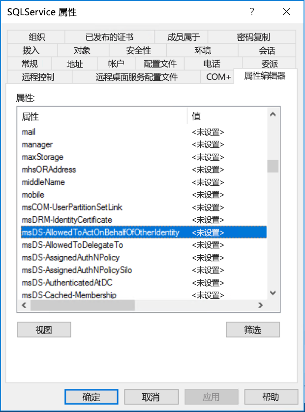

# <a name="configure-kerberos-based-sso-from-power-bi-service-to-on-premises-data-sources"></a>将基于 Kerberos 的 SSO 从 Power BI 配置到本地数据源

使用 [Kerberos 约束委派](/windows-server/security/kerberos/kerberos-constrained-delegation-overview)启用无缝 SSO 连接。 启用 SSO 后，Power BI 报表和仪表板可以轻松通过本地源刷新数据，同时遵从在这些源上配置的用户级别权限。

必须配置多个项才能使 Kerberos 约束委派正常工作，其中包括服务主体名称  (SPN) 和服务帐户上的委派设置。

### <a name="prerequisite-1-install-and-configure-the-microsoft-on-premises-data-gateway"></a>先决条件 1：安装并配置 Microsoft 本地数据网关

本地数据网关支持就地升级，以及现有网关的设置接管  。

### <a name="prerequisite-2-run-the-gateway-windows-service-as-a-domain-account"></a>先决条件 2：将网关 Windows 服务作为域帐户运行

在标准安装中，网关作为计算机本地服务帐户（具体而言，NT Service\PBIEgwService  ）运行，如下图所示：


若要启用 Kerberos 约束委派，网关必须作为域帐户运行，除非 Azure Active Directory (Azure AD) 实例已与本地 Active Directory 实例同步（使用 Azure AD DirSync/Connect）。 若要切换到域帐户，请参阅[更改网关服务帐户](/data-integration/gateway/service-gateway-service-account)。

> [!NOTE]
> 如果配置了 Azure AD Connect 并且用户帐户已同步，则网关服务不需要在运行时执行本地 Azure AD 查找。 相反，只需使用网关服务的本地服务 SID 来完成 Azure Active Directory 中所需的所有配置。 本文所述的 Kerberos 约束委派配置步骤与 Azure Active Directory 上下文中所需的配置步骤相同。 它们仅应用于 Azure AD 中网关的计算机对象（由本地服务 SID 标识），而不是域帐户。

### <a name="prerequisite-3-have-domain-admin-rights-to-configure-spns-setspn-and-kerberos-constrained-delegation-settings"></a>先决条件 3：具有域管理员权限才能配置 SPN (SetSPN) 和 Kerberos 约束委派设置

不建议域管理员暂时或永久地授权其他人来配置 SPN 和 Kerberos 委派设置，而不要求该人员具有域管理员权限。 在下一部分中，我们将更详细地介绍建议的配置步骤。

## <a name="configure-kerberos-constrained-delegation-for-the-gateway-and-data-source"></a>为网关和数据源配置 Kerberos 约束委派

以域管理员身份，为网关服务域帐户配置 SPN（如果需要），并在网关服务域帐户上配置委派设置。

### <a name="configure-an-spn-for-the-gateway-service-account"></a>为网关服务帐户配置 SPN

首先，确定是否已经为用作网关服务帐户的域帐户创建了 SPN：

1. 以域管理员身份启动“Active Directory 用户和计算机”  。

2. 右键单击该域，选择“查找”，然后输入网关服务帐户的帐户名  。

3. 在搜索结果中，右键单击网关服务帐户，然后选择“属性”  。

4. 如果“委派”选项卡在“属性”对话框中可见，则表明已创建 SPN，并且可以跳到[确定使用基于资源的Kerberos 约束委派或标准 Kerberos 约束委派](#decide-on-resource-based-or-standard-kerberos-constrained-delegation)   。

    如果“属性”对话框中没有“委派”选项卡，可以在该帐户上手动创建 SPN 以启用它   。 请使用 Windows 附带的 [setspn 工具](https://technet.microsoft.com/library/cc731241.aspx)（需要域管理员权限才能创建 SPN）。

    例如，假设网关服务帐户为“Contoso\GatewaySvc”，并且运行网关服务的计算机名为 MyGatewayMachine   。 若要为网关服务帐户设置 SPN，可以运行以下命令：

    

    还可以使用 Active Directory 用户和计算机 MMC（Microsoft 管理控制台）管理单元来设置 SPN。

### <a name="decide-on-resource-based-or-standard-kerberos-constrained-delegation"></a>确定使用基于资源的 Kerberos 约束委派或标准 Kerberos 约束委派

可以为  基于资源的 Kerberos 约束委派或标准 Kerberos 约束委派配置委派设置。 如果数据源属于不同于网关的域，则使用基于资源的委派，但请注意，此方法需要 Windows Server 2012 或更高版本。 有关这两种委派方法差异的详细信息，请参阅[受约束的 Kerberos 委派概述页](/windows-server/security/kerberos/kerberos-constrained-delegation-overview)。

 确定要使用的方法后，请转到  [为标准 Kerberos 约束委派配置网关服务帐户](#configure-the-gateway-service-account-for-standard-kerberos-constrained-delegation)或  [为基于资源的 Kerberos 约束委派配置网关服务帐户](#configure-the-gateway-service-account-for-resource-based-kerberos-constrained-delegation)一节。 不要同时完成这两个小节。

## <a name="configure-the-gateway-service-account-for-standard-kerberos-constrained-delegation"></a>为标准 Kerberos 约束委派配置网关服务帐户

> [!NOTE]
> 如果要启用标准 Kerberos 约束委派，请完成本节中的步骤。 如果要启用基于资源的 Kerberos 约束委派，请完成[为基于资源的 Kerberos 约束委派配置网关服务帐户](#configure-the-gateway-service-account-for-resource-based-kerberos-constrained-delegation)小节中的步骤。

现在，将为网关服务帐户设置委派设置。 有多种工具可以用来执行这些步骤。 在此，我们将使用 Active Directory 用户和计算机，它是一个 Microsoft 管理控制台 (MMC) 管理单元，用于管理和发布目录中的信息。 默认情况下，它在域控制器上可用，但也可以通过其他计算机上的“Windows 功能”配置来启用它。

我们需要通过协议转换来配置“Kerberos 约束委派”。 使用约束委派时，必须要明确要允许网关向其提供委派凭据的服务。 例如，只有 SQL Server 或 SAP HANA 服务器接受网关服务帐户的委派调用。

本节假定你已经为基础数据源（例如 SQL Server、SAP HANA、SAP BW、Teradata 和 Spark）配置了 SPN。 要了解如何配置这些数据源服务器 SPN，请参阅相应数据库服务器的技术文档。 还可以参阅博客文章[My Kerberos Checklist](https://techcommunity.microsoft.com/t5/SQL-Server-Support/My-Kerberos-Checklist-8230/ba-p/316160)（我的 Kerberos 清单）中的标题为 What SPN does your app require?（你的应用需要什么SPN？）的部分  。

在以下步骤中，我们假设本地环境中有两台位于相同域的计算机：网关计算机和运行 SQL Server（已为基于 Kerberos 的 SSO 进行过配置）的数据库服务器。 只要已为基于 kerberos 的单一登录配置了数据源，就可以对其他一个受支持的数据源采用这些步骤。 针对本示例，我们还假设以下设置和名称：

* Active Directory 域 (Netbios)：**Contoso**
* 网关计算机名：**MyGatewayMachine**
* 网关服务帐户：**Contoso\GatewaySvc**
* SQL Server 数据源计算机名：**TestSQLServer**
* SQL Server 数据源服务帐户：**Contoso\SQLService**

下面是配置委派设置的方法：

1. 通过域管理员权限，打开“Active Directory用户和计算机”  。

2. 右键单击网关服务帐户 (Contoso\GatewaySvc)，然后选择“属性”   。

3. 选择“**委派**”选项卡。

4. 选择“仅信任此计算机来委派指定的服务” > “使用任意身份验证协议”   。

5. 在“可以由此帐户提供委派凭据的服务”下选择“添加”   。

6. 在新对话框中，选择“用户或计算机”  。

7. 输入数据源的服务帐户，例如，SQL Server 数据源的服务帐户可能类似于 Contoso\SQLService  。 应该已在此帐户上设置了适当的数据源 SPN。 添加帐户后，请选择“确定”  。

8. 选择你为数据库服务器创建的 SPN。 在我们的示例中，SPN 以“MSSQLSvc”开头  。 如果你为数据库服务添加了 FQDN 和 NetBIOS SPN，请同时选择两者。 你可能只看到一个。

9. 选择**确定**。 现在，应在网关服务帐户可向其提供委派凭据的服务列表中看到 SPN。

    

现在，跳到[“在网关计算机上向网关服务帐户授予本地策略权限”](#grant-the-gateway-service-account-local-policy-rights-on-the-gateway-machine)以继续执行设置过程。

## <a name="configure-the-gateway-service-account-for-resource-based-kerberos-constrained-delegation"></a>为基于资源的 Kerberos 约束委派配置网关服务帐户

> [!NOTE]
> 如果要启用基于资源的 Kerberos 约束委派，请完成本节中的步骤。 如果要启用标准 Kerberos 约束委派，请完成[为标准 Kerberos 约束委派配置网关服务帐户](#configure-the-gateway-service-account-for-standard-kerberos-constrained-delegation)小节中的步骤。

使用[基于资源的 Kerberos 约束委派](/windows-server/security/kerberos/kerberos-constrained-delegation-overview)可实现 Windows Server 2012 及更高版本的单一登录连接，且允许前端和后端服务位于不同的域。 若要实现此目的，后端服务域需要信任前端服务域。

在以下步骤中，我们假设本地环境中有两台位于不同域的计算机：网关计算机和运行 SQL Server（已为基于 Kerberos 的 SSO 进行过配置）的数据库服务器。 只要已为基于 kerberos 的单一登录配置了数据源，就可以对其他一个受支持的数据源采用这些步骤。 针对本示例，我们还假设以下设置和名称：

* Active Directory 前端域 (Netbios)：**ContosoFrontEnd**
* Active Directory 后端域 (Netbios)：**ContosoBackEnd**
* 网关计算机名：**MyGatewayMachine**
* 网关服务帐户：**ContosoFrontEnd\GatewaySvc**
* SQL Server 数据源计算机名：**TestSQLServer**
* SQL Server 数据源服务帐户：**ContosoBackEnd\SQLService**

给定这些示例名和设置，完成下面的配置步骤：

1. 在 ContosoFrontEnd 域的域控制器上，确保未使用“Active Directory 用户和计算机”（Microsoft 管理控制台 (MMC) 管理单元）为网关服务帐户应用任何委派设置。  

    

2. 使用 ContosoBackEnd 域的域控制器上的“Active Directory 用户和计算机”，确保未为后端服务帐户应用任何委派设置。  

    

3. 此外，确保还未设置此帐户的“msDS-AllowedToActOnBehalfOfOtherIdentity”属性  。 可在“属性编辑器”  中找到此属性，如下图中所示：

    

4. 在 ContosoBackEnd 域的域控制器上的“Active Directory 用户和计算机”中创建组。   将网关服务帐户添加到此组，如下图所示。 此图显示了名为“ResourceDelGroup”的新建组，以及添加到此组的网关服务帐户“GatewaySvc”。  

    

5. 在 ContosoBackEnd 域的域控制器中打开命令提示符，并运行以下命令，以更新后端服务帐户的 msDS-AllowedToActOnBehalfOfOtherIdentity 属性：  

    ```powershell
    $c = Get-ADGroup ResourceDelGroup
    Set-ADUser SQLService -PrincipalsAllowedToDelegateToAccount $c
    ```

6. 可以验证“Active Directory 用户和计算机”中的后端服务帐户属性的“属性编辑器”选项卡中是否反映此更新。  现在应设置 msDS-AllowedToActOnBehalfOfOtherIdentity  。

## <a name="grant-the-gateway-service-account-local-policy-rights-on-the-gateway-machine"></a>在网关计算机上向网关服务帐户授予本地策略权限

最后，在运行网关服务（示例中的 MyGatewayMachine）的计算机上，必须授予网关服务帐户本地策略“身份验证后模拟客户端”和“以操作系统方式执行”(SeTcbPrivilege)。    。 可以使用本地组策略编辑器 (gpedit) 执行和验证此配置  。

1. 在网关计算机上运行：gpedit.msc  。

2. 依次转到“本地计算机策略”&gt;“计算机配置”&gt;“Windows 设置”&gt;“安全设置”&gt;“本地策略”&gt;“用户权限分配”       。

    

3. 从“用户权限分配”下的策略列表中，选择“身份验证后模拟客户端”   。

    

    右键单击，然后打开“属性”  。 查看帐户列表。 它必须包含网关服务帐户（Contoso\GatewaySvc 或 ContosoFrontEnd\GatewaySvc，具体取决于约束委派的类型）   。

4. 从“用户权限分配”下的策略列表中，选择“以操作系统方式执行”(SeTcbPrivilege)   。 确保网关服务帐户也包括在帐户列表中。

5. 重启“本地数据网关”  服务进程。

### <a name="set-user-mapping-configuration-parameters-on-the-gateway-machine-if-required"></a>如果需要，在网关计算机上设置用户映射配置参数

如果未配置 Azure AD Connect，请执行以下步骤以将 Power BI 服务用户映射到本地 Active Directory 用户。 以这种方式映射的每个 Active Directory 用户都需要具有数据源的 SSO 权限。 有关详细信息，请参阅 [Guy in a Cube 视频](https://www.youtube.com/watch?v=NG05PG9aiRw)。

1. 打开主网关配置文件 `Microsoft.PowerBI.DataMovement.Pipeline.GatewayCore.dll`。 默认情况下，此文件存储在 C:\Program Files\On-premises data gateway。

1. 将 ADUserNameLookupProperty  设置为未使用的 Active Directory 属性。 假设将在下面的步骤中使用 `msDS-cloudExtensionAttribute1`，但此属性只可在 Windows Server 2012 或更高版本中使用。 将 ADUserNameReplacementProperty  设置为 `SAMAccountName`。 保存配置文件。

1. 在任务管理器的“服务”选项卡中，右键单击网关服务，然后选择“重启”   。

    

1. 对于要为其启用 Kerberos SSO 的每个 Power BI 服务用户，请将本地 Active Directory 用户（具有数据源的 SSO 权限）的 `msDS-cloudExtensionAttribute1` 属性设置为 Power BI 服务用户的完整用户名（即 UPN）。 例如，如果你以 `test@contoso.com` 身份登录 Power BI 服务，并且想将此用户映射到具有 SSO 权限的本地 Active Directory 用户（例如 `test@LOCALDOMAIN.COM`），请将 `test@LOCALDOMAIN.COM` 的 `msDS-cloudExtensionAttribute1` 属性设置为 `test@contoso.com`。

    可以使用“Active Directory 用户和计算机”Microsoft 管理控制台 (MMC) 管理单元来设置 `msDS-cloudExtensionAttribute1` 属性：
    
    1. 以域管理员身份启动“Active Directory 用户和计算机”。
    
    1. 右键单击该域，选择“查找”，然后键入要映射到本地 Active Directory 用户的帐户名。
    
    1. 选择“属性编辑器”选项卡  。
    
        找到 `msDS-cloudExtensionAttribute1` 属性，然后双击它。 将该值设置为用于登录 Power BI 服务的用户的完整用户名（即 UPN）。
    
    1. 选择**确定**。
    
        
    
    1. 选择**应用**。 验证是否已在“值”列中设置了正确的值  。

## <a name="complete-data-source-specific-configuration-steps"></a>完成数据源特定的配置步骤

SAP HANA 和 SAP BW 必须先具有额外的数据源特定配置要求和先决条件，才能通过网关建立到这些数据源的 SSO 连接。 有关详细信息，请参阅 [SAP HANA 配置页](service-gateway-sso-kerberos-sap-hana.md)和 [SAP BW - CommonCryptoLib (sapcrypto.dll) 配置页](service-gateway-sso-kerberos-sap-bw-commoncryptolib.md)。 也可以[配置 SAP BW 以与 gx64krb5 SNC 库一起使用](service-gateway-sso-kerberos-sap-bw-gx64krb.md)，但 Microsoft 不建议使用此库，因为 SAP 不再支持该库。 应将 CommonCryptoLib 或  gx64krb5 用作 SNC 库。 不要同时完成两个库的配置步骤。

> [!NOTE]
> 其他 SNC 库也可能适用于 BW SSO，但 Microsoft 并未正式支持它们。

## <a name="run-a-power-bi-report"></a>运行 Power BI 报表

完成所有配置步骤后，可以使用 Power BI 中的“管理网关”页面来配置要用于 SSO 的数据源  。 如果具有多个网关，请确保选择已配置 Kerberos SSO 的网关。 在数据源的“高级设置”下，确保已选中“通过 Kerberos 对 DirectQuery 查询使用 SSO”   。


 从 Power BI Desktop 发布基于 DirectQuery 的报表  。 此报表必须使用用户可以访问的数据，该用户映射到登录 Power BI 服务的 (Azure) Active Directory 用户。 由于刷新操作的工作原理，必须使用 DirectQuery 而不是导入。 刷新基于导入的报表时，网关将使用创建数据源时输入到“用户名”和“密码”字段中的凭据   。 换句话说，不使用 Kerberos SSO  。 同样，在发布时，如果具有多个网关，请确保选择已配置 SSO 的网关。 在 Power BI 服务中，你现在应该能够刷新报表或基于已发布的数据集创建新报表。

在大多数情况下，此配置有效。 但是，使用 Kerberos 时，根据你的环境可以有不同的配置。 如果报表仍无法加载，请联系你的域管理员进一步调查。 如果数据源是 SAP BW，还可以参阅 [CommonCryptoLib](service-gateway-sso-kerberos-sap-bw-commoncryptolib.md#troubleshooting) 和 [gx64krb5/gsskrb5](service-gateway-sso-kerberos-sap-bw-gx64krb.md#troubleshooting) 的数据源特定配置页的疑难解答部分，具体取决于所选的 SNC 库。

## <a name="next-steps"></a>后续步骤

有关“本地数据网关”  和 DirectQuery  的详细信息，请查看以下资源：

* [本地数据网关是什么？](/data-integration/gateway/service-gateway-onprem)
* [Power BI 中的 DirectQuery](desktop-directquery-about.md)
* [DirectQuery 支持的数据源](desktop-directquery-data-sources.md)
* [DirectQuery 和 SAP BW](desktop-directquery-sap-bw.md)
* [DirectQuery 和 SAP HANA](desktop-directquery-sap-hana.md)
