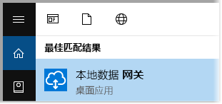
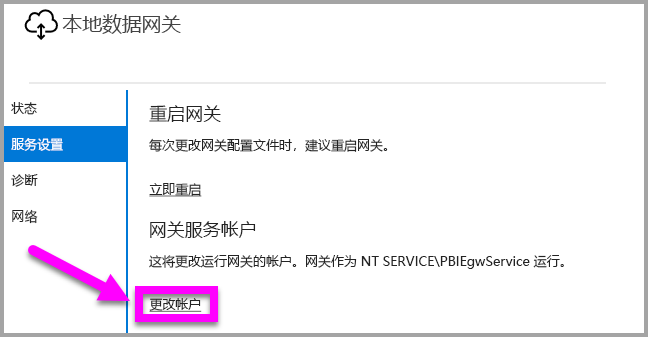

# <a name="use-kerberos-for-single-sign-on-sso-from-power-bi-to-on-premises-data-sources"></a>使用 Kerberos 进行从 Power BI 到本地数据源的单一登录 (SSO)

使用 [Kerberos 约束委派](/windows-server/security/kerberos/kerberos-constrained-delegation-overview)启用无缝单一登录连接。 启用 SSO 后，Power BI 报表和仪表板可以轻松通过本地源刷新数据。

## <a name="supported-data-sources"></a>支持的数据源

目前支持以下数据源：

* SQL Server
* SAP HANA
* SAP BW
* Teradata
* Spark
* Impala

我们还通过[安全断言标记语言 (SAML)](service-gateway-sso-saml.md) 支持 SAP HANA。

### <a name="sap-hana"></a>SAP HANA

要为 SAP HANA 启用 SSO，请首先按照以下步骤操作：

* 确保当前运行的 SAP HANA 服务器具备所需的最低版本（版本取决于 SAP Hana 服务器平台级别）：
  * [HANA 2 SPS 01 Rev 012.03](https://launchpad.support.sap.com/#/notes/2557386)
  * [HANA 2 SPS 02 Rev 22](https://launchpad.support.sap.com/#/notes/2547324)
  * [HANA 1 SP 12 Rev 122.13](https://launchpad.support.sap.com/#/notes/2528439)
* 在网关计算机上，安装 SAP 的最新 HANA ODBC 驱动程序。  最低版本为 2017 年 8 月发布的 HANA ODBC 版本 2.00.020.00。

有关使用 Kerberos 设置和配置 SAP HANA 单一登录的详细信息，请参阅 SAP HANA 安全指南中的主题[使用 Kerberos 进行单一登录](https://help.sap.com/viewer/b3ee5778bc2e4a089d3299b82ec762a7/2.0.03/en-US/1885fad82df943c2a1974f5da0eed66d.html)和该页中的链接，尤其是 SAP 注释 1837331 – HOWTO HANA DBSSO Kerberos/Active Directory]。

## <a name="preparing-for-kerberos-constrained-delegation"></a>准备 Kerberos 约束委派

必须配置多个项才能使 Kerberos 约束委派正常工作，其中包括服务主体名称 (SPN) 和服务帐户上的委派设置。

### <a name="prerequisite-1-install--configure-the-on-premises-data-gateway"></a>先决条件 1：安装并配置本地数据网关

此版本的本地数据网关支持就地升级，以及现有网关的设置接管。

### <a name="prerequisite-2-run-the-gateway-windows-service-as-a-domain-account"></a>先决条件 2：将网关 Windows 服务作为域帐户运行

在标准安装中，网关作为计算机本地服务帐户（具体而言，NT Service\PBIEgwService）运行，如下图所示：


若要启用 Kerberos 约束委派，网关必须作为域帐户运行，除非 Azure AD 已与本地 Active Directory 同步（使用 Azure AD DirSync/Connect）。 如果需要将帐户切换到域帐户，请参阅本文后面的[将网关切换到域帐户](#switching-the-gateway-to-a-domain-account)。

> [!NOTE]
> 如果配置了 Azure AD DirSync / Connect 并且用户帐户已同步，则网关服务不需要在运行时执行本地 AD 查找，并且可以将本地服务 SID（而不是请求域帐户）用于网关服务。 本文所述的 Kerberos 约束委派配置步骤与该配置相同（它们仅应用于 Active Directory 中的网关计算机对象，而不是域帐户）。

### <a name="prerequisite-3-have-domain-admin-rights-to-configure-spns-setspn-and-kerberos-constrained-delegation-settings"></a>先决条件 3：具有域管理员权限才能配置 SPN (SetSPN) 和 Kerberos 约束委派设置

虽然从技术上讲域管理员可以暂时或永久地允许其他人配置 SPN 和 Kerberos 委派，且无需域管理员权限，但不建议采用此方法。 下一节将详细介绍先决条件 3 所需的配置步骤。

## <a name="configuring-kerberos-constrained-delegation-for-the-gateway-and-data-source"></a>为网关和数据源配置 Kerberos 约束委派

若要正确配置系统，我们需要配置或验证以下两项：

1. 如果需要，为网关服务域帐户配置 SPN。

2. 在网关服务域帐户上配置委派设置。

请注意，你必须是域管理员才能执行这两个配置步骤。

下列各节将依次介绍这些步骤。

### <a name="configure-an-spn-for-the-gateway-service-account"></a>为网关服务帐户配置 SPN

首先，确定是否已经为用作网关服务帐户的域帐户创建了 SPN，请执行以下步骤：

1. 以域管理员身份启动“Active Directory 用户和计算机”。

2. 右键单击该域，选择“查找”，然后输入网关服务帐户的帐户名

3. 在搜索结果中，右键单击网关服务帐户，然后选择“属性”。

4. 如果 “委派” 选项卡在 “属性” 对话框中可见，则表明已创建 SPN，并且可以跳到有关配置委派设置的下一小节。

    如果“属性”对话框中没有“委派”选项卡，则可以在添加“委派”选项卡的帐户上手动创建一个 SPN（这是配置委派设置的最简单的方法）。 创建 SPN 可以使用 Windows 附带的 [setspn 工具](https://technet.microsoft.com/library/cc731241.aspx)来完成（需要域管理员权限才能创建 SPN）。

    例如，假设网关服务帐户为“PBIEgwTest\GatewaySvc”，并且运行网关服务的计算机名为 Machine1。 若要为本示例中计算机的网关服务帐户设置 SPN，可以运行以下命令：

    

    完成该步骤后，我们可以继续配置委派设置。

### <a name="configure-delegation-settings-on-the-gateway-service-account"></a>在网关服务帐户上配置委派设置

第二个配置要求是网关服务帐户上的委派设置。 有多种工具可以用来执行这些步骤。 在本文中，我们将使用“Active Directory 用户和计算机”，这是一个 Microsoft 管理控制台 (MMC) 管理单元，可用于管理和发布目录中的信息。 默认在域控制器上可用。 也可以通过其他计算机上的“Windows 功能”配置来启用它。

我们需要通过协议转换来配置“Kerberos 约束委派”。 使用约束委派时，必须要明确要委派哪些服务。 例如，只有你的 SQL Server 或 SAP HANA 服务器接受网关服务帐户的委派调用。

本节假定你已经为基础数据源（例如 SQL Server、SAP HANA、Teradata、Spark 等）配置了 SPN。 要了解如何配置这些数据源服务器 SPN，请参阅相应数据库服务器的技术文档。 另外，也可以查看描述[*你的应用需要哪种 SPN？*](https://blogs.msdn.microsoft.com/psssql/2010/06/23/my-kerberos-checklist/)的博客文章。

在以下步骤中，我们假设本地环境中有两台计算机：网关计算机和运行 SQL Server 数据库的服务器。 针对本示例，我们还假设以下设置和名称：

* 网关计算机名：PBIEgwTestGW
* 网关服务帐户：PBIEgwTest\GatewaySvc（帐户显示名称：网关连接器）
* SQL Server 数据源计算机名：PBIEgwTestSQL
* SQL Server 数据源服务帐户：PBIEgwTest\SQLService

给定这些示例名和设置，配置步骤如下：

1. 通过域管理员权限，启动“Active Directory用户和计算机”。

2. 右键单击网关服务帐户 (PBIEgwTest\GatewaySvc)，然后选择“属性”。

3. 选择“**委派**”选项卡。

4. 选择“仅信任此计算机来委派指定的服务”。

5. 选择“使用任何身份验证协议”。

6. 在“可以由此帐户提供委派凭据的服务”下选择“添加”。

7. 在新对话框中，选择“用户或计算机”。

8. 输入 SQL Server 数据库服务 (PBIEgwTest\SQLService) 的服务帐户，然后选择“确定”。

9. 选择你为数据库服务器创建的 SPN。 在我们的示例中，SPN 将以 MSSQLSvc 开头。 如果你为数据库服务添加了 FQDN 和 NetBIOS SPN，请同时选择两者。 你可能只会看到其中一个。

10. 选择**确定**。 现在，列表中应该会显示 SPN。

11. 或者，你可以选择“已展开”以在以下位置同时显示 FQDN 和 NetBIOS SPN。

12. 如果选择了“已展开”，则对话框将如下所示。 选择**确定**。

    

最后，在运行网关服务（在我们的示例中为 PBIEgwTestGW）的计算机上，必须为网关服务帐户授予本地策略“身份验证后模拟客户端”。 可以使用本地组策略编辑器 (gpedit) 执行/验证此操作。

1. 在网关计算机上运行：gpedit.msc。

1. 导航到“本地计算机策略”>“计算机配置”>“Windows设置”>“安全设置”>“本地策略”>“用户权限分配”，如下图所示。

    

1. 从“用户权限分配”下的策略列表中，选择“身份验证后模拟客户端”。

    

    右键单击并打开“身份验证后模拟客户端”的“属性”，并检查帐户列表。 其中必须包括网关服务帐户 (PBIEgwTest\GatewaySvc)。

1. 从“用户权限分配”下的策略列表中，选择“以操作系统方式执行”(SeTcbPrivilege)。 确保网关服务帐户也包括在帐户列表中。

1. 重启“本地数据网关”服务进程。

如果使用 SAP HANA，我们建议执行以下附加步骤，这些步骤可以小幅度提升性能。

1. 在网关安装目录中找到并打开此配置文件：Microsoft.PowerBI.DataMovement.Pipeline.GatewayCore.dll.config。

1. 找到“FullDomainResolutionEnabled”属性，并将其值更改为“True”。

    ```xml
    <setting name=" FullDomainResolutionEnabled " serializeAs="String">
          <value>True</value>
    </setting>
    ```

## <a name="running-a-power-bi-report"></a>运行 Power BI 报表

完成本文前述的所有配置步骤后，可以使用 Power BI 中的“管理网关”页配置数据源。 然后在其“高级设置”下启用 SSO，并发布绑定到该数据源的报表和数据集。


此配置将在大多数情况下有效。 但是，使用 Kerberos 时，根据你的环境可以有不同的配置。 如果报表仍无法加载，则需要联系你的域管理员进一步调查。

## <a name="switching-the-gateway-to-a-domain-account"></a>将网关切换到域帐户

在本文前面部分，我们讨论了使用本地数据网关用户界面将网关从本地服务帐户切换为域帐户进行运行。 以下是执行此操作必需的步骤。

1. 启动“本地数据网关”配置工具。

   

2. 选择主页上的“登录”按钮，然后使用你的 Power BI 帐户登录。

3. 登录完成后，选择“服务设置”选项卡。

4. 选择“更改帐户”以开始指导说明，如下图所示。

   

## <a name="configuring-sap-bw-for-sso"></a>为 SSO 配置 SAP BW

了解了 Kerberos 如何与网关配合使用后，接下来可以为 SAP Business Warehouse (SAP BW) 配置 SSO。 以下步骤假设你已经[为 Kerberos 约束委派做好了准备](#preparing-for-kerberos-constrained-delegation)（如本文前面部分所述）。

本指南尝试尽可能全面地进行介绍。 如果你已经完成了其中的一些步骤，则可以跳过这些步骤：例如，已经为 BW 服务器创建了一个服务用户并将 SPN 映射到该服务用户，或者已经安装了 gsskrb5 库。

### <a name="setup-gsskrb5-on-client-machines-and-the-bw-server"></a>在客户端计算机和 BW 服务器上设置 gsskrb5

客户端和服务器必须使用 gsskrb5 才能通过网关完成 SSO 连接。 目前不支持 Common Crypto Library (sapcrypto)。

1. 从 [SAP Note 2115486](https://launchpad.support.sap.com/) 下载 gsskrb5/gx64krb5（需要是 SAP 用户）。 请确保至少有 1.0.11.x 版本的 gsskrb5.dll 和 gx64krb5.dll。

1. 将库放在网关计算机上可由网关实例访问的位置（如果要使用 SAP GUI/Logon 测试 SSO 连接，还需要 SAP GUI 可以访问该位置）。

1. 将另一个副本放在 BW 服务器计算机上的可由 BW 服务器访问的位置。

1. 在客户端和服务器计算机上，将 SN\_LIB 和 SNC\_LIB\_64 环境变量分别设置为指向 gsskrb5.dll 和 gx64krb5.dll 的位置。

### <a name="create-a-bw-service-user-and-enable-snc-communication-using-gsskrb5-on-the-bw-server"></a>创建 BW 服务用户并在 BW 服务器上使用 gsskrb5 启用 SNC 通信

除了已经完成的网关配置，还有一些 SAP BW 特定的额外步骤。 文档中的[在网关服务帐户上配置委派设置](#configure-delegation-settings-on-the-gateway-service-account)部分假设你已为基础数据源配置了 SPN。 要为 SAP BW 完成此配置：

1. 在 Active Directory 域控制器服务器上，为 Active Directory 环境中的 BW 应用程序服务器创建服务用户（最初只是普通的 Active Directory 用户）。 然后为其分配 SPN。

    SAP 建议使用 SAP/ 启动 SPN，但应该也能使用其他前缀，例如 HTTP/。 SAP/ 之后的内容可自行决定；一种选择是使用 BW 服务器服务用户的用户名。 例如，如果创建 BWServiceUser@ \<域\>作为服务用户，则可以使用 SPN SAP/BWServiceUser。 设置 SPN 映射的一种方法是使用 setspn 命令。 例如，要在我们刚创建的服务用户上设置 SPN，需要从域控制器计算机上的 cmd 窗口中执行以下命令：`setspn -s SAP/ BWServiceUser DOMAIN\ BWServiceUser`。 有关详细信息，请参阅 SAP BW 文档。

1. 授予服务用户访问 BW 应用程序服务器的权限：

    1. 在 BW 服务器计算机上，将服务用户添加到 BW 服务器的本地管理员组：打开“计算机管理”程序，然后双击服务器的“本地管理员组”。

        

    1. 双击“本地管理员组”，然后选择“添加”，将 BW 服务用户添加到组。 使用“检查名称”按钮确保已正确输入名称。 选择**确定**。

1. 将 BW 服务器的服务用户设置为在 BW 服务器计算机上启动 BW 服务器服务的用户。

    1. 打开“运行”程序并输入“Services.msc”。 查找与 BW 应用程序服务器实例对应的服务。 右键单击它，然后选择“属性”。

        

    1. 切换到“登录”选项卡，并如上所述将用户更改为 BW 服务用户。 输入用户的密码，然后选择“确定”。

1. 在 SAP GUI/Logon 中登录服务器，并使用 RZ10 事务设置以下配置文件参数：

    1. 将 snc/identity/as 配置文件参数设置为：p:\<已创建的 BW 服务用户\>，例如 p:BWServiceUser@MYDOMAIN.COM。 请注意服务用户的 UPN 前面的 p: 不是 p:CN=，与用作 SNC 库时的 Common Crypto Lib 不一样。

    1. 将 snc/gssapi\_lib 配置文件参数设置为\<服务器计算机上 gsskrb5.dll/gx64krb5.dll 的路径（要使用的库取决于操作系统位数）\>。 请务必将库放在 BW 应用程序服务器可以访问的位置。

    1. 还可以设置以下额外加配置文件参数，并根据需要更改值。 请注意，最后五个选项使客户端无需配置 SNC 即可使用 SAP Logon/GUI 连接到 BW 服务器。

        | 设置 | 值 |
        | --- | --- |
        | snc/data\_protection/max | 3 |
        | snc/data\_protection/min | 1 |
        | snc/data\_protection/use | 9 |
        | snc/accept\_insecure\_cpic | 1 |
        | snc/accept\_insecure\_gui | 1 |
        | snc/accept\_insecure\_r3int\_rfc | 1 |
        | snc/accept\_insecure\_rfc | 1 |
        | snc/permit\_insecure\_start | 1 |

    1. 将属性 snc/enable 设置为 1。

1. 设置这些配置文件参数后，在服务器计算机上打开 SAP 管理控制台并重启 BW 实例。 如果服务器无法启动，请仔细检查是否正确设置了配置文件参数。 有关配置文件参数设置的详细信息，请参阅 [SAP 文档](https://help.sap.com/saphelp_nw70ehp1/helpdata/en/e6/56f466e99a11d1a5b00000e835363f/frameset.htm)。 如果遇到问题，还可以参考本节后面的故障排除信息部分。

### <a name="map-a-bw-user-to-an-active-directory-user"></a>将 BW 用户映射到 Active Directory 用户

将 Active Directory 用户映射到 SAP BW 应用程序服务器用户，并在 SAP GUI/Logon 中测试 SSO 连接。

1. 使用 SAP GUI/Logon 登录 BW 服务器。 执行事务 SU01。

1. 对于“用户”，输入要为其启用 SSO 连接的 BW 用户（上面的屏幕截图显示的是为 BIUSER 设置权限）。 选择 SAP Logon 窗口左上角附近的“编辑”图标（笔形图片）。

    

1. 选择“SNC”选项卡。在 SNC 名称输入框中，输入 p:\<你的 active directory 用户\>@\<你的域\>。 请注意，必须在 Active Directory 用户的 UPN 之前加“p:”。 指定的 Active Directory 用户应是要为其启用 SSO 访问 BW 应用程序服务器的人员或组织。 例如，如果要为用户 [testuser@TESTDOMAIN.COM](mailto:testuser@TESTDOMAIN.COM) 启用 SSO 访问权限，请输入 p:testuser@TESTDOMAIN.COM。

    

1. 选择保存图标（屏幕左上角附近的“软盘”）。

### <a name="test-sign-in-using-sso"></a>使用 SSO 测试登录

验证是否能以刚为其启用了 SSO 访问权限的 Active Directory 用户的身份来使用 SAP Logon/SAP GUI 通过 SSO 登录服务器。

1. 以刚为其启用了 SSO 访问权限的 Active Directory 用户的身份登录到安装了 SAP Logon 的计算机并启动 SAP GUI/Logon。 创建新连接。

1. 在“创建新系统条目”窗口中，选择“用户指定的系统”，然后选择“下一步”。

    

1. 在下一页填写相应的详细信息，包括应用程序服务器，实例编号和系统 ID，然后选择“完成”。

1. 右键单击新连接，然后选择“属性”。 选择“网络”选项卡。在“SNC 名称”窗口中输入 p:\<BW 服务用户的 UPN\>，例如 p:BWServiceUser@MYDOMAIN.COM，然后选择“确定”。

    

1. 双击刚才创建的连接，尝试与 BW 服务器建立 SSO 连接。 如果连接成功，请继续执行下一步。 否则，请查看本文档中先前的步骤以确保它们已正确完成，或查看下面的故障排除部分。 请注意，如果在此上下文中无法通过 SSO 连接到 BW 服务器，你将无法在网关上下文中使用 SSO 连接到 BW 服务器。

### <a name="troubleshoot-installation-and-connections"></a>安装和连接故障排除

如果遇到任何问题，请按照以下步骤对 SAP GUI/Logon 中的 gsskrb5 安装和 SSO 连接进行故障排除。

1. 查看服务器日志（位于服务器计算机上的…work\dev\_w0）可以帮助你对完成 gsskrb5 设置步骤期间遇到的任何错误进行故障排除，特别是更改配置文件参数后无法启动 BW 服务器的情况。

1. 如果由于“登录失败”而无法启动 BW 服务，则在设置 BW“启动”用户时可能提供了错误密码。 通过以 BW 服务用户身份登录 Active Directory 环境中的计算机来验证密码。

1. 如果收到有关阻止服务器启动的 SQL 凭据的错误，请验证是否已为服务用户授予了 BW 数据库的访问权限。

1. “(GSS-API) 指定的目标未知或无法访问”：这通常表示指定了错误的 SNC 名称。 在客户端应用程序中，确保除服务用户的 UPN 之外，仅使用“p:”，而不是“p:CN=”或任何其他内容。

1. “(GSS-API) 提供了无效的名称”：确保“p:”在服务器的 SNC 标识配置文件参数的值中。

1. “（SNC 错误）找不到指定模块”：这通常是因为将放置 gsskrb5.dll/gx64krb5.dll 的位置需要提升权限（管理员权限）才能访问。

### <a name="add-registry-entries-to-the-gateway-machine"></a>将注册表项添加到网关计算机

将所需的注册表项添加到安装网关的计算机的注册表中。

1. 在 cmd 窗口中执行以下命令：

    1. REG ADD HKLM\SOFTWARE\Wow6432Node\SAP\gsskrb5 /v ForceIniCredOK /t REG\_DWORD /d 1 /f

    1. REG ADD HKLM\SOFTWARE\SAP\gsskrb5 /v ForceIniCredOK /t REG\_DWORD /d 1 /f

### <a name="set-configuration-parameters-on-the-gateway-machine"></a>设置网关计算机上的配置参数

设置配置参数有两种选择，具体取决于你是否配置了 Azure AD DirSync，以便用户可以作为 Azure Ad 用户登录 Power BI 服务。

如果配置了 Azure AD DirSync，请按照以下步骤操作。

1. 打开主网关配置文件 Microsoft.PowerBI.DataMovement.Pipeline.GatewayCore.dll。 默认情况下，此文件存储在 C:\Program Files\On-premises data gateway 中。

1. 请务必将“FullDomainResolutionEnabled”属性设置为 True，将“SapHanaSsoRemoveDomainEnabled”属性设置为 False。

1. 保存配置文件。

1. 通过任务管理器的“服务”选项卡重启网关服务（右键单击“重启”）

    

如果未配置 Azure AD DirSync，请为要映射到 Azure AD 用户的所有 Power BI 服务用户执行以下步骤。 以下步骤会将 Power BI Service 用户手动链接到具有登录 BW 的权限的 Active Directory 用户。

1. 打开主网关配置文件 Microsoft.PowerBI.DataMovement.Pipeline.GatewayCore.dll。 默认情况下，此文件存储在 C:\Program Files\On-premises data gateway。

1. 将 ADUserNameLookupProperty 设置为 msDS-cloudExtensionAttribute1，将 ADUserNameReplacementProperty 设置为 SAMAccountName。 保存配置文件。

1. 通过任务管理器的“服务”选项卡重启网关服务（右键单击“重启”）。

    

1. 将映射到 BW 用户的 Active Directory 用户的 msDS-cloudExtensionAttribute1 属性设置为要为其启用 Kerberos SSO 的 Power BI 服务用户。 设置 msDS-cloudExtensionAttribute1 属性的一种方法是通过 Active Directory 用户和计算机 MMC 管理单元（请注意，也可以使用其他方法）。

    1. 以管理员用户身份登录到域控制器计算机。

    1. 在管理单元窗口中打开“用户”文件夹，然后双击映射到 BW 用户的 Active Directory 用户。

    1. 选择“属性编辑器”选项卡。

        如果没有看到此选项卡，则需要搜索有关如何启用它的说明或使用其他方法设置 msDS-cloudExtensionAttribute1 属性。 选择其中一个属性，然后选择“m”键以导航到以“m”开头的Active Directory 属性。 找到 msDS cloudExtensionAttribute1 属性并双击。 将值设置为用于登录 Power BI 服务的用户名，格式为 YourUser@YourDomain。

    1. 选择**确定**。

        

    1. 选择**应用**。 验证是否已在“值”列中设置了正确的值。

### <a name="add-a-new-bw-application-server-data-source-to-the-power-bi-service"></a>将新的 BW 应用程序服务器数据源添加到 Power BI 服务

将 BW 数据源添加到网关：按照本文前面有关[运行报表](#running-a-power-bi-report)的说明进行操作。

1. 在数据源配置窗口中，与从 Power BI Desktop 登录到 BW 服务器一样，输入应用程序服务器的“主机名”、“系统编号”和”客户端 ID”。 对于“身份验证方法”，选择“Windows”********。

1. 在“SNC 合作伙伴名称”字段中，输入 p: \<映射到 BW 服务用户的 SPN\>。 例如，如 SPN 为 SAP/BWServiceUser@MYDOMAIN.COM，则应在“SNC 合作伙伴名称”字段中输入 p:SAP/BWServiceUser@MYDOMAIN.COM。

1. 对于 SNC 库，请选择 SNC\_LIB 或 SNC\_LIB\_64。

1. “用户名”和”密码”应该是有权通过 SSO 登录 BW 服务器的 Active Directory 用户（已通过 SU01 事务映射到 BW 用户的 Active Directory 用户）的用户名和密码。 仅当未选中“通过 Kerberos 使用 SSO 执行 DirectQuery 查询”框时，才会使用这些凭据。

1. 勾选“通过 Kerberos 使用 SSO 执行 DirectQuery 查询”框并选择“应用”。 如果测试连接不成功，请验证先前的设置和配置步骤是否已正确完成。

    网关始终使用键入的凭据建立与服务器的测试连接，并执行基于导入的报表的计划刷新。 如果勾选了“通过 Kerberos 使用 SSO 执行 DirectQuery 查询”，并且用户正在访问基于直接查询的报表或数据集，则网关仅尝试建立 SSO 连接。

### <a name="test-your-setup"></a>测试设置

将 Power BI Desktop 中的 DirectQuery 报表发布到 Power BI 服务以测试设置。 确保以 Azure AD 用户或已映射到 Azure AD 用户的 msDS-cloudExtensionAttribute1 属性的用户身份登录 Power BI 服务。 如果设置已成功完成，应该能够创建基于 Power BI 服务中的已发布数据集的报表，并通过报表中的视觉对象拉取数据。

### <a name="troubleshooting-gateway-connectivity-issues"></a>网关连接问题故障排除

1. 检查网关日志。 打开“网关配置”应用程序，选择“诊断”，然后选择“导出日志”。 最新错误将位于检查的任何日志文件的底部。

    

1. 打开 BW 跟踪并查看生成的日志文件。 可使用多种不同类型的 BW 跟踪。 有关详细信息，请参阅 SAP 文档。

## <a name="errors-from-an-insufficient-kerberos-configuration"></a>Kerberos 配置不全导致的错误

如果基础数据库服务器和网关未针对 Kerberos 约束委派正确配置，则可能会收到以下错误消息：


与错误消息 (DM_GWPipeline_Gateway_ServerUnreachable) 相关的技术详细信息可能如下所示：


结果是网关无法正确模拟原始用户，并且数据库连接尝试失败。

## <a name="next-steps"></a>后续步骤

有关“本地数据网关”和 DirectQuery 的详细信息，请查看以下资源：

* [本地数据网关](service-gateway-onprem.md)
* [Power BI 中的 DirectQuery](desktop-directquery-about.md)
* [DirectQuery 支持的数据源](desktop-directquery-data-sources.md)
* [DirectQuery 和 SAP BW](desktop-directquery-sap-bw.md)
* [DirectQuery 和 SAP HANA](desktop-directquery-sap-hana.md)