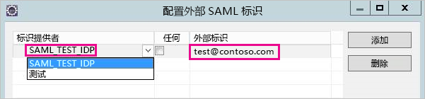
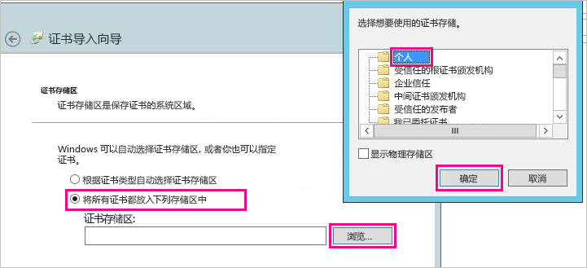
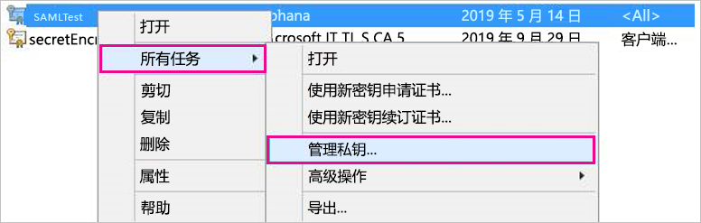
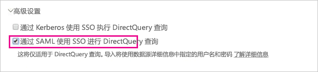

# <a name="use-security-assertion-markup-language-saml-for-sso-from-power-bi-to-on-premises-data-sources"></a>使用安全断言标记语言 (SAML) 启用从 Power BI 到本地数据源的 SSO

使用[安全断言标记语言 (SAML)](https://www.onelogin.com/pages/saml) 启用无缝单一登录连接。 启用 SSO 后，Power BI 报表和仪表板可以轻松通过本地源刷新数据，同时遵从在这些源上配置的用户级别权限。

## <a name="supported-data-sources"></a>支持的数据源

目前通过 SAML 支持 SAP HANA。 有关使用 SAML 为 SAP HANA 设置和配置单一登录的详细信息，请参阅 SAP HANA 文档中的 [SAML SSO for BI Platform to HANA](https://wiki.scn.sap.com/wiki/display/SAPHANA/SAML+SSO+for+BI+Platform+to+HANA)（BI 平台到 HANA 的 SAML SSO）。

我们使用 [Kerberos](service-gateway-sso-kerberos.md) 支持其他数据源（包括 HANA）。

请注意，对于 HANA，强烈建议在建立 SAML SSO 连接之前启用加密（即，应将 HANA 服务器配置为接受加密连接，并将网关配置为在与 HANA 服务器通信时使用加密）  。 默认情况下，HANA ODBC 驱动程序无法加密 SAML 断言，如果未启用加密，已签名的 SAML 断言将从网关“明文”发送到 HANA 服务器，并且容易被第三方拦截和重用  。 有关使用 OpenSSL 库为 HANA 启用加密的说明，请参阅[为 SAP HANA 启用加密](/power-bi/desktop-sap-hana-encryption)。

## <a name="configuring-the-gateway-and-data-source"></a>配置网关和数据源

要使用 SAML，必须在要为其启用 SSO 的 HANA 服务器与网关之间建立信任关系，该网关在此方案中充当 SAML 标识提供者 (IdP)。 有多种方法可以建立这种关系，例如将网关 IdP 的 x509 证书导入 HANA 服务器信任存储区，或者让 HANA 服务器信任的根证书颁发机构 (CA) 签署网关的 X509 证书。 我们在本指南中介绍了后一种方法，但如果更方便，你也可以使用另一种方法。

另请注意，虽然本指南使用 OpenSSL 作为 HANA 服务器的加密提供程序，不过 SAP 建议使用 SAP 加密库（也称为 CommonCryptoLib 或 sapcrypto）代替 OpenSSL 来完成建立信任关系的设置步骤。 有关详细信息，请参阅官方 SAP 文档。

以下步骤描述了如何使用 HANA 服务器信任的根 CA 对网关 IdP 的 X509 证书进行签名，从而在 HANA 服务器和网关 IdP 之间建立信任关系。 你将创建此根 CA。

1. 创建根 CA 的 X509 证书和私钥。 例如，要以 .pem 格式创建根 CA 的 X509 证书和私钥，请执行以下步骤：

   ```
   openssl req -new -x509 -newkey rsa:2048 -days 3650 -sha256 -keyout CA_Key.pem -out CA_Cert.pem -extensions v3_ca
   ```

    确保已正确保护根 CA 的私钥，如果第三方获取了该私钥，可能利用它对 HANA 服务器进行未经授权的访问。

    将证书（例如，CA_Cert.pem）添加到 HANA 服务器的信任存储区，以便 HANA 服务器将信任刚刚创建的根 CA 签名的任何证书。 通过检查 ssltruststore 配置设置，可以找到 HANA 服务器的信任存储区的位置  。 如果已按照 SAP 文档介绍的步骤配置 OpenSSL，则 HANA 服务器可能已经信任可以重用的根 CA. 有关详细信息，请参阅[如何将 SAP HANA Studio 的 Open SSL 配置到 SAP HANA 服务器](https://archive.sap.com/documents/docs/DOC-39571)。 若具有多个想为 SAML SSO 启用的 HANA 服务器，请确保每个服务器都信任该根 CA。

1. 创建网关 IdP 的 X509 证书。 例如，要创建有效期为一年的证书签名请求 (IdP_Req.pem) 和私钥 (IdP_Key.pem)，请执行以下命令：

   ```
   openssl req -newkey rsa:2048 -days 365 -sha256 -keyout IdP_Key.pem -out IdP_Req.pem -nodes
   ```

   使用已将 HANA 服务器配置为信任的根 CA 签署证书签名请求。 例如，要使用 CA_Cert.pem 和 CA_Key.pem（根 CA 的证书和密钥）对 IdP_Req.pem 进行签名，请执行以下命令：

   ```
   openssl x509 -req -days 365 -in IdP_Req.pem -sha256 -extensions usr_cert -CA CA_Cert.pem -CAkey CA_Key.pem -CAcreateserial -out IdP_Cert.pem
   ```

生成的 IdP 证书有效期为一年（请参阅天数选项）。 现在，在 HANA Studio 中导入 IdP 的证书以创建新的 SAML 标识提供者。

1. 在 SAP HANA Studio 中，右键单击 SAP HANA 服务器，然后导航到“安全”&gt;“打开安全控制台”&gt;“SAML 标识提供者”&gt;“OpenSSL 加密库”     。

    

1. 选择“导入”，导航到 IdP_Cert.pem，然后导入它  。

1. 在 SAP HANA Studio 中，选择“安全”文件夹  。

    

1. 展开“用户”，然后选择要将 Power BI 用户映射到的用户  。

1. 依次选择“SAML”、“配置”   。

    

1. 选择在步骤 2 中创建的标识提供者。 对于外部标识，输入 Power BI 用户的 UPN（即用户用于登录 Power BI 的电子邮件地址），然后选择“添加”   。 请注意，如果已将网关配置为使用 ADUserNameReplacementProperty 配置选项，则应输入替换 Power BI 用户初始 UPN 的值  。 例如，如果将 ADUserNameReplacementProperty 设置为 SAMAccountName，则应输入用户的 SAMAccountName    。

    

配置网关的证书和标识后，将证书转换为 pfx 格式并配置网关以使用证书。

1. 运行以下命令，将证书转换为 pfx 格式。 请注意，此命令将生成的 .pfx 文件命名为 samlcert.pfx，并将其密码设置为“root”。

    ```
    openssl pkcs12 -export -out samltest.pfx -in IdP_Cert.pem -inkey IdP_Key.pem -passin pass:root -passout pass:root
    ```

1. 将 pfx 文件复制到网关计算机：

    1. 双击 samltest.pfx，然后选择“本地计算机”&gt;“下一步”   。

    1. 输入密码，然后选择“下一步”  。

    1. 选择“将所有证书放入以下存储”，然后选择“浏览”&gt;“个人”&gt;“确定”     。

    1. 选择“下一步”，然后选择“完成”   。

    

1. 授予网关服务帐户访问证书私钥的权限：

    1. 网关计算机上运行 Microsoft 管理控制台 (MMC)。

        

    1. 在“文件”下，选择“添加/删除管理单元”   。

        

    1. 选择“证书”&gt;“添加”，然后选择“计算机帐户”&gt;“下一步”     。

    1. 选择“本地计算机”&gt;“完成”&gt;“确定”    。

    1. 展开“证书”&gt;“个人”&gt;“证书”，然后找到证书    。

    1. 右键单击证书并导航到“所有任务”&gt;“管理私钥”   。

        

    1. 将网关服务帐户添加到列表中。 默认情况下，帐户是“NT SERVICE\PBIEgwService”  。 可通过运行 services.msc 和查找“本地数据网关服务”来确定正在运行网关服务的帐户   。

        

最后，按照以下步骤向网关配置添加证书指纹。

1. 运行以下 PowerShell 命令列出计算机上的证书。

    ```powershell
    Get-ChildItem -path cert:\LocalMachine\My
    ```

1. 复制创建的证书的指纹。

1. 导航到网关目录（默认为 C:\Program Files\On-premises data gateway）  。

1. 打开 PowerBI.DataMovement.Pipeline.GatewayCore.dll.config，找到 SapHanaSAMLCertThumbprint 部分   。 粘贴已复制的指纹。

1. 重启网关服务。

## <a name="running-a-power-bi-report"></a>运行 Power BI 报表

现在，可以使用 Power BI 中的“管理网关”页面配置 SAP HANA 数据源，并在其“高级设置”下启用 SSO   。 然后，可以发布绑定到该数据源的报表和数据集。



## <a name="troubleshooting"></a>故障排除

配置 SSO 后，可能会在 Power BI 门户中看到以下错误：“提供的凭据无法用于 SapHana 源。”  此错误表示 SAP HANA 已拒绝 SAML 凭据。

服务器端的身份验证跟踪提供详细信息，以对 SAP HANA 上的凭据问题进行故障排除。 按照以下步骤配置 SAP HANA 服务器的跟踪。

1. 在 SAP HANA 服务器上，通过运行以下查询启用身份验证跟踪。

    ```
    ALTER SYSTEM ALTER CONFIGURATION ('indexserver.ini', 'SYSTEM') set ('trace', 'authentication') = 'debug' with reconfigure 
    ```

1. 重现所遇到的问题。

1. 在 HANA Studio 中，打开管理控制台，然后转到“诊断文件”  选项卡。

1. 打开最新的 indexserver 跟踪并搜索 SAMLAuthenticator.cpp。

    应该会找到一个指示根本原因的详细错误消息，如以下示例所示。

    ```
    [3957]{-1}[-1/-1] 2018-09-11 21:40:23.815797 d Authentication   SAMLAuthenticator.cpp(00091) : Element '{urn:oasis:names:tc:SAML:2.0:assertion}Assertion', attribute 'ID': '123123123123123' is not a valid value of the atomic type 'xs:ID'.
    [3957]{-1}[-1/-1] 2018-09-11 21:40:23.815914 i Authentication   SAMLAuthenticator.cpp(00403) : No valid SAML Assertion or SAML Protocol detected
    ```

1. 完成故障排除后，通过运行以下查询关闭身份验证跟踪。

    ```
    ALTER SYSTEM ALTER CONFIGURATION ('indexserver.ini', 'SYSTEM') UNSET ('trace', 'authentication');
    ```

## <a name="next-steps"></a>后续步骤

有关“本地数据网关”  和 DirectQuery  的详细信息，请查看以下资源：

* [本地数据网关是什么？](/data-integration/gateway/service-gateway-onprem)
* [Power BI 中的 DirectQuery](desktop-directquery-about.md)
* [DirectQuery 支持的数据源](desktop-directquery-data-sources.md)
* [DirectQuery 和 SAP BW](desktop-directquery-sap-bw.md)
* [DirectQuery 和 SAP HANA](desktop-directquery-sap-hana.md)
