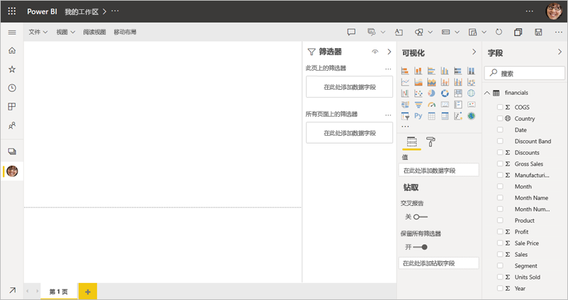
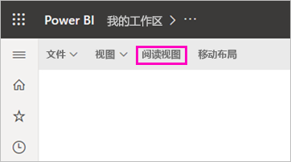
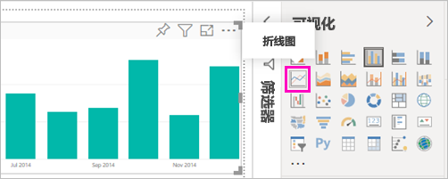
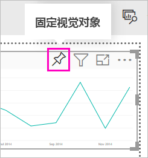
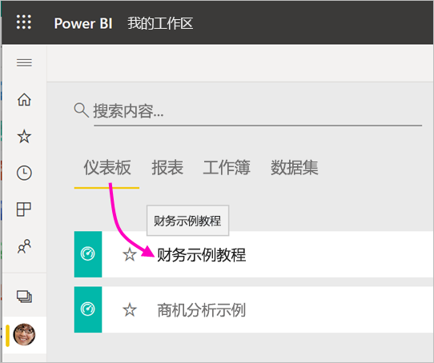
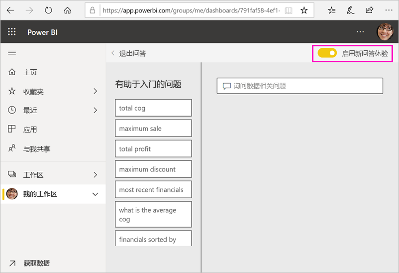
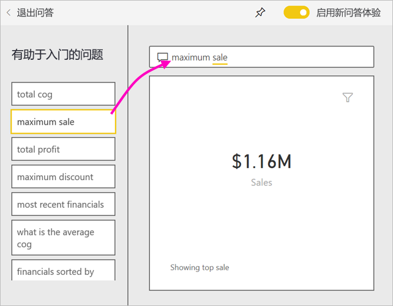
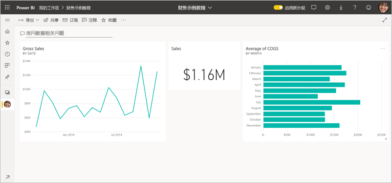

# 教程：Power BI 服务入门
本教程介绍了 Power BI 服务的一些功能  。 在这里，你可连接到数据、创建报表和仪表板，并就你的问题提问。 你还可在 Power BI 服务中执行更多其他操作；本教程仅作激发兴趣之用。 要了解 Power BI 服务如何与其他 Power BI 产品/服务契合，建议阅读[什么是 Power BI](power-bi-overview.md)。

在本教程中，将完成以下步骤：

> [!div class="checklist"]
> * 登录 Power BI Online 帐户或进行注册（如果还没有帐户）。
> * 打开 Power BI 服务。
> * 获取一些数据并在报表视图中打开。
> * 使用该数据创建可视化效果并将其另存为报表。
> * 从该报表固定磁贴，创建仪表板。
> * 使用问答自然语言工具将其他可视化效果添加到仪表板。
> * 在仪表板上重新排列磁贴、调整其大小并与之交互。
> * 删除数据集、报表和仪表板，清理资源。

> [!TIP]
> 更喜欢可以自主掌控进度的免费培训课程？ [在 EdX 上注册学习我们的“数据分析和可视化”课程](http://aka.ms/edxpbi)。

## 注册 Power BI 服务
如果没有 Power BI 帐户，请先[注册一个 Power BI Pro 免费试用版](https://app.powerbi.com/signupredirect?pbi_source=web)，再进行操作。

拥有帐户后，在浏览器中输入 app.powerbi.com 以打开 Power BI 服务  。 

## 步骤 1：获取数据

通常，需要创建 Power BI 报表时，会先使用 Power BI Desktop。 而这一次，我们将在 Power BI 服务中从头开始创建一个报表。

在本教程中，我们会从 CSV 文件中获取数据。 想要跟着做吗？ [下载财务示例 CSV 文件](http://go.microsoft.com/fwlink/?LinkID=521962)。

1. [登录 Power BI](http://www.powerbi.com/)。 还没有帐户？ 别担心，可以注册一个免费试用版。
2. Power BI 将在浏览器中打开。 在左侧导航栏底部选择“获取数据”  。

    随即将打开“获取数据”页面  。   

3. 在“创建新内容”部分下，选择“文件”   。 
   
   
4.  选择“本地文件”  。
   
    

5. 浏览到计算机上的该文件，然后选择“打开”  。

5. 在本教程中，我们会选择“导入”，将 Excel 文件添加为数据集，然后就可以使用它来创建报表和仪表板  。 如果选择“上传”，则整个 Excel 工作簿都将上传至 Power BI，然后可以在 Excel Online 中打开它并进行编辑  。
   
   
6. 数据集准备就绪后，选择“数据集”，然后选择“财务示例”数据集旁边的“创建报表”，打开报表编辑器    。 

    

    报表画布是空白的。 我们看到右侧有“筛选器”、“可视化效果”和“字段”窗格    。

    

7. 请注意，顶部导航栏上有“读取视图”选项  。 由于具有此选项，这意味着你当前处于“编辑视图”中。 进行[简要了解](service-the-report-editor-take-a-tour.md)是熟悉报表编辑器的一个不错的方法。

    

    同时，在“编辑视图”中，可以创建和修改报表，因为你是报表的所有者  。 也是创建者  。 与同事共享报表时，他们只能在“阅读视图”中与报表交互，你的同事是使用者  。 详细了解[阅读视图和编辑视图](consumer/end-user-reading-view.md)。

## 步骤 2：在报表中创建图表
连接到数据后，请开始浏览数据。  发现有趣的内容后，可以创建仪表板来监视内容，并查看内容在不同时间的变化。 我们来看看具体的工作方式。
    
1. 在报表编辑器中，我们首先使用页面右侧的“字段”窗格生成可视化效果。  选中“销售总额”和“日期”复选框   。
   
   

    Power BI 会分析数据并创建可视化对象。 如果先选择“日期”，会看到一个表格  。 如果先选择“销售总额”，则会看到一个柱形图  。 

2. 切换到不同的数据显示方式。 让我们在折线图中查看此数据。 从“可视化对象”窗格中，选择折线图图标  。
   
   

3. 看起来不错，让我们将它固定到仪表板  。 将鼠标悬停在可视化对象上，并选择固定图标。 固定此可视化对象时，它将存储在仪表板上并会不断更新，由此你可以大致跟踪最新值。
   
   

4. 由于此报表是新建的，因此在可视化对象固定到仪表板之前，系统会提示保存。 为报表命名（例如“一段时间内的销售额”），然后选择“保存”   。 

5. 选择“新建仪表板”，并将其命名为“教程用财务示例”   。 
   
   
   
6. 选择“固定”  。
   
    会显示一条成功消息（右上角附近），告知你可视化效果已作为磁贴添加到你的仪表板中。
   
    

7. 选择“转至仪表板”来查看新建的仪表板，它包含一个以磁贴形式固定的折线图  。 
   
   
   
8. 在仪表板上选择新的磁贴，以便返回到报表。 Power BI 会转回到报表的“阅读视图”。 

1. 要切换回“编辑视图”，请在顶部导航栏中选择省略号 (...)，然后选择“编辑”  。 回到“编辑视图”后，可继续探索并固定磁贴。

    

## 步骤 3：探索问答功能

要快速浏览数据，请尝试问答问题框中提问。 问答功能会创建有关你的数据的自然语言查询。 在仪表板中，问答框位于顶部（用于询问数据相关问题）  。 而在报表中，它位于顶部导航栏中（用于提问）  。

1. 要返回到仪表板，请在黑色“Power BI”栏中选择“我的工作区”   。

    

1. 在“仪表板”选项卡上，选择你的仪表板  。

    

1. 选择“询问数据相关问题”  。 问答功能会自动提供多项建议。

    

    > [!NOTE]
    > 如果看不到这些建议，请打开“新问答体验”  。

2. 部分建议会返回一个值。 例如，选择“最高销售额”  。

    问答功能会搜索答案，并以卡片可视化形式进行显示  。

    

3. 选择“固定”图标  以在“教程用财务示例”仪表板上显示此可视化效果。

1. 向下滚动浏览“有助于入门的问题”列表，并选择“每月平均销售成本”   。 

    

1. 另请将条形图固定到“教程用财务示例”仪表板中  。

1. 将光标放在问答框中“按月”的后面，然后键入“折线图”   。 选择“折线图(可视化效果类型)”  。 

    

4. 选择“退出问答”  以返回到仪表板，可在此处看到所创建的新磁贴。 

   

   你会看到，即使你已将图表更改为折线图，磁贴仍为条形图，这是因为它保持固定时的效果。 

## 步骤 4：重新放置磁贴

仪表板很宽。 可重新排列磁贴，以便更好地利用仪表板的空间。

1. 将“销售总额”折线图的右下角向上拖动，直到它与“销售”磁贴等高，然后松开鼠标  。

    

    现在，上面两个磁贴高度相同。

    

1. 拖动“平均销售成“条形图磁贴，直到它在“销售总额”折线图下方大小合适   。

    现在效果更好。

    

## 步骤 5：与磁贴进行交互

下面是要观察的最后一个交互操作，然后你将开始自行创建仪表板和报表。 选择不同的磁贴会呈现不同的结果。 

1. 首先，选择从报表中固定的“销售总额”折线图磁贴  。 

    Power BI 会在阅读视图中打开报表。 

2. 选择浏览器上的“后退”按钮。 

1. 现在选择在问答中创建的“平均销售成本”条形图磁贴  。 

    Power BI 不会打开报表。 改为打开问答，这是因为你是在问答中创建此图表的。

## 清理资源
完成本教程后，现可删除数据集、报表和仪表板。 

1. 在左侧导航栏中，确保位于“我的工作区”中  。
2. 选择“数据集”  选项卡并找到本教程导入的数据集。  
3. 选择省略号 (...)，再选择“删除”  。

    

    删除数据集时，会看到一则警告，它提示还将删除该数据集中的所有包含数据的报告和仪表板磁贴  。

4. 选择“删除”  。

## 后续步骤

可添加更多可视化效果磁贴并[对磁贴进行重命名、重设大小、链接和重新定位](service-dashboard-edit-tile.md)，从而优化仪表板。

