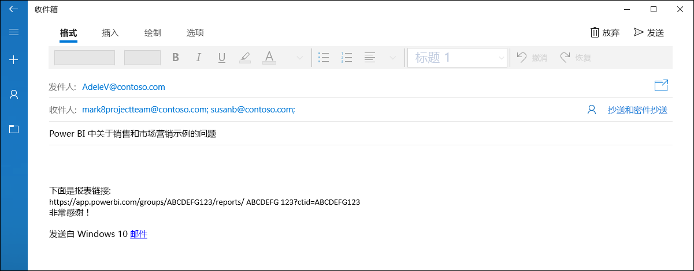
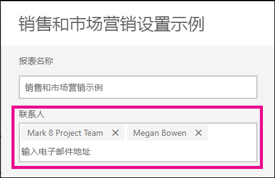
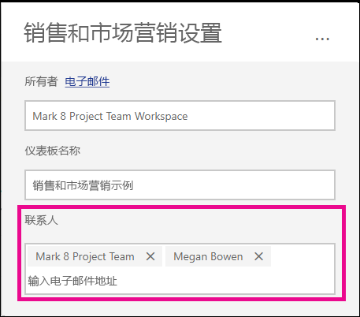

# 在 Power BI 服务中设置报表和仪表板的联系人信息
本文介绍如何在 Power BI 服务中设置仪表板或报表的联系人信息。

> [!NOTE]
> 可以为经典工作区或新工作区中的项设置联系人信息。 无法在“我的工作区”中设置项的联系人信息。 查看[新外观](service-new-look.md)中的报表或仪表板时，会显示信息卡。

可以向某个项的联系人添加多个用户或组。 可以是：
* 人员
* Office 365 组
* 启用了电子邮件的安全组
* 通讯组列表

默认情况下，创建新报表或仪表板的人员是其联系人。 如果设置某个值，则该值会覆盖默认值。 当然，可以从联系人列表中删除所有人员或组。 执行此操作时，对于经典工作区，将显示该工作区的 Office 365 组。 对于新工作区体验工作区，将使用[工作区联系人列表](service-create-the-new-workspaces.md#workspace-contact-list)。 如果未设置工作区联系人列表，则会显示工作区管理员。

将向查看此项的人员显示联系人信息。 

 

单击联系人列表时，将创建电子邮件，以便可以提出问题或获取帮助。 

 
 
联系人列表信息也用于其他位置。 例如，显示在错误对话框的一些错误方案中。 与项相关的自动电子邮件（如访问请求）将发送到联系人列表。 

> [!NOTE]
> 发布应用时，会将各个项上设置的联系人信息设置为发布或更新应用的人员。 可以设置应用支持 URL，使应用用户获得所需的帮助。

## 设置报表的联系人信息
1. 在“我的工作区”中，选择“报表”  选项卡。
2. 找到所需的报表，然后选择“设置”  图标。
3. 找到“联系人”  输入字段并设置一个值。

     

## 设置仪表板的联系人信息
1. 在工作区中，选择“仪表板”  选项卡。
2. 找到所需的仪表板，然后选择“设置”  图标
3. 找到“联系人”  输入字段并设置一个值。

     

## 限制和注意事项
* 自动为 Power BI 服务中创建的新项设置联系人。 现有项将显示工作区默认值。
* 可以在联系人列表中设置任何用户或组，但不会自动向他们授予对该项的权限。 使用共享或通过角色向需要访问工作区的用户提供权限。 
* 项目级联系人列表在发布时不会被推送到应用中。 新应用导航体验提供了一个支持 URL，你可以配置该 URL 来帮助管理大量应用用户的反馈。

## 后续步骤

更多问题？ [尝试参与 Power BI 社区](https://community.powerbi.com/)
