# Power BI 中的自动机器学习（预览）

适用于数据流的自动机器学习 (AutoML) 使业务分析师可以直接在 Power BI 中对机器学习模型进行训练、验证和调用。 它包括创建新 ML 模型的简单体验，分析师可以使用其数据流指定用于训练模型的输入数据。 服务会自动提取最相关的功能，选择适当的算法，并调整和验证 ML 模型。 在对模型进行训练后，Power BI 会自动生成一个包含验证结果的报表，用于向分析师解释性能和结果。 然后，可以在数据流中的任何新的或更新的数据上调用该模型。

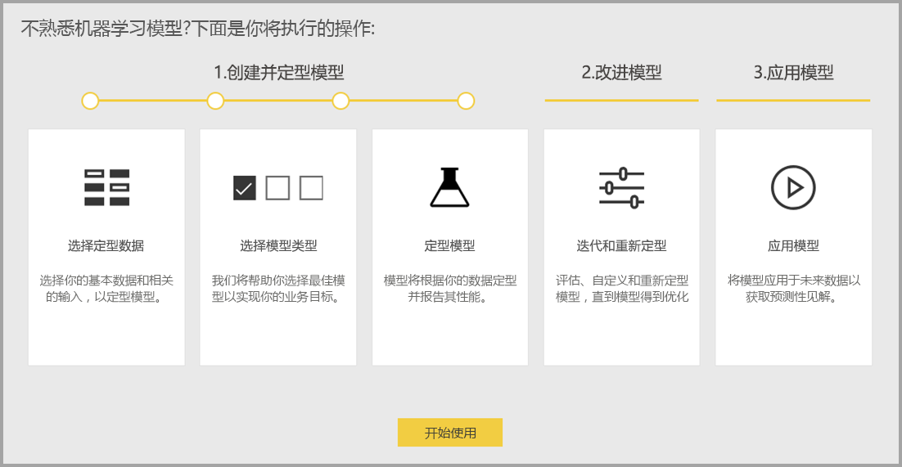

自动机器学习仅适用于 Power BI Premium 和嵌入式容量上托管的数据流。 在此预览版中，AutoML 使你能够为二进制预测、分类和回归模型训练机器学习模型。

## 使用 AutoML

[Power BI 数据流](service-dataflows-overview.md)为大数据提供自助服务数据准备。 AutoML 使你能够在 Power BI 中充分利用数据准备工作来构建机器学习模型。

通过 Power BI 中的 AutoML，数据分析师只需借助 Power BI 技能便可以使用数据流来构建具有简化体验的机器学习模型。 创建 ML 模型背后的大部分数据科学都是通过 Power BI 自动完成的，使用护栏确保生成的模型具有良好的质量，并通过可见性提供深入了解用于创建 ML 模型的过程。

AutoML 支持创建数据流的二进制预测、分类和回归模型。 这些是受监督的机器学习模型的类型，这意味着它们通过了解过去观察的已知结果来预测其他观察结果。 用于训练 AutoML 模型的输入数据集是一组标有已知结果的记录。

Power BI 中的 AutoML 从 [Azure 机器学习服务](https://docs.microsoft.com/azure/machine-learning/service/overview-what-is-azure-ml)集成[自动 ML](https://docs.microsoft.com/azure/machine-learning/service/concept-automated-ml)，以创建 ML 模型。 不过，在 Power BI 中，无需 Azure 订阅即可使用 AutoML。 训练和托管 ML 模型的过程完全由 Power BI 服务管理。

训练 ML 模型后，AutoML 会自动生成一个 Power BI 报表，用于说明 ML 模型的可能性能。 AutoML 突出显示输入中影响模型返回的预测结果的关键影响者，从而强调了可解释性。 该报表还包含模型的关键指标，具体取决于 ML 模型类型。

生成的报表的其他页显示模型的统计摘要和训练详细信息。 对于想要查看模型性能的标准数据科学度量值的用户，统计摘要非常有用。 训练详细信息汇总了用关联建模参数创建模型的所有运行迭代。 它还介绍了如何使用每个输入来创建 ML 模型。

然后，可以将 ML 模型应用于数据以进行评分。 刷新数据流时，ML 模型的预测会自动应用于数据。 Power BI 还包含有关 ML 模型产生的每个特定预测得分的个性化说明。

## 创建机器学习模型

本节介绍如何创建 AutoML 学习模型。 

### 创建 ML 模型的数据准备

若要在 Power BI 中创建机器学习模型，必须先使用历史结果信息（该信息用于训练 ML 模型）为数据创建数据流。 有关配置数据流的详细信息，请参阅 [Power BI 中的自助服务数据准备](service-dataflows-overview.md)。

在当前版本中，Power BI 仅使用单个实体的数据来训练 ML 模型。 因此，如果历史数据包含多个实体，则必须手动将数据加入单个数据流实体。 对于可能成为你要尝试预测的结果的强预测器的任何业务指标，还应当添加计算列。

对于训练机器学习模型，AutoML 有特定的数据要求。 以下各节根据各自的模型类型对这些要求进行了说明。

### 配置 ML 模型输入

若要创建 AutoML 模型，请在包含历史数据的数据流实体的“操作”列中选择 ML 图标，然后选择“添加机器学习模型”。

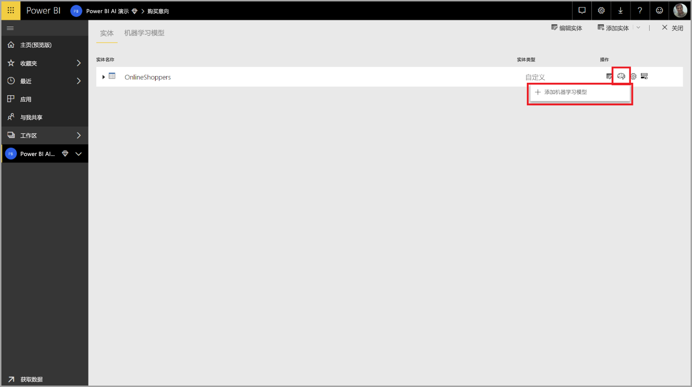

简化的体验已启动，其中包含一个向导，该向导将引导你完成创建 ML 模型的过程。 该向导包括以下简单步骤。

1. 选择包含历史结果数据的实体，以及要进行预测的字段
2. 根据想要查看的预测类型选择模型类型
3. 选择希望模型用作预测信号的输入
4. 命名模型并保存配置

历史结果字段标识用于训练 ML 模型的标签属性，如下图所示。

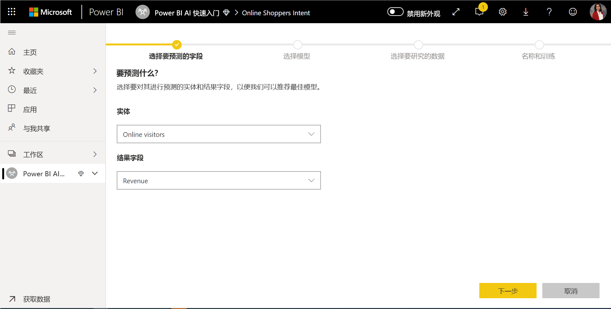

在指定历史结果字段时，AutoML 将分析标签数据，以确定可对该数据训练的 ML 模型的类型，并提供可进行训练的最可能的 ML 模型类型。 

> [!NOTE]
> 你选择的数据可能不支持某些模型类型。

AutoML 还会分析所选实体中的所有字段，以建议用于训练 ML 模型的输入。 此过程是大致的且基于统计分析，因此你应查看使用的输入。 任何依赖于历史结果字段（或标签字段）的输入都不应当用于训练 ML 模型，因为它们会影响其性能。

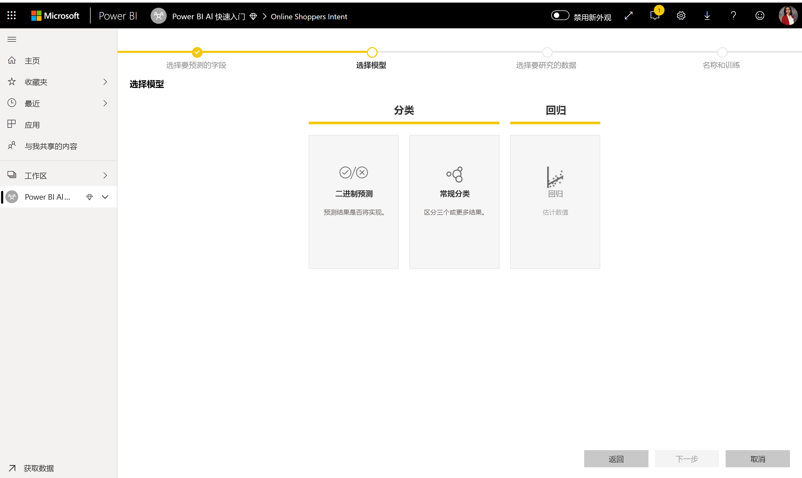

在最后一步中，可以命名模型并保存其设置。

在此阶段，系统会提示你刷新数据流，从而开始 ML 模型的训练过程。

### ML 模型训练

AutoML 模型的训练是数据流刷新的一部分。 AutoML 首先准备要进行训练的数据。

AutoML 将提供的历史数据拆分为训练和测试数据集。 测试数据集是在训练后用于验证模型性能的维持数据集。 它们是作为数据流中的“训练和测试”实体实现的。 AutoML 对模型验证使用交叉验证。

接下来，分析每个输入字段并应用插补法，这会将缺失值替换为替换值。 AutoML 使用几个不同的插补法策略。 然后，将任何所需的采样和规范化应用于数据。

AutoML 应用多个转换是基于其数据类型和统计属性的每个选定输入字段。 AutoML 使用这些转换提取功能以用于训练 ML 模型。

AutoML 模型的训练过程包括多达 50 个迭代，其中包含不同的建模算法和超参数设置，以查找性能最佳的模型。 使用维持数据测试数据集进行验证，对其中每个模型的性能进行评估。 在此训练步骤中，AutoML 会创建多个管道，用于训练和验证这些迭代。 评估模型性能的过程可能需要几分钟到几小时的时间，具体取决于数据集的大小和可用的专用容量资源。

在某些情况下，生成的最终模型可能使用系综学习，其中多个模型用于提供更好的预测性能。

### AutoML 模型可解释性

在对模型进行训练后，AutoML 将分析输入功能与模型输出之间的关系。 它为每个输入功能评估维持数据测试数据集的模型输出的变化量和变化方向。 这称为“功能重要性”。

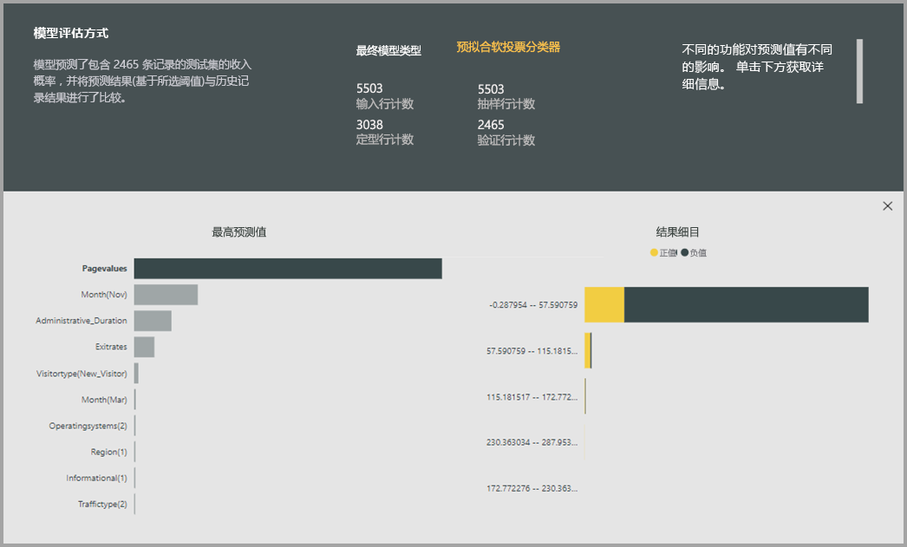

### AutoML 模型报表

AutoML 会生成一个 Power BI 报表，该报表在验证过程中汇总模型的性能以及全局功能重要性。 此报表汇总了将 ML 模型应用于维持数据测试数据的结果，并将预测与已知结果值进行比较。

你可以查看模型报表以了解其性能。 你还可以验证模型的关键影响者是否与有关已知结果的业务见解一致。

用于描述报表中的模型性能的图表和度量值因模型类型不同而异。 以下各节介绍了这些性能图表和度量值。

报表中的其他页可以从数据科学角度描述有关模型的统计度量值。 例如，“二进制预测”报表包括增益图和模型的 ROC 曲线。

报表还包括“训练详细信息”页，其中包含有关模型训练方式的说明，且包含一张图表来说明每个迭代运行的模型性能。

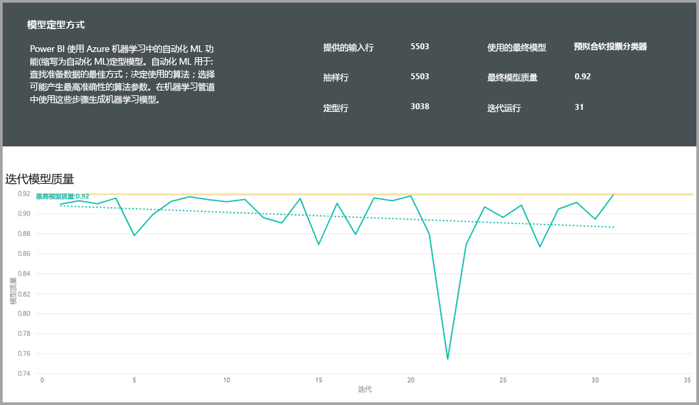

此页上的另一个部分介绍了如何使用插补法方法来填充输入字段缺少的值，以及如何对每个输入字段进行转换以提取模型中使用的功能。 它还包括最终模型所使用的参数。

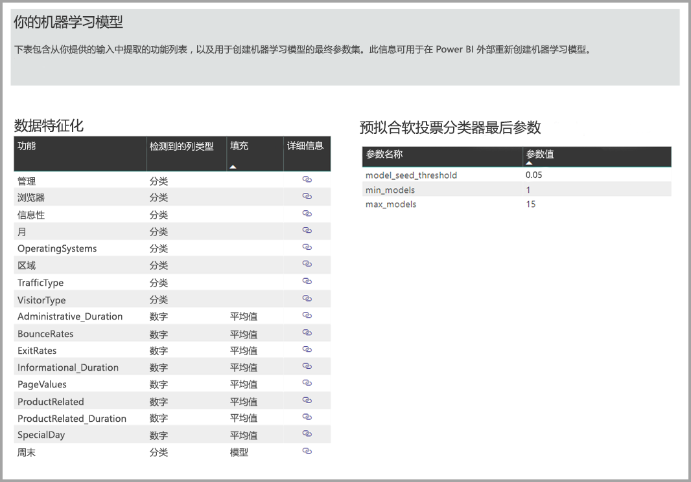

如果生成的模型使用系综学习，则“训练详细信息”页还包括一个部分，用于描述系综中每个构成模型的权重及其参数。

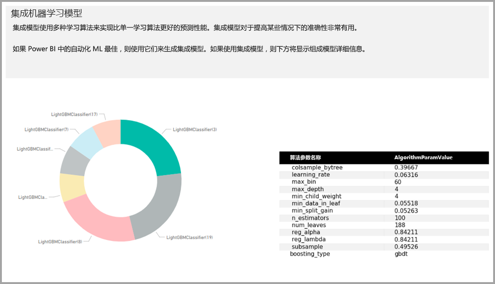

## 应用 AutoML 模型

如果对创建的 ML 模型的性能感到满意，则可以在数据流刷新后将其应用于新数据或更新的数据。 你可以通过选择右上角的“应用”按钮，从模型报表执行此操作。

若要应用 ML 模型，你必须指定须应用该模型的实体的名称，以及将为模型输出添加到此实体的列的前缀。 列名的默认前缀为模型名称。 Apply 函数可能包含特定于模型类型的其他参数。

应用 ML 模型会创建一个新的数据流实体，该实体带有扩充的后缀 <model_name>。 例如，如果将 PurchaseIntent 模型应用于 OnlineShoppers 实体，则输出将生成 OnlineShoppers 扩充的 PurchaseIntent。

目前，输出实体不能用于在 Power Query 编辑器中预览 ML 模型结果。 输出列始终显示 null 作为结果。 若要查看结果，在应用该模型时，将创建第二个输出实体，其中包含扩充的后缀 < model_name > Preview。

必须刷新数据流才能在查询编辑器中预览结果。

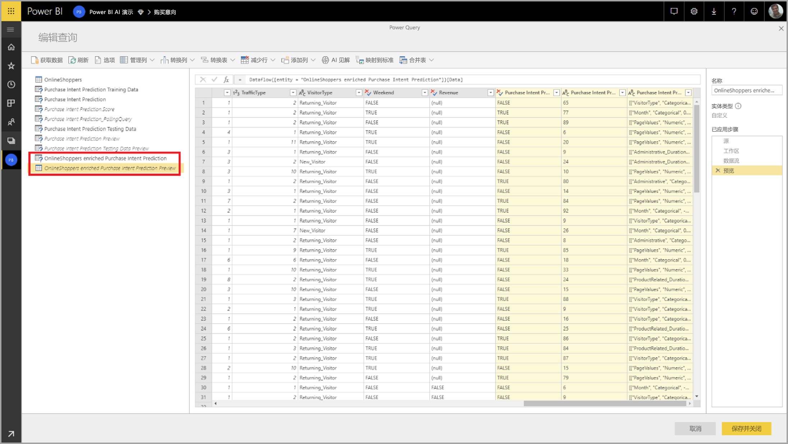

应用模型时，AutoML 始终会在刷新数据流时保持最新的预测。

AutoML 还包含对输出实体中评分的每一行的个性化说明。

若要在 Power BI 报表中使用 ML 模型的见解和预测，可以使用数据流连接器从 Power BI Desktop 连接到输出实体。

## 二进制预测模型

二进制预测模型（更正式地称为“二元分类模型”）用于将数据集分类为两个组。 它们用于预测可能具有二进制结果的事件，例如，销售机会是否转换、帐户是否将发生变化、是否需要按时支付发票、事务是否为欺诈性等等。

由于结果是二进制，因此 Power BI 期望二进制预测模型的标签是布尔值，已知结果标为 true 或 false。 例如，在销售机会转换模型中，赢得的销售机会标为 true，失去的销售机会标为 false，开放的销售机会标为 null。

二进制预测模型的输出是一个概率分数，用于标识与 true 标签值对应的结果得到实现的可能性。

### 训练二进制预测模型

若要创建二进制预测模型，包含训练数据的输入实体必须有一个布尔字段作为历史结果字段来标识过去已知的结果。

先决条件：

* 布尔字段必须用作历史结果字段
* 每类结果需要至少 50 行的历史数据

通常，如果过去的结果由不同数据类型的字段标识，则可以添加一个计算列以使用 Power Query 将这些结果转换为布尔值。

二进制预测模型的创建过程遵循与其他 AutoML 模型相同的步骤，如上文“配置 ML 模型输入”一节所述。

### 二进制预测模型报表

二进制预测模型将生成输出，该输出是记录将达到由布尔值标签值定义为 true 的结果的概率。 该报表包含概率阈值的切片器，它会影响如何解释高于和低于概率阈值的分数。

该报表以“真正”、“假正”、“真负”和“假负”的形式描述模型的性能。 对于结果数据中的两个类，“真正”和“真负”是正确预测的结果。 “假正”是实际布尔标签值为 False 但预测为 True 的结果。 相反，“假负”是实际布尔标签值为 True 但预测为 False 的结果。

度量值（如精度和撤回）描述了预测结果的概率阈值效果。 可以使用概率阈值切片器选择一个阈值，该阈值实现精度与撤回之间的均衡折衷。

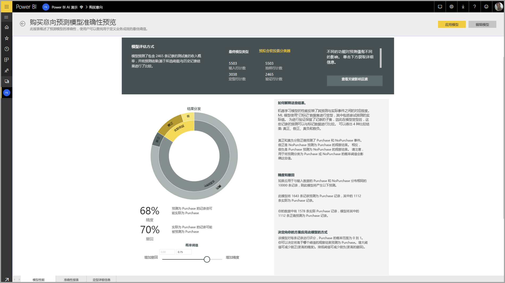

模型报表的“准确性报表”页包含模型的“累积收益”图和 ROC 曲线。 这些是模型性能的统计度量值。 报表包含所显示的图表的说明。

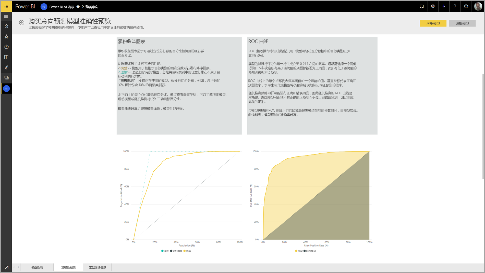

### 应用二进制预测模型

若要应用二进制预测模型，必须使用要应用 ML 模型预测的数据指定实体。 其他参数包含输出列名称前缀和概率阈值，以用于对预测结果进行分类。

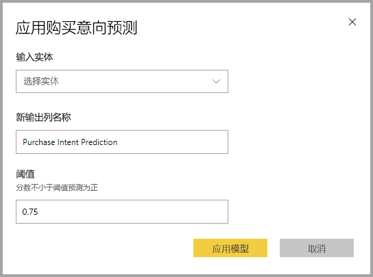

当应用二进制预测模型时，它向扩充的输出实体添加三个输出列。 它们为“PredictionScore”、“PredictionOutcome”和“PredictionExplanation”。 实体中的列名具有在应用模型时指定的前缀。

“PredictionOutcome”列包含预测的结果标签。 概率超过阈值的记录会被预测为可能获得结果，而未超过阈值的记录被预测为不可能获得结果。

“PredictionExplanation”列包含一个说明，其中含有输入功能对 PredictionScore 的特定影响。 这是一个 JSON 格式的预测输入功能的权重集合。

## 分类模型

分类模型用于将数据集分类为多个组或类。  它们用于预测具有多个可能结果之一的事件，例如客户是否可能具有非常高、高、中或低的终身价值；违约风险是高、中、低还是非常低；等等。

分类模型的输出是一个概率分数，用于标识记录将获得给定类的条件的可能性。

### 训练分类模型

包含分类模型训练数据的输入实体必须有一个字符串或数值字段作为历史结果字段，用于标识过去已知的结果。

先决条件：

* 每类结果需要至少 50 行的历史数据

分类模型的创建过程遵循与其他 AutoML 模型相同的步骤，如上文“配置 ML 模型输入”一节所述。

### 分类模型报表

通过将 ML 模型应用于维持数据测试数据并将记录的预测类与实际已知类进行比较，生成分类模型报表。

模型报表包括一个图表，其中包括每个已知类的正确和错误分类记录的细分。

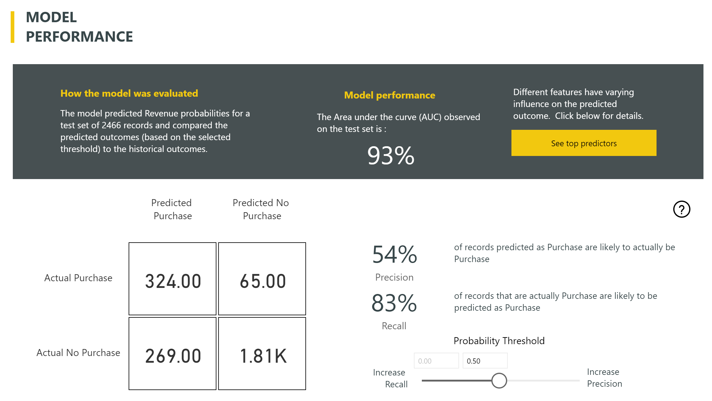

通过进一步的特定于类的向下钻取，可以分析已知类的预测是如何分布的。 这包括其他类，在这些类中，已知类的记录可能会分类不当。

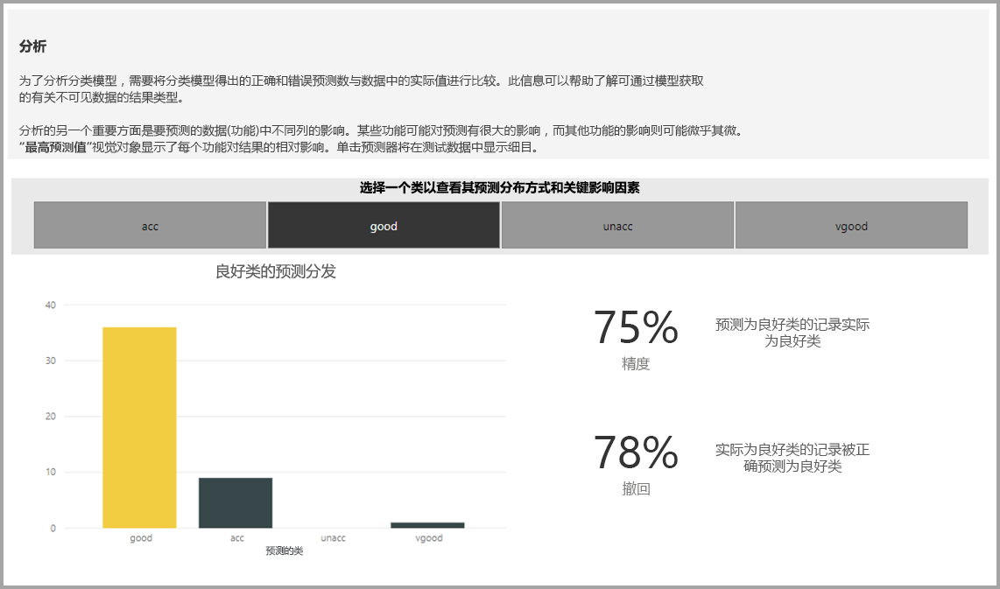

报表中的模型说明还包括每个类的最高预测值。

分类模型报表还包括与其他模型类型页面相似的“训练详细信息”页，如本文上面的“AutoML 模型报表”一节所述。

### 应用分类模型

若要应用分类 ML 模型，必须使用输入数据和输出列名称前缀指定实体。

当应用分类模型时，它向扩充的输出实体添加三个输出列。 它们为“PredictionScore”、“PredictionClass”和“PredictionExplanation”。 实体中的列名具有在应用模型时指定的前缀。

“PredictionClass”列包含记录最可能的预测类。 “PredictionScore”列包含每个可能类的记录的概率分数列表。

“PredictionExplanation”列包含一个说明，其中含有输入功能对 PredictionScore 的特定影响。 这是一个 JSON 格式的预测输入功能的权重集合。

## 回归模型

回归模型用于预测值，如可能会从销售交易中实现的收入、帐户的生存期值、可能要支付的应付款发票量、发票的支付日期等等。

回归模型的输出为预测值。

### 训练回归模型

回归模型包含训练数据的输入实体必须有一个数值字段作为历史结果字段，用于标识过去已知的结果值。

先决条件：

* 回归模型需要至少 100 行的历史数据

回归模型的创建过程遵循与其他 AutoML 模型相同的步骤，如上文“配置 ML 模型输入”一节所述。

### 回归模型报表

与其他 AutoML 模型报表类似，回归报表基于将模型应用于维持数据测试数据的结果。

模型报表包含将预测值与实际值进行比较的图表。 在此图表中，与对角线的距离表示预测中的误差。

残差图显示了维持数据测试数据集中不同值的平均误差百分比。 横轴表示组实际值的平均值，其中气泡的大小显示了该范围内的值的频率或计数。 垂直轴是平均残差。

回归模型报表还包括“训练详细信息”页，如上面的“AutoML 模型报表”中所述。

### 应用回归模型

若要应用回归 ML 模型，必须使用输入数据和输出列名称前缀指定实体。

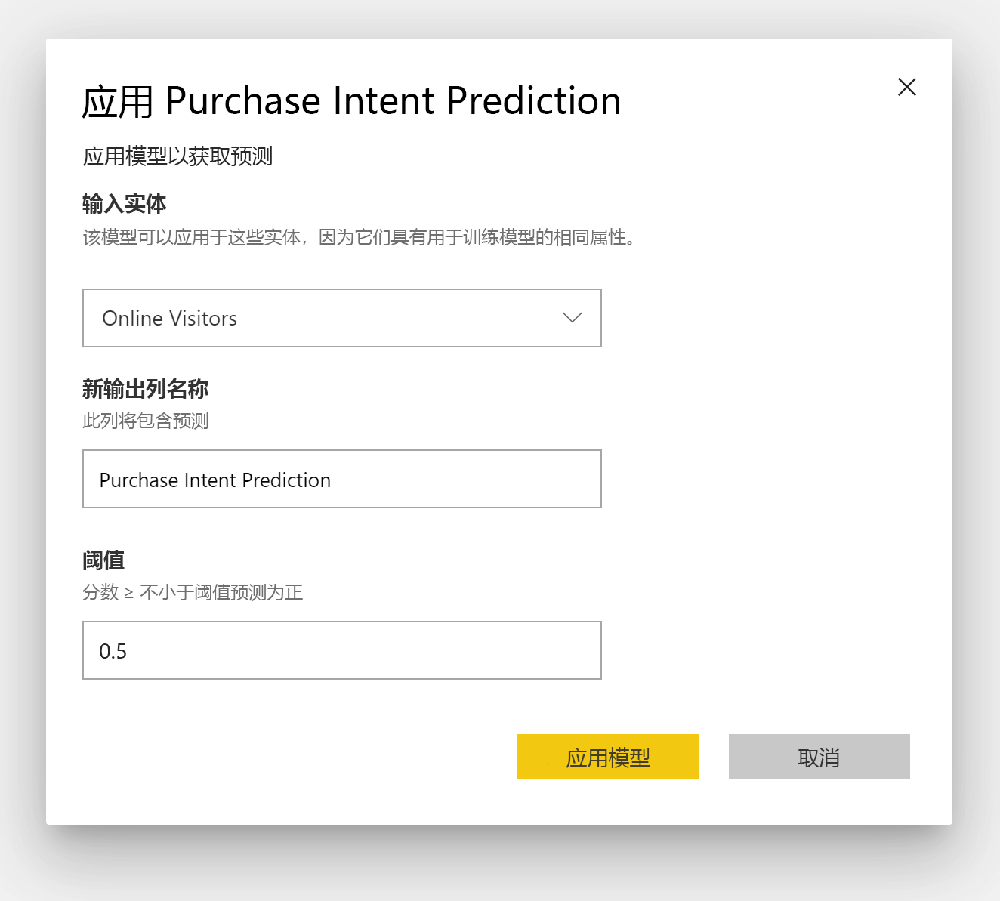

当应用回归模型时，它向扩充的输出实体添加两个输出列。 这两个列是“PredictionValue”和“PredictionExplanation”。 实体中的列名具有在应用模型时指定的前缀。

“PredictionValue”列包含基于输入字段的记录的预测值。 “PredictionExplanation”列包含一个说明，其中含有输入功能对 PredictionValue 的特定影响。 这是一个 JSON 格式的输入功能权重的集合。

## 后续步骤

本文提供了 Power BI 服务中数据流的自动机器学习概述。 以下文章也可提供帮助。

* [教程：在 Power BI 中生成机器学习模型（预览）](service-tutorial-build-machine-learning-model.md)
* [教程：在 Power BI 中使用认知服务](service-tutorial-use-cognitive-services.md)
* [教程：在 Power BI 中调用机器学习工作室模型（预览版）](service-tutorial-invoke-machine-learning-model.md)
* [Power BI 中的认知服务（预览版）](service-cognitive-services.md)
* [Power BI 中的 Azure 机器学习集成（预览版）](service-machine-learning-integration.md)

有关数据流的详细信息，可以阅读以下这些文章：
* [在 Power BI 中创建和使用数据流](service-dataflows-create-use.md)
* [在 Power BI Premium 上使用计算实体](service-dataflows-computed-entities-premium.md)
* [将数据流与本地数据源配合使用](service-dataflows-on-premises-gateways.md)
* [Power BI 数据流的开发人员资源](service-dataflows-developer-resources.md)
* [数据流和 Azure Data Lake 集成（预览）](service-dataflows-azure-data-lake-integration.md)

