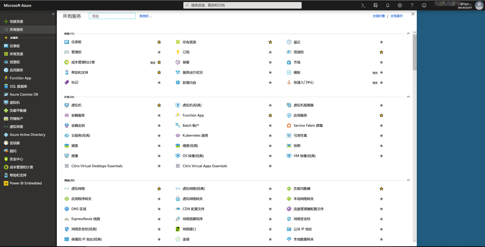
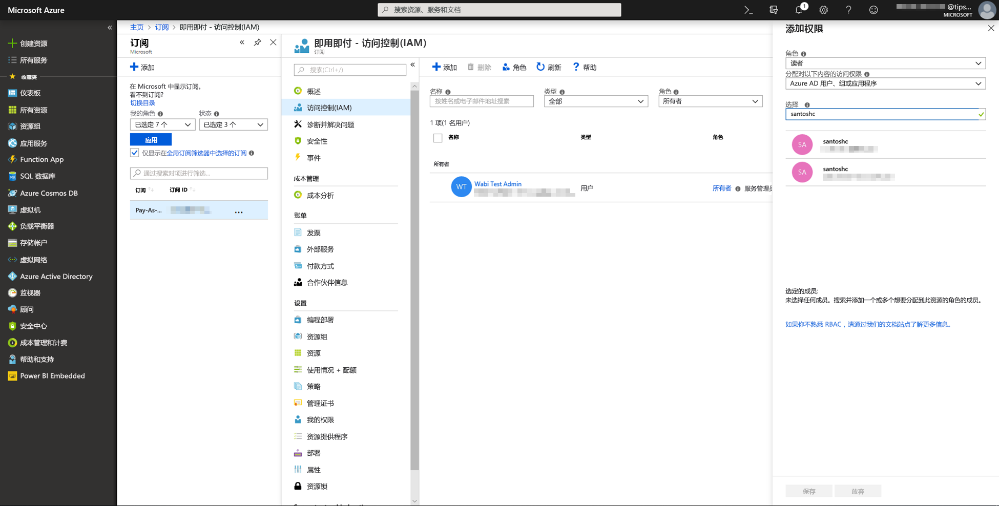

# Power BI 中的 Azure 机器学习集成

许多组织都使用机器学习  模型，以获得有关其业务的更好的见解和预测。 在报表、仪表板和其他分析中可视化和调用这些模型中的见解的功能可有助于将这些见解传播到最需要它们的业务用户。  现在，Power BI 通过使用简单的点击手势可轻松整合托管在 Azure 机器学习服务上的模型中的见解。

若要使用此功能，数据科学家只需使用 Azure 门户向 BI 分析师授予访问 Azure ML 模型的权限。  然后，在每个会话开始时，Power Query 将发现用户具有访问权限的所有 Azure ML 模型，并将其作为动态 Power Query 函数公开。  然后，用户可以通过从 Powre Query 编辑器中的功能区中访问这些函数来调用它们，或通过直接调用 M 函数来调用这些函数。 在为一组行调用 Azure ML 模型时，Power BI 还自动批处理访问请求，以实现更好的性能。

此功能目前仅支持 Power BI 数据流以及 Power BI 服务中的联机 Power Query。

若要了解有关数据流的详细信息，请参阅 [Power BI 中的自助服务数据准备](service-dataflows-overview.md)。

若要了解有关 Azure 机器学习的详细信息，请参阅：

- 概述：[Azure 机器学习服务是什么？](https://docs.microsoft.com/azure/machine-learning/service/overview-what-is-azure-ml)
- Azure 机器学习的快速入门和教程：[Azure 机器学习文档](https://docs.microsoft.com/azure/machine-learning/)

## 向 Power BI 用户授予对 Azure ML 模型的访问权限

若要从 Power BI 访问 Azure ML 模型，用户必须具有对 Azure 订阅的读取  权限。  此外：

- 对于机器学习工作室模型，具有对机器学习工作室 Web 服务的读取  权限
- 对于机器学习服务模型，具有对机器学习服务工作区的读取  权限

本文中的步骤介绍了如何向 Power BI 用户授予对托管在 Azure ML 服务上的模型的访问权限，以便他们可以将此模型作为 Power Query 函数进行访问。  有关更为详细的信息，请参阅[使用 RBAC 和 Azure 门户管理访问](https://docs.microsoft.com/azure/role-based-access-control/role-assignments-portal)。

1. 登录 [Azure 门户](https://portal.azure.com)。

2. 转到“订阅”  页。 可以通过 Azure 门户左侧导航菜单中的“所有服务”  列表找到“订阅”  页。

    

3. 选择订阅。

    

4. 选择“访问控制 (IAM)”  ，然后选择“添加”  按钮。

    

5. 选择“读取器”  作为角色。 选择想要授予其访问 Azure AL 模型权限的 Power BI 用户。

    

6. 选择**保存**。

7. 重复第三步至第六步的操作，以向用户授予对特定机器学习工作室 Web 服务或  托管模型的机器学习服务工作区的读取器  访问权限。

## 机器学习服务模型的架构发现

数据科学家主要使用 Python 来为机器学习服务开发甚至部署其机器学习模型。  与机器学习工作室（有助于自动执行创建模型的架构文件的任务）不同，在机器学习服务中，数据科学家必须使用 Python 显式生成架构文件。

此架构文件必须包含在为机器学习服务模型部署的 Web 服务中。 若要自动生成 Web 服务的架构，必须在已部署模型的条目脚本中提供输入/输出的示例。 请参阅 Azure 机器学习服务文档的部署模型中关于（可选）自动生成 Swagger 架构的子节。 该链接包括示例条目脚本以及架构生成的语句。 

具体来说，条目脚本中的 @input_schema 和 @output_schema 函数引用了输入示例和输出示例变量中的输入和输出示例格式，并在部署期间使用这些示例为 web 服务生成 OpenAPI (Swagger) 规范     。

通过更新条目脚本生成架构的这些说明还必须应用于在自动化机器学习试验中使用 Azure 机器学习 SDK 创建的模型。

> [!NOTE]
> 使用 Azure 机器学习服务可视界面创建的模型当前不支持架构生成，但后续版本将提供支持。 

## 调用 Power BI 中的 Azure ML 模型

你可以从数据流中的 Power Query 编辑器中直接调用已授予访问权限的任何 Azure ML 模型。 若要访问 Azure ML 模型，从 Azure ML 模型中选择想要使用见解进行扩充的实体的“编辑”  按钮，如下图中所示。

选择“编辑”  按钮将在数据流中为实体打开 Power Query 编辑器。

选择功能区中的“AI 见解”  按钮，然后选择左侧导航菜单中的“Azure 机器学习模型”  文件夹。 有权访问的所有 Azure ML 模型都在此处作为 Power Query 函数列出。 此外，会将 Azure ML 模型的输入参数自动映射为相应的 Power Query 函数的参数。

若要调用 Azure ML 模型，可以从下拉列表中将任一选定的实体的列指定为输入。 此外，还可以通过将列图标切换到输入对话框左侧来指定要用作输入内容的常量值。

选择“调用”  以查看作为实体表中新列的 Azure ML 模型的输出预览。 还会将模型调用视作查询的一个应用步骤。

如果模型返回多个输出参数，则会将它们组合在一起作为输出列中的记录。 可以展开列，以在单个列中生成单独的输出参数。

保存数据流后，当刷新数据流时，将为实体表中的任何新行或更新的行自动调用模型。

## 后续步骤

本文提供了将机器学习集成到 Power BI 服务的概述。 以下文章也应该会非常有趣且实用。 

* [教程：在 Power BI 中调用机器学习工作室模型](service-tutorial-invoke-machine-learning-model.md)
* [教程：在 Power BI 中使用认知服务](service-tutorial-use-cognitive-services.md)
* [Power BI 中的认知服务](service-cognitive-services.md)

有关数据流的详细信息，可以阅读以下这些文章：
* [在 Power BI 中创建和使用数据流](service-dataflows-create-use.md)
* [在 Power BI Premium 上使用计算实体](service-dataflows-computed-entities-premium.md)
* [将数据流与本地数据源配合使用](service-dataflows-on-premises-gateways.md)
* [Power BI 数据流的开发人员资源](service-dataflows-developer-resources.md)
* [数据流和 Azure Data Lake 集成（预览）](service-dataflows-azure-data-lake-integration.md)

