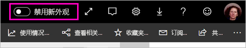
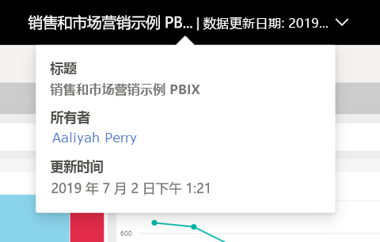
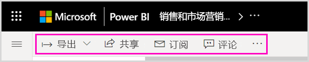
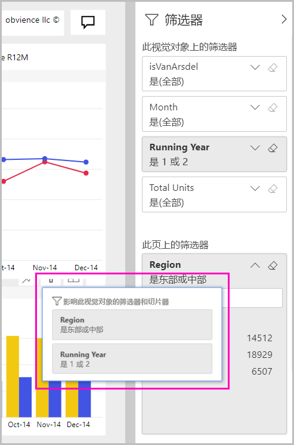

# Power BI 服务的新外观

Power BI 服务 (app.powerbi.com) 的新外观使报表查看和交互更加容易。 新外观更便捷，它基于你对其他 Microsoft 产品的熟悉程度。 在整个 Power BI 服务中，我们通过转换为较浅的颜色主题并更新图标，使报表内容成为主要的关注点。 下面概述了新外观中相较原外观的变化。 有关详细信息，请参阅编号部分：

正在寻找特定的操作？ 请参阅[全新外观：操作位于何处？](service-new-look-where-actions.md)

## 有关更改的快速教程

此动画生动演示了对报表外观的更改。

## 1.选择启用新外观

任何 Power BI 服务用户都可以选择启用新外观。 只需将开关从“禁用新外观”滑动到“启用新外观”即可   。

如果需要返回旧外观，只需将开关滑动回到“关”  。 如果看不到此开关，请选择右上角的省略号菜单。

## 2.查看报表详细信息 

在顶部横幅中，可快速查看“上次刷新日期”和“联系信息”等详细信息。  打开菜单，查看报表的其他详细信息。 甚至可以向报表所有者发送电子邮件。

## 3.页的垂直列表 
报表页名称现在在垂直窗格的列表中。 它们很明显、不易忽视，类似于 Word 和 PowerPoint 中的导航。 可以通过调整垂直窗格的大小，增加或减小报表区域的其余部分。

## 4.简化的操作栏 

位于顶部、更新后的操作栏显示报表使用者最常用、最重要的命令。 通过筛选器和书签，可以更轻松地导出、订阅、与他人协作以及更深入地了解。

## 5.报表命令位于何处？

我们没有从旧外观中删除任何功能。 可以通过展开操作栏中的省略号（... 菜单），找到其他命令（如编辑、保存副本等）。 此外，还可以从内容列表访问使用情况指标。

### “文件”菜单操作位于何处？

想查找“文件”菜单操作  ？ 过去位于“文件”菜单上的操作现在也位于省略号 (...) 菜单上  。 

## 6.新筛选器体验

默认情况下，新外观提供最新更新（如查看已应用的筛选器和新筛选器窗格）。 即使报表设计器尚未升级到新的筛选器体验，也会显示新筛选器窗格。

## 仪表板的“新外观”体验 

与报表和应用一样，仪表板也具有简化的操作栏，以实现一致的体验，但会保留功能上的差异。 下面是仪表板中的操作的演练。
 

## 编辑模式无更改 

我们保留了与桌面版中类似的创作体验。 新外观更改仅适用于阅读视图。

## 后续步骤

[面向使用者的 Power BI](consumer/end-user-consumer.md)
