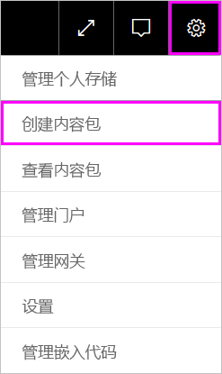
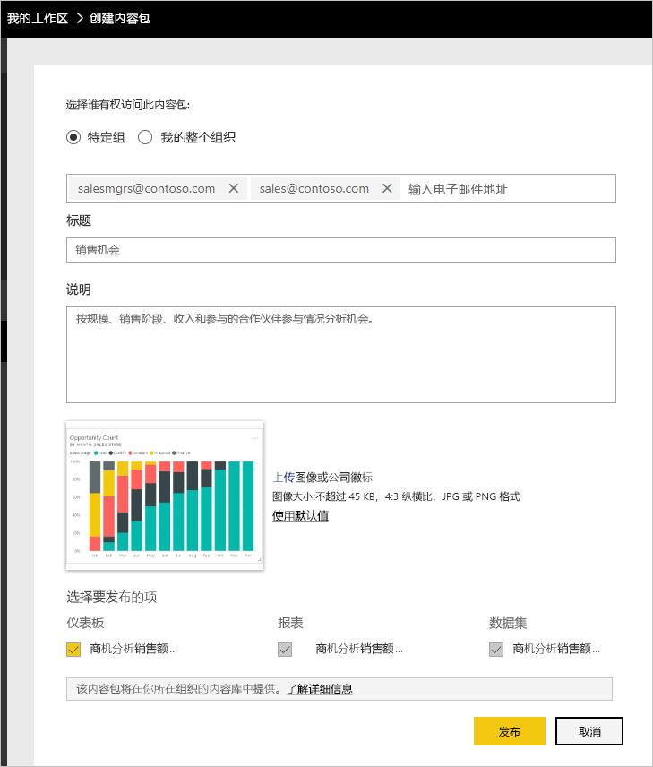
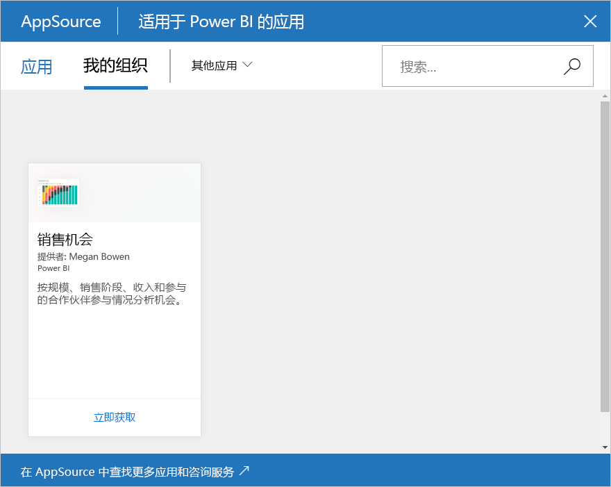

# 教程：创建和发布 Power BI 组织内容包

本教程介绍了如何创建组织内容包，授予对特定组的访问权限，并将组织内容包发布到你在 Power BI 上的组织内容包库。

创建内容包不同于共享仪表板，也不同于在组中针对这些包开展协作。 阅读[如何在 Power BI 中分享工作](service-how-to-collaborate-distribute-dashboards-reports.md)，根据自己的情况选择最佳选项。

你和你的同事需要具有 [Power BI Pro 帐户](https://powerbi.microsoft.com/pricing)才能创建组织内容包。

> [!NOTE]
> 无法在新工作区体验预览中创建或安装组织内容包。 如果尚未升级，现在正是将内容包升级到应用的最佳时机。 详细了解[新工作区体验](service-create-the-new-workspaces.md)。

## 创建和发布内容包

假设你是 Contoso 的发布经理，准备推出新产品。  你已创建了一个包含要共享的报表的仪表板。 管理发布的其他员工可能会发现它们很有用。 你想要对仪表板和报表进行打包的方法，使其作为你的同事使用的解决方案。

想要跟着做吗？ 在 [Power BI 服务](https://powerbi.com)中，转到“我的工作区”  。 然后转到“获取数据” > “示例” > “机会分析示例” > “连接”，获取自己的副本     。

1. 在左侧的导航窗格中，选择“工作区” > “我的工作区”   。

1. 在顶部导航栏中，选择齿轮图标  > “创建内容包”  。

   

1. 在“创建内容包”窗口中，输入以下信息  。  

   请记住，你组织的内容包库可能会快速填满。 该库最终可能会得到数百个为组织或组发布的内容包。 花点时间为内容包指定有意义的名称、添加合理的说明并选择合适的受众。  使用的字词要使你的内容包可通过搜索轻松查找。 以便将来更加易于查找。

      

    1. 选择“特定组”  。

    1. 输入个人、[Office 365 组](https://support.office.com/article/Create-a-group-in-Office-365-7124dc4c-1de9-40d4-b096-e8add19209e9)、通讯组或安全组的完整电子邮件地址。 例如：salesmgrs@contoso.com；sales@contoso.com

        针对本教程，尝试使用你的组的电子邮件地址。

    1. 将内容包命名为*销售机会*。

        > [!TIP]
        > 请考虑将仪表板名称包含在内容包名称中。 这样一来，你的同事连接到你的内容包后便可更轻松地找到仪表板。

    1. 推荐：添加说明。 这有助于同事更轻松地找到所需的内容包。 除了说明外，还请添加你的同事在搜索此内容包时可能输入的关键字。 添加联系人信息，方便同事有疑问或需要帮助时使用。

    1. 上传图像或徽标，以便组成员更轻松地查找内容包。

        扫描图像比扫描文本更快。 屏幕截图显示了“机会计数”柱形图磁贴的图像  。

    1. 选择**机会分析示例**仪表板，将其添加到内容包。

        Power BI 会自动添加相关联的报表和数据集。 可以根据需要添加其他内容。

       > [!NOTE]
       > Power BI 仅列出了可编辑的仪表板、报表、数据集和工作簿。 因此，该应用不会显示与你共享的任何内容。

   1. 如果你有 Excel 工作簿，可在“报表”下查看它们，带有 Excel 图标  。 也可将它们添加到内容包。

      

      > [!NOTE]
      > 如果组成员不能查看 Excel 工作簿，可能需要[在 OneDrive for Business 中共享工作簿](https://support.office.com/article/Share-documents-or-folders-in-Office-365-1fe37332-0f9a-4719-970e-d2578da4941c)。

1. 选择**发布**将该内容包添加到组的组织内容包库。  

   如果成功地发布，你将看到一条成功消息。

1. 当组成员转到“获取数据” > “组织内容包”时，他们会看到你的内容包   。

   

   > [!TIP]
   > 你的浏览器中显示的 URL 是此内容包的唯一地址。  想要告诉同事有关此新内容包的信息？  将 URL 粘贴到电子邮件中。

1. 当组成员选择“连接”时，他们可以[查看和使用你的内容包](service-organizational-content-pack-copy-refresh-access.md)  。

## 后续步骤

* [Power BI 中的组织内容包简介](service-organizational-content-pack-introduction.md)。

* [管理、更新和删除组织内容包](service-organizational-content-pack-manage-update-delete.md)。

* [在 Power BI 中发布应用](service-create-distribute-apps.md)。

* [什么是 OneDrive for Business？](https://support.office.com/article/What-is-OneDrive-for-Business-187f90af-056f-47c0-9656-cc0ddca7fdc2)

* 更多问题？ [尝试参与 Power BI 社区](http://community.powerbi.com/)
