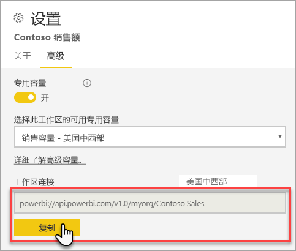

# 使用客户端应用程序和工具连接到数据集（预览）

Power BI Premium 工作区和数据集支持 Microsoft 和第三方客户端应用程序和工具的只读连接  。 

> [!NOTE]
> 本文将只介绍 Power BI Premium 工作区和数据集的只读连接。 且不提供关于可编程性、特定工具和应用程序、体系结构以及工作区和数据集管理的深入信息  。 接下来介绍的主题需要读者对 Analysis Services 表格模型数据库体系结构和管理有扎实的理解。

## 协议

Power BI Premium 使用 [XML for Analysis](https://docs.microsoft.com/bi-reference/xmla/xml-for-analysis-xmla-reference) (XMLA) 协议，用于客户端应用程序与管理工作区和数据集的引擎之间的通信。 这些通信通过通常所说的 XMLA 终结点进行。 XMLA 是 Microsoft Analysis Services 引擎所使用的同一通信协议，该协议在底层运行 Power BI 的语义建模、治理、生命周期和数据管理。 

绝大多数客户端应用程序和工具都不通过使用 XMLA 终结点显式地与引擎通信。 而是将 MSOLAP、ADOMD 和 AMO 等客户端库用作客户端应用程序和引擎之间的媒介，从而使用 XMLA 进行排他式通信。

## 支持的工具

这些工具支持对 Power BI Premium 工作区和数据集的只读访问：

**SQL Server Management Studio (SSMS)** - 支持 DAX、MDX、XMLA 和 TraceEvent 查询。 需要 18.0 版本。 请从[此处](https://docs.microsoft.com/sql/ssms/download-sql-server-management-studio-ssms)下载。 

**SQL Server Profiler** - 包含在 SSMS 18.0（预览版）中，此工具支持对服务器事件进行跟踪和调试。 可以捕获每个事件的数据并将其保存到文件或表中，以供之后分析。 尽管 SQL Server 已正式弃用 Profiler，但 SSMS 中仍含有，并且 Analysis Services 仍支持该工具，目前 Power BI Premium 也支持该工具。 若要了解详细信息，请参阅 [SQL Server Profiler](https://docs.microsoft.com/sql/tools/sql-server-profiler/sql-server-profiler)。

**DAX Studio** - 开源、社区工具，用于针对 Analysis Services 执行和分析 DAX 查询。 需要 2.8.2 版本或更高版本。 若要了解详细信息，请参阅 [daxstudio.org](https://daxstudio.org/)。

**Excel 数据透视表** - 需 Office 16.0.11326.10000 或更高版本的即点即用版本。

**第三方** - 包括客户端数据可视化应用程序和工具，可用于连接到、查询和使用 Power BI Premium 中的数据集。 大多数工具都需要最新版本的 MSOLAP 客户端库，但某些可以使用 ADOMD。

## 客户端库

客户端应用程序和工具必须使用客户端库来连接到 Power BI Premium 工作区。 Power BI Premium 还支持用于连接到 Analysis Services 的相同客户端库。 Excel、SQL Server Management Studio (SSMS) 和 SQL Server Data Tools (SSDT) 等 Microsoft 客户端应用程序安装全部三个客户端库，并进行常规应用程序更新。 在某些情况下，特别是使用第三方应用程序和工具时，可能需要安装更新版本的客户端库。 客户端库会每月更新。 若要了解详细信息，请参阅[用于连接到 Analysis Services 的客户端库](https://docs.microsoft.com/azure/analysis-services/analysis-services-data-providers)。

## 连接到 Premium 工作区

可以连接到分配给 Premium 专用容量的工作区。 分配给专用容量的工作区具有 URL 格式的连接字符串。 

若要获取工作区连接字符串，请在 Power BI 的“工作区设置”中的“Premium”选项卡上，单击“工作区连接”中的“复制”     。

工作区连接使用类似于 Analysis Services 服务器名称的以下 URL 格式来为工作区编址：   
`powerbi://api.powerbi.com/v1.0/[tenant name]/[workspace name]` 

例如，`powerbi://api.powerbi.com/v1.0/contoso.com/Sales Workspace`

### 在 SSMS 中连接

在“连接到服务器” > “服务器类型”中，选择 Analysis Services    。 在“服务器名称”中，输入 URL  。 在“身份验证”中，选择“Active Directory - 通用且具有 MFA 支持”，然后在“用户名”中输入你的组织用户 ID    。 

连接时，工作区显示为 Analysis Services 服务器，工作区中的数据集显示为数据库。  

### 初始目录

你可能需要为 SQL Server Profiler 等部分工具指定“初始目录”  。 在工作区中指定数据集（数据库）。 在“连接到服务器”中，单击“选项”   。 在“连接到服务器”对话框的“连接属性”选项卡上的“连接到数据库”中，输入数据集名称    。

### 复制工作区名称

连接到与另一工作区同名的工作区时，可能会出现以下错误：无法连接到 powerbi://api.powerbi.com/v1.0/[租户名称]/[工作区名称]  。

若要解决该错误，除工作区名称之外，还需指定可从 URL 中的工作区 objectID 复制的 ObjectIDGuid。 将 objectID 追加到连接 URL。 例如，`powerbi://api.powerbi.com/v1.0/myorg/Contoso Sales - 9d83d204-82a9-4b36-98f2-a40099093830'

### 复制数据集名称

连接到与同一工作区中的另一数据集同名的数据集时，请将数据集 guid 追加​​到数据集名称。 连接到 SSMS 中的工作区时，可以获取数据集名称和 guid  。 

### 显示的数据集中的延迟

连接到工作区时，新的、已删除和已重命名数据集中的更改可能需要 5 分钟才会显示。 

### 不支持的数据集

使用 XMLA 终结点无法访问以下数据集。 这些数据集将不会在 SSMS 或其他工具中的工作区下显示  ： 

- 具有到 Analysis Services 模型的实时连接的数据集。 
- 使用 REST API 推送数据的数据集。
- Excel 工作簿数据集。 

Power BI 服务不支持以下数据集：   

- 具有到 Power BI 数据集的实时连接的数据集。

## 审核日志 

客户端应用程序和工具连接到工作区时，通过 XMLA 终结点进行的访问记录在 GetWorkspaces 操作下的 Power BI 审核日志中  。 若要了解详细信息，请参阅[审核 Power BI](service-admin-auditing.md)。

## 另请参阅

[Analysis Services 参考](https://docs.microsoft.com/bi-reference/#pivot=home&panel=home-all)   
[SQL Server Management Studio](https://docs.microsoft.com/sql/ssms/sql-server-management-studio-ssms)   
[SQL Server Analysis Services 表格数据](https://docs.microsoft.com/openspecs/sql_server_protocols/ms-ssas-t/b98ed40e-c27a-4988-ab2d-c9c904fe13cf)   
[动态管理视图 (DMV)](https://docs.microsoft.com/sql/analysis-services/instances/use-dynamic-management-views-dmvs-to-monitor-analysis-services)   

更多问题？ [尝试咨询 Power BI 社区](https://community.powerbi.com/)
