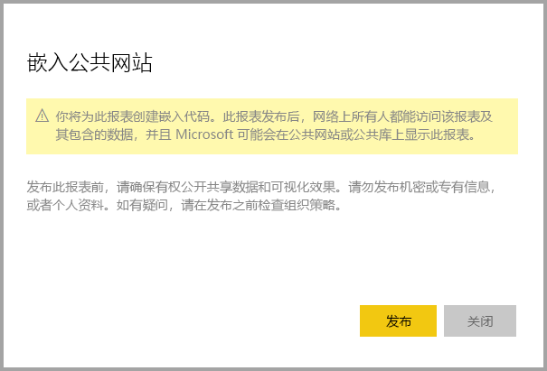

# 从 Power BI 发布到 Web

借助 Power BI“发布到 Web”  选项，可轻松地将交互式 Power BI 内容嵌入博客文章、网站、电子邮件或社交媒体中。 还可以轻松编辑、更新、刷新或停止共享已发布的视觉对象。

> [!WARNING]
> 使用“发布到 Web”时，Internet 上的所有人都可查看你发布的报表或视觉对象  。 查看不需要身份验证。 它包括查看报表聚合的详细级别数据。 发布报表前，请确保可以公开共享数据和可视化效果。 请勿发布机密或专有信息。 如果有任何疑问，请在发布前查看组织策略。

>[!Note]
>可以将内容安全地嵌入内部门户或网站。 使用[嵌入”](service-embed-secure.md)或[在 SharePoint Online 中嵌入”](service-embed-report-spo.md)选项。 这些选项可确保在用户查看内部数据时强制执行所有权限和数据安全性。

## 通过“发布到 Web”创建嵌入代码

可在个人工作区或组工作区中编辑的报表提供有“发布到 Web”功能  。  但与你共享的报表，或依赖行级安全性来保护数据的报表不提供该功能。 请参阅以下[限制](#limitations)部分，了解有关不支持“发布到 Web”的情况的完整列表   。 使用“发布到 Web”前请查看本文之前所述的“警告”部分   。

以下短视频演示了此功能的工作方式。 然后，按以下步骤自行尝试。

<iframe width="560" height="315" src="https://www.youtube.com/embed/UF9QtqE7s4Y" frameborder="0" allowfullscreen></iframe>

以下步骤介绍如何使用**发布到 Web**。

1. 打开可编辑的工作区中的报表，然后选择“更多选项 (...)”    > “嵌入”   > “发布到 Web (公共)”  。

   
   
2. 如果 Power BI 管理员尚未允许你创建嵌入代码，则可能需要与他们联系。

   
   
   若要获取在查找谁能在组织中启用“发布到 Web”方面的帮助，请参阅本文后面的[如何查找 Power BI 管理员](#find-your-power-bi-administrator)。

3. 查看对话框内容，然后选择“创建嵌入代码”  。

   

4. 查看如下所示的警告，并确认数据是否准备好嵌入到公共网站。 如果已准备好，选择“发布”  。

   

5. 对话框显示一条链接。 选择该链接以在电子邮件中发送，或复制 HTML。 可以将它嵌入 iFrame 等代码，或直接粘贴到网页或博客。

   

6. 如果之前为报表创建了嵌入代码并选择“发布到 Web”，则不会显示步骤 2-4 中的对话框  。 相反，将显示“嵌入代码”对话框  ：

   

   每个报表只能创建一个嵌入代码。

### 视图模式的提示

在博客帖子中嵌入内容时，通常需要调整以适合屏幕的特定大小。  可根据需要调整 iFrame 标记中的高度和宽度。 但需要确保报表适合给定的 iFrame 区域，因此编辑报表时还需要设置相应的视图模式。

下表提供有关视图模式及其嵌入时外观的指导。

| 视图模式 | 嵌入时外观 |
| --- | --- |
|  |“调整到页面大小”会考虑报表的页面高度和宽度  。 如果将页面设置为动态  比率，如 16:9 或 4:3，内容将在 iFrame 范围内缩放至合适的大小。 嵌入 iFrame 中时，使用“调整到页面大小”可能会导致“宽屏”，内容在 iFrame 中调整至合适大小后，iFrame 区域会显示灰色背景   。 为了最大限度地减少上下黑边，请正确设置 iFrame 的高度和宽度。 |
|  |“实际大小”确保报表保持其在报表页上设置的大小  。 这可能导致 iFrame 中显示滚动条。 设置 iFrame 高度和宽度，以避免出现滚动条。 |
|  |“适应宽度”  确保内容填充 iFrame 的水平区域。 仍会显示一个边框，但内容进行缩放，以便利用所有可用的水平空间。 |

### iFrame 高度和宽度的提示

“发布到 Web”  嵌入类似于以下示例的代码：

 
可以手动编辑宽度和高度，确保它正以所希望的方式适应正将其嵌入到的页面。

若要实现更完美的适应，可尝试为 iFrame 的高度添加 56 个像素，以适应底部栏的当前大小。 如果报表页使用动态尺寸，下表提供了一些可用于实现适应页面而不会造成宽屏的尺寸。

| 比率 | 大小 | 尺寸（宽 x 高） |
| --- | --- | --- |
| 16:9 |小 |640 x 416 px |
| 16:9 |中 |800 x 506 px |
| 16:9 |大 |960 x 596 px |
| 4:3 |小 |640 x 536 px |
| 4:3 |中 |800 x 656 px |
| 4:3 |大 |960 x 776 px |

## 管理嵌入代码

创建“发布到 Web”嵌入代码后，可通过 Power BI 中的“设置”菜单管理代码   。 管理嵌入代码包括，能够删除代码的目标视觉对象或报表（使嵌入代码不可用），或获取嵌入代码。

1. 若要管理你的**发布到 Web** 嵌入代码，打开**设置**齿轮，然后选择**管理嵌入代码**。

   

2. 显示嵌入代码。

   

3. 可以检索，也可以删除嵌入代码。 删除它会禁用指向该报表或视觉对象的任何链接。

   

4. 如果选择“删除”，系统会提示进行确认  。

   

## 报表更新和数据刷新

创建“发布到 Web”嵌入代码并将其共享后，将使用你所做的所有更改对报表进行更新，并立即激活嵌入代码链接  。 打开链接的任何人都可以查看。 但完成此初始操作之后，需要两到三小时用户才能看见对报表或视觉对象的更新。 若要了解详细信息，请参阅本文后面[工作方式](#howitworks)部分  。 

### 数据刷新

数据刷新自动反映在嵌入的报表或视觉对象中。 大约需要一小时才可从嵌入代码中看到刷新的数据。 若要禁用自动刷新，选择报表所用数据集计划上的“不刷新”  。  

## Power BI 视觉对象

在“发布到 Web 中”，支持 Power BI 视觉对象  。 使用“发布到 Web”时，共享你的已发布视觉对象的用户不需要启用 Power BI 视觉对象即可查看报表  。

## 了解嵌入代码状态列

>[!Note]
>查看经常发布的嵌入代码。 删除不再需要公开提供的任何代码。

“管理嵌入代码”页包括状态列  。 嵌入代码默认处于“激活”状态，但也可能处于以下状态之一  。

| 状态 | 说明 |
| --- | --- |
| **活动** |该报表可供 Internet 用户查看并进行交互。 |
| **被阻止** |报表内容违反了 [Power BI 服务条款](https://powerbi.microsoft.com/terms-of-service)。 Microsoft 已将其阻止。 如果你认为内容被错误阻止，请与支持部门联系。 |
| **不支持** |报表的数据集正在使用行级别安全性或另一个不受支持的配置。 请参阅[限制](#limitations)部分中的完整列表  。 |
| **侵权** |嵌入代码在定义的租户策略外部。 如果在创建嵌入代码后更改“发布到 Web”租户设置以排除拥有该嵌入代码的用户，则通常会出现此状态  。 如果已禁用租户设置，或者不再允许用户创建嵌入代码，则现有嵌入代码显示“侵权”状态  。 有关详细信息，请参阅本文中的[查找 Power BI 管理员](#find-your-power-bi-administrator)部分。 |

## 报告有关发布到 Web 内容的问题

若要报告与嵌入到网页或博客中的“发布到 Web”  内容相关的问题，请使用“发布到 Web”  报表底部栏中的“标志”  图标。

你需要向 Microsoft 发送一封电子邮件，解释该问题。 Microsoft 会基于 [Power BI 服务条款](https://powerbi.microsoft.com/terms-of-service)评估该内容，并采取相应的措施。

## 许可

你需要成为 Microsoft Power BI 用户才能使用**发布到 Web**。 报告查看者无需是 Power BI 用户。

## 工作方式（技术详细信息）

使用“发布到 Web”创建嵌入代码时，报表对所有 Internet 用户均可见  。 它是公开提供的，因此你可以期望将来查看者能够轻松地通过社交媒体共享报表。 用户查看报表，或者通过打开直接公共 URL，或者在嵌入到的网页或博客中查看，Power BI 将缓存报表定义和查看报表所需的查询结果。 此缓存可确保成千上万的并发用户能够在不影响性能的情况下查看报表。

缓存会持续很长时间。 如果你更新报表定义（例如更改其视图模式）或刷新报表数据，大约需要一小时才能在用户查看的报表版本中反映更改。 因此建议你提前暂存工作，并仅在对设置满意时创建“发布到 Web”嵌入代码  。

## 查找 Power BI 管理员

Power BI 管理门户具有控制可以发布到 Web 的人员的设置。 与组织的 [Power BI 管理员](service-admin-role.md)合作，在管理门户中更改[“发布到 Web”租户设置](service-admin-portal.md#publish-to-web)。

对于已注册 Power BI 的小型组织或个人，可能还没有 Power BI 管理员。 遵循[租户管理员接管流程](https://docs.microsoft.com/azure/active-directory/users-groups-roles/domains-admin-takeover)。 有了 Power BI 管理员后，他们就可以为你创建嵌入代码。

已建立的组织通常已有 Power BI 管理员。 担任以下任何角色的人员都可以充当 Power BI 管理员：

- Office 365 管理员
- Azure Active Directory 管理员
- 在 Azure Active Directory 中具有 Power BI 服务管理员角色的用户

需要在组织中[找到这些人中的一个](https://docs.microsoft.com/office365/admin/admin-overview/admin-overview#who-has-admin-permissions-in-my-business)，请他们在管理门户中更新[“发布到 Web”租户设置](service-admin-portal.md#publish-to-web)。

## 限制

“发布到 Web”支持用于 Power BI 服务中绝大部分数据源和报表  。 但以下类型的报表当前不受支持或不可用于“发布到 Web”  ：

- 使用行级别安全性的报表。
- 使用任何实时连接数据源的报表，包括在本地托管的 Analysis Services 表格、Analysis Services Multidimensional 以及 Azure Analysis Services。
- 使用[共享数据集](service-datasets-across-workspaces.md)的报表，共享数据集与报表存储在不同的工作区中。
- [共享和经认证的数据集](service-datasets-share.md)。
- 直接或通过组织内容包共享的报表。
- 你不是编辑成员的工作区中的报表。
- “发布到 Web”报表中当前不支持“R”视觉对象  。
- 从已发布到 Web 的报表中的视觉对象中导出数据。
- ArcGIS Maps for Power BI 视觉对象。
- 包含报表级别 DAX 度量值的报表。
- 单一登录数据查询模型。
- 保护机密或专有信息。
- 随“嵌入”  选项提供的自动身份验证功能不适用于 Power BI JavaScript API。 对于 Power BI JavaScript API，请使用[用户拥有数据](developer/embedded/embed-sample-for-your-organization.md)方法进行嵌入。

## 后续步骤

- [SharePoint Online 报表 Web 部件](service-embed-report-spo.md) 

- [在安全门户或网站中嵌入报表](service-embed-secure.md)

更多问题？ [尝试参与 Power BI 社区](https://community.powerbi.com/)
