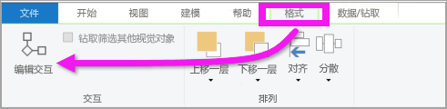
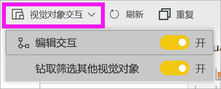
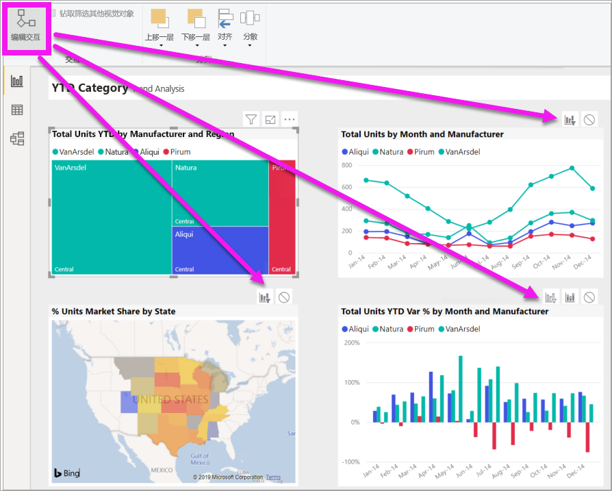
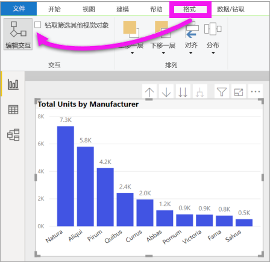

# 更改视觉对象在 Power BI 报表中的交互方式
如果具有编辑报表的权限，则可以使用“视觉对象交互”，更改报表页上的可视化效果相互影响的方式  。 

## 视觉对象交互简介
默认情况下，报表页上的可视化组件可用于交叉筛选和交叉突出显示页面上的其他可视化组件。
例如，在地图可视化组件上选择一个州会突出显示柱形图并筛选折线图以便仅显示适用于该州的数据。
请参阅[关于筛选和突出显示](power-bi-reports-filters-and-highlighting.md)。 如果具有支持[钻取](consumer/end-user-drill.md)的可视化效果，在默认情况下，钻取某个可视化效果不会对报表页上的其他可视化效果造成影响。 但可以同时覆盖这两种默认行为，并且可以对每个可视化效果设置交互。

本文将为你展示如何使用 Power BI Desktop 中的**视觉对象交互**。 该过程与 Power BI 服务[编辑视图](service-interact-with-a-report-in-editing-view.md)中的相同。 如果你只有“阅读视图”访问权限，或者报表已与你共享，你将无法更改视觉对象交互设置。

术语*交叉筛选*和*交叉突出显示*用于区分此处描述的行为与当你使用“筛选”  窗格*筛选*和*突出显示*可视化组件时所发生的行为。  

> [!NOTE]
> 此视频使用的是较旧版本的 Power BI Desktop 和 Power BI 服务。 
>
>

<iframe width="560" height="315" src="https://www.youtube.com/embed/N_xYsCbyHPw?list=PL1N57mwBHtN0JFoKSR0n-tBkUJHeMP2cP" frameborder="0" allowfullscreen></iframe>

## 启用视觉对象交互控件
如果你对某一报表有编辑权限，则可以打开视觉对象交互控件，然后自定义报表页上的可视化组件相互筛选和突出显示的方式。 

1. 选择可视化组件并将其激活。  
2. 显示“视觉对象交互”  选项。
    

    - 在 Desktop 中，选择“格式”>“交互”  。

        

    - 在 Power BI 服务中，在“编辑”视图下打开报表，然后从报表菜单栏中选择下拉列表。

        

3. 要显示可视化组件交互控件，请选择“编辑交互”  。 Power BI 将筛选和突出显示图标添加到报表页上的所有其他可视化效果中。 我们可以看到，树形图交叉筛选折线图和地图，并且交叉突出显示柱形图。 现在你可以更改所选可视化效果与报表页上的其他可视化效果交互的方式。
   
    

## 更改交互行为
通过选择报表页上的可视化效果（一次一个），熟悉可视化效果的交互方式。  选择数据点或条形图或形状，观察对其他可视化效果的影响。 如果你所看到的行为不是你希望的行为，则可以更改交互行为。 这些更改随报表一起保存，因此你和你的报表使用者将具有相同的视觉对象交互体验。

首先选择可视化效果将其激活。  请注意，页面上的所有其他可视化效果现在都显示交互图标。 粗体图标是正在应用的图标。 接下来，确定你希望所选的可视化效果  对其他可视化效果的影响。  然后，对报表页上的其他所有可视化效果重复执行此操作（可选）。

如果所选的可视化效果：
   
   * 交叉筛选页面上的其他某个可视化效果，请选择该可视化效果右上角的“筛选器”  图标。
   * 交叉突出显示页面上的其他某个可视化效果，请选择“突出显示”  图标。
   * 不会对页面上的其他可视化效果产生任何影响，请选择“无影响”  图标。

## 更改可钻取可视化效果的交互
[可以钻取某些 Power BI 可视化效果](consumer/end-user-drill.md)。 默认情况下，钻取可视化效果时，它不会影响报表页上的其他可视化效果。 但这种行为可以更改。 

> [!TIP]
> 使用[人力资源示例 PBIX 文件](https://download.microsoft.com/download/6/9/5/69503155-05A5-483E-829A-F7B5F3DD5D27/Human%20Resources%20Sample%20PBIX.pbix)自行尝试。 有一个柱形图，可向下钻取“新员工”  选项卡。
>

1. 选择可钻取的视觉对象以将其激活。 

2. 选择“向下钻取”图标，打开“向下钻取”。

    

2. 从菜单栏中选择“格式”   >   “钻取筛选其他视觉对象”。  现在，在可视化效果中向下钻取（和向上钻取）时，报表页上的其他可视化效果将发生改变，以反映当前的钻取选择。 

    

3. 如果你所看到的行为不是你希望的行为，则可以按[如上所述](#change-the-interaction-behavior)更改交互行为。

## 注意事项和疑难解答
如果使用不同表中的字段来生成矩阵，然后又尝试通过从层次结构的不同级别选择多个项来交叉突出显示，则会在其他视觉对象上看到错误。 

    
## 后续步骤
[Power BI 报表中的筛选和突出显示](power-bi-reports-filters-and-highlighting.md)