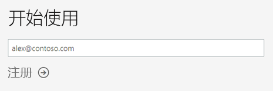
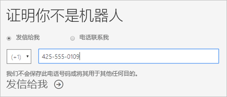
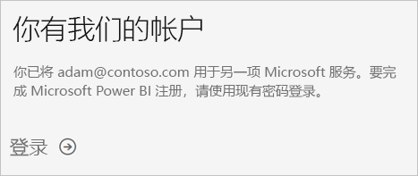
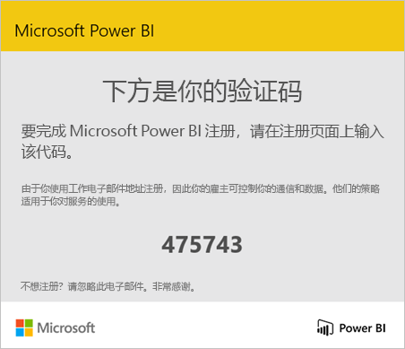
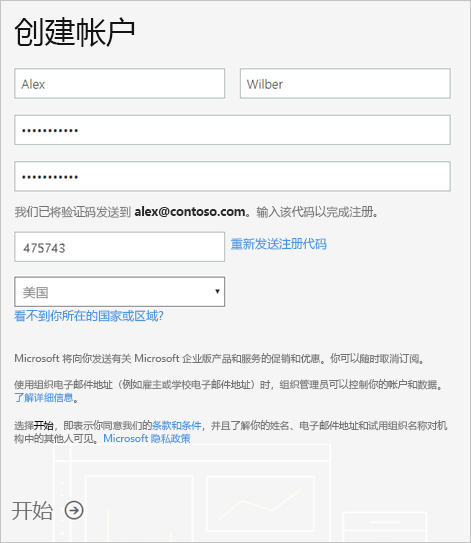
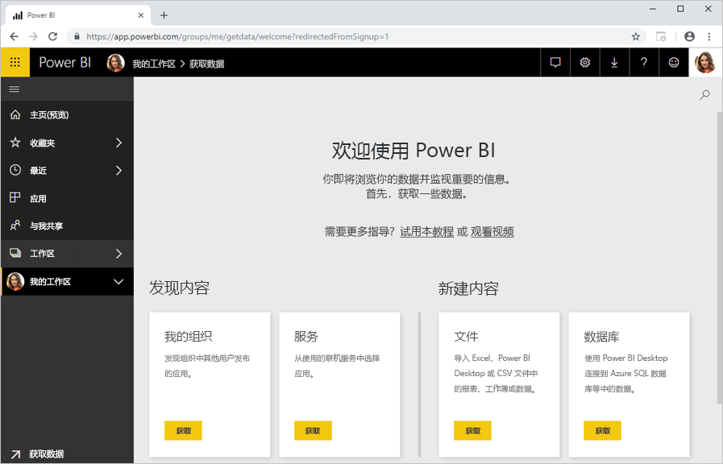

# 以个人身份注册 Power BI

Power BI 既是你的个人报表和可视化工具，还可用作组项目、部门或整个企业背后的分析和决策引擎。 本文介绍如何注册 Power BI Pro 试用版以个人身份。 如果你是 Power BI 管理员，请参阅[Power BI 中你的组织的许可](service-admin-licensing-organization.md)。

## 支持的电子邮件地址

在开始注册过程之前，务必了解哪些类型的可以在 Power BI 中使用的电子邮件地址：

* Power BI 要求使用工作或学校电子邮件地址进行注册。 不能注册使用由使用者电子邮件服务或电信提供商提供的电子邮件地址。 这包括 outlook.com、 hotmail.com、 gmail.com 和其他人。

* 注册后，可[邀请来宾用户](https://docs.microsoft.com/azure/active-directory/active-directory-b2b-what-is-azure-ad-b2b)使用包括个人帐户在内的任何电子邮件地址来查看你的 Power BI 内容。

* 可使用 .gov 或 .mil 地址注册 Power BI，但注册过程不同。 有关详细信息，请参阅[注册 Power BI 服务中的为美国政府组织](service-govus-signup.md)。

## 注册试用版

请按照以下步骤注册 Power BI Pro 试用版。 请参阅下一部分中，[试用版过期](#trial-expiration)，以了解此试用版过期时，有的选项。

1. 转到 Power BI 中的[注册页](https://signup.microsoft.com/signup?sku=a403ebcc-fae0-4ca2-8c8c-7a907fd6c235)。

1. 输入你的电子邮件地址，然后选择“注册”  。

    

1. 如果获取与此类似的消息，请选择一个选项以接收验证码，然后继续执行此过程的下一步。

    

    如果收到一条消息与此类似，完成登录和使用 Power BI 的步骤。

    

1. 输入收到的验证码，然后选择“注册”  。

    

1. 检查你的电子邮件类似如下的消息。

    

1. 在下一个屏幕上，输入你的信息和电子邮件中的验证码。 选择一个区域，查看此屏幕链接的政策，然后选择“开始”  。

    

1. 然后进入[Power BI 登录页](https://powerbi.microsoft.com/landing/signin/)，，您可以开始使用 Power BI。

    

## 试用版有效期

你的 Power BI Pro 试用版过期时，对 Power BI （免费） 许可证的许可证更改。 发生这种情况后，你不再有权需要 Power BI Pro 许可证的功能。 有关详细信息，请参阅[按许可证类型列出的功能](service-features-license-type.md)。

如果有足够的 Power BI （免费） 许可证，你无需执行任何其他操作。 若要充分利用 Power BI Pro 功能，请联系 IT 管理员了解如何购买 Power BI Pro 许可证。

## 注册过程疑难解答

在大多数情况下，你可以注册 Power bi 按如下所述的过程。 一些可能会阻止你注册的问题详见下表中，与可能的解决方法。

| 症状/错误消息 | 原因和解决方法 |
| ----------------------- | -------------------- |
| <strong>个人电子邮件地址 (例如nancy@gmail.com)</strong>将收到类似于此注册过程的消息：    *你输入的是个人电子邮件地址：请输入你的工作电子邮件地址，以便我们可以安全地存储你公司的数据。*    或    *这看起来像个人电子邮件地址。请输入你的工作地址，以便我们可以将你和公司中的其他人相连接。请不必担心。我们不会向任何人分享你的地址。* | Power BI 不支持由使用者电子邮件服务或电信提供商提供的电子邮件地址。    若要完成注册，请尝试再次使用你的工作或学校分配的电子邮件地址。    如果你仍无法注册并且愿意完成更高级的安装过程，则可以[注册新的 Office 365 试用版订阅并使用该电子邮件地址进行注册](service-admin-signing-up-for-power-bi-with-a-new-office-365-trial.md)。    此外，还可以让现有用户[向你发出来宾邀请](service-admin-azure-ad-b2b.md)。 |
| **自助服务注册已禁用**:你将收到类似此注册过程：    *我们无法完成注册。你的 IT 部门已经关闭了注册 Microsoft Power BI。请与他们联系以完成注册。*    或    *这看起来像个人电子邮件地址。请输入你的工作地址，以便我们可以将你和公司中的其他人相连接。请不必担心。我们不会向任何人分享你的地址。* | 组织的 IT 管理员已禁用自助注册 Power BI。    若要完成注册，请与 IT 管理员联系并要求他们[按照说明进行操作以启用注册](service-admin-licensing-organization.md#enable-or-disable-individual-user-sign-up-in-azure-active-directory)。    如果[通过合作伙伴注册 Office 365](service-admin-syndication-partner.md)，也可能会遇到此问题。 |
| **电子邮件地址不是 Office 365 ID**你将收到类似此注册过程：    *我们在 contoso.com 找不到你。你在工作或学校时使用其他 ID 吗？  请使用该 ID 尝试登录，如果不起作用，请与你的 IT 部门联系。* | 你的组织使用不同于你的电子邮件地址的 ID 登录到 Office 365 和其他 Microsoft 服务。  例如，你的电子邮件地址可能是 Nancy.Smith@contoso.com，但你的 ID 是 nancys@contoso.com。    若要完成注册，请使用你的组织已分配给你用于登录到 Office 365 或其他 Microsoft 服务的 ID。  如果不知道这是什么，请联系 IT 管理员联系。    如果你仍无法注册并且愿意完成更高级的安装过程，则可以[注册新的 Office 365 试用版订阅并使用该电子邮件地址进行注册](service-admin-signing-up-for-power-bi-with-a-new-office-365-trial.md)。 |

## 后续步骤

[购买 Power BI Pro](service-admin-purchasing-power-bi-pro.md)  
[适用于个人用户的 Power BI 服务协议](https://powerbi.microsoft.com/terms-of-service/)  

更多问题？ [尝试咨询 Power BI 社区](http://community.powerbi.com/)