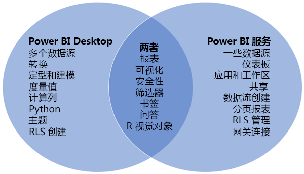
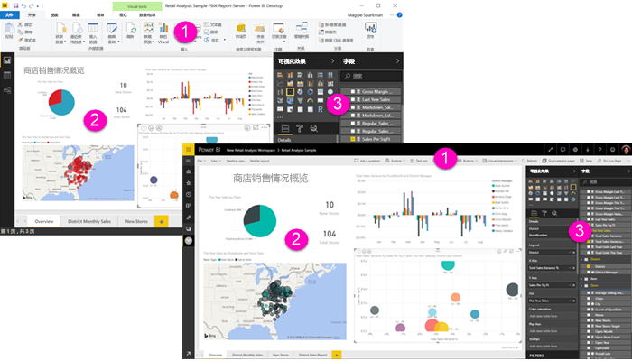

# 比较 Power BI Desktop 和 Power BI 服务

在维恩图中比较 Power BI Desktop 和 Power BI 服务，中间的区域会显示两者如何重叠。 可以在 Power BI Desktop 或服务中执行某些任务。 但在维恩图的两侧，应用程序和服务各有其独特的功能。  

“Power BI Desktop”是完整的数据分析和报表创建工具  。 在本地计算机上安装免费应用程序时，可以连接到许多不同的数据源，并将其（通常称为建模）组合到数据模型中。 请参阅 [Power BI Desktop 入门指南](desktop-getting-started.md)了解整个过程。

“Power BI 服务”是一种基于云的在线服务，用于为团队和公司进行轻量级报表编辑和协作  。 也可以连接到 Power BI 服务中的数据源，但建模不可以。 

致力于商业智能项目的大多数报表设计器都使用“Power BI Desktop”创建报表，然后使用“Power BI 服务”与他人共享其报表   。

## 报表编辑

在应用程序和服务中，可以生成和编辑报表  。 报表可以有一个或多个页面，带有视觉对象和视觉对象的集合。 可以添加书签、按钮、筛选器和钻取，以增强报表中的导航功能。

Power BI Desktop 中和服务中的报表编辑器类似。 它们由三个部分组成：  

1. Power BI Desktop 中和服务中的顶部导航栏有所不同    
2. 报表画布     
3. “字段”、“可视化效果”和“筛选器”窗格   

此视频显示 Power BI Desktop 中的报表编辑器。 

<iframe width="560" height="315" src="https://www.youtube.com/embed/IkJda4O7oGs" frameborder="0" allowfullscreen></iframe>

## 在 Power BI 服务中进行协作

创建报表后，可以将其保存到 Power BI 服务中的“工作区”，你和你的同事可以在其中进行协作   。 基于这些报表生成“仪表板”  。 然后，你可以与组织内外的报表使用者共享这些仪表板和报表。 报表使用者可在 Power BI 服务的[阅读视图](consumer/end-user-reading-view.md)，而不是编辑视图中查看它们。 它们没有提供给报表创建者的所有功能的访问权限。 

## 后续步骤

[什么是 Power BI Desktop？](desktop-what-is-desktop.md)

在 Power BI 服务中[创建报表](service-report-create-new.md)

[报表设计器的基本概念](service-basic-concepts.md)

更多问题？ [尝试参与 Power BI 社区](http://community.powerbi.com/)

