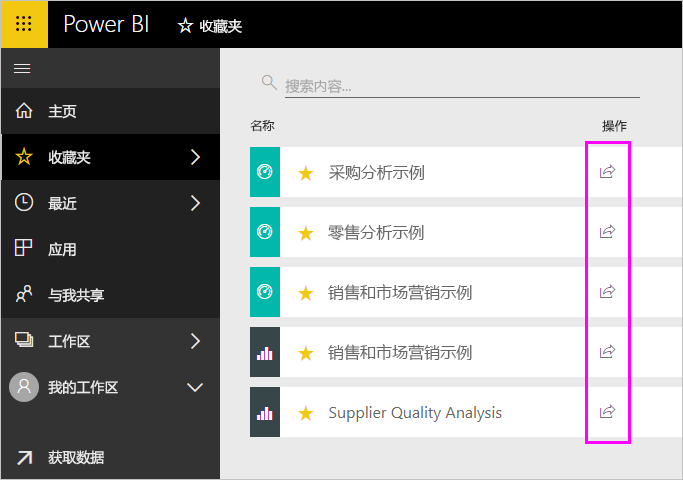
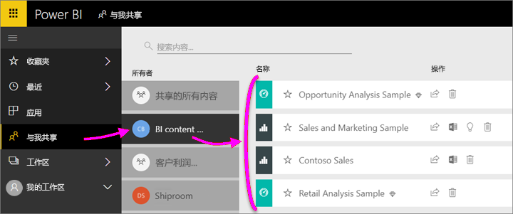
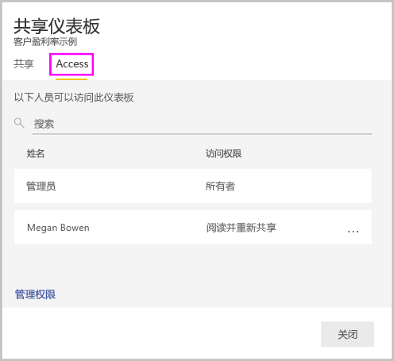
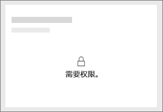

# 与同事和其他人共享 Power BI 仪表板和报表
共享  是一种使多人能够访问你的仪表板和报表的有效方式。 Power BI 还提供了[其他多种开展协作和分发仪表板及报表的方式](service-how-to-collaborate-distribute-dashboards-reports.md)。

要进行共享，无论是在组织内还是在组织外共享内容，你都需要一个 [Power BI Pro 许可证](service-features-license-type.md)。 你的收件人也需要 Power BI Pro 许可证，除非该内容位于[高级容量](service-premium-what-is.md)。 

你可以共享仪表板和报表从 Power BI 服务中的大多数位置：收藏夹、 最近浏览、 与我共享 （如果所有者允许）、 我的工作区或其他工作区。 共享仪表板或报表时，你与之共享的人员可查看并与其交互，但不能编辑它。 除非应用[行级别安全性 (RLS)](service-admin-rls.md)，否则他们会看到你在仪表板或报表中看到的相同数据。 如果你允许，与之共享的同事还可以与其他同事共享。 组织可以外的人员也查看并交互的仪表板或报表，但不能共享它。 

你也可以[在任何 Power BI 移动应用中共享仪表板](consumer/mobile/mobile-share-dashboard-from-the-mobile-apps.md)。 但是，不能共享 Power BI Desktop 中的仪表板。

## 视频：共享仪表板
观看 Amanda 在她的公司内部和外部与同事共享她的仪表板。 然后可以按照视频下面的分步说明来自己尝试。

<iframe width="560" height="315" src="https://www.youtube.com/embed/0tUwn8DHo3s?list=PL1N57mwBHtN0JFoKSR0n-tBkUJHeMP2cP" frameborder="0" allowfullscreen></iframe>

## 共享仪表板或报表

1. 在仪表板或报表列，或在打开的仪表板或报表中，选择“共享”  。

2. 在顶部框中，输入个人、通讯组或安全组的完整电子邮件地址。 不能与动态通讯组列表共享。 
   
   你可以与地址在组织外部的人员进行共享，但会看到一条警告。
   
    
 
   >[!NOTE]
   >在输入的框支持，最多 100 个用户或组。 如果需要与大量用户共享，请考虑在工作区中创建仪表板并[作为应用分发](service-create-distribute-apps.md)。
   > 
   > 

3. 如果需要，请添加一条消息。 可选。
4. 若要允许同事与他人共享你的内容，请检查**允许收件人共享仪表板 （或报表）** 。
   
   允许他人共享称为重新共享  。 如果你允许，他们可以从 Power BI 服务和移动应用重新共享，或将电子邮件邀请转发给组织中的其他人。 该邀请将在一个月后过期。 你的组织外的用户无法重新共享。 作为内容的所有者，你可以关闭重新共享，或者逐个撤消重新共享。 请参阅[停止共享或阻止他人共享](#stop-sharing-or-stop-others-from-sharing)。

5. 选择**共享**。
   
     
   
   Power BI 会发送电子邮件邀请给的人员，而非组，其中包含指向共享内容。 你会看到成功  通知。 
   
   当组织中的收件人单击该链接时，Power BI 会将仪表板或报表添加到他们的“与我共享”  列表页中。 他们可以选择你的名字来查看你与之共享的所有内容。 
   
   
   
   当组织外部的收件人单击该链接时，他们会看到仪表板或报表，但不是在常用的 Power BI 门户中。 有关详细信息，请参阅[与组织外部人员共享仪表板或报表](#share-a-dashboard-or-report-with-people-outside-your-organization)。

## 谁有权访问你共享的仪表板或报表？
有时您需要查看已共享，并了解他们共享的人员：

1. 在仪表板或报表列或仪表板或报表中，选择“共享”  。 
2. 在中**共享仪表板**或**共享报表**对话框中，选择**访问**。
   
    

    组织外的人员都将作为**来宾**列出。

## 停止共享或阻止他人共享
只有仪表板或报表所有者可以打开和关闭重新共享。

### 如果尚未发送共享邀请
* 清除**允许收件人共享仪表板 （或报表）** 之前将其发送邀请底部的复选框。

### 如果已共享仪表板或报表
1. 在仪表板或报表列或仪表板或报表中，选择“共享”  。 
2. 在中**共享仪表板**或**共享报表**对话框中，选择**访问**。
   
    
3. 选择“阅读并重新共享”  旁边的省略号 (...  ) 并选择：
   
   
   
   * 阅读  以防止该用户与其他人进行共享。
   * 删除访问权限  以防止该用户查看共享内容。

4. 在中**删除访问权限**对话框框中，决定是否也要删除对相关内容，例如报表和数据集访问权限。 如果移除带有警告图标的项，最好删除相关的内容，因为它不会正确显示。

    

## 与组织外部的人员共享仪表板或报表
当组织外部共享与的人员时，他们将收到带有指向共享仪表板或报表，必须在登录到 Power BI 以查看电子邮件。 如果他们没有 Power BI Pro 许可证，则可以在单击链接后注册一个许可证。

他们在登录后，就会看到共享仪表板或报表在其自己的浏览器窗口中，而不常用的 Power BI 门户。 若要稍后访问此仪表板或报表，它们必须为书签链接。

组织外的用户不能编辑此仪表板或报表内的任何内容。 不过，它们可以与图表进行交互并更改筛选器或切片器，他们不能保存他们的更改。 

只有你的直接收件人才能看到共享仪表板或报表。 例如，如果发送电子邮件至 Vicki@contoso.com，只有 Vicki 才能看到仪表板。 任何其他人可以看到仪表板中，即使他们有链接。 Vicki 必须使用相同的电子邮件地址来访问它;如果她注册与任何其他电子邮件地址时，她不会有权访问仪表板。

如果角色级或行级安全性是通过本地 Analysis Services 表格模型实现的，组织外的人员将无法查看任何数据。

如果链接从 Power BI 移动应用向用户发送组织外，单击的链接将打开仪表板，在浏览器中，而不是在 Power BI 移动应用。

如果您[允许外部来宾用户编辑和管理组织中的内容](service-admin-portal.md#export-and-sharing-settings)，默认仅消耗体验不能应用于它们。 [了解详细信息](service-admin-azure-ad-b2b.md)。

## 限制和注意事项
共享仪表板和报表的注意事项：

* 通常，你和同事将在仪表板或报表中会看到相同的数据。 因此，如果你有权限比他们查看更多的数据，他们将能够在仪表板或报表中看到你的所有数据。 但是，如果[行级别安全性 (RLS)](service-admin-rls.md) 应用于仪表板或报表下面的数据集，则每个人的凭据将用于确定他们可以访问哪些数据。
* 共享的仪表板的每个人都可以查看并与中的相关报表交互[阅读视图](consumer/end-user-reading-view.md#reading-view)。 他们不能创建报表或将更改保存到现有报表。
* 虽然没有人可以查看或下载数据集，它们可以直接通过使用 Analyze in Excel 功能访问数据集。 管理员可以限制在组中的每个人在 Excel 中使用分析的能力。 但此限制适用于组内的每个人和该组所隶属的每个工作区。
* 每个人都可以手动[刷新数据](refresh-data.md)。
* 如果使用 Office 365 收发电子邮件，可以通过输入与通讯组关联的电子邮件地址，与通讯组成员进行共享。
* 共享您的电子邮件域的同事和其属于不同域但是在同一租户中注册的同事可以与他人共享仪表板。 例如，如果在同一个租户和电子邮件地址中注册的域 contoso.com 和 contoso2.com 是konrads@contoso.com，然后同时ravali@contoso.com和gustav@contoso2.com可以共享，只要你向它们授予了共享的权限。
* 如果你的同事已经有权访问特定仪表板或报表，您可以通过复制 URL，当你在仪表板或报表上时发送的直接链接。 例如：`https://powerbi.com/dashboards/g12466b5-a452-4e55-8634-xxxxxxxxxxxx`
* 同样，如果你的同事已经有权访问特定仪表板，你可以[发送到基础报表的直接链接](service-share-reports.md)。 
* 你可以共享，至多 100 个用户或组中的单个共享操作。 但是，可以为超过 500 个用户提供对某个项的访问权限。 为此，请通过分别指定用户共享多个时间或者与包含的所有用户的用户组共享。

## 故障排除共享

### 我的仪表板收件人在磁贴或“所需的权限”消息中看到一个锁图标

与其共享的人员尝试查看报表时，可能会在仪表板中看到锁定的磁贴或“需要权限”消息。

如果是这样，您需要向他们授予对基础数据集的权限：

1. 转到内容列表中的“数据集”  选项卡。

1. 选择省略号 ( **...** ) 旁边数据集，然后选择**管理权限**。

    

1. 选择“添加用户”  。

    

1. 输入个人、通讯组或安全组的完整电子邮件地址。 不能与动态通讯组列表共享。

    

1. 选择**添加**。

### 我无法共享仪表板或报表

若要共享仪表板或报表，你需要权限重新共享基础内容;也就是说，任何相关的报表和数据集。 如果看到一条消息指出不能共享，请要求报表作者给予你重新共享这些报表和数据集的权限。

## 后续步骤
* 想提供反馈？ 请转到 [Power BI 社区站点](https://community.powerbi.com/)提出你的建议。
* [应如何针对仪表板及报表开展协作并进行共享？](service-how-to-collaborate-distribute-dashboards-reports.md)
* [共享筛选的 Power BI 报表](service-share-reports.md)。
* 是否有任何问题? [尝试参与 Power BI 社区](http://community.powerbi.com/)。

