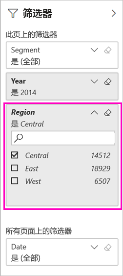
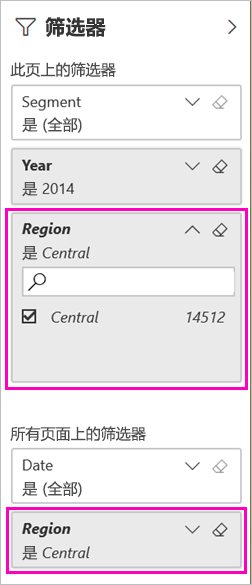

# 共享筛选的 Power BI 报表的两种方式
共享  是一种使多人能够访问你的仪表板和报表的有效方式。 如果你想要共享筛选的报表版本，该怎么办？ 也许一个报表仅显示特定城市或销售人员或年份的数据。 尝试筛选报表并将其共享，或创建自定义 URL。 收件人第一次打开报表时，将对其进行筛选。 他们可以通过修改 URL 来删除筛选器。 

Power BI 还提供了[其他开展协作和分发报表的方式](service-how-to-collaborate-distribute-dashboards-reports.md)。 要进行共享，你和收件人都需要一个 [Power BI Pro 许可证](service-features-license-type.md)，或者内容需要位于[高级容量](service-premium-what-is.md)中。 

## 筛选报表的两种方式

我们会将市场营销和销售示例模板应用用于这两种筛选技术。 想要体验它？ 你也可以安装[市场营销和销售示例模板应用](https://appsource.microsoft.com/product/power-bi/microsoft-retail-analysis-sample.salesandmarketingsample?tab=Overview)。

### 设置筛选器

在[编辑视图](consumer/end-user-reading-view.md)中打开报表并应用筛选器。

在此示例中，我们将筛选市场营销和销售示例模板应用的“YTD 类别”页，以仅显示其中“Region”等于“Central”的值。   
 

保存报表。

### 在 URL 中创建筛选器

将筛选器添加到报表页 URL 的末尾时，行为略有不同。 筛选的页面看起来相同。 但是，Power BI 会将筛选器添加到整个报表，并从筛选器窗格删除其他值。  

将以下代码添加到以下报表页 URL 的末尾：
   
    ?filter=*tablename*/*fieldname* eq *value*
   
字段类型必须是数字、日期时间或字符串。 “Tablename”或“fieldname”值不能包含空格   。
   
在本示例中，表的名称是 Geo，字段的名称是 Region，我们要筛选的依据值是 Central：   
   
    ?filter=Geo/Region eq 'Central'

浏览器会添加特殊字符来表示斜杠、空格和撇号，因此最终会看到如下内容：
   
    app.powerbi.com/groups/xxxx/reports/xxxx/ReportSection4d00c3887644123e310e?filter=Geo~2FRegion%20eq%20'Central'

保存报表。

有关详细信息，请参阅文章[在 URL 使用查询字符串参数筛选报表](service-url-filters.md)。

## 共享筛选的报表

1. [共享报表](service-share-dashboards.md)时，请清除“向收件人发送电子邮件通知”复选框  。

    

4. 使用前面创建的筛选器发送链接。

## 后续步骤
* [在 Power BI 中共享工作的方式](service-how-to-collaborate-distribute-dashboards-reports.md)
* [共享仪表板](service-share-dashboards.md)
* 更多问题？ [尝试参与 Power BI 社区](http://community.powerbi.com/)。
* 想提供反馈？ 请转到 [Power BI 社区站点](https://community.powerbi.com/)提出你的建议。

