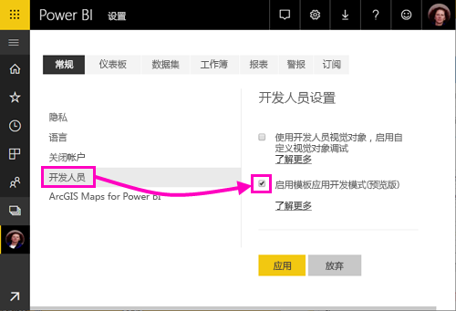
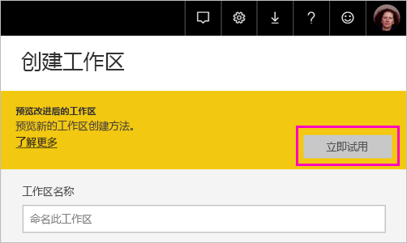
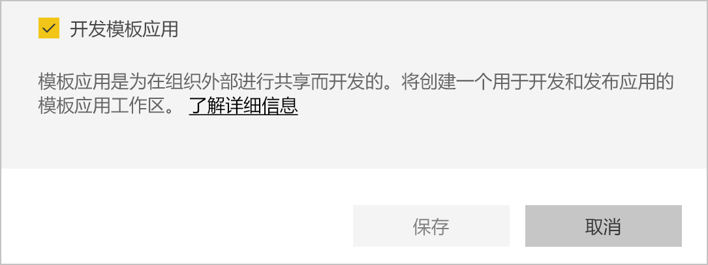
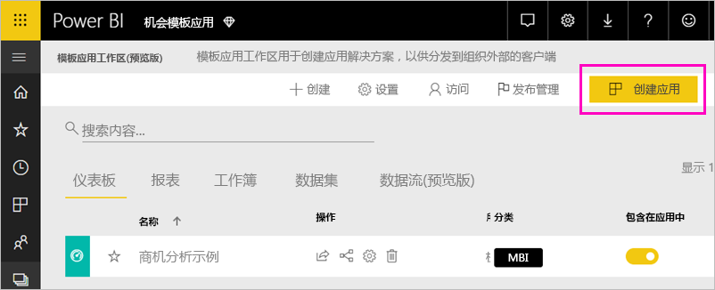
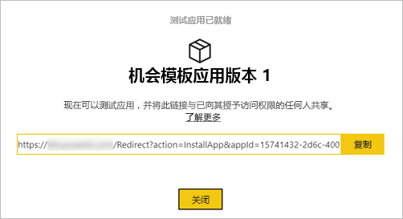
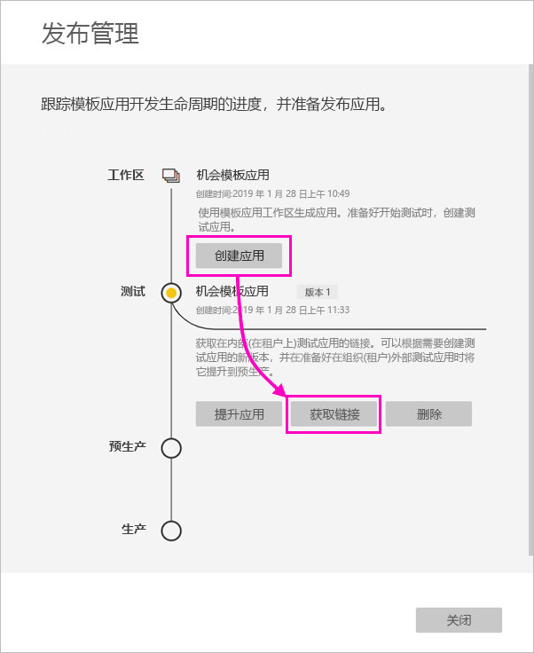
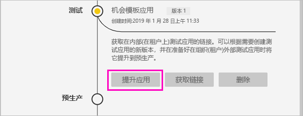
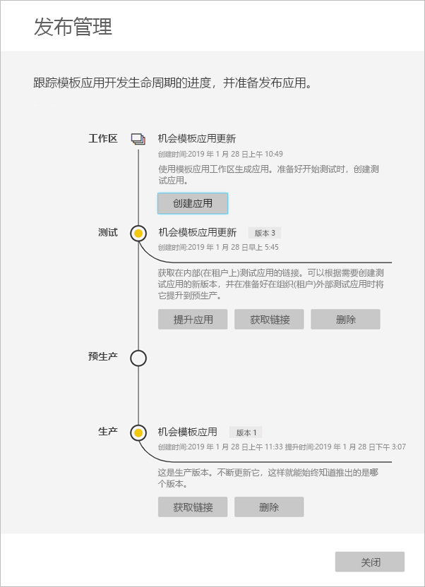

# 在 Power BI 中创建模板应用（预览）

新的 Power BI 模板应用使 Power BI 合作伙伴能够在极少编码或没有编码的情况下生成 Power BI 应用，并将它们部署到任何 Power BI 客户。  本文包含创建 Power BI 模板应用的分步说明。 

如果可以创建 Power BI 报表和仪表板，那么您可成为模板应用构建者，可以生成分析内容并将其打包到“应用”中。 然后，可以通过任何可用平台（例如 AppSource）或者通过在自己的 Web 服务中使用应用，将应用部署其他 Power BI 租户。 作为构建者，可以创建受保护的分析包以进行分发。 

Power BI 租户管理员管理和控制组织中谁可以创建模板应用，以及谁可以安装它们。 获得授权的用户可以安装模板应用，然后对其进行修改并将其分发给组织中的 Power BI 用户。

## 先决条件 

下面是生成模板应用的要求：  

- 一个 [Power BI Pro 许可证](service-self-service-signup-for-power-bi.md)
- [安装 Power BI Desktop](desktop-get-the-desktop.md)（可选）
- 熟悉 [Power BI 的基本概念](service-basic-concepts.md)
- 创建模板应用的权限。 有关详细信息，请参阅 Power BI [管理门户、模板应用设置](service-admin-portal.md#template-apps-settings-preview)。

## 启用应用开发人员模式

若要创建可以分发给其他 Power BI 租户的模板应用，需要处于应用开发人员模式。 否则，只能在自己的组织中为 Power BI 消费者创建应用。
 
1. 在浏览器中打开 Power BI 服务。
2. 转到“设置” > “常规” > “开发人员” > “启用模板应用开发模式”。

    

    如果没有看到该选项，请与你的 Power BI 管理员联系，以向你授予管理门户中[模板应用开发权限](service-admin-portal.md#template-apps-settings-preview)。

3. 选择**应用**。

## 创建模板应用工作区

若要创建可以分发给其他 Power BI 租户的模板应用，需要在一个新的应用工作区中创建它。 
 
1. 在 Power BI 服务中，选择“工作区” > “创建应用工作区”。 
 
    

3. 在“创建应用工作区”的“预览改进的工作区”中，选择“立即试用”。

    

5. 为应用工作区输入名称、说明（可选）和徽标图像（可选）。

4. 选择“开发模板应用”。

    

5. 选择**保存**。

## 在模板应用中创建内容

与常规 Power BI 应用工作区一样，下一步是在工作区中创建内容。  在此预览版的模板应用中，我们最多只支持每种类型中的一种：一个数据集、一个报表和一个仪表板。

- 在应用工作区中[创建 Power BI 内容](power-bi-creator-landing.md)。

如果在 Power Query 中使用参数，请确保这些参数具有明确定义的类型（例如，Text）。 不支持 Any 和 Binary 类型。 

[在Power BI（预览）中创作模板应用的提示](service-template-apps-tips.md)在为模板应用创建报表和仪表板时提供了一些建议。

## 创建测试模板应用

现在工作区中已有内容，即可将其打包到模板应用中。 第一步是创建一个测试模板应用，只能从租户的组织内部访问。

1. 在模板应用工作区中，选择“创建应用”。 

    
 
    在此，可以在四个类别中为模板应用填写其他参数。 

    **品牌**

    - 应用名称 
    - 说明
    - 应用徽标（可选）
    - 应用颜色 

    **内容** 

    - 应用登陆页面（可选）：将报表或仪表板定义为应用的登陆页面。  
    
    **控件** 

    控制应用程序用户使用应用程序内容的一些局限和限制。 可以使用此控件来保护应用可能包含的某些知识产权。

    **访问权限**

    - 在测试阶段，确定组织中的其他人可以安装和测试应用。

    别担心，可以随时返回并在稍后更改这些设置。  

2. 选择“创建应用”。 

    你会看到测试应用已就绪的消息，其中包含可复制并与应用测试人员共享的链接。

    

    你还完成了发布管理过程的第一步，这也是接下来要完成的步骤。

    

## 管理模板应用版本

在公开发布此模板应用之前，需要确保它已准备就绪。 Power BI 已创建发布管理窗格，可在其中关注并检查完整的应用发布路径。 还可以触发阶段间的转换。 常见的阶段包括： 

- 生成测试应用：仅在组织中进行测试。 
- 将测试包提升到预生产阶段：在组织外进行测试。
- 将预生产包提升到生产：生产版本。 
- 删除任何包或从上一阶段重新开始。 

让我们来了解各个阶段。

1. 在模板应用工作区中，选择“发布管理”。

    

2. 选择“创建应用”。 

    如果在上面的“创建测试模板应用”中创建了测试应用，那么“测试”旁边的黄色圆点已经填充，无需在此处选择“创建应用”。 如果选择它，则会返回到模板应用创建过程。
 
3. 选择“获取链接”。

    
 
9. 若要测试应用安装体验，请复制通知窗口中的链接并将其粘贴到新的浏览器窗口中。 

    从这里开始，需要按照客户所遵循的相同过程进行操作。 有关版本信息，请参阅[在组织中安装和分发模板应用](service-template-apps-install-distribute.md)。
 
10. 在对话框中，选择“安装”。

    安装成功后，会看到新应用已就绪的通知。 
 
11. 选择“转到应用”。
 
12. 在“开始使用新应用”中，看到的应用与客户将看到的应用相同。 

    

13. 选择“浏览应用”以使用示例数据验证测试应用。

1. 若要进行任何更改，请返回到原始工作区中的应用。 更新测试应用，直到满意为止。

9. 准备好将应用提升到预生产以在租户之外进行进一步测试时，请返回“发布管理”窗格，然后选择“测试”旁边的“提升应用”。
 
    

11. 选择“提升”以确认选择。 

12. 复制此新 URL 以在租户外共享以供测试。 此链接也是要提交以开始在 AppSource 上分发应用的链接。

12. 当应用准备好通过 AppSource 进行生产或共享时，请返回“发布管理”窗格，然后选择“预生产”旁边的“提升应用”。
 
11. 选择“提升”以确认选择。 

    现在应用已投入生产，并已准备好分发。

    

为了让应用广泛适用于全球数千名 Power BI 用户，我们建议将该应用提交到 AppSource。 有关详细信息，请参阅 [Power BI 应用程序产品/服务](https://docs.microsoft.com/azure/marketplace/cloud-partner-portal/power-bi/cpp-power-bi-offer)。 

## 更新应用

现在应用已投入生产，可以在测试阶段重新开始，无需中断生产中的应用。 

1. 在“发布管理”窗格中，选择“创建应用”。

1. 返回应用创建过程。 
2. 设置“品牌”、“内容”、“控件”和“访问权限”后，再次选择“创建应用”。
3. 选择“关闭”，然后返回“发布管理”。 

    现有两个版本：生产中的版本，以及测试中的新版本。 

    

## 后续步骤

通过[在组织中安装、自定义和分发模板应用](service-template-apps-install-distribute.md)，了解客户与模板应用的互动方式。

有关分发应用的详细信息，请参阅 [Power BI 应用程序产品/服务](https://docs.microsoft.com/azure/marketplace/cloud-partner-portal/power-bi/cpp-power-bi-offer)。

