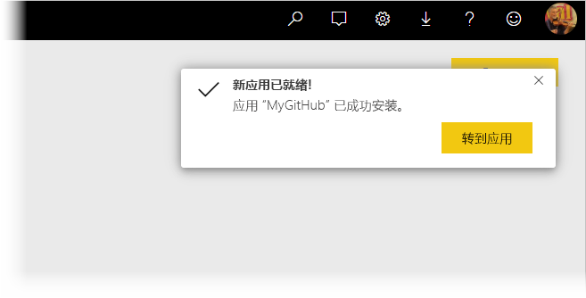
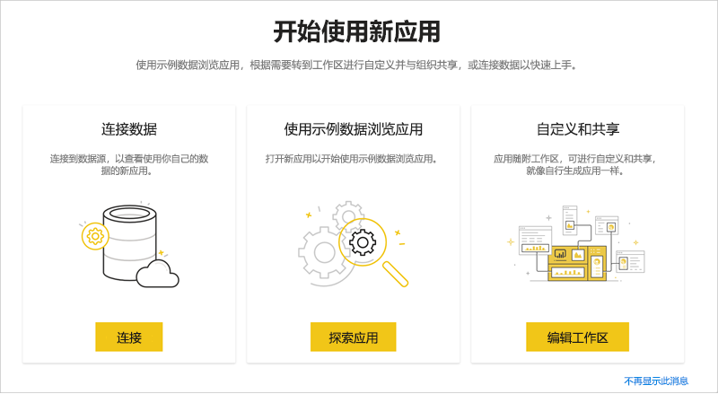
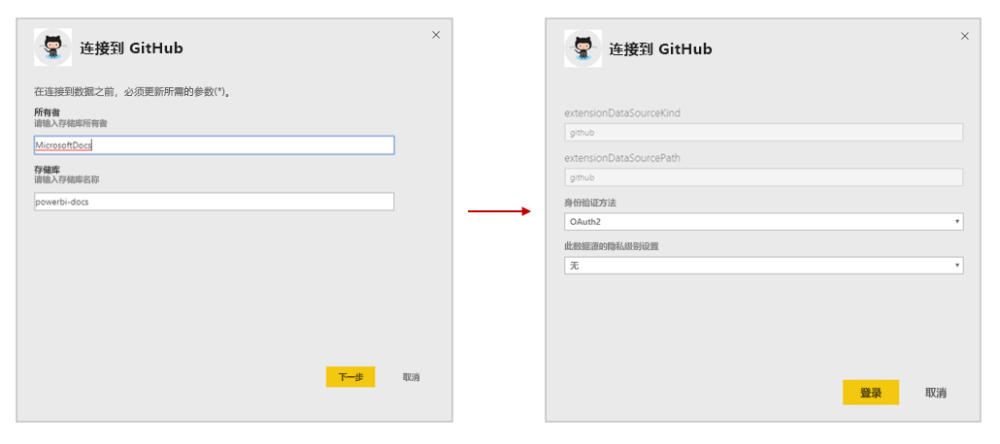
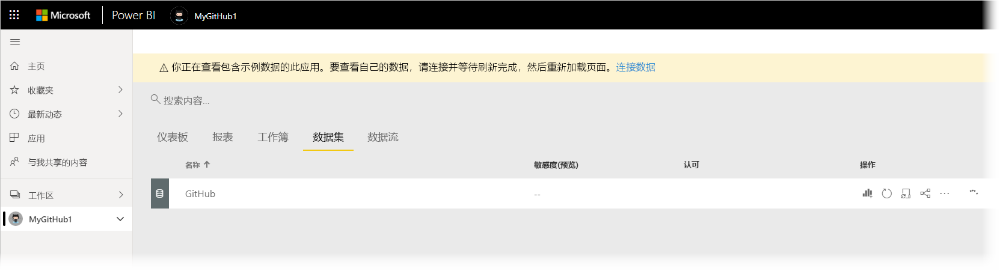
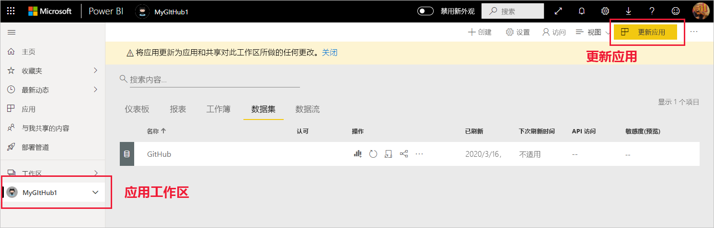

# 在组织中安装和分发模板应用

你是 Power BI 分析师吗？ 如果是，本文将向你介绍如何安装[模板应用](service-template-apps-overview.md)以连接到多个用于运行 Salesforce、Microsoft Dynamics 和 Google Analytics 等业务的服务。 然后，可以修改模板应用的预构建仪表板和报表以满足组织的需求，并将它们作为[应用](consumer/end-user-apps.md)分发给同事。 

如果你有兴趣自己创建模板应用以在组织外部分发，请参阅[在 Power BI 中创建模板应用](service-template-apps-create.md)。 Power BI 合作伙伴几乎或完全无需编码，即可构建 Power BI 应用，并将其提供给 Power BI 客户。 

## 先决条件  

要安装、自定义和分发模板应用，需要： 

* 一个 [Power BI Pro 许可证](service-self-service-signup-for-power-bi.md)。
* 在租户上安装模板应用的权限。
* 有效的应用安装链接，可以从 AppSource 或应用创建者处获取该链接。
* 非常熟悉 [Power BI 的基本概念](service-basic-concepts.md)。

## 安装模板应用

1. 在 Power BI 服务的导航窗格中，选择“应用” > “获取应用”   。

    

1. 在出现的 AppSource 窗口中，选择“应用”  。 浏览或搜索所需应用，然后选择“立即获取”  。

    

1. 在显示的对话框中，选择“安装”  。

    
    
    应用随关联的工作区一起安装。 如果决定自定义应用，则需要在此关联的工作区中执行此操作  。

    > [!NOTE]
    > 如果使用未在 AppSource 上列出的应用的安装链接，将出现一个验证对话框，要求你确认选择。
    >
    >要安装未在 AppSource 上列出的模板应用，需要向管理员请求相关权限。有关详细信息，请参阅 Power BI 管理门户中的[模板应用设置](service-admin-portal.md#template-apps-settings)。

    安装成功完成后，系统会显示一条通知，告知你新应用已准备就绪。

    

## 连接到数据

1. 选择“转到应用”  。 “开始使用新应用”窗口随即显示  。

   

1. 单击“连接”  。
    
    这将打开一个对话框或一系列对话框，你可以在其中将数据源从示例数据更改为自己的数据源。 这通常意味着重新定义数据集参数和数据源凭据。 请参阅[已知限制](service-template-apps-tips.md#known-limitations)。
    
    在下面的示例中，连接到数据涉及两个对话框。

   

    填写完连接对话框后，连接过程开始。 系统会显示一个横幅，通知你正在查看示例数据。

    

    等待数据完成连接和更新。 要知道此过程何时完成，请查看数据集行（新外观）或选项卡（旧外观）上的进度指示器。

   连接和数据刷新完成后，请刷新浏览器。横幅现在通知你需要更新应用，以应用对应用所做的任何更改并进行共享。

    

## 自定义和共享应用

在连接到数据和数据刷新后，刷新浏览器，然后可看到与应用关联的工作区。 此时，你可以在其中编辑任何项目，就像在任何工作区中一样。 但是，请记住，使用新版本更新应用后，所做的任何更改都将被覆盖，除非以不同的名称保存更改后的项目。 [查看有关覆盖的详细信息](#overwrite-behavior)。

有关在工作区中编辑项目的信息，请参阅
* [Power BI 中的报表编辑器导览](service-the-report-editor-take-a-tour.md)
* [Power BI 服务中设计器的基本概念](service-basic-concepts.md)

在工作区中完成对项目的所有更改后，即可发布和共享应用。 请参阅[发布应用](service-create-distribute-apps.md#publish-your-app)，了解如何执行此操作。

## 更新模板应用

模板应用的创建者有时会通过 AppSource 和/或直接链接发布其模板应用的新改进版本。

如果最初是从 AppSource 下载的应用，则当新版本的模板应用可用时，Power BI 服务会出现一个更新横幅，通知你有新的应用版本可用。

  

>[!NOTE]
>如果最初是通过直接链接而不是通过 AppSource 获得的应用，则知道新版本何时可用的唯一方法是联系模板应用创建者。

  要安装更新，请在通知横幅上单击“获取它”，或在 AppSource 中再次查找应用，然后选择“立即获取”   。 如果从模板应用创建者处获取了更新的直接链接，只需单击该链接。
  
  系统将询问你是要覆盖当前版本，还是要在新工作区中安装新版本。 默认情况下选择的是“覆盖”。

  

- **覆盖现有版本：** 使用模板应用的更新版本覆盖现有工作区。 [查看有关覆盖的详细信息](#overwrite-behavior)。

- **安装到新工作区：** 安装需要重新配置的工作区和应用的新版本（即，连接到数据、定义导航和权限）。

### 覆盖行为

* 覆盖会更新工作区（而非应用）中的报表、仪表板和数据集。 覆盖不会更改应用的导航、设置和权限。
* 更新工作区后，需要更新应用，以将更改从工作区应用于应用  。
* 覆盖将保留配置的参数和身份验证。 更新后，数据集会开始自动刷新。 在此刷新过程中，应用、报表和仪表板显示示例数据  。

  

* 覆盖始终显示示例数据，直到刷新完成。 如果模板应用的作者对数据集或参数进行了更改，则在刷新完成之前，工作区和应用程序的用户看不到新数据。 相反，在此期间，他们继续看到示例数据。
* 覆盖绝不会删除已添加到工作区的新报表或仪表板。 它仅使用原始作者所做的更改覆盖原始报表和仪表板。

>[!IMPORTANT]
>切记在覆盖后[更新应用](#customize-and-share-the-app)，以将更改应用于组织应用用户的报表和仪表板。

## 后续步骤

[与同事一起在 Power BI 中创建工作区](service-create-workspaces.md)
