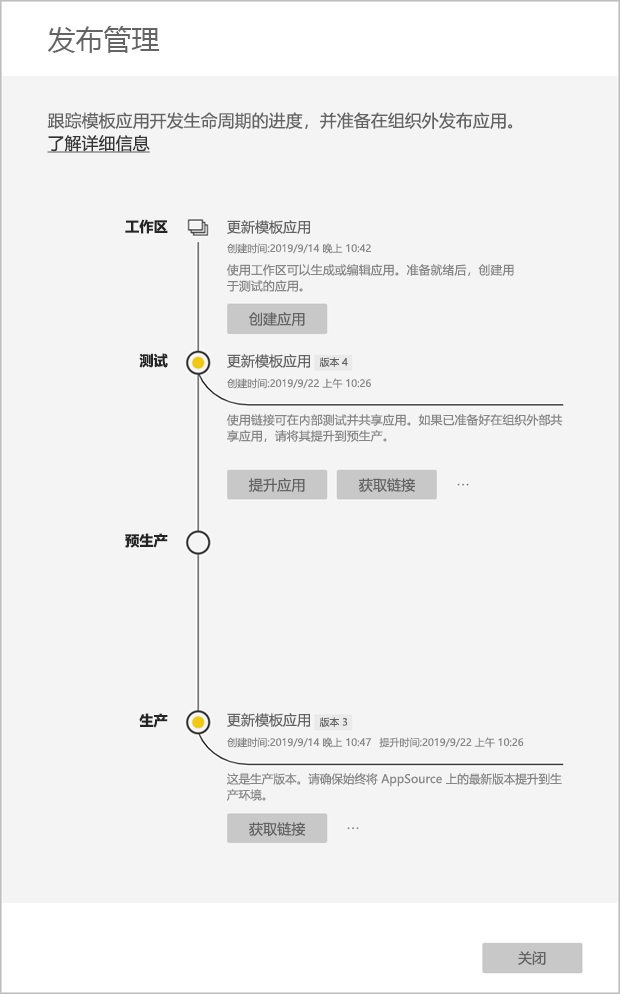

# 更新、删除和提取模板应用

现在应用已投入生产，可以在测试阶段重新开始，无需中断生产中的应用。
## 更新应用

1. 在“发布管理”窗格中，选择“创建应用”   。
2. 返回应用创建过程。
3. 设置“品牌”、“内容”、“控件”和“访问权限”后，再次选择“创建应用”     。
4. 选择“关闭”，然后返回“发布管理”   。

   现有两个版本：生产中的版本，以及测试中的新版本。

    

5. 准备好将应用提升到预生产以在租户之外进行进一步测试时，请返回到“发布管理”窗格，再选择“测试”  旁边的“提升应用”  。
6. 链接现已生效。 按照 [Power BI 应用产品/服务更新](https://docs.microsoft.com/azure/marketplace/cloud-partner-portal/power-bi/cpp-update-existing-offer)中的步骤操作，重新将它提交到云合作伙伴门户 (CPP)。
7. 在 CPP 中，必须重新发布  并验证产品/服务。

>[!NOTE]
>只有在应用获得云合作伙伴门户的批准且已发布后，才能将它提升到生产阶段。

## 提取工作区
借助提取功能，现在回滚到旧版模板应用不再是难事。 下面介绍了如何从各个发布阶段中将特定应用版本提取到新工作区：

1. 在“发布管理”窗格中，依次按下“更多(...)”  和“提取”  。

     
2. 在对话框中，输入已提取工作区的名称。 此时，系统会添加新工作区。

新工作区的版本控制会重置，你可以继续从新提取的工作区开发和分发模板应用。

## 删除模板应用版本
模板应用工作区是活动分散式模板应用的源。 为了保护模板应用用户，如果不先删除工作区中的所有已创建应用版本，就无法删除工作区。
删除应用版本也会删除不再有效的应用 URL。

1. 在“发布管理”窗格中，依次选择省略号 (...)  和“删除”  。
 
 

>[!NOTE]
>请确保不要删除客户或 AppSource  正在使用的应用版本，否则它们将不再有效。

## 后续步骤

通过[在组织中安装、自定义和分发模板应用](service-template-apps-install-distribute.md)，了解客户与模板应用的互动方式。

有关分发应用的详细信息，请参阅 [Power BI 应用程序产品/服务](https://docs.microsoft.com/azure/marketplace/cloud-partner-portal/power-bi/cpp-power-bi-offer)。
