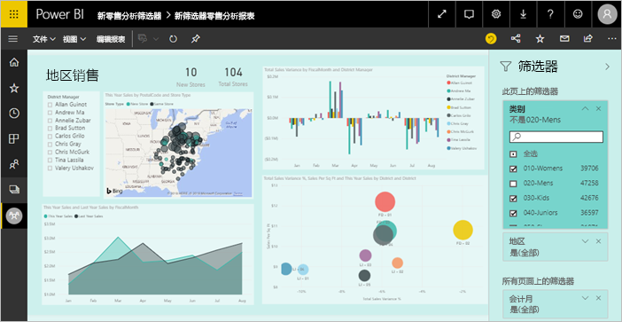

# Power BI 中的报表编辑器导览

Power BI 服务中的报表编辑器和 Power BI Desktop 中的报表编辑器非常相似。 通常情况下，首先在 Power BI Desktop 中创建报表。 然后将报表发布到 Power BI 服务，可在其中继续修改报表。 还可以在 Power BI 服务中根据报表创建仪表板。

创建仪表板和报表后，将它们分发给报表使用者。 根据具体共享方式，最终用户可以在 Power BI 服务的“阅读”视图中与仪表板和报表进行交互，但不能对其进行编辑。 详细了解[报表使用者可在 Power BI 服务中执行哪些操作](consumer/end-user-reading-view.md)。 

此视频显示 Power BI Desktop 中的报表编辑器。 本文介绍 Power BI 服务中的报表编辑器。 

<iframe width="560" height="315" src="https://www.youtube.com/embed/IkJda4O7oGs" frameborder="0" allowfullscreen></iframe>

在 Power BI 服务中，报表编辑器仅在“编辑视图”中可用。 要在“编辑视图”中打开报表，你必须是报表所有者或创建者，或者是报表所在的应用工作区的参与者。

Power BI 报表编辑器包含 3 个部分：  

1. “字段”、“可视化效果”和“筛选器”窗格
2. 顶部导航栏    
3. 报表画布     

## 1.报表编辑器窗格

首次打开报表时，可以看到三个窗格：“可视化效果”、“筛选器”和“字段”。 左侧窗格“可视化效果”和“筛选器”可控制可视化效果的外观，其中包括类型、字体、筛选、格式设置。  而右侧窗格上的“字段”则可管理将用于可视化效果的基础数据。 

报告编辑器中显示的内容会随报表画布中选择的内容不同而异。  例如，如果选择单个视觉对象：

|  |  |
| --- | --- |
|  |<ul><li>“可视化效果”窗格顶部会标识出正在使用的视觉对象类型；在本例中，就是簇状柱形图。  </li> <li>“可视化效果”窗格底部（可能需要向下滚动）则会显示视觉对象中正在使用的字段。 此图使用 FiscalMonth、DistrictManager 和 Total Sales Variance。   </li><li>“筛选器”窗格（可能需要向下滚动）将显示已应用的所有筛选器。   </li><li>“字段”窗格中列出可用的表，如果展开表的名称，还会列出构成该表的字段。 黄色字体告诉用户可视化效果中至少正在使用该表格中的一个字段。  </li><li> 要显示“格式设置”窗格，请为所选的可视化效果选择滚动油漆刷图标。  </li><li> 要显示“分析”窗格，请选择放大镜图标。</ul> |

## “可视化效果”窗格

在此处选择可视化效果类型。 小图片称为*模板*。 在上图中，已选择“簇状条形图”。 如果未首先选择可视化效果类型，而是通过选择字段开始生成可视化效果，则 Power BI 将为你选择可视化效果类型。 你可以保留 Power BI 的选择或通过选择不同的模板更改类型。 可以根据需要进行多次切换，找到最能代表你的数据的可视化效果类型。

### 管理视觉对象中的字段

此窗格中显示的存储桶（有时称为 *井* ）根据所选择的可视化效果类型而有所不同。  例如，如果选择的是条形图，则会看到以下存储桶：值、轴和图例。 当选择某个字段时，或将其拖到画布上时，Power BI 会将该字段添加到其中一个存储桶。  也可以直接将“字段”列表中的字段拖动到存储桶中。  某些存储桶仅限于特定类型的数据。  例如，**值**将不会接受非数字字段。 因此，如果将**员工姓名**字段拖入**值**存储桶，Power BI 会将其更改为**员工姓名计数**。

### 删除字段
若要从可视化效果中删除字段，请选择字段名称右侧的“X”。

有关详细信息，请参阅[向 Power BI 报表添加可视化效果](visuals/power-bi-report-add-visualizations-i.md)。

### 格式化视觉对象
选择滚动油漆刷图标，以显示“格式设置”窗格。 可用选项取决于所选可视化效果的类型。

几乎可以进行任何格式设置。  若要了解详细信息，可以自行探索或参阅以下文章：

* [自定义可视化效果的标题、背景和图例](visuals/power-bi-visualization-customize-title-background-and-legend.md)
* [颜色格式](visuals/service-getting-started-with-color-formatting-and-axis-properties.md)
* [自定义 X 轴和 Y 轴属性](visuals/power-bi-visualization-customize-x-axis-and-y-axis.md)

### 将分析添加到可视化效果
选择放大镜图标以显示“分析”窗格。 可用选项取决于所选可视化效果的类型。

    
通过 Power BI 服务中的“分析”窗格，可以将动态参考行添加到可视化效果，并重点关注重要趋势或见解。 若要了解详细信息，请参阅 [Power BI 服务中的“分析”窗格](service-analytics-pane.md)或 [Power BI Desktop 中的“分析”窗格](desktop-analytics-pane.md)。

- - -
## “筛选器”窗格
使用“筛选器”窗格可在页面、报表、钻取和视觉对象级别查看、设置和修改报表的持久筛选器。 是的，你可以对报表页和视觉对象执行即席筛选，方法是选择视觉对象元素，或使用切片器等工具，但如果使用“筛选器”窗格，筛选器状态会与报表一起保存。 

“筛选器”窗格还有一项强大功能，即可使用尚未在报表中任意视觉对象中用过的字段来进行筛选。 我来解释一下。 在创建报表页时，Power BI 会自动将在可视化效果中使用的所有字段添加到“筛选器”窗格的视觉对象级别筛选器区域。  但是，如果希望通过当前未在可视化效果中使用的字段来设置视觉对象、页面、钻取或报表筛选器，只需将其拖到其中一个筛选器 Bucket。   

有关详细信息，请参阅[向报表添加筛选器](power-bi-report-add-filter.md)。

新的筛选器体验当前处于预览状态。 在新筛选器中，可以将它们的格式设置为类似于报表本身的格式。 还可以锁定筛选器或对报表使用者隐藏这些筛选器。 

了解有关[新筛选器体验](power-bi-report-filter-preview.md)的详细信息。

- - -
## “字段”窗格
“字段”窗格显示数据中存在的表和字段，可供你创建可视化效果。

|  |  |
| --- | --- |
|  |<ul><li>将字段拖到页上，以启动一个新的可视化效果。  还可以将字段拖动到现有可视化效果，以将字段添加到该可视化效果。  </li> <li>添加某一字段旁的选中标记时，Power BI 会将该字段添加到活动（或新的）可视化效果中。 它还决定将该字段放入哪个存储桶。  例如，该字段应用于图例、轴还是值？ Power BI 进行最佳推测，如有必要，可以将其从一个存储桶移动到另一个。   </li><li>无论哪种方式，每个所选的字段都会被添加到报表编辑器中的可视化效果窗格。</li></ul> |

**注意**：如果使用的是 Power BI Desktop，则还可以选择显示/隐藏字段、添加计算等。

### 字段图标的涵义
**∑ 聚合**聚合是一个数值，例如，可对其求和或求平均值。 聚合随数据一起导入（在报表所基于的数据模型中定义）。
有关详细信息，请参阅 [Power BI 报表中的聚合函数](service-aggregates.md)。

计算度量值（亦称为计算字段）  
各个计算字段都具有其自己的硬编码公式。 不能更改此计算，例如，如果该计算是求和，则只能进行求和。 有关详细信息，请参阅[了解度量值](desktop-measures.md)

唯一字段  
具有此图标的字段是从 Excel 导入的，因此将被设置为显示全部值，即使它们具有重复项也是如此。 例如，你的数据可能有两条人名为 John Smith 的记录，每一条都将被视为唯一（它们不合成一条）。  

地理位置字段  
地理字段可用于创建地图可视化效果。 

层次结构  
选择箭头以显示构成层次结构的字段。 

## 2.顶部导航栏
顶部导航栏中可用的操作有很多；新操作一直在增加。 有关特定操作的信息，请使用 Power BI 文档目录或搜索框。

## 3.报表画布
报表画布是显示工作内容的地方。 使用“字段”、“筛选器”和“可视化效果”窗格创建视觉对象时，将在报表画布中生成和显示这些视觉对象。 画布底部的每个选项卡均表示报表中的一个页面。 选择某个选项卡将打开该页。 

## 后续步骤
[创建报表](service-report-create-new.md)

有关报表的详细信息，请参阅 [Power BI 服务](service-report-create-new.md)、[Power BI Desktop](desktop-report-view.md) 和 [Power BI 移动应用](consumer/mobile/mobile-apps-view-phone-report.md)。

[Power BI 设计器的基本概念](service-basic-concepts.md)

更多问题？ [尝试参与 Power BI 社区](http://community.powerbi.com/)

