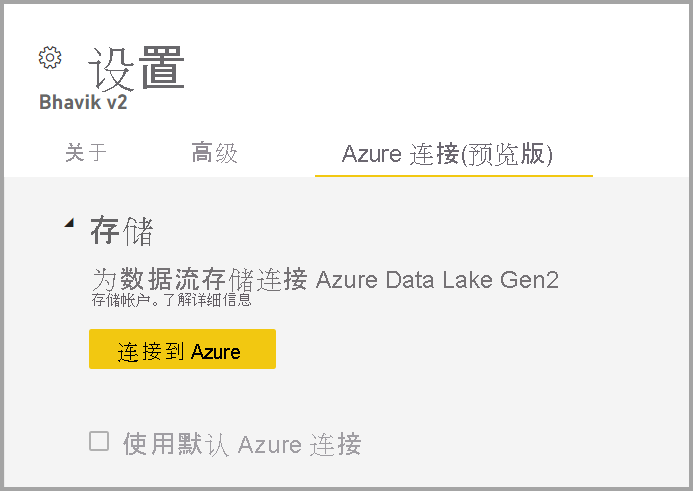
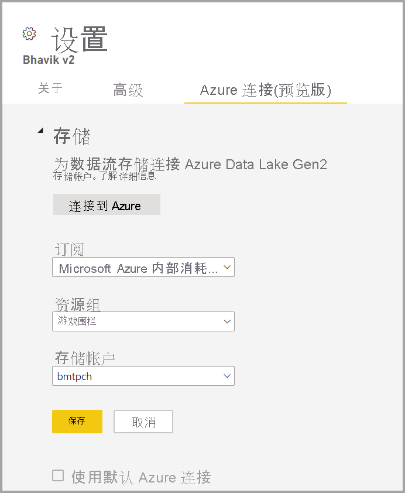

# 将数据流存储配置为使用 Azure Data Lake Gen 2 

默认情况下，Power BI 中使用的数据存储在由 Power BI 提供的内部存储中。 通过将数据流与 Azure Data Lake Storage Gen 2 (ADLS Gen2) 集成，可以将数据流存储在组织的 Azure Data Lake Storage Gen2 帐户中。

可以通过两种方法配置要使用的 ADLS Gen 2 存储：可以使用租户分配的 ADLS Gen 2 帐户，也可以在工作区级别使用自己的 ADLS Gen 2 存储。 

## 先决条件

若要使用自己的 ADLS Gen 2 帐户，就必须在存储帐户、资源组或订阅层具有所有者权限。 即使你是管理员，也必须为自己分配所有者权限。 

另外，ADLS Gen 2 帐户必须与 Power BI 租户部署在同一区域中。 如果资源的位置不在同一区域中，则会发生错误。

最后，你可以从管理门户连接到任何 ADLS Gen 2，但如果直接连接到工作区，则必须先确保工作区中没有数据流，然后再进行连接。

## 在工作区中连接到 Azure Data Lake Gen 2
导航到没有数据流的工作区。 选择“工作区设置”，其中有一个名为“Azure 连接”的新选项卡。 选择“Azure 连接”选项卡，然后选择“存储”部分。

 
如果租户已经配置了 ADLS Gen 2，则会显示“使用默认 Azure 连接”选项。 你有两个选项：通过选中名为“使用默认 Azure 连接”的框来使用租户配置的 ADLS Gen 2，或选择“连接到 Azure”以指向新的 Azure 存储帐户。 

当你选择“连接到 Azure”时，Power BI 会检索你有权访问的 Azure 订阅的列表。 填写下拉列表，并选择有效的 Azure 订阅、资源组和启用了分层命名空间选项（即 ADLS Gen2 标志）的存储帐户。

 
完成选择后，选择“保存”，此时已成功将工作区附加到你自己的 ADLS Gen2 帐户。 Power BI 会自动为存储帐户配置所需权限，并设置将向其写入数据的 Power BI 文件系统。 此时，此工作区中每个数据流的数据都将直接写入该文件系统，该文件系统可与其他 Azure 服务配合使用，为所有组织或部门数据创建单个源。

## 从工作区或租户分离 Azure Data Lake Gen 2

若要删除工作区级别的连接，必须首先确保删除工作区中的所有数据流。 删除所有数据流后，在工作区设置中选择“断开连接”。 这同样适用于租户，但必须先确保所有工作区也已与租户存储帐户断开连接，然后才能在租户级别断开连接。

## 禁用 Azure Data Lake Gen 2

在“管理门户”的“数据流”下，可以禁用用户的访问权限，使其无法使用此功能，也可以禁止工作​区管理员使用自己的 Azure 存储。

## 后续步骤
以下文章提供有关数据流和 Power BI 的详细信息：

* [数据流和自助数据准备简介](dataflows-introduction-self-service.md)
* [创建数据流](dataflows-create.md)
* [配置和使用数据流](dataflows-configure-consume.md)
* [数据流的高级功能](dataflows-premium-features.md)
* [使用数据流的 AI](dataflows-machine-learning-integration.md)
* [数据流限制和注意事项](dataflows-features-limitations.md)