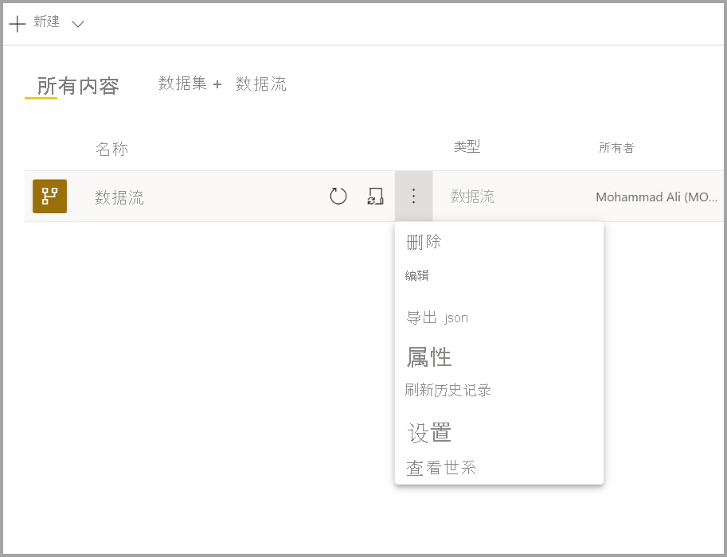
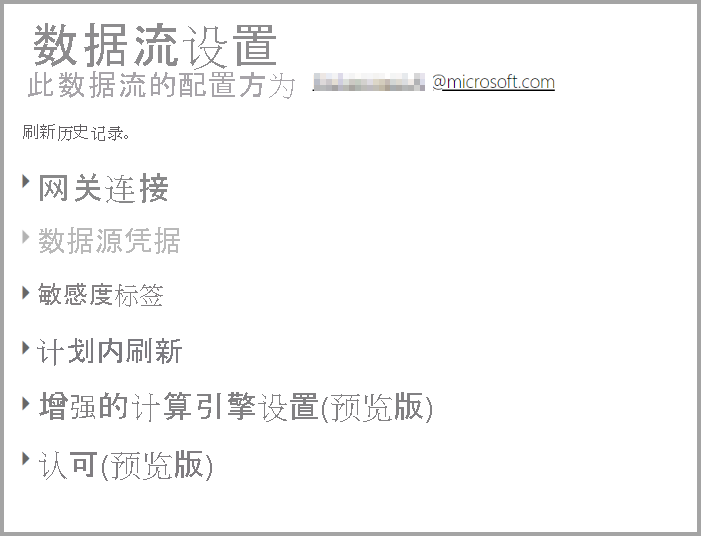
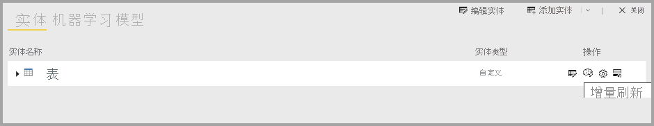

# 配置和使用数据流

借助数据流，可以统一来自多个源的数据，并准备好统一数据供建模使用。 每当创建数据流时，系统都会提示你刷新该数据流的数据。 若要在 Power BI Desktop 的数据集中使用数据流，或将数据流作为链接实体或计算实体进行引用，必须先对其进行刷新。

## 配置数据流

若要配置数据流刷新，请选择“更多”菜单（省略号），然后选择“设置”。

“设置”选项为数据流提供了许多选项，详情请参阅以下各节。

* **取得所有权：** 如果你不是数据流的所有者，许多设置将处于禁用状态。 若要取得数据流的所有权，请选择“接管”以进行控制。 系统会提示你提供凭据，以确保你具有所需的访问级别。

* **网关连接：** 在此部分中，可以选择数据流是否使用网关，以及使用哪个网关。 

* **数据源凭据：** 在此部分中，可以选择使用哪些凭据，并更改向数据源进行身份验证的方式。

* **敏感度标签：** 可在此处定义数据流中数据的敏感度。 若要了解有关敏感度标签的详细信息，请参阅[如何在 Power BI 中应用敏感度标签](../../admin/service-security-apply-data-sensitivity-labels.md)。

* **计划的刷新：** 可在此处定义所选数据流刷新的时间。 数据流的刷新频率可与数据集的刷新频率相同。

* **增强的计算引擎设置：** 可在此处定义数据流是否存储在计算引擎内部。 计算引擎允许引用该数据流的后续数据流以更快的速度执行合并和联接以及其他转换。 它还允许对数据流执行 DirectQuery。 选择“打开”可确保始终在 DirectQuery 模式下支持数据流，并且任何引用都受益于该引擎。 选择“优化”意味着仅在引用此数据流的情况下使用引擎。 选择“关闭”将禁用此数据流的计算引擎和 DirectQuery 功能。

* **认可：** 可以定义是否对数据流进行认证或推广。 

## 刷新数据流
数据流彼此之间互为构建基块。 假设你有一个名为“原始数据”的数据流和一个名为“已转换的数据”的链接实体，后者包含“原始数据”数据流的链接实体。 当“原始数据”数据流的计划刷新触发时，它会在完成后触发所有引用它的数据流。 此功能会产生一种刷新连锁效应，让你不必手动计划数据流。 处理链接实体刷新时，需要注意几个细微差别：

* 仅当链接实体存在于同一工作区时，它才会通过刷新触发

* 如果正在刷新源实体，链接实体将处于无法编辑的锁定状态。 如果引用链中的任意数据流无法刷新，则所有数据流都将回滚到旧数据（工作区中的数据流刷新是事务性的）。

* 由源刷新完成操作触发时，仅刷新被引用的实体。 若要计划所有实体，还应对链接实体设置计划刷新。 请勿对链接数据流设置刷新计划，以避免重复刷新。

**取消刷新**：数据流支持取消刷新功能，这一点与数据集不同。 如果刷新运行了很长时间，则可以选择数据流选项（数据流旁边的省略号），然后选择“取消刷新”。

**增量刷新（仅限 Premium）** ：还可以将数据流设置为增量刷新。 为此，请选择要设置增量刷新的数据流，然后选择增量刷新图标。

设置增量刷新会向数据流添加用于指定日期范围的参数。 有关如何设置增量刷新的详细信息，请参阅 [Power Query 中的增量刷新](https://docs.microsoft.com/power-query/dataflows/incremental-refresh)一文。

在某些情况下，不应设置增量刷新：

* 如果链接实体引用数据流，则不应使用增量刷新。 数据流不支持查询折叠（即使该实体启用了直接查询）。 

* 引用数据流的数据集不应使用增量刷新。 一般来说，数据流刷新速度较快，因此不必使用增量刷新。 如果刷新时间太长，请考虑使用计算引擎或 DirectQuery 模式。

## 使用数据流

可以通过以下三种方式使用数据流：

* 根据数据流创建链接实体，以允许其他数据流作者使用数据

* 根据数据流创建数据集，以允许用户利用数据创建报表

* 使用可读取 CDM 格式的外部工具创建连接

**通过 Power BI Desktop 使用**：若要使用数据流，请运行 Power BI Desktop，然后在“获取数据”对话框中选择“Power BI 数据流连接器”。

> [!NOTE]
> Power BI 数据流连接器使用的凭据集与当前登录用户使用的凭据集不同。 这是设计使然，意在支持多租户用户。

选择要连接的数据流和实体。 

> [!NOTE]
> 无论数据流或实体位于哪个工作区，也无论它是在 Premium 还是非 Premium 工作区中定义的，都可以与其连接。

如果 DirectQuery 可用，系统会提示你选择是要通过 DirectQuery 还是通过导入功能连接到实体。 

在 DirectQuery 模式下，可以在本地快速查询大型数据集。 但是，不能执行任何其他转换。 

使用导入功能会将数据引入 Power BI，并要求独立于数据流刷新数据集。

## 后续步骤
以下文章提供有关数据流和 Power BI 的详细信息：

* [数据流和自助数据准备简介](dataflows-introduction-self-service.md)
* [创建数据流](dataflows-create.md)
* [将数据流存储配置为使用 Azure Data Lake Gen 2](dataflows-azure-data-lake-storage-integration.md)
* [数据流的高级功能](dataflows-premium-features.md)
* [使用数据流的 AI](dataflows-machine-learning-integration.md)
* [数据流限制和注意事项](dataflows-features-limitations.md)