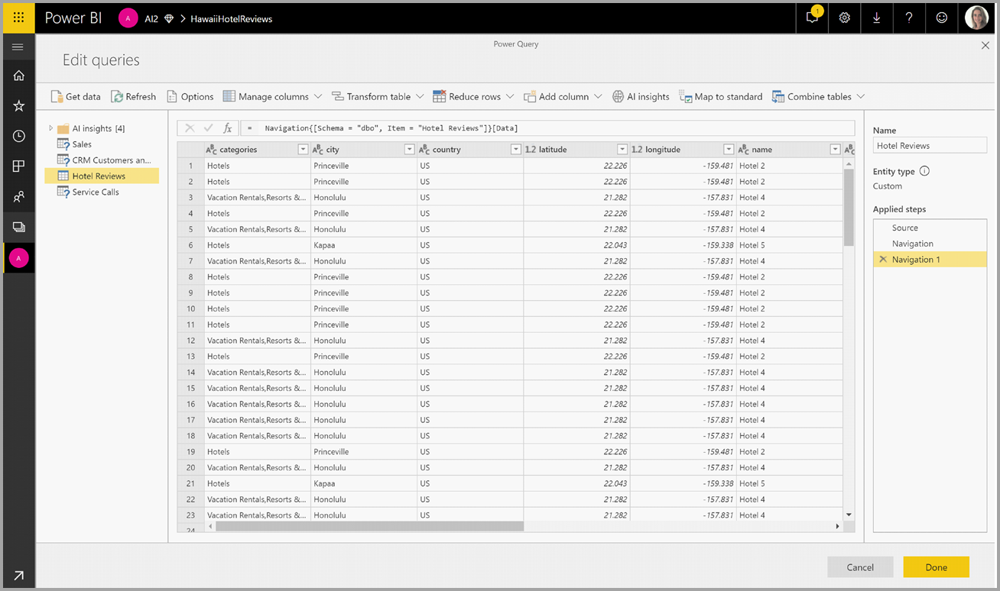

# 使用数据流的 AI

本文介绍如何将人工智能 (AI) 与数据流结合使用。 本文将介绍以下领域：

* 认知服务
* 自动化机器学习
* Azure 机器学习集成

## Power BI 中的认知服务

借助 Power BI 中的认知服务，可以在数据流自助数据准备中应用 [Azure 认知服务](https://azure.microsoft.com/services/cognitive-services/)中的不同算法来丰富数据。

目前支持的服务包括[情绪分析](/azure/cognitive-services/text-analytics/how-tos/text-analytics-how-to-sentiment-analysis)、[关键短语提取](/azure/cognitive-services/text-analytics/how-tos/text-analytics-how-to-keyword-extraction)、[语言检测](/azure/cognitive-services/text-analytics/how-tos/text-analytics-how-to-language-detection)和[图像标记](/azure/cognitive-services/computer-vision/concept-tagging-images)。 转换在 Power BI 服务上执行，无需 Azure 认知服务订阅。 此功能需要 Power BI Premium。

### **启用 AI 功能**

高级容量节点 EM2、A2 或 P1 及更高版本均支持认知服务。 容量上的单独 AI 工作负载用于运行认知服务。 公共预览期间（2019 年 6 月之前），默认情况下禁用此工作负载。 在 Power BI 中使用认知服务之前，需要在管理门户的容量设置中启用 AI 工作负载。 可以在工作负载部分启用 AI 工作负载，并定义希望此工作负载使用的最大内存量。 建议的内存限制为 20%。 超过此限制会导致查询速度变慢。

### **Power BI 中的认知服务入门**

[数据流自助服务数据准备](https://powerbi.microsoft.com/blog/introducing-power-bi-data-prep-wtih-dataflows/)中包含认知服务转换。 若要使用认知服务丰富数据，请首先编辑数据流。

选择 Power Query 编辑器顶部功能区中的“AI 见解”按钮。

在弹出窗口中，选择要使用的函数和要转换的数据。 在本例中，我会对包含评论文本的列的情绪进行评分。

Cultureinfo 是一个可选输入，用于指定文本的语言。 此字段中应输入 ISO 代码。 可以使用一个列作为 Cultureinfo 的输入，也可以使用静态字段。 在本例中，将整个列的语言指定为“英语 (en)”。 如果将此字段留空，Power BI 会在应用该函数之前自动检测语言。 接下来，选择“调用”。

调用该函数后，结果将作为新列添加到表中。 还会添加转换作为查询中的一个应用步骤。

如果函数返回多个输出字段，则调用该函数会添加一个新列，其中包含多个输出字段的记录。

使用展开选项将一个或两个值作为列添加到数据中。

### **可用函数**

本部分介绍 Power BI 中认知服务的可用函数。

#### **检测语言**

语言检测函数评估文本输入，并为每个字段返回语言名称和 ISO 标识符。 此函数对于收集未知语言的任意文本的数据列很有用。 该函数应以文本格式的数据作为输入。

文本分析可识别多达 120 种语言。 有关详细信息，请参阅[支持的语言](/azure/cognitive-services/text-analytics/text-analytics-supported-languages)。

#### **提取关键短语**

关键短语提取函数评估非结构化的文本，并为每个文本字段返回一个关键短语列表。 该函数需要一个文本字段作为输入，并接受 Cultureinfo 的可选输入。 （请参阅本文前面的“入门”部分）。

提供更大的文本块进行处理时，最适合使用关键短语提取。 这与情绪分析相反，情绪分析处理较小文本块的效果更好。 若要使两个操作都获得最佳结果，请考虑相应地重构输入。

#### **情绪评分**

情绪评分函数计算文本输入，并为每个文档返回一个范围从 0（消极）到 1（积极）的情绪分数。 此函数对于检测社交媒体、客户评论和论坛中的积极和消极情绪非常有用。

文本分析使用机器学习分类算法生成 0 到 1 之间的情绪分数。 接近 1 的分数表示积极情绪，接近 0 的分数表示消极情绪。 该模型经过预先训练，包含具有情绪关联的大量文本。 目前，无法提供你自己的训练数据。 该模型在文本分析过程中使用了多种技术，包括文本处理、词性分析、字词放置和字词关联。 有关算法的详细信息，请参阅[文本分析简介](/archive/blogs/machinelearning/machine-learning-and-text-analytics)。

对整个输入字段执行情绪分析，而不是提取文本中特定实体的情绪。 事实上，当文档包含一个或两个句子而不是大块文本时，评分准确性会呈现提升趋势。 在客观性评估阶段，模型确定某个输入字段整体上是客观的还是包含情绪。 总体客观的输入字段不会进入到情绪检测短语阶段，结果是 0.50 分，无需进一步处理。 对于在管道中继续处理的输入字段，下一阶段将生成一个高于或低于 0.50 的分数，具体取决于在输入字段中检测到的情绪程度。

目前，情绪分析支持英语、德语、西班牙语和法语这几种语言。 其他语言均为预览版。 有关详细信息，请参阅[支持的语言](/azure/cognitive-services/text-analytics/text-analytics-supported-languages)。

#### **标记图像**

标记图像函数基于超过 2000 个可识别物体、生物、风景和动作返回标记。 如果标记不明确或不常见，输出会提供“提示”，以便在已知环境的上下文中阐明标记的含义。 标记不是作为分类法组织的，并且不存在继承层次结构。 内容标记的集合构成在完整句子中显示为用户可读语言的图像“说明”的基础。

上传图像或指定图像 URL 后，计算机视觉算法会根据图像中标识的物体、生物和动作输出标记。 标记不局限于主要主题（例如前景中的人物），它还可以包括背景（室内或室外）、家具、工具、植物、动物、配饰，小配件等元素。

此函数需要图像 URL 或 Base 64 字段作为输入。 目前，图像标记支持英语、西班牙语、日语、葡萄牙语和简体中文。 有关详细信息，请参阅[支持的语言](/rest/api/cognitiveservices/computervision/tagimage/tagimage#uri-parameters)。

## Power BI 中的自动机器学习

适用于数据流的自动机器学习 (AutoML) 使业务分析师可以直接在 Power BI 中对机器学习 (ML) 模型进行训练、验证和调用。 它包括创建新 ML 模型的简单体验，分析师可以使用其数据流指定用于训练模型的输入数据。 服务会自动提取最相关的功能、选择适当的算法，以及调整和验证 ML 模型。 在对模型进行训练后，Power BI 会自动生成一个包含验证结果的性能报表。 然后，可以在数据流中的任何新的或更新的数据上调用该模型。

自动机器学习仅适用于 Power BI Premium 和嵌入式容量上托管的数据流。

### 使用 AutoML

数据流为大数据提供自助数据准备。 AutoML 集成到数据流中，使你能够在 Power BI 中充分利用数据准备工作来构建机器学习模型。

通过 Power BI 中的 AutoML，数据分析师只需借助 Power BI 技能便可以使用数据流来构建具有简化体验的机器学习模型。 创建 ML 模型背后的大多数数据科学都是通过 Power BI 自动完成的。 该模式具有良好的保护措施，可确保生成高质量模型，并清晰展示创建 ML 模型的整个过程。

AutoML 支持创建数据流的二进制预测、分类和回归模型    。 这些是受监督的机器学习技术类型，这意味着它们通过了解过去观察的已知结果来预测其他观察结果。 用于训练 AutoML 模型的输入数据集是一组标有已知结果的记录  。

Power BI 中的 AutoML 从 [Azure 机器学习](/azure/machine-learning/service/overview-what-is-azure-ml)集成[自动化 ML](/azure/machine-learning/service/concept-automated-ml)，以创建 ML 模型。 不过，在 Power BI 中，无需 Azure 订阅即可使用 AutoML。 训练和托管 ML 模型的过程完全由 Power BI 服务管理。

训练 ML 模型后，AutoML 会自动生成一个 Power BI 报表，用于说明 ML 模型的可能性能。 AutoML 会突出显示输入中影响模型返回的预测结果的关键影响因素，以此强调可解释性。 该报表还包含模型的关键指标。

生成的报表的其他页显示模型的统计摘要和训练详细信息。 对于想要查看模型性能的标准数据科学度量值的用户，统计摘要非常有用。 训练详细信息汇总了用关联建模参数创建模型的所有运行迭代。 它还介绍了如何使用每个输入来创建 ML 模型。

然后，可以将 ML 模型应用于数据以进行评分。 刷新数据流时，数据将根据 ML 模型中的预测进行更新。 Power BI 还包含有关 ML 模型产生的每个特定预测的个性化说明。

### 创建机器学习模型

本节介绍如何创建 AutoML 模型。

#### 创建 ML 模型的数据准备

若要在 Power BI 中创建机器学习模型，必须先使用历史结果信息（该信息用于训练 ML 模型）为数据创建数据流。 对于可能成为你要尝试预测的结果的强预测器的任何业务指标，还应当添加计算列。 有关配置数据流的详细信息，请参阅[配置和使用数据流](dataflows-configure-consume.md)。

对于训练机器学习模型，AutoML 有特定的数据要求。 以下各节根据各自的模型类型对这些要求进行了说明。

#### 配置 ML 模型输入

若要创建 AutoML 模型，请在数据流实体的“操作”列中选择 ML 图标，然后选择“添加机器学习模型”   。

简化的体验已启动，其中包含一个向导，该向导将引导你完成创建 ML 模型的过程。 该向导包括以下简单步骤。

**1.选择包含历史数据的实体，以及要进行预测的结果字段**

结果字段标识用于训练 ML 模型的标签属性，如下图所示。

**2.选择模型类型**

选定结果字段时，AutoML 将分析标签数据，以推荐可训练的最可能的 ML 模型类型。 可通过单击“选择其他模型”来选取其他模型类型，如下所示。

> [!NOTE]
> 对于所选的数据，某些模型类型可能不受支持，因此会被禁用。 在上面的示例中，由于文本列被选作结果字段，因此禁用了“回归”。

**3.选择希望模型用作预测信号的输入**

AutoML 分析所选实体中的示例，以建议用于训练 ML 模型的输入。 将在未选择的字段旁边提供说明。 如果某个特定字段的非重复值太多或只有一个值，或者与输出字段的相关性很低或很高，则不建议这样做。

任何依赖于结果字段（或标签字段）的输入都不应当用于训练 ML 模型，因为它们会影响其性能。 此类字段将被标记为“可能与输出字段存在高相关性”。 将这些字段引入训练的数据会导致标签泄露，其中模型对验证或测试数据执行良好，但用于在生产中进行评分时达不到预期性能。 如果训练的模型性能好到令人难以置信，则 AutoML 模型中可能会出现标签泄露的问题。

此功能建议基于数据示例，因此应查看使用的输入。 可以选择更改所选内容，使其仅包含希望模型学习的字段。 也可以通过选择实体名称旁边的复选框选择所有字段。

**4.为模型命名并保存配置**

在最后一步中，可以为模型命名并选择“保存并训练”，即可开始训练 ML 模型。 可以选择缩短训练时间以查看快速结果，或增加训练所用的时间以获得最佳模型。

#### ML 模型训练

AutoML 模型的训练是数据流刷新的一部分。 AutoML 首先准备要进行训练的数据。
AutoML 将提供的历史数据拆分为训练和测试数据集。 测试数据集是在训练后用于验证模型性能的维持数据集。 它们是作为数据流中的“训练和测试”  实体实现的。 AutoML 对模型验证使用交叉验证。

接下来，分析每个输入字段并应用插补法，这会将缺失值替换为替换值。 AutoML 使用几个不同的插补法策略。 对于被视为数值特征的输入属性，列值的平均值用于插补。 对于被视为类别特征的输入属性，AutoML 使用插补的列值模式。 用于插补的值平均值和模式由二次采样的训练数据集上的 AutoML 框架进行计算。

然后，将任何所需的采样和规范化应用于数据。 对于分类模型，AutoML 通过分层采样运行输入数据，并对类进行均衡，以确保行计数在所有类别中都相等。

AutoML 对每个选定输入字段基于其数据类型和统计属性应用多个转换。 AutoML 使用这些转换提取功能以用于训练 ML 模型。

AutoML 模型的训练过程包括多达 50 个迭代，其中包含不同的建模算法和超参数设置，以查找性能最佳的模型。 如果 AutoML 发现没有观察到性能改进，则训练可以在较小的迭代初期结束。 使用维持数据测试数据集进行验证，对其中每个模型的性能进行评估。 在此训练步骤中，AutoML 会创建多个管道，用于训练和验证这些迭代。 评估模型性能的过程可能需要几分钟到几小时的时间，最长到向导中配置的训练时间，具体取决于数据集的大小和可用的容量资源。

在某些情况下，生成的最终模型可能使用系综学习，其中多个模型用于提供更好的预测性能。

#### AutoML 模型可解释性

在对模型进行训练后，AutoML 将分析输入功能与模型输出之间的关系。 它为每个输入特征评估维持数据测试数据集的模型输出的变化量变化。 这称为“功能重要性”  。 该操作在完成训练后进行刷新的过程中发生。 因此刷新所用的时间可能比在向导中配置的训练时间要长。

#### AutoML 模型报表

AutoML 会生成一个 Power BI 报表，该报表在验证过程中汇总模型的性能以及全局功能重要性。 一旦数据流刷新成功，便可以从“机器学习模型”选项卡访问此报表。 此报表汇总了将 ML 模型应用于维持数据测试数据的结果，并将预测与已知结果值进行比较。

你可以查看模型报表以了解其性能。 你还可以验证模型的关键影响者是否与有关已知结果的业务见解一致。

用于描述报表中的模型性能的图表和度量值因模型类型不同而异。 以下各节介绍了这些性能图表和度量值。

报表中的其他页可以从数据科学角度描述有关模型的统计度量值。 例如，“二进制预测”  报表包括增益图和模型的 ROC 曲线。

报表还包括“训练详细信息”页，其中包含有关模型训练方式的说明，和一张图表来说明每个迭代运行的模型性能  。

此页上的另一部分介绍了检测到的输入字段的类型和用于填充缺失值的插补方法。 它还包括最终模型所使用的参数。

如果生成的模型使用集成学习，则“训练详细信息”页还包括一个图表，用于描述集成中每个构成模型的权重及其参数  。

### 应用 AutoML 模型

如果对创建的 ML 模型的性能感到满意，则可以在数据流刷新后将其应用于新数据或更新的数据。 可通过选择右上角的“应用”按钮，或选择“机器学习模型”选项卡中操作下的“应用 ML 模型”按钮来从模型报表中执行此操作  。

若要应用 ML 模型，你必须指定须应用该模型的实体的名称，以及将为模型输出添加到此实体的列的前缀。 列名的默认前缀为模型名称。 Apply  函数可能包含特定于模型类型的其他参数。

应用 ML 模型会创建两个新的数据流实体，其中包含针对其在输出实体中评分的每一行的预测和个性化说明。 例如，如果将 PurchaseIntent 模型应用于 OnlineShoppers 实体，则输出将生成 OnlineShoppers 扩充的 PurchaseIntent 和 OnlineShoppers 扩充的 PurchaseIntent 说明实体     。 对于扩充实体中的每一行，根据输入特征，“说明”在扩充说明实体中被划分为多行  。 ExplanationIndex 有助于将扩充说明实体中的行映射到已扩充实体中的行  。

你还可以在 PQO 函数浏览器中使用 AI 见解将任何 Power BI AutoML 模型应用于同一工作区中的任何数据流中的实体。 这样一来，就可以在同一工作区中使用其他人创建的模型，而无需成为具有该模型的数据流的所有者。 Power Query 发现工作区中的所有 Power BI ML 模型，并将其公开为动态 Power Query 函数。  你可以通过从 Powre Query 编辑器的功能区中访问这些函数来调用它们，或通过直接调用 M 函数来调用这些函数。 此功能目前仅支持 Power BI 数据流以及 Power BI 服务中的联机 Power Query。 请注意，这与使用 AutoML 向导在数据流中应用 ML 模型的情况非常不同。 未说明使用此方法创建的实体，并且除非你是数据流的所有者，否则无法访问模型训练报表或重新训练模型。 如果编辑了源模型（添加或删除输入字段），或者删除了模型或源数据流，则会中断此依赖数据流。

应用模型后，AutoML 始终会在刷新数据流时保持最新的预测。

若要在 Power BI 报表中使用 ML 模型的见解和预测，可以使用数据流连接器从 Power BI Desktop 连接到输出实体。

### 二元预测模型

二进制预测模型（更正式地称为“二元分类模型”）用于将数据集分类为两个组。 它们用于预测可能具有二进制结果的事件。 例如，销售机会是否转换、帐户是否将发生变化、是否需要按时支付发票、事务是否为欺诈性等等。

二进制预测模型的输出是一个概率分数，用于标识目标结果得到实现的可能性。

#### 训练二进制预测模型

先决条件：

- 每类结果需要至少 20 行的历史数据

二进制预测模型的创建过程遵循与其他 AutoML 模型相同的步骤，如上文“配置 ML 模型输入”一节所述。 唯一的区别是在“选择模型”步骤中，你可以在其中选择你最感兴趣的目标结果值。 还可为结果提供易记的标签，以便用于自动生成的用于汇总模型验证结果的报表。

#### 二进制预测模型报表

二进制预测模型将生成输出，该输出是记录将达到目标结果的概率。 该报表包含概率阈值的切片器，它会影响如何解释高于和低于概率阈值的分数。

该报表以“真正”、“假正”、“真负”和“假负”的形式描述模型的性能。 对于结果数据中的两个类，“真正”和“真负”是正确预测的结果。 “假正”是被预测具有目标结果但实际上没有的记录。 相反，“假负”是具有目标结果但预测为没有的记录。

度量值（如精度和撤回）描述了预测结果的概率阈值效果。 可以使用概率阈值切片器选择一个阈值，该阈值实现精度与撤回之间的均衡折衷。

该报表还包含一个成本收益分析工具，来帮助确定应针对的填充子集，以获取最高利润。 考虑到目标的估计单位成本和获得目标结果的单位收益后，成本收益分析尝试最大程度地提高利润。 你可使用此工具根据最大点选取概率阈值，以最大程度地提高利润。 还可使用关系图计算选择的概率阈值的利润或成本。

模型报表的“准确性报表”页包含模型的“累积收益”图和 ROC 曲线。 这些是模型性能的统计度量值。 报表包含所显示的图表的说明。

#### 应用二进制预测模型

若要应用二进制预测模型，必须使用要应用 ML 模型预测的数据指定实体。 其他参数包含输出列名称前缀和概率阈值，以用于对预测结果进行分类。

当应用二进制预测模型时，它向扩充的输出实体添加四个输出列：Outcome、PredictionScore、PredictionExplanation 和 ExplanationIndex   。 实体中的列名具有在应用模型时指定的前缀。

PredictionScore 是一个百分比概率，用于标识目标结果得到实现的可能性。

Outcome 列包含预测的结果标签。 概率超过阈值的记录会被预测为可能获得目标结果，并标记为 True。 低于阈值的记录被预测为不可能获得结果并标记为 False。

“PredictionExplanation”列包含一个说明，其中含有输入功能对 PredictionScore 的特定影响。

### 分类模型

分类模型用于将数据集分类为多个组或类。 它们用于预测具有多个可能结果之一的事件。 例如，客户是否可能具有非常高、高、中或低的终身价值；违约风险是高、中、低还是非常低；等等。

分类模型的输出是一个概率分数，用于标识记录将获得给定类的条件的可能性。

#### 训练分类模型

包含分类模型训练数据的输入实体必须有一个字符串或整个数值字段作为结果字段，用于标识过去已知的结果。

先决条件：

- 每类结果需要至少 20 行的历史数据

分类模型的创建过程遵循与其他 AutoML 模型相同的步骤，如上文“配置 ML 模型输入”一节所述。

#### 分类模型报表

通过将 ML 模型应用于维持数据测试数据并将记录的预测类与实际已知类进行比较，生成分类模型报表。

模型报表包括一个图表，其中包括每个已知类的正确和错误分类记录的细分。

通过进一步的特定于类的向下钻取，可以分析已知类的预测是如何分布的。 这包括其他类，在这些类中，已知类的记录可能会分类不当。

报表中的模型说明还包括每个类的最高预测值。

分类模型报表还包括与其他模型类型页面相似的“训练详细信息”页，如本文上面的“AutoML 模型报表”一节所述。

#### 应用分类模型

若要应用分类 ML 模型，必须使用输入数据和输出列名称前缀指定实体。

应用分类模型时，它向扩充的输出实体添加五个输出列：ClassificationScore、ClassificationResult、ClassificationExplanation、ClassProbabilities 和 ExplanationIndex    。 实体中的列名具有在应用模型时指定的前缀。

ClassProbabilities 列包含每个可能类的记录的概率分数列表。

ClassificationScore 是一个百分比概率，用于标识记录将获得给定类的条件的可能性。

ClassificationResult 列包含记录最可能的预测类。

ClassificationExplanation 列包含一个说明，其中含有输入功能对 ClassificationScore 的特定影响。

### 回归模型

回归模型用于预测数值。 例如：可能会从销售交易中实现的收入、帐户的生存期值、可能要支付的应付款发票量、发票的支付日期等等。

回归模型的输出为预测值。

#### 训练回归模型

回归模型包含训练数据的输入实体必须有一个数值字段作为结果字段，用于标识已知的结果值。

先决条件：

- 回归模型需要至少 100 行的历史数据

回归模型的创建过程遵循与其他 AutoML 模型相同的步骤，如上文“配置 ML 模型输入”一节所述。

#### 回归模型报表

与其他 AutoML 模型报表类似，回归报表基于将模型应用于维持数据测试数据的结果。

模型报表包含将预测值与实际值进行比较的图表。 在此图表中，与对角线的距离表示预测中的误差。

残差图显示了维持数据测试数据集中不同值的平均误差百分比。 横轴表示组实际值的平均值，其中气泡的大小显示了该范围内的值的频率或计数。 垂直轴是平均残差。

回归模型报表还包括“训练详细信息”页，如上面的“AutoML 模型报表”中所述。

#### 应用回归模型

若要应用回归 ML 模型，必须使用输入数据和输出列名称前缀指定实体。

应用回归模型时，它向扩充的输出实体添加三个输出列：RegressionResult、RegressionExplanation 和 ExplanationIndex  。 实体中的列名具有在应用模型时指定的前缀。

RegressionResult 列包含基于输入字段的记录的预测值。 RegressionExplanation 列包含一个说明，其中含有输入功能对 RegressionResult 的特定影响。

## Power BI 中的 Azure 机器学习集成

许多组织都使用机器学习模型，以获得有关其业务的更好的见解和预测。 在报表、仪表板和其他分析中可视化和调用这些模型中的见解的功能可有助于将这些见解传播到最需要它们的业务用户。  现在，Power BI 通过使用简单的点击手势可轻松整合托管在 Azure 机器学习上的模型中的见解。

若要使用此功能，数据科学家只需使用 Azure 门户向 BI 分析师授予访问 Azure ML 模型的权限。  然后，在每个会话开始时，Power Query 将发现用户具有访问权限的所有 Azure ML 模型，并将其作为动态 Power Query 函数公开。  然后，用户可以通过从 Powre Query 编辑器中的功能区中访问这些函数来调用它们，或通过直接调用 M 函数来调用这些函数。 在为一组行调用 Azure ML 模型时，Power BI 还自动批处理访问请求，以实现更好的性能。

此功能目前仅支持 Power BI 数据流以及 Power BI 服务中的联机 Power Query。

若要了解有关数据流的详细信息，请参阅[数据流和自助数据准备简介](dataflows-introduction-self-service.md)。

若要了解有关 Azure 机器学习的详细信息，请参阅：

- 概述：[什么是 Azure 机器学习？](/azure/machine-learning/service/overview-what-is-azure-ml)
- Azure 机器学习的快速入门和教程：[Azure 机器学习文档](/azure/machine-learning/)

> [!NOTE]
> 使用 Azure 机器学习集成需要 Power BI Premium 订阅。

### 向 Power BI 用户授予对 Azure ML 模型的访问权限

若要从 Power BI 访问 Azure ML 模型，用户必须具有对 Azure 订阅的读取权限。  此外：

- 对于机器学习工作室（经典）模型，具有对机器学习工作室（经典）Web 服务的读取权限
- 对于机器学习模型，具有对机器学习工作区的读取权限

本文中的步骤介绍了如何向 Power BI 用户授予对托管在 Azure ML 服务上的模型的访问权限，以便他们可以将此模型作为 Power Query 函数进行访问。  有关更为详细的信息，请参阅[使用 RBAC 和 Azure 门户管理访问](/azure/role-based-access-control/role-assignments-portal)。

1. 登录 [Azure 门户](https://portal.azure.com)。

2. 转到“订阅”页。 可以通过 Azure 门户导航窗格菜单中的“所有服务”列表找到“订阅”页 。

    

3. 选择订阅。

    

4. 选择“访问控制 (IAM)”，然后选择“添加”按钮。

    

5. 选择“读取器”作为角色。 选择想要授予其访问 Azure AL 模型权限的 Power BI 用户。

    

6. 选择“保存”。

7. 重复第三步至第六步的操作，以向用户授予对特定机器学习工作室（经典）Web 服务或托管模型的机器学习工作区的读者访问权限。

### 机器学习模型的架构发现

数据科学家主要使用 Python 来为机器学习开发甚至部署其机器学习模型。  与机器学习工作室（经典）（有助于自动执行创建模型的架构文件的任务）不同，在机器学习中，数据科学家必须使用 Python 显式生成架构文件。

此架构文件必须包含在为机器学习模型部署的 Web 服务中。 若要自动生成 Web 服务的架构，必须在已部署模型的条目脚本中提供输入/输出的示例。 请参阅 [Azure 机器学习服务文档的部署模型中关于（可选）自动生成 Swagger 架构](/azure/machine-learning/how-to-deploy-and-where#optional-define-model-web-service-schema)的子节。 该链接包括示例条目脚本以及架构生成的语句。 

具体来说，条目脚本中的 \@input_schema 和 \@output_schema 函数引用了 input_sample 和 output_sample 变量中的输入和输出示例格式，并在部署期间使用这些示例为 Web 服务生成 OpenAPI (Swagger) 规范 。

通过更新条目脚本生成架构的这些说明还必须应用于在自动化机器学习试验中使用 Azure 机器学习 SDK 创建的模型。

> [!NOTE]
> 使用 Azure 机器学习可视化界面创建的模型当前不支持架构生成，但后续版本将提供支持。 

### 调用 Power BI 中的 Azure ML 模型

你可以从数据流中的 Power Query 编辑器中直接调用已授予访问权限的任何 Azure ML 模型。 若要访问 Azure ML 模型，从 Azure ML 模型中选择想要使用见解进行扩充的实体的“编辑”按钮，如下图中所示。

选择“编辑”按钮将在数据流中为实体打开 Power Query 编辑器。

选择功能区中的“AI 见解”按钮，然后选择导航窗格菜单中的“Azure 机器学习模型”文件夹。 有权访问的所有 Azure ML 模型都在此处作为 Power Query 函数列出。 此外，会将 Azure ML 模型的输入参数自动映射为相应的 Power Query 函数的参数。

若要调用 Azure ML 模型，可以从下拉列表中将任一选定的实体的列指定为输入。 此外，还可以通过将列图标切换到输入对话框左侧来指定要用作输入内容的常量值。

选择“调用”以查看作为实体表中新列的 Azure ML 模型的输出预览。 还会将模型调用视作查询的一个应用步骤。

如果模型返回多个输出参数，则会将它们组合在一起作为输出列中的记录。 可以展开列，以在单个列中生成单独的输出参数。

保存数据流后，当刷新数据流时，将为实体表中的任何新行或更新的行自动调用模型。

## 后续步骤

本文提供了 Power BI 服务中数据流的自动机器学习概述。 以下文章也可提供帮助。

- [教程：在 Power BI 中生成机器学习模型](../../connect-data/service-tutorial-build-machine-learning-model.md)
- [教程：在 Power BI 中使用认知服务](../../connect-data/service-tutorial-use-cognitive-services.md)
- [教程：在 Power BI 中调用机器学习工作室（经典）模型（预览版）](../../connect-data/service-tutorial-invoke-machine-learning-model.md)

以下文章提供有关数据流和 Power BI 的详细信息：

* [数据流和自助数据准备简介](dataflows-introduction-self-service.md)
* [创建数据流](dataflows-create.md)
* [配置和使用数据流](dataflows-configure-consume.md)
* [将数据流存储配置为使用 Azure Data Lake Gen 2](dataflows-azure-data-lake-storage-integration.md)
* [数据流的高级功能](dataflows-premium-features.md)
* [数据流限制和注意事项](dataflows-features-limitations.md)
* [数据流最佳做法](dataflows-best-practices.md)