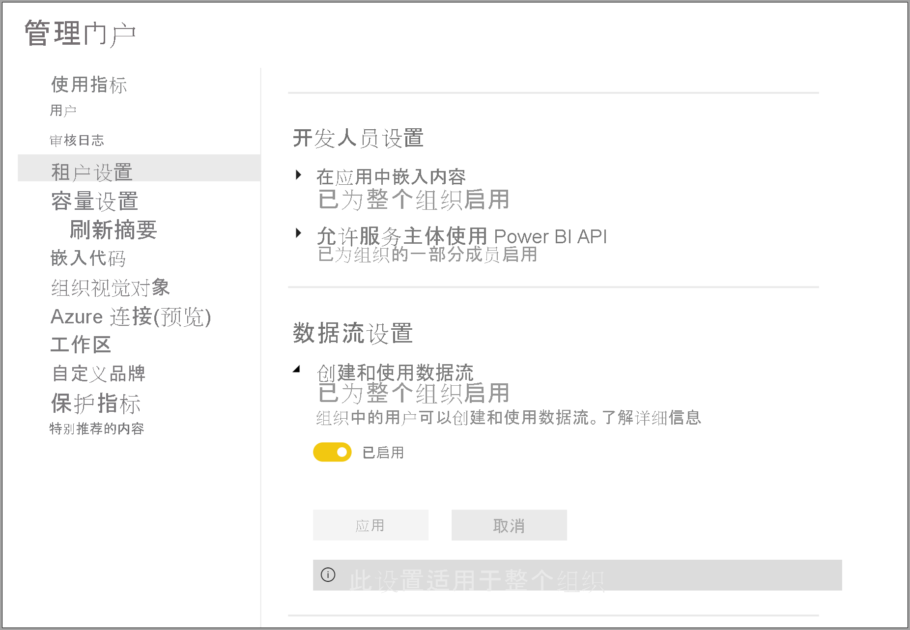
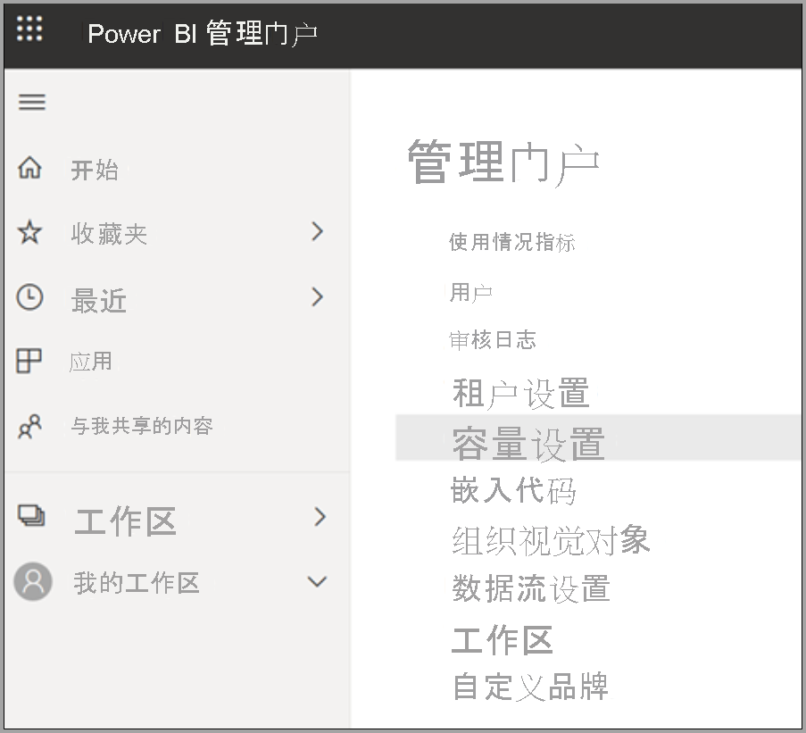
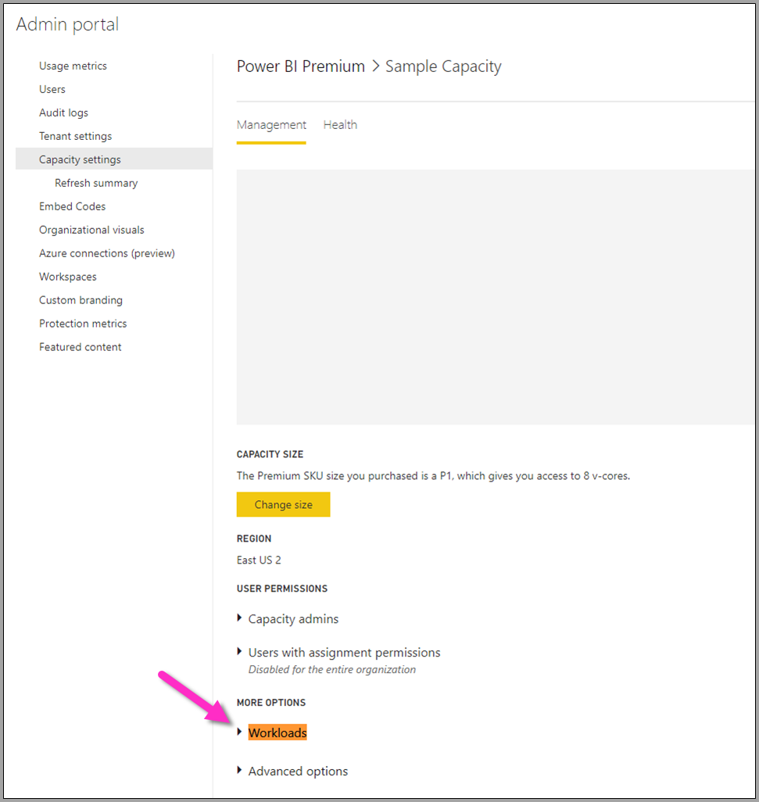
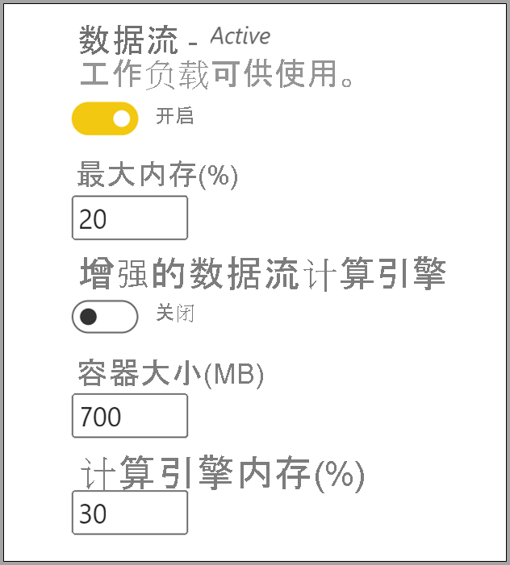

# 配置 Power BI Premium 数据流工作负载

可以在 Power BI Premium 订阅中创建数据流工作负载。 Power BI 使用工作负载的概念来描述 Premium 内容。 工作负载包括数据集、分页报表、数据流和 AI。 通过数据流工作负载，可使用数据流自助数据准备功能来引入、转换、集成和扩充数据。 Power BI Premium 数据流在“管理门户”中进行管理。

以下部分介绍如何在组织中启用数据流，如何在高级容量中优化其设置以及常见用法指南。

## 在 Power BI Premium 中启用数据流

在 Power BI Premium 订阅中使用数据流的第一项要求是支持为你的组织创建和使用数据流。 在“管理门户”中，选择“租户设置”，并将“数据流设置”下的滑块切换到“启用”，如下图所示   。

启用数据流工作负载后，将使用默认设置对其进行配置。 你可能想要根据需要调整这些设置。 接下来，我们将介绍这些设置的位置，介绍每个设置，并帮助你了解何时可能需要更改这些值以优化数据流性能。

## 优化数据流设置

启用数据流后，可以使用“管理门户”来更改或优化数据流的创建方式以及它们在 Power BI Premium 订阅中使用资源的方式。 以下步骤演示如何调整数据流设置。

1. 在“管理门户”中，选择“租户设置”，列出已创建的所有容量 。 选择一种容量来管理其设置。

    

2. Power BI Premium 容量反映了可用于数据流的资源。 可以通过选择“更改大小”按钮来更改容量大小，如下图所示。

    

3. 在“容量设置”中，可以通过展开“工作负载”来配置数据流设置。

    

4. 在“工作负载”部分，滚动到“数据流”区域 。 下图显示了一些设置，可用于控制或优化容量的数据流工作负载行为。

    

下表提供了数据流设置的基本说明。

| 管理部分 | **设置名称** | **说明** |
|---------|---------|---------|
| 容量大小 | 更改大小 | 列出了当前选定的容量，以及用于更改容量的选项。 更改此设置可纵向扩展或纵向缩减容量。 |
| **工作负载** | **最大内存(%)** | 数据流可在容量中使用的最大内存百分比。 |
| **工作负载** | 增强的数据流计算引擎 | 处理大规模数据量时，启用此选项可使计算实体的计算速度提高 20 倍。  **必须重启容量才能激活新引擎。**  有关详细信息，请参阅[增强的数据流计算引擎](../../admin/service-admin-premium-workloads.md#enhanced-dataflows-compute-engine)。 |
| **工作负载** | **容器大小** | 数据流用于数据流中各实体的容器的最大大小。 默认值为 700 MB。 有关详细信息，请参阅[容器大小](../../admin/service-admin-premium-workloads.md#container-size)。 |
| **工作负载** | 计算引擎内存(%) | 分配给计算引擎的最大内存百分比。 默认值为 30% |

在下面的部分中，我们将详细介绍每个设置以及它们如何影响数据流工作负载。

### 了解数据流工作负载选项

了解数据流工作负载选项的一种简单方法是使用类比。 你可以将“容量大小”或拥有的 Power BI Premium 实例的类型视为你的“餐馆” 。 在餐馆里，有“工作负载内存”，这是你的“厨房” 。 “计算引擎”是“烤箱” 。 最后，“容器”是“厨师”的品质 。 若要评估数据流工作负载选项，可以想象为一个大型或非常重要的晚宴准备餐食。 你有重要的客人要来，你必须在他们到达时准备好晚餐。

我们将使用这个餐馆的类比来解释每个设置并提供每个设置的指导。 我们将从最高级别（即高级容量）开始，因为这是你在使用 Power BI Premium 时所做的第一项选择。

#### 高级容量 SKU - 纵向扩展硬件

Power BI Premium 工作负载使用前端和后端核心的组合以提供跨各种工作负载类型的快速查询。 [容量节点](../../admin/service-premium-what-is.md#capacity-nodes)一文包含一个图表，该图表说明了每个可用工作负载产品/服务的当前规范。 A3 及更高的容量可以利用计算引擎，因此，当你想要使用增强的计算引擎时，请从[容量节点](../../admin/service-premium-what-is.md#capacity-nodes)开始。 

在我们的餐馆类比中，选择容量就像选择更高质量的餐馆。 尽管成本较高，但由于前端核心、后端核心和内存的增加，可以获得更高的性能级别。 当你去到更大的餐馆时，你会有更大的厨房和更好的厨师，这类似于在 Power BI Premium 中升级到更高的 SKU，从而带来了提高 CPU 速度、增加每次操作的内存和增加更多并行性的好处。

#### 最大内存 - 专用于数据流的容量 

“最大内存 %”设置是指为数据流工作负载提供的内存百分比（高级容量可用的物理内存除外）。 你可以有效地将最大容量专用于数据流工作负载，容量会根据需要针对你设置的分配动态地纵向扩展。 在我们的类比中，如果你扩大厨房的面积，就可以提供更多的餐食 - 同样，你可以增加数据流的容量工作负载大小，允许更多的数据流。 虽然存在动态资源调控，但“最大内存 %”配置选项允许你将 100% 的内存专用于数据流工作负载。 这是为了应对极少数的情况：你想要在不依赖于资源调控的情况下，确保容量的内存可用于数据流工作负载。 用我们的类比来说，这就像确保你的厨房专注于为客人准备一顿特定的餐食，将整个厨房都用于该任务一样。 当然，正如下一部分中所解释的一样，投入更多并不意味着更好的食物或餐食上桌时间更快。

#### 容器大小 - 刷新或内存不足问题

接下来，我们将讨论“容器大小(MB)”设置。 在内部，数据流使用称为糅合容器的进程来评估 ETL 进程。 引擎将查询逻辑拆分到这些容器中，它们可以并行处理这些逻辑。 这一数量的容器有效地提供了并发处理并提高了性能。 这些容器首先受“容量”限制，其次受“最大内存 %”设置限制，然后受容器设置中专门分配给它们的内存量（默认为 700Mb）的限制 。 因此，可以增加硬件内存量并增加容器大小，但这样做会减少并行操作，同时将更多内存专用于容器中的特定 ETL 进程。 容器的数量上限为后端核心数的三倍，这一点很重要，因为你不能将容器设置得非常小，不能有超过该上限的多个并行容器。 可以设置的容器的最小大小为 200Mb。 容器大小还限定在查询级别，这意味着每个查询都在自己的容器中执行，但在查询引用其他查询时除外，在这种情况下，它们将作为同一容器的一部分进行刷新。

回到我们的类比，根据所下订单的类型和餐食的复杂程度，在厨房中减少厨师的数量，但使厨师更加专注，可以更快地准备餐食。 这里的折衷是厨师变少，但是有更多的专注准备时间。 同样，将容器大小度量值提高到 1200-1500 MB 意味着更复杂的 ETL 作业（例如聚合、联接、透视、行或列操作等活动）变少，性能会有所提高，因为我们为每个容器提供了更多内存，但这样做会减少容器的数量。 正如类比所暗示的那样，过多的订单实际上可能会减慢厨房出餐的速度，这也是你考虑容器大小的方式，当你需要完成复杂的实体操作，并且希望以并行性换取性能时，可以使用此方法，因为增加此资源会将内存分配给较少容器。

总而言之，你希望根据所使用的查询优化容器大小。 例如，若只是将数据从源加载到实体中，则不需要拉入数据并执行任何操作，只需将数据加载到存储中。 在这种情况下，你需要尽可能多的并行性，因为你希望提高加载和刷新操作的速度。 相反，当你添加更多转换操作（复杂筛选、联接、聚合）时，内存可能会高得多，因为我们可能需要在内存中处理其中一些转换操作。 请注意，如果你还针对该容量运行了其他数据流操作，则它会降低这些操作的速度，并迫使它们排队以获得一个执行槽。 为此，Power BI Premium Capacity Metrics 应用可协助监视和管理数据流、刷新性能和整个容量。 可使用 Power BI Premium 容量指标应用按容量进行筛选，并查看工作区内容的性能指标。 对于存储在高级容量中的所有内容，可以按小时查看其在过去 7 天内的性能指标和资源使用情况，因此，要调查数据流性能，建议从此应用开始。

#### 增强的计算引擎 - 提高性能的机会

在我们的类比中，[增强的计算引擎](dataflows-premium-features.md#the-enhanced-compute-engine)类似于烤箱。 Power BI 使用计算引擎来处理查询和刷新操作。 增强的计算引擎是对标准引擎的改进，可通过将数据加载到 SQL 缓存来工作，使用 SQL 加速实体转换和刷新操作，并实现 DirectQuery 连接。 如果将这些引擎比作烤箱，当你利用改进的烤箱时，你也许能够更快、更有效地烹饪餐食。 将计算实体配置为“启用”或“优化”时（如果业务逻辑允许），Power BI 将使用 SQL 提高性能 。 DirectQuery 连接也可“启用”引擎。 正如类比所暗示的那样，某些餐食可能不需要烤箱，也不会利用烤箱。 可以采用类似的方式来考虑增强的计算引擎 - 确保数据流的使用正确地利用了增强的计算引擎。

> [!NOTE]
> 增强的计算引擎尚未在所有区域提供。

## 常见场景指南

本部分提供有关通过 Power BI Premium 使用数据流工作负载的常见场景的指南。

### 刷新时间缓慢

刷新时间缓慢通常是一个并行问题。 应按顺序查看以下选项：

1. 刷新时间缓慢的关键概念是数据准备的性质。 在本文前面介绍的餐馆类比中，假设已准备好食物，等待使用。 在这种情况下，由于准备时间极短，因此可以更快地烹饪食物。 同样，只要你可以通过利用数据源实际进行准备并执行预先查询逻辑来优化缓慢的刷新时间，你就应该这样做。 具体而言，当使用关系数据库（如 SQL）作为源时，请查看是否可以在源上运行初始查询，并将该源查询用于数据源的初始提取数据流。 如果在源系统中无法使用本机查询，请执行数据流[引擎可折叠到数据源](/power-query/power-query-folding)的操作。

2. 评估在相同容量下分散刷新时间。 刷新操作是需要大量计算的过程。 对照我们的餐馆类比，分散刷新时间类似于限制餐馆的客人数量。 正如餐馆会安排客人和规划容量一样，你还需要考虑在使用量未达到顶峰时的刷新操作。 这可能会对缓解容量紧张有很大帮助。

3. 增加提供给工作负载的总内存量。 将其视为厨房的大小。 优化此资源类似于调整厨房可以容纳厨师的数量。 这是通过调整“最大内存 %”设置，并将其增大到 100% 来完成的。

4. 减少容器的内存量，从而允许使用更多的容器。 你可以这样想：与其雇佣一名像 Gordon Ramsey 这样能力出众的厨师，不如雇佣许多称职但价格较低的厨师。 这样你的厨房中就有更多的厨师，但这些厨师只能执行较小的任务。 这样你就有了更多的容器，但内存却少了。

5. 执行上述两个步骤，可以实现更高的并行度，因为你获得了更多的厨师和更大的厨房。
    
6. 如果本部分中的步骤不能提供所需的并行度，请考虑将容量升级到更高的 SKU。 然后再次按照本部分前面的步骤进行操作。

### 内存不足异常

当你遇到“内存不足异常”时，你需要提高容器和内存的性能。 请执行下列步骤：

1. 增加容器上的内存。 这类似于拥有一位明星厨师与拥有许多厨师，如前一部分中所述。

2. 增加工作负载的内存和容器的内存。 在我们的类比中，创造了一个更大的厨房并具有更高质量的厨师。

3. 如果这些更改未提供所需的并行度，请考虑使用更高的 Power BI Premium SKU。

### 使用计算引擎提高性能

执行以下步骤以使工作负载触发计算引擎，并始终提高性能：

对于同一工作区中的计算实体和链接实体：

1. 对于引入，重点是尽可能快地将数据导入存储，仅当筛选器减小了总体数据集大小时才使用筛选器。 最佳做法是将转换逻辑与此步骤分离，并使引擎能够专注于组成部分的初始收集。 接下来，使用链接实体或计算实体将转换和业务逻辑分离到同一工作区中的单独数据流；这样做可以使引擎激活并加快计算速度。 在我们的类比中，这就像是在厨房里准备食物：食物准备通常是一个与收集原料不同的单独步骤，是把食物放入烤箱的先决条件。 同样，逻辑需要单独准备，然后才能利用计算引擎。

2. 确保执行折叠的操作，例如合并、联接、转换及[其他](/power-query/power-query-folding#transformations-that-can-achieve-folding)操作。

3. [在已发布的指导原则和限制内](dataflows-features-limitations.md#dataflows-in-premium)生成数据流。

你还可以使用 DirectQuery。

### 计算引擎已启用，但性能较低

在调查计算引擎已启用但性能下降的情况时，请执行以下步骤：

1. 限制跨工作区存在的计算和链接实体。

2. 如果在启用计算引擎的情况下进行初始刷新，则数据将写入湖和缓存中。 这种双写意味着这些刷新速度将比较缓慢。

3. 如果你有一个链接到多个数据流的数据流，请确保计划对源数据流的刷新，使其不会同时刷新。

## 后续步骤
以下文章提供有关数据流和 Power BI 的详细信息：

* [数据流和自助数据准备简介](dataflows-introduction-self-service.md)
* [创建数据流](dataflows-create.md)
* [配置和使用数据流](dataflows-configure-consume.md)
* [将数据流存储配置为使用 Azure Data Lake Gen 2](dataflows-azure-data-lake-storage-integration.md)
* [使用数据流的 AI](dataflows-machine-learning-integration.md)
* [数据流限制和注意事项](dataflows-features-limitations.md)