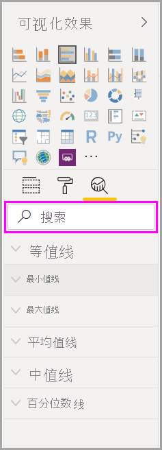
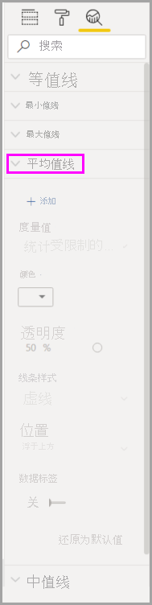

# 使用 Power BI Desktop 中的“分析”窗格

通过 Power BI Desktop 的“分析”  窗格，你可以向视觉对象添加动态参考行  ，并重点关注重要趋势或见解。 “分析”  图标和窗格位于 Power BI Desktop 的“可视化效果”  区域中。

> [!NOTE]
> 仅当在 Power BI Desktop 画布上选择视觉对象时才会显示  “分析”窗格。

## 在“分析”窗格内搜索

自 2018 年 2 月版 Power BI Desktop（版本 2.55.5010.201 或更高版本）开始，可以在“分析”  窗格内进行搜索，此窗格是“可视化效果”  窗格的子节。 选择“分析”  图标时，将显示搜索框。

## 使用“分析”窗格

通过“分析”  窗格，可以创建以下类型的动态参考行：

* X 轴恒线
* Y 轴恒线
* 最小值线
* 最大值线
* 平均线
* 中线
* 百分位数线
* 对称底纹

> [!NOTE]
> 并非所有行都适用于所有视觉对象类型。

以下各部分介绍如何在可视化效果中使用“**分析**”窗格和动态参考行。

若要查看视觉对象的可用动态参考行，请按照下列步骤操作：

1. 选择或创建视觉对象，然后从“**可视化效果**”部分选择“**分析**”图标。

    

2. 为想要创建的行类型选择行类型以展开其选项。 本示例中将选择“平均值线”  。

    

3. 若要创建一个新行，请选择“ **+添加”&nbsp;** 。 然后，可以命名该行。 双击文本框，然后输入名称。

    现在，你已经为行提供了各种选项。 可以指定其“颜色”  、“透明度”  百分比、“线型”  和“位置”  （与视觉对象的数据元素相比）。 还可以选择是否包含“数据标签”  。 若要指定线所基于的视觉对象度量值，请选择“度量值”  下拉列表，该列表将自动填充来自视觉对象的数据元素。 我们在此选择“区域性”  作为度量值，对其设置“区域性平均值”  标签。

    

4. 如果想要显示数据标签，请将“数据标签  ”从“关闭”  更改为“打开”  。 执行此操作可以为数据标签获取大量其他选项。

    

5. 请注意“**分析**”窗格中的“**平均线**”项旁显示的数目。 它指出目前在视觉对象上所拥有的动态行的数量和类型。 如果为“可购性”  添加了“最大值线”  ，则可以看到“分析”  窗格显示现在也有适用于该视觉对象的“最大值线”  动态参考行。

    

如果所选择的视觉对象不能具有对其适用的动态参考行（本示例中为“映射”  视觉对象），则会在选择“分析”  窗格时看到以下信息。

可以通过使用“分析”  窗格创建动态参考行，以突出显示许多有趣的见解。

我们正在计划开发更多的特性和功能，其中包括扩展可以具有适用动态参考行的视觉对象。 请经常查看其新增功能。

## 应用预测

如果数据源中有时间数据，则可以使用“预测”  功能。 只需选择一个视觉对象，然后展开“分析”  窗格的“预测”  部分。 可以指定多个输入以修改预测，例如预测长度  或置信区间  。 下图显示了已应用预测的基线视觉对象。 使用想像（并通过预测）了解它如何应用于你的模型。

> [!NOTE]
> 预测功能仅适用于折线图视觉对象。

## 限制

是否能使用动态参考行取决于正在使用的视觉对象的类型。 以下列表更明确地说明了这些限制。

可以在以下视觉对象上使用 x 轴恒线  、y 轴恒线  和对称着色  ：

* 散点图

可在以下视觉对象上使用恒线  、最小值线  、*最大值线*、平均值线  、*中值线*、百分位数线  ：

* 分区图
* 簇状条形图
* 簇状柱形图
* 折线图
* 散点图

以下视觉对象仅能使用“*分析*”窗格中的恒线  ：

* 堆积面积图
* 堆积条形图
* 堆积柱形图
* 瀑布图
* 100% 堆积条形图
* 100% 堆积柱形图

如果有时间数据，以下视觉对象可以使用趋势线  ：

* 分区图
* 簇状柱形图
* 折线图
* 折线图和簇状柱形图

最后，当前无法将任何动态线应用到多个视觉对象，包括（但不限于）：

* 漏斗图
* 折线图和簇状柱形图
* 折线图和堆积柱形图
* 带状图
* 非笛卡尔视觉对象，如环形图、仪表、矩阵、饼图和表

只有在使用 Power BI Desktop  中的导入数据，或在实时连接到运行 Analysis Service 2016  或更高版本、Azure Analysis Services  的服务器上的模型或连接到 Power BI 服务上的数据集时，才能使用百分位数线。

## 后续步骤

可以使用 Power BI Desktop 执行各种操作。 有关其功能的详细信息，请参阅下列资源：

* [Power BI Desktop 中的新增功能](../fundamentals/desktop-latest-update.md)
* [获取 Power BI Desktop](../fundamentals/desktop-get-the-desktop.md)
* [什么是 Power BI Desktop？](../fundamentals/desktop-what-is-desktop.md)
* [Power BI Desktop 的查询概述](desktop-query-overview.md)
* [Power BI Desktop 中的数据类型](../connect-data/desktop-data-types.md)
* [使用 Power BI Desktop 成型和合并数据](../connect-data/desktop-shape-and-combine-data.md)
* [在 Power BI Desktop 中执行常见任务](desktop-common-query-tasks.md)
