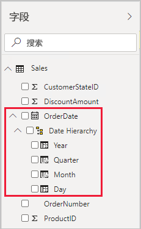
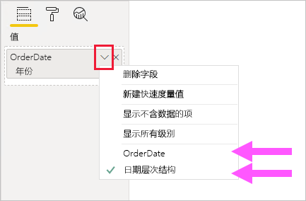
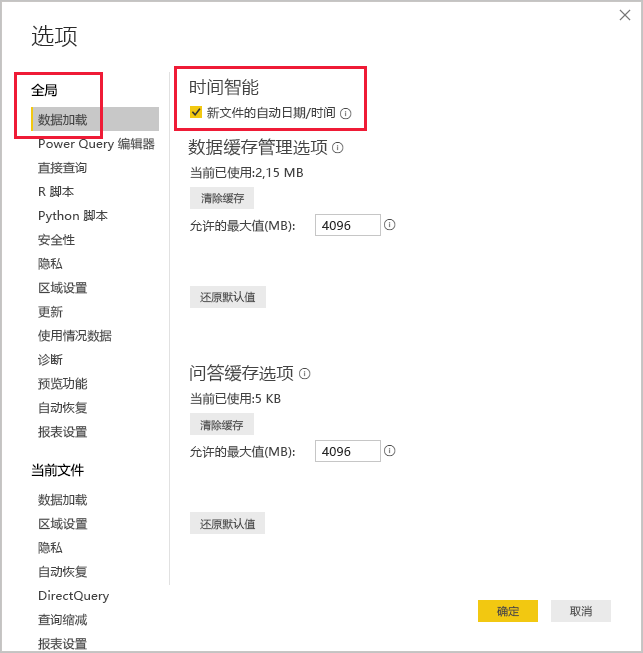

# <a name="apply-auto-datetime-in-power-bi-desktop"></a>在 Power BI Desktop 中应用自动日期/时间

本文面向在 Power BI Desktop 中开发导入或复合模型的数据建模人员。 本文介绍了“自动日期/时间”选项。

“自动日期/时间”是 Power BI Desktop 中的数据加载选项。 此选项用于实现基于模型中所加载日期列的时间智能报告。 具体而言，它可以让报表作者使用日历时间段（年份、季度、月份和天数），从而使用数据模型进行筛选、分组和向下钻取。 重要的是，无需显式开发这些时间智能功能。

启用该选项后，如果满足以下所有条件，Power BI Desktop 会为每个日期列创建隐藏的自动日期/时间表：

- 表存储模式为“导入”
- 列数据类型为“日期”或“日期/时间”
- 列不是模型关系中的“多”方

## <a name="how-it-works"></a>工作原理

每个自动日期/时间表实际上都是使用 DAX [CALENDAR](/dax/calendar-function-dax) 函数生成数据行的[计算表](desktop-calculated-tables.md)。 每个表还包含六个计算列：**Day**、**MonthNo**、**Month**、**QuarterNo**、**Quarter** 和 **Year**

> [!NOTE]
> Power BI 按[模型语言](../fundamentals/supported-languages-countries-regions.md#choose-the-language-for-the-model-in-power-bi-desktop)对列名称和值进行转换和格式化。 例如，如果模型是使用英语创建的，则即使使用韩国客户端进行查看，它仍将以英语显示月份名称等。

Power BI Desktop 还会创建自动日期/时间表的“Date”列与模型日期列的关系。

“自动日期/时间”表中包含模型日期列中存储的所有日期值的的全部日历年份。 例如，如果日期列中最早的值是 2016 年 3 月 20 日，最新值是 2019 年 10月 23 日，则表将包含 1461 行。 2016 到 2019 这四个日历年的每个日期对应一行。 当 Power BI 刷新模型时，也会刷新每个自动日期/时间表。 这样一来，模型始终包括包含日期列值的日期。

如果可以查看自动日期/时间表的行，它们将如下所示：


> [!NOTE]
> 永久隐藏自动日期/时间表，对建模人员也是如此。 不会在“字段”窗格或“模型”视图中显示这类表，也不会在“数据”视图中显示表中的行。 此外，DAX 表达式也无法直接引用表及其列。
>
> 此外，使用[在 Excel 中分析](../collaborate-share/service-analyze-in-excel.md)或使用 Power BI 以外的报表设计器连接到模型时，不能使用它们。

表还定义了层次结构，为视觉对象提供年份、季度、月份和日期级别的向下钻取路径。

如果可以在模型视图中查看自动日期/时间表，它可能如下所示（相关列已突出显示）：


## <a name="work-with-auto-datetime"></a>使用自动日期/时间

存在包含（可见）日期列的自动日期/时间表时，报表作者不会看到该列显示为“字段”窗格中的字段。 但他们会看到与日期列同名的可扩展对象。 由于它带有日历图标，因此可以轻松识别。 报表作者展开日历对象时，会看到名为“日期层次结构”的层次结构。 展开层次结构后，会看到以下四个级别：年份、季度、月份和日期   。



可使用自动日期/时间生成的层次结构配置视觉对象，其方式与使用普通层次结构的方式完全相同。 可以使用整个“日期层次结构”层次结构或层次结构的特定级别来配置视觉对象。

不过，有一个已添加的功能不受普通层次结构的支持。 将自动日期/时间层次结构（或层次结构的级别）添加到视觉对象时，报表作者可以在使用层次结构或日期列之间进行切换。 如果某些视觉对象只需要日期列而不是层次结构和级别，则这种方法非常有意义。 首先配置视觉对象字段（右键单击视觉对象字段，或单击向下箭头），然后使用上下文菜单来在日期列或日期层次结构之间切换。



最后，使用 DAX 编写的模型计算可以“直接”引用日期列，也可以“间接”引用隐藏的自动日期/时间表列 。

使用 Power BI Desktop 编写的公式可以按常规方式引用日期列。 但必须使用特定扩展语法引用自动日期/时间表列。 首先，引用日期列，然后在其后添加句点 (.)。 然后，可通过公式栏自动完成从自动日期/时间表中选择列。

![在公式栏中输入 DAX 度量表达式的示例。 截至目前，公式读作 Date Count = COUNT(Sales[OrderDate]。 自动完成列表将显示隐藏的自动日期/时间表中的所有七个列。 这些列如下所示：Date、Day、Month、MonthNo、Quarter、QuarterNo 和 Year。](media/desktop-auto-date-time/auto-date-time-dax-auto-complete.png)

在 Power BI Desktop 中，有效的度量表达式可以读作：

```dax
Date Count = COUNT(Sales[OrderDate].[Date])
```

> [!NOTE]
> 虽然这度量值表达式在 Power BI Desktop 中有效，但它不是正确的 DAX 语法。 Power BI Desktop 在内部将表达式转置以引用真实的（隐藏）自动日期/时间表列。

## <a name="configure-auto-datetime-option"></a>配置自动日期/时间选项

可以全局或为当前文件配置自动日期/时间 。 全局选项适用于新的 Power BI Desktop 文件，且可随时开启或关闭。 如果是新安装的 Power BI Desktop，则两个选项都默认为开启。

同样，当前文件选项也可以随时开启或关闭。 开启后，将创建自动日期/时间表。 关闭后，将从模型中删除任何自动日期/时间表。

> [!CAUTION]
> 由于关闭当前文件选项会删除自动日期/时间表，因此请务必小心。 务必修复任何已配置为使用这些选项的已损坏报表筛选器或视觉对象。

在 Power BI Desktop 中，选择“文件”>“选项和设置”>“选项”，然后选择“全局”或“当前文件”页 。 在任一页上，都可在“时间智能”部分中找到该选项。



## <a name="next-steps"></a>后续步骤

有关本文的详细信息，请参阅以下资源：

- [Power BI Desktop 中的自动日期/时间指南](../guidance/auto-date-time.md)
- [在 Power BI Desktop 中创建日期表](../guidance/model-date-tables.md)
- [在 Power BI Desktop 中设置和使用日期表](desktop-date-tables.md)
- 是否有任何问题? [尝试咨询 Power BI 社区](https://community.powerbi.com/)
- 建议？ [提出改进 Power BI 的想法](https://ideas.powerbi.com/)
