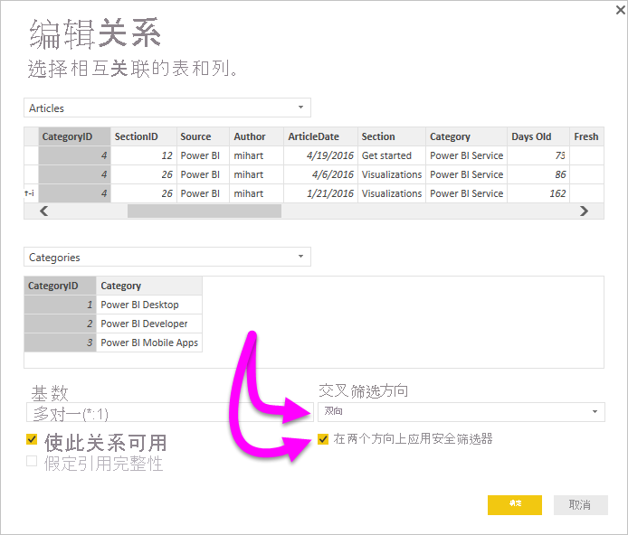

# 在 Power BI Desktop 中使用 DirectQuery 启用双向交叉筛选

通过筛选表以创建适当的数据视图时，报表创建者和数据建模者面临确定如何将筛选器应用于报表的挑战。 以前，表的筛选器上下文位于关系的一侧，而不是另一侧。 这种安排通常需要复杂的 DAX 公式才能获得所需的结果。

通过双向交叉筛选，报表创建者和数据建模者现在可以更好地控制如何在处理相关表时应用筛选器。 使用双向交叉筛选，他们可以在表关系的两侧应用筛选器  。 你可通过将筛选器上下文传播到表关系另一侧的另一个相关表来应用筛选器。

## 为 DirectQuery 启用双向交叉筛选

可以在“编辑关系”对话框中启用交叉筛选  。 若要为关系启用交叉筛选，必须配置以下选项：

* 将“交叉筛选器方向”设置为“双向”   。
* 选择“双向应用安全筛选器”  。

  

> [!NOTE]
> 在 Power BI Desktop 中创建交叉筛选 DAX 公式时，请使用 UserPrincipalName  。 此字段通常与用户登录名相同，例如 <em>joe@contoso.com</em>，而不是 UserName  。 正因如此，你可能需要创建一个可将 UserName（或 EmployeeID）映射到 UserPrincipalName 的相关表    。

有关详细信息以及双向交叉筛选操作方式的示例，请查看 [Power BI Desktop 双向交叉筛选白皮书](https://download.microsoft.com/download/2/7/8/2782DF95-3E0D-40CD-BFC8-749A2882E109/Bidirectional%20cross-filtering%20in%20Analysis%20Services%202016%20and%20Power%20BI.docx)。

