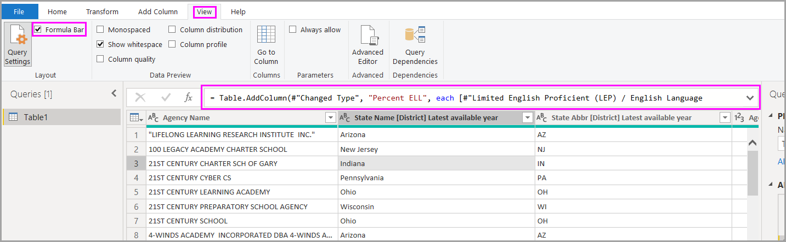

# 在 Power BI Desktop 中执行常见查询任务

在 Power BI Desktop 的 Power Query 编辑器窗口中，可执行很多常用任务。 本文演示了这些常见任务，并提供其他信息的链接。

本文展示了下列常见查询任务：

* 连接到数据
* 调整和合并数据
* 行分组
* 列透视
* 创建自定义列
* 查询公式

我们将使用几个数据连接来完成这些任务。 如果你想要自己逐步完成这些任务，可下载或连接下列数据。

第一个数据连接是 [Excel 工作簿](https://download.microsoft.com/download/5/7/0/5701F78F-C3C2-450C-BCCE-AAB60C31051D/PBI_Edu_ELSi_Enrollment_v2.xlsx)，可以下载该工作簿并保存到本地。 另一个是 Web 资源，也用于其他 Power BI Desktop 文章：

<https://www.bankrate.com/retirement/best-and-worst-states-for-retirement/>

常见查询任务从连接到这两个数据源所需的步骤开始。

## 连接到数据

若要连接到 Power BI Desktop 中的数据，请依次选择“主页”  、“获取数据”  。 Power BI Desktop 将显示一个含有最常见数据源的菜单。 对于 Power BI Desktop 可连接到的数据源的完整列表，请选择菜单末尾的“更多”  。 有关详细信息，请参阅 [Power BI Desktop 中的数据源](../connect-data/desktop-data-sources.md)。

若要开始，请选择“Excel”  ，指定前面提到的 Excel 工作簿，然后选择“打开”  。 查询将检查该工作簿，然后在你选择表后在“导航器”  对话框中呈现它找到的数据。

在将数据加载到 Power BI Desktop 中之前，可选择“转换数据”  编辑、调整或组织  数据。 当你使用需要在加载前削减的大型数据集时，编辑特别有用。

连接到其它类型的数据同样很简单。 还需要连接到 Web 资源。 选择“获取数据”   > “更多”  ，然后选择“其他”   > “Web”   > “连接”  。

“从 Web”  对话框随即出现，可在其中键入网页的 URL。

选择“确定”。  与之前一样，Power BI Desktop 会检查 Web 页面数据，并在“导航器”  对话框中显示预览选项。 选择表时，将显示数据预览。

其他数据连接与此类似。 如果需要身份验证才能建立数据连接，Power BI Desktop 将提示你提供相应凭据。

有关连接到 Power BI Desktop 中数据的分步演示，请参阅[连接到 Power BI Desktop 中的数据](../connect-data/desktop-connect-to-data.md)。

## 调整和合并数据

可使用 Power Query 编辑器轻松调整和合并数据。 本部分包括几个有关数据调整方式的示例。 有关如何调整和合并数据的更完整演示，请参阅[使用 Power BI Desktop 调整和合并数据](../connect-data/desktop-shape-and-combine-data.md)。

上一节中，你已连接到两组数据：Excel 工作簿和 Web 资源。 在 Power Query 编辑器中加载数据后，在“查询”  窗格的可用查询中选择 Web 页面查询，如下所示：

在调整数据时，可将数据源转换为满足你需求的形式和格式。

在 Power Query 编辑器中，可在功能区和上下文菜单中找到许多命令。 例如，在右键单击列时，上下文菜单将允许删除此列。 还可以选择一个列，然后从功能区的“主页”  选项卡中选择“删除列”  按钮。

在此查询中，可以通过多种其他方式来调整数据。 可以从顶部或底部删除任意数量的行。 也可以添加列、拆分列、替换值，并执行其他调整任务。 利用这些功能，可以按你希望的方式定向 Power Query 编辑器以获取数据。

## 行分组

在 Power Query 编辑器中，可将多个行中的值聚集为单个值。 在汇总所提供的产品数、总销售额或学生计数时，此功能会很有用。

在此示例中，将对教育注册数据集中的行进行分组。 数据来自 Excel 工作簿。 它已在 Power Query 编辑器中进行调整，以获取所需的列、重命名表，然后再进行一些其他转换。

让我们了解每个州有多少个机构。 （机构可以包含学区、地区性服务区等其他教育机构。）选择“机构 ID - NCES 指定\[地区\]最新可用年份”  列，然后选择“转换”  选项卡中的“分组依据”  按钮或功能区的“开始”  选项卡。 （这两个选项卡中都有“分组依据”  。）

此时会显示“分组依据”  对话框。 当 Power Query 编辑器对行进行分组时，它会创建一个新列，将“分组依据”  结果置于其中。 可按照以下方式调整 **分组依据** 操作：

1. 未标记的下拉列表指定要分组的列。 Power Query 编辑器将此值默认设置为所选列，但你可以将其更改为表中的任何列。
2. **新列名**：Power Query 编辑器会基于它对要进行分组的列所应用的操作为新列建议一个名称。 但你也可以将新列命名为所需的任何名称。
3. **Operation**：可以选择 Power Query 编辑器应用的操作，如“求和”  、“中值”  或“统计非重复行数”  。 默认值为“统计行数”  。
4. “添加分组”  和“添加聚合”  ：仅当选择了“高级”  选项时，这些按钮才可用。 在单个操作中，可以对多个列执行分组操作（“分组依据”  操作），并使用这些按钮创建多个聚合。 根据此对话框内的所选内容，Power Query 编辑器将创建一个新列，该列可对多个列进行操作。

选择“添加分组”  或“添加聚合”  ，向“分组依据”  操作添加更多分组或聚合操作。 若要删除分组或聚合，请选择该行右侧的省略号图标 (...  )，然后选择“删除”  。 继续操作，并使用默认值尝试“分组依据  操作，以查看发生的情况。

在选择“确定”  时，查询将执行“分组依据”  操作并返回结果。 嘿，看看这个 – 俄亥俄州、伊利诺伊州、德克萨斯州和加利福尼亚州，每个州现在都有 1,000 多个机构！

利用 Power Query 编辑器，始终可以删除最后一个调整操作。 在“查询设置”  窗格中的“已应用步骤”  下，只需选择最近完成的步骤旁边的“X”  。 因此请继续尝试。 如果对结果不满意，可重做此步骤，直到 Power Query 编辑器按所需的方式调整数据。

## 列透视

可对列进行透视，并创建包含某列中每个唯一值的聚合值的表格。 例如，若要了解在每个产品类别中具有多少种不同的产品，可快速创建一个表来执行此操作。

我们来看一个示例。 以下“Products_by_Categories”  表已调整为仅显示每个唯一产品（按名称）以及每种产品所属的类别。 若要新建一个表格来显示每个类别的产品计数（基于 CategoryName  列），请选中该列，然后选择“转换”   > “透视列”  。

随即出现“透视列”  对话框，你将了解将使用哪个列的值来创建新列 (1)。 （如果未显示所需的列名称 CategoryName  ，请从下拉列表中选择。）展开“高级选项”  (2) 时，可以选择将应用于聚合值 (3) 的函数。

选择“确定”  时，查询将根据“透视列”  对话框中提供的转换说明显示表。

## 创建自定义列

在 Power Query 编辑器中，可以创建在表的多个列上操作的自定义公式。 然后，可以将此类公式的结果置于新（自定义）列中。 Power Query 编辑器可轻松创建自定义列。

使用 Power Query 编辑器中的 Excel 工作簿数据，请转到功能区的“添加列”  选项卡，然后选择“自定义列”  。

以下对话框随即出现。 在此示例中，创建一个名为“Percent ELL”  的自定义列，该列计算为英语学习者 (ELL) 的学生总数的百分比。

与 Power Query 编辑器中的任何其他已应用步骤一样，如果新的自定义列不提供所需的数据，则可以删除此步骤。 在“查询设置”  窗格的“已应用步骤”  下，只需选择“添加的自定义”  步骤旁边的“X”  。

## 查询公式

可以编辑 Power Query 编辑器生成的步骤。 还可以创建自定义公式，以便更准确地连接到数据并对其进行调整。 每当 Power Query 编辑器对数据执行操作时，公式栏中都会显示与操作关联的公式。 若要查看公式栏，请转到功能区的“查看”  选项卡，然后选择“公式栏”  。

Power Query 编辑器将每个查询的所有已应用步骤保存为可查看或修改的文本。 可以使用“高级编辑器”  查看或修改任何查询的文本。 只需选择“查看”  然后选择“高级编辑器”  即可。

下面来看看 **高级编辑器**，它显示了与 **USA\_StudentEnrollment** 查询关联的查询步骤。 这些步骤是使用 Power Query 公式语言（通常称为 *M*）进行创建的。有关详细信息，请参阅 [了解 Power Query 公式](https://support.office.com/article/learn-about-power-query-formulas-6bc50988-022b-4799-a709-f8aafdee2b2f)。 若要查看语言规范本身，请参阅 [Power Query M 语言规范](/powerquery-m/power-query-m-language-specification)。

Power BI Desktop 提供了一组全面的公式类别。 有关详细信息以及所有 Power Query 编辑器公式的完整参考，请参阅 [Power Query M 函数引用](/powerquery-m/power-query-m-function-reference)。

## 后续步骤

可以使用 Power BI Desktop 执行各种操作。 有关其功能的详细信息，请参阅下列资源：

* [什么是 Power BI Desktop？](../fundamentals/desktop-what-is-desktop.md)
* [Power BI Desktop 的查询概述](desktop-query-overview.md)
* [Power BI Desktop 中的数据源](../connect-data/desktop-data-sources.md)
* [连接到 Power BI Desktop 中的数据](../connect-data/desktop-connect-to-data.md)
* [使用 Power BI Desktop 成型和合并数据](../connect-data/desktop-shape-and-combine-data.md)
