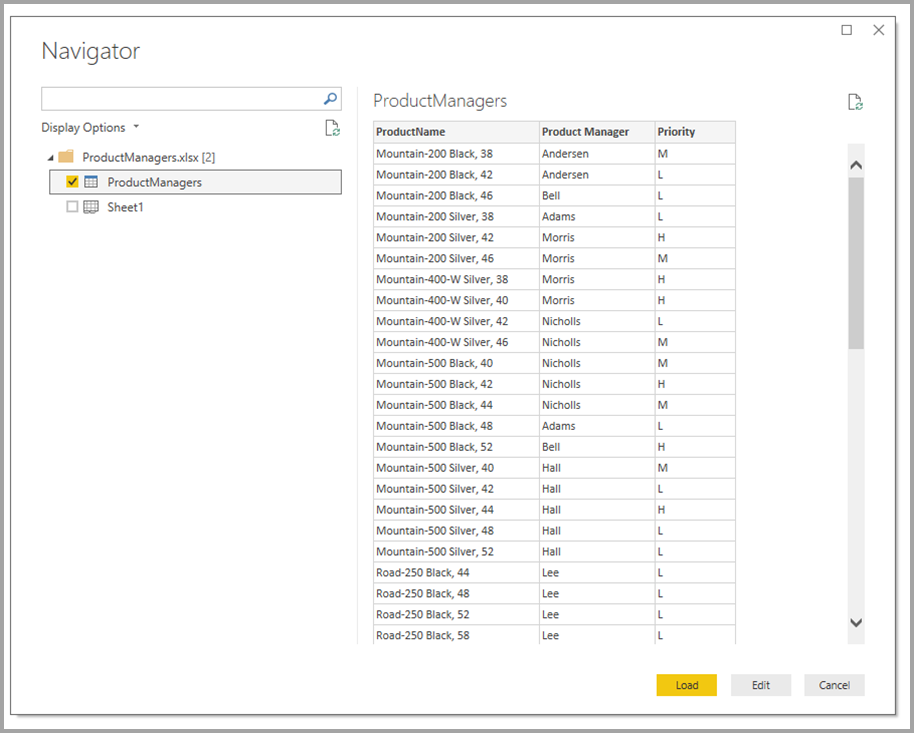
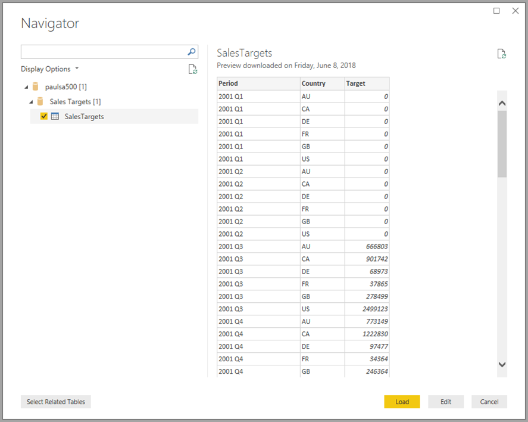

# 在 Power BI Desktop 中使用复合模型

之前在 Power BI Desktop 中，当在报表中使用 DirectQuery 时，禁止该报表使用其他数据连接（无论是 DirectQuery 还是导入）。 有了复合模型后，便删除了该限制。 一个报表可以在所选择的任何组合中无缝地包含来自多个 DirectQuery 或导入数据连接的数据连接。

Power BI Desktop 中的复合模型功能包括三个相关功能：

* **复合模型**：允许报表具有来自不同源组的两个或更多数据连接，例如一个或多个 DirectQuery 连接和一个导入连接，两个或更多 DirectQuery 连接，或其任意组合。 本文详细介绍了复合模型。

* **多对多关系**：借助复合模型，可以在表之间建立多对多关系  。 这种方法删除了对表中唯一值的要求。 它还删除了旧解决办法，如为建立关系而仅引入新表。 有关详细信息，请参阅[在 Power BI Desktop 中应用多对多关系](desktop-many-to-many-relationships.md)。

* **存储模式**：现在可以指定哪些视觉对象需要查询后端数据源。 导入的是不需要查询的视觉对象，即使基于 DirectQuery，也不例外。 此功能有助于提升性能，并减少后端负载。 以前，甚至是切片器等简单视觉对象，也会启动后端源的查询。 有关详细信息，请参阅[管理 Power BI Desktop 中的存储模式](desktop-storage-mode.md)。

## 使用复合模型

通过复合模型，在使用 Power BI Desktop 或 Power BI 服务时可以连接到不同类型的数据源。 可以用两种方法实现实现这些数据连接：

* 将数据导入 Power BI，这是获取数据最常见的方式。
* 使用 DirectQuery 直接连接到其原始源存储库中的数据。 了解有关 DirectQuery 的详细信息，请参阅[在 Power BI 中使用 DirectQuery](../connect-data/desktop-directquery-about.md)。

使用 DirectQuery 时，可通过复合模型创建 Power BI 模型（例如 .pbix  形式的 Power BI Desktop 文件），后者执行下述任一操作或全部两项操作：

* 合并来自一个或多个 DirectQuery 源的数据。
* 合并来自 DirectQuery 源的数据和导入数据。

例如，通过使用复合模型，可以生成结合了以下类型的数据的模型：

* 来自企业数据仓库的销售数据。
* 来自部门 SQL Server 数据库的销售目标数据。
* 从电子表格导入的数据。

将来自多个 DirectQuery 源的数据合并，或将 DirectQuery 与导入的数据相结合的模型称为“复合模型”。

你可以像往常一样在表之间创建关系，即使这些表来自不同的源。 任何跨源的关系都是使用“多对多”基数创建的，而不考虑它们的实际基数。 你可将其更改为一对多、多对一或一对一。 如果设置了任何基数，则跨源关系具有不同的行为。 不能使用数据分析表达式 (DAX) 函数从 `many` 端检索 `one` 端的值。 在同一个源中，还可能看到性能影响与多对多关系的对比。

> [!NOTE]
> 在复合模型的上下文中，所有导入的表实际上都是一个单一源，与实际基础数据源无关。

## 复合模型示例

有关复合模型的示例，请考虑使用 DirectQuery 连接到 SQL Server 中的公司数据仓库的报表。 在该实例中，数据仓库包含按“Country”、“Quarter”和“Bike (Product)”分类的销售数据，如下图所示    ：

此时，可以使用来自此源的字段构建简单的视觉对象。 下图显示所选季度按“ProductName”  排列的销售总额。

但如果 Office Excel 电子表格中有关于分配给每个产品的产品经理的数据以及营销优先级，又该怎么操作呢？ 如果要按“Product Manager”查看“Sales Amount”，将此本地数据添加到公司数据仓库可能无法实现   。 也可能最少需要几个月的时间。

也许可以从数据仓库（而不是使用 DirectQuery）导入该销售数据。 然后，可以将销售数据与从电子表格中导入的数据相结合。 这种方法需要首先使用 DirectQuery，因此不合理。 原因可能包括：

* 基础数据源中强制执行的安全规则的某种组合。
* 需要能够查看最新数据。
* 数据的规模庞大。

因此需要用到复合模型。 复合模型允许使用 DirectQuery 连接到数据仓库，然后使用“获取数据”  获取其他源。 在此示例中，我们首先建立 DirectQuery 与企业数据仓库的连接。 使用“获取数据”  ，选择“Excel”  ，然后导航到包含本地数据的电子表格。 最后，导入包含“Product Name”、分配的“Sales Manager”和“Priority”的电子表格    。  

在“字段”列表中，可以看见两个表：来自 SQL Server 的原始“Bike”表，以及新的“ProductManagers”表    。 新表包含从 Excel 导入的数据。

同样，在 Power BI Desktop 中的“关系”视图中，现在可以看到额外的一个名为“ProductManagers”的表   。

现在需要将这些表与模型中的其他表相关联。 与往常一样，我们在来自 SQL Server 的“Bike”表和导入的“ProductManagers”表之间创建关系   。 也就是“Bike[ProductName]”和“ProductManagers[ProductName]”之间的关系   。 如前所述，所有跨越源的关系都默认为具有“多对多”基数。

创建此关系后，关系会按照我们所期望的那样显示在 Power BI Desktop 的“关系”视图中  。

现在可以使用“字段”列表的任意字段来创建视觉对象  。 此方法无缝地混合来自多个源的数据。 例如，每个“Product Mnager”的总“SalesAmount”如下图所示   ：

以下示例显示了维度  表（例如“Product”  或“Customer”  ）的一种常见用例，它通过从其他位置导入的一些额外数据进行扩展。 还有可能使表借助 DirectQuery 连接到各个源。 若要继续了解示例，假定每个“Country”和“Period”的“Sales Targets”都存储在一个单独的部门数据库中    。 可以像往常那样使用“获取数据”  连接到该数据，如下图所示：

类似于之前的操作，可以在模型中在新表和其他表之间创建关系，并创建合并表数据的视觉对象。 让我们再次看看“关系”视图，我们已在其中建立了新关系  ：

下图基于新的数据和已创建的关系。 左下方的视觉对象显示总“Sales Amount”与“Target”的对比，差异计算显示差异   。 “Sales Amount”和“Target”数据来自两个不同的 SQL Server 数据库   。

## 设置存储模式

复合模型中的每个表都有一个存储模式，指示表是基于 DirectQuery 还是导入。 可以在“属性”窗格中查看和修改存储模式  。 要显示存储模式，请右键单击“字段”列表中的某个表，然后选择“属性”   。 下图显示“SalesTargets”表的存储模式  。

也可以在每个表的工具提示上查看存储模式。

对于包含一些来自 DirectQuery 的表和一些导入表的任何 Power BI Desktop 文件（.pbix  文件），状态栏显示一种称为“混合”  的存储模式。 可以在状态栏中单击该术语，并轻松将所有表切换为导入。

更多有关存储模式的详细信息，请参阅[在 Power BI Desktop 中管理存储模式](desktop-storage-mode.md)。  

> [!NOTE]
> 可在 Power BI Desktop 和 Power BI 服务中使用“混合”存储模式  。

## 计算表

可以将计算表添加到使用 DirectQuery 的模型中。 定义计算表的数据分析表达式 (DAX) 可以引用导入的表或 DirectQuery 表或两者的组合。

计算表始终是导入的，刷新表时，也会刷新表中的数据。 如果计算表引用 DirectQuery 表，则引用 DirectQuery 表的视觉对象始终显示基础数据源中的最新值。 或者，引用计算表的视觉对象显示上次刷新计算表时的值。

## 安全隐患

复合模型有一些安全隐患。 发送到一个数据源的查询可以包括已从另一个源检索的数据值。 在前面的示例中，按“产品经理”  显示“(销售额)”  的视觉对象向“Sales”关系数据库发送 SQL 查询。 SQL 查询可能包含“产品经理”的姓名及其关联的“产品”。

因此，存储在电子表格中的信息现包含在发送到关系数据库的查询中。 如果为机密信息，则应考虑安全隐患。 具体而言，请考虑以下几点：

* 即使对原始源中的数据没有权限，任何可以查看跟踪或审核日志的数据库管理员也都可以查看此信息。 在此示例中，管理员需要权限来查看 Excel 文件。

* 应考虑为每个源设置加密。 若希望避免通过加密连接从一个源检索信息，然后无意中将其包含在通过未加密连接发送到另一个源的查询中。

创建复合模型时，Power BI Desktop 会显示一条警告消息，以便确认已考虑任何安全隐患。  

此外，如果作者将模型 A 中的 Table1 添加到复合模型中（我们将其称为模型 C 以作参考），则查看基于模型 C 构建的报表的用户可以查询模型 A 中不受 RLS 保护的任何表。

出于类似原因，打开从不受信任的源发送的 Power BI Desktop 文件时必须小心谨慎。 如果该文件包含复合模型，某人使用打开文件的用户的凭据从一个源检索的信息会被作为查询的一部分发送到另一个数据源。 Power BI Desktop 文件的恶意作者就可以查看该信息。 初次打开包含多个源的 Power BI Desktop 文件时，Power BI Desktop 将显示警告。 此警告类似于打开包含本机 SQL 查询的文件时显示的警告。  

## 性能影响  

使用 DirectQuery 时应始终考虑性能，主要是为了确保后端源具有足够的资源来为用户提供良好体验。 良好的体验意味着视觉对象在五秒或更短的时间内刷新。 有关更多性能建议，请参阅[关于在 Power BI 中使用 DirectQuery](../connect-data/desktop-directquery-about.md)。

使用复合模型有更多的性能注意事项。 只有一个视觉对象则可能导致向多个源发送查询，这通常会将来自一个查询的结果传递到第二个源。 这种情况可能会导致以下执行形式：

* 包含大量文字值的 SQL 查询：例如，为一组选定的“Product Managers”请求总“Sales Amount”的视觉对象首先需要查找由这些产品经理管理的“Products”  。 此序列必须在视觉对象发送包含 `WHERE` 子句中的所有产品 ID 的 SQL 查询之前发生。

* 在较低粒度级别进行查询、稍后在本地聚合数据的 SQL 查询：随着满足“产品经理”筛选条件的“产品”的数量增加，将所有产品包含在 `WHERE` 子句中可能会效率低下或不可行。 于是，有必要在“产品”的较低级别查询关系源，然后在本地聚合结果。 如果“Products”基数超过 100 万限制，则查询失败。

* 多个 SQL 查询，按值一个组一个：如果聚合使用 DistinctCount 并按来自另一个源的某个列分组，且外部源不支持有效传递定义分组的多个文本值，则需要按值每组发送一个 SQL 查询。

   请求按“产品经理”（从电子表格导入）排布的不同数量的 CustomerAccountNumber（来自 SQL Server 表）的视觉对象，需要在发送到 SQL Server 的查询中传递来自“产品经理”表的详细信息。 通过其他源（例如 Redshift），此操作不可行。 相反，会根据每个“销售经理”发送一个 SQL 查询，直到达到某个实际限制，此时查询就会失败。

每一种情况对性能都有其相应的影响，并且每个数据源的具体细节都有所不同。 虽然在连接两个源的关系中使用的列的基数仍然很低（几千），但性能不会受到影响。 随着此基数的增长，应更注重对其产生的性能的影响。

此外，使用“多对多”关系意味着必须将单独查询发送到每个总计或小计级别的基础源，而不是在本地聚合详细值。 一个带总计的简单表视觉对象将发送两个 SQL 查询，而不是一个。

## 限制和注意事项

此版本的复合模型有一些限制：

当前，只有连接到 SQL、Oracle 和 Teradata 数据源的复合模型支持[增量刷新](../admin/service-premium-incremental-refresh.md)。

以下 Live Connect 多维源无法用于复合模型：

* SAP HANA
* SAP Business Warehouse
* SQL Server Analysis Services
* Power BI 数据集
* Azure Analysis Services

使用 DirectQuery 连接到这些多维数据源时，不能同时连接到另一个 DirectQuery 源，也不能与导入数据相结合。

在使用复合模型时，使用 DirectQuery 的现有限制仍然适用。 现在每个表都要遵循其中许多限制，具体视表的存储模式而定。 例如，导入表上的计算列可以引用其他表，但是 DirectQuery 表上的计算列仍只能引用同一表上的列。 如果模型中的任何一个表都是 DirectQuery，则其他限制适用于整个模型。 例如，如果模型中有任何表具有 DirectQuery 的存储模式，则 QuickInsights 和问答功能在该模型上不可用。

## 后续步骤

若要详细了解复合模型和 DirectQuery，请参阅以下文章：

* [Power BI Desktop 中的多对多关系](desktop-many-to-many-relationships.md)
* [Power BI Desktop 中的存储模式](desktop-storage-mode.md)
* [在 Power BI 中使用 DirectQuery](../connect-data/desktop-directquery-about.md)
* [Power BI 中 DirectQuery 支持的数据源](../connect-data/power-bi-data-sources.md)
* [使用适用于 Power BI 数据集和 Azure Analysis Services 的 DirectQuery（预览版）](../connect-data/desktop-directquery-datasets-azure-analysis-services.md)
