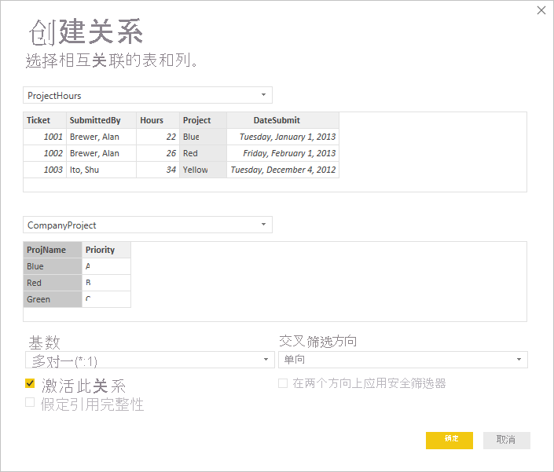
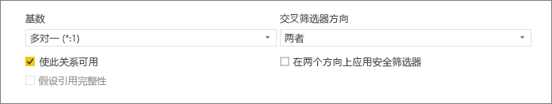
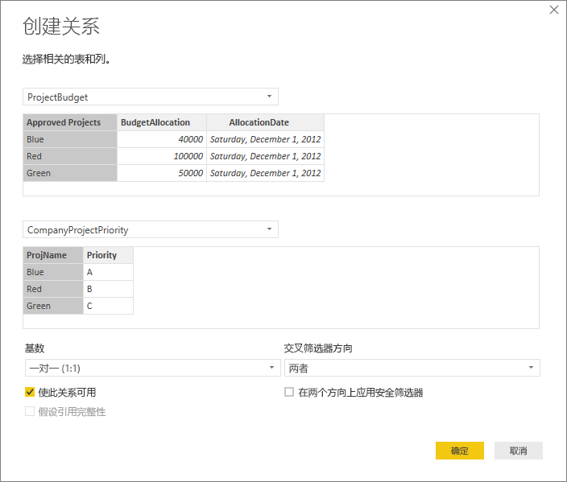
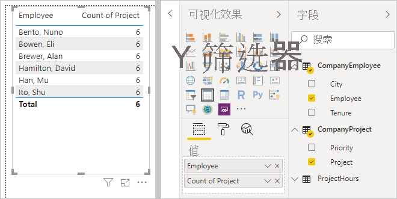
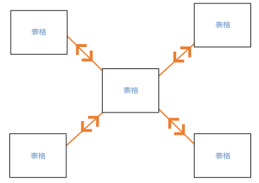
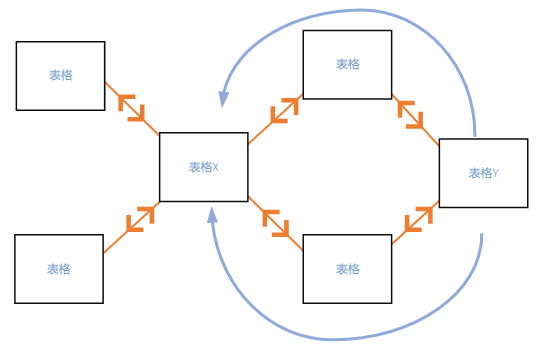
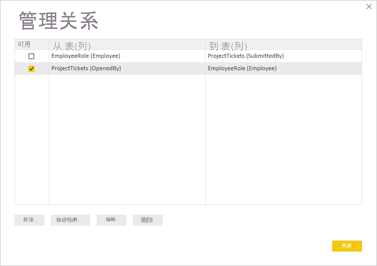
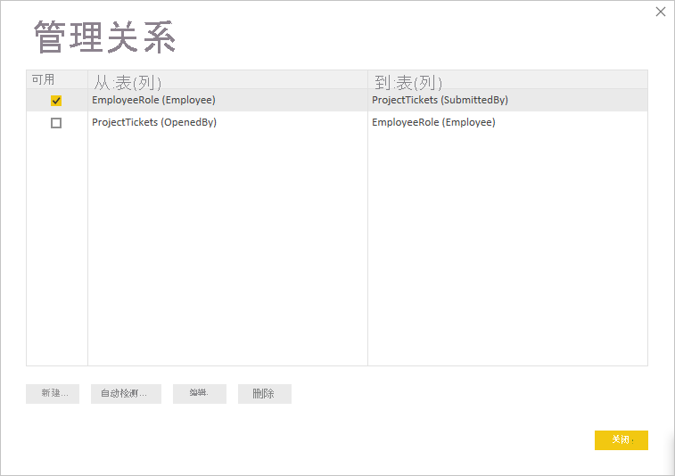

# 在 Power BI Desktop 中创建和管理关系
导入多个表时，你很可能要使用所有这些表中的数据来执行一些分析。 为准确计算结果并在报表中显示正确信息，这些表之间的关系是必需的。 Power BI Desktop 可轻松创建这些关系。 事实上，在大多数情况下，你无需执行任何操作，自动检测功能会为你执行相关操作。 但有时，你可能需要自行创建关系，或者需要对关系进行更改。 无论哪种方法，都有必要了解 Power BI Desktop 中的关系及其创建和编辑方式。

## 在加载期间自动检测
如果同时查询两个或多个表，则在加载数据时，Power BI Desktop 将尝试为你查找并创建关系。 关系选项“基数”、“交叉筛选方向”和“激活此关系”会自动设置  。 Power BI Desktop 查看表中你正在查询的列名，以确定是否存在任何潜在关系。 若存在，则将自动创建这些关系。 如果 Power BI Desktop 无法以高置信度确定存在匹配项，则不会创建关系。 但是，你仍可使用“管理关系”对话框来手动创建或编辑关系。

## 使用自动检测功能创建关系
在“主页”选项卡上，选择“管理关系”\>“自动检测”  。

## 手动创建关系
1. 在“主页”选项卡上，选择“管理关系”\>“新建”  。

2. 在“创建关系”对话框第一个表的下拉列表中，选择一个表。 选择要在关系中使用的列。

3. 在第二个表的下拉列表中，选择要在关系中使用的其他表。 选择要使用的其他列，然后选择“确定”。

   

默认情况下，Power BI Desktop 为新关系自动配置“基数”（方向）、“交叉筛选方向”和“激活此关系”选项  。 但是，你可根据需要更改这些设置。 有关详细信息，请参阅[了解其他选项](#understanding-additional-options)。

如果为该关系选择的表均不具有唯一值，则将看到以下错误：*One of the columns must have unique values*（其中一列必须具有唯一值）。 关系中至少有一个表必须具有密钥值的不同的唯一列表，该列表是对所有关系数据库技术的常见要求。 

如果遇到此错误，可采用以下方式修复：

* 使用“删除重复项”创建具有唯一值的列。 此方法的缺点是删除重复行时信息可能会丢失；而通常重复键（行）是有用的。
* 将包含不同密钥值列表的中间表添加到模型，该模型会链接到关系中的两个原始列。

有关详细信息，请参阅此 [博客文章](/archive/blogs/cansql/relationships-in-power-bi-fixing-one-of-the-columns-must-have-unique-values-error-message)。

## 编辑关系
1. 在“主页”选项卡上，选择“管理关系” 。

2. 在“管理关系”对话框中，选择关系，然后选择“编辑” 。

## 配置其他选项
创建或编辑关系时，可配置其他选项。 默认情况下，Power BI Desktop 会根据最佳推测自动配置其他选项，但每个关系的配置可能会根据列中的数据有所不同。

### 基数
“基数”选项可以具有以下设置之一：

**多对一(\*:1)** ：多对一关系是最常见的默认关系类型。 这意味着一个给定表中的列可具有一个值的多个实例，而另一个相关表（通常称为查找表）仅具有一个值的一个实例。

**一对一(1:1)** ：在一对一关系中，一个表中的列仅具有特定值的一个实例，而另一个相关表也是如此。

**一对多(1:*)** ：在一对多关系中，一个表中的列仅具有特定值的一个实例，而另一个相关表可具有一个值的多个实例。

**多对多(\*:\*)** ：借助复合模型，可以在表之间建立多对多关系，从而消除了表中对唯一值的要求。 它还删除了旧解决办法，如为建立关系而仅引入新表。 有关详细信息，请参阅[具有多对多基数的关系](./desktop-many-to-many-relationships.md)。 

有关何时更改基数的详细信息，请参阅[了解其他选项](#understanding-additional-options)。

### 交叉筛选器方向
“交叉筛选方向”选项可以具有以下设置之一：

**双向**：出于筛选目的，两个表被视为如同一个表。 “双向”设置非常适用于其周围具有多个查找表的单个表。 例如，具有部门查找表的实际销售额表。 此配置通常称为星型架构配置（一个具有多个查找表的中心表）。 但是，如果你拥有两个或多个具有查找表（部分查找表共有）的表，则“双向”设置不适合。 继续讲之前的示例，在本例中你还一个预算销售表，它记录了每个部门的目标预算。 并且，部门表格同时连接到标售表和预算表。 对于此类配置，请避免“双向”设置。

**单向**：最常用的默认方向，这意味着连接表中的筛选选项适用于将求值总和的表。 如果你在 Excel 2013 或更早的数据模型中导入了 Power Pivot，则所有关系都将具有单个方向。 

有关何时更改交叉筛选方向的详细信息，请参阅[了解其他选项](#understanding-additional-options)。

### 激活此关系
勾选后，关系会用作处于活动状态的默认关系。 如果两个表格之间存在多个关系，则 Power BI Desktop 可通过活动关系自动创建包含这两个表的可视化效果。

有关何时激活特定关系的详细信息，请参阅[了解其他选项](#understanding-additional-options)。

## 了解关系
使用一种关系将两个表连接在一起之后，就可如同单个表一样使用两个表中的数据，从而无需担忧关系详细信息，也不必在导入前将这些表合并成单个表。 在许多情况下，Power BI Desktop 可自动为你创建关系。 但如果 Power BI Desktop 无法以高置信度确定两个表之间存在关系，则不会自动创建关系。 在这种情况下，必须执行此操作。 

我们来快速演示一下，以更好地向你展示关系如何在 Power BI Desktop 进行操作。

>[!TIP]
>你可自行完成此课程： 
>
> 1. 将以下“ProjectHours”表复制到 Excel 工作表中（标题除外），选择所有单元格，然后选择“插入”\>“表”  。 
> 2. 在“创建表”对话框中，选择“确定” 。 
> 3. 选择任何表单元格，然后选择“表设计”\>“表名称”，并输入“ProjectHours” 。 
> 4. 对“CompanyProject”表执行相同的操作。 
> 5. 使用 Power BI Desktop 中的“获取数据”导入数据。 选择两个表作为数据源，然后选择“加载”。

第一个表“ProjectHours”是记录某位员工在特定项目上工作的小时数的工作单记录。 

**ProjectHours**

| **工作单** | **提交者** | **小时数** | **项目** | **提交日期** |
| ---:|:--- | ---:|:--- | ---:|
| 1001 |Brewer, Alan |22 |蓝色 |2013/1/1 |
| 1002 |Brewer, Alan |26 |红色 |2013/2/1 |
| 1003 |Ito, Shu |34 |黄色 |2012/12/4 |
| 1004 |Brewer, Alan |13 |橙色 |2012/1/2 |
| 1005 |Bowen, Eli |29 |紫色 |2013/10/1 |
| 1006 |Bento, Nuno |35 |绿色 |2013/2/1 |
| 1007 |Hamilton, David |10 |黄色 |2013/10/1 |
| 1008 |Han, Mu |28 |橙色 |2012/1/2 |
| 1009 |Ito, Shu |22 |紫色 |2013/2/1 |
| 1010 |Bowen, Eli |28 |绿色 |2013/10/1 |
| 1011 |Bowen, Eli |9 |蓝色 |2013/10/15 |

第二个表“CompanyProject”列举具有所分配优先级的项目：A、B 或 C。 

**CompanyProject**

| **项目名称** | **优先级** |
| --- | --- |
| 蓝色 |A |
| 红色 |B |
| 绿色 |C |
| 黄色 |C |
| 紫色 |B |
| 橙色 |C |

请注意，每个表都具有一个项目列。 每个列的命名略有不同，但其值看起来相同。 这很重要，我们很快将回到这一点。

我们向一个模型导入了两个表，接下来创建报表。 首先，我们要获取的是按项目优先级提交的小时数，因此选择“字段”窗格中的“Priority”和“Hours”  。

如果在报表画布中查看表，你会看到每个项目的小时数均为“256”，这也是总数。 显然，此数字不正确。 为什么？ 这是因为如果这两个表之间不存在关系，则不能由一个表中的值（“CompanyProject”表中的“Priority”）切分另一个表中的值（“Project”表中的“Hours”）来计算后者值的总数   。

因此，让我们在这两个表之间创建一个关系。

还记得两个表中具有项目名称但其值看似相似的那些列吗？ 我们将使用这两列来创建表之间的关系。

为什么是这些列？ 嗯，如果查看“ProjectHours”中的“Project”列，可看到蓝色、红色、黄色、橙色等 。 事实上，显示了多个具有相同值的行。 “Project”实际上具有多个颜色值。

如果查看“CompanyProject”表中的“ProjName”列，可看到每个项目名称仅具有一个颜色值 。 这个表中的每个颜色值都是唯一的，这一点很重要，因为我们可在这两个表之间创建关系。 此情况下，可创建多对一的关系。 在多对一的关系中，一个表中至少有一个列必须包含唯一值。 对于一些关系，还有一些其他选项，我们将在后面讨论。 现在，让我们为两个表各自的“Project”列创建关系。

### 若要创建新关系
1. 从“主页”选项卡选择“管理关系” 。
2. 在“管理关系”中，选择“新建”以打开“创建关系”对话框，可在其中选择表、列以及要用于关系的任何其他设置  。
3. 在第一个下拉列表中，选择“ProjectHours”作为第一个表，然后选择“Project”列 。 此方是关系中的 *多方*。
4. 在第二个下拉列表中，“CompanyProject”已被预先选择为第二个表。 选择“ProjName”列。 此方是关系中的 *单方*。 
5. 接受关系选项的默认设置，然后选择“确定”。

   

6. 在“管理关系”对话框中，选择“关闭” 。

为了完全展示，只需以复杂的方式创建这一关系。 只需选择“管理关系”对话框中的“自动检测”即可 。 事实上，如果两个列的名称相同，则在加载数据时，自动检测功能会自动为你创建关系。 但，其中面临的挑战是什么呢？

现在，我们再来看一下报表画布中的表。

这看起来好得多，不是吗？

按“Priority”汇总小时数时，Power BI Desktop 会查询“CompanyProject”查找表中唯一颜色值的每个实例，然后查询“ProjectHours”表中这些值的每个实例，最后计算每个唯一值的总和  。

这非常简单。 事实上，借助自动检测功能，可能甚至无需执行此操作。

## 了解其他选项
使用自动检测功能或手动创建关系时，Power BI Desktop 会基于表中的数据自动配置其他选项。 这些其他关系选项位于“创建关系”和“编辑关系”对话框的底部 。

 

Power BI 通常会自动设置这些选项，你无需进行调整；但是，在许多情况下，你可能需要自行配置这些选项。

## 自动关系更新

可以管理 Power BI 如何处理和自动调整报表和模型中的关系。 若要指定 Power BI 处理关系选项的方式，请在 Power BI Desktop 中选择“文件” > “选项和设置” > “选项”，然后在左侧窗格中选择“数据加载”   。 此时系统会显示“关系”的选项。

   

可选择和启用三个选项： 

- **在第一次加载时从数据源导入关系**：默认情况下选择此选项。 选中后，Power BI 会检查数据源中定义的关系，例如数据仓库中的外键/主键关系。 如果存在这种关系，那么在最初加载数据时，会将它们镜像复制到 Power BI 数据模型。 利用此选项，可以快速开始使用模型，而无需自行查找或定义这些关系。

- **在刷新数据时更新或删除关系**：默认情况下不选择此选项。 如果选中，则 Power BI 会在刷新数据集时检查数据源关系中的更改。 如果更改或删除这些关系，Power BI 会在其自己的数据模型中镜像这些更改，进行更新或删除以使其匹配。

   > [!WARNING]
   > 如果使用依赖于已定义关系的行级别安全性，我们建议不要选择此选项。 如果删除 RLS 设置所依赖的关系，则模型的安全性可能会降低。 

- **加载数据后自动检测新关系**：[在加载期间自动检测](#autodetect-during-load)中介绍了此选项。 

## 将来更新数据需要其他基数
通常，Power BI Desktop 可自动确定用于关系的最佳基数。 如果由于知道数据将在未来更改，而确实需要替代自动设置，则可在“基数”控件中对其进行更改。 我们来看一个需要选择其他基数的示例。

“CompanyProjectPriority”表列出了所有公司项目及其优先级。 而“ProjectBudget”表是一组其预算已获批准的项目。

**CompanyProjectPriority**

| **项目名称** | **优先级** |
| --- | --- |
| 蓝色 |A |
| 红色 |B |
| 绿色 |C |
| 黄色 |C |
| 紫色 |B |
| 橙色 |C |

**ProjectBudget**

| **已批准的项目** | **预算分配** | **分配日期** |
|:--- | ---:| ---:|
| 蓝色 |40,000 |2012/12/1 |
| 红色 |100,000 |2012/12/1 |
| 绿色 |50,000 |2012/12/1 |

如果我们在“ProjectBudget”表的“Approved Projects”列和“CompanyProjectPriority”表的“ProjectName”列之间创建关系，则 Power BI 会自动将“基数”设置为“一对一(1:1)”，并将“交叉筛选方向”设置为“双向”       。 

 

Power BI 进行这些设置的原因在于，对于 Power BI Desktop 而言，两个表的最佳组合如下所示：

| **项目名称** | **优先级** | **预算分配** | **分配日期** |
|:--- | --- | ---:| ---:|
| 蓝色 |A |40,000 |2012/12/1 |
| 红色 |B |100,000 |2012/12/1 |
| 绿色 |C |50,000 |2012/12/1 |
| 黄色 |C |  |  |
| 紫色 |B |  |  |
| 橙色 |C |  |  |

这两个表之间存在一对一的关系，原因是组合表的“ProjName”列中没有重复值。 “ProjName”列是唯一的，因为每个值仅出现一次；因此，这两个表中的行可直接合并而无任何重复项。

但是，假设你知道在下次刷新数据时，此数据会进行更改。 对于蓝色和红色项目，刷新后的“ProjectBudget”表现在具有其他行：

**ProjectBudget**

| **已批准的项目** | **预算分配** | **分配日期** |
| --- | ---:| ---:|
| 蓝色 |40,000 |2012/12/1 |
| 红色 |100,000 |2012/12/1 |
| 绿色 |50,000 |2012/12/1 |
| 蓝色 |80,000 |2013/6/1 |
| 红色 |90,000 |2013/6/1 |

 这些其他行意味着两个表的最佳组合现在如下所示： 

| **项目名称** | **优先级** | **预算分配** | **分配日期** |
| --- | --- | ---:| ---:|
| 蓝色 |A |40,000 |2012/12/1 |
| 红色 |B |100,000 |2012/12/1 |
| 绿色 |C |50,000 |2012/12/1 |
| 黄色 |C |  |  |
| 紫色 |B |  |  |
| 橙色 |C |  |  |
| 蓝色 |A |80000 |2013/6/1 |
| 红色 |B |90000 |2013/6/1 |

在这一新的组合表中，“ProjName”列具有重复值。 刷新表格后，两个原始表将不再具有一对一的关系。 在此情况下，由于我们知道将来的这些更新将导致“ProjName”列出现重复项，我们想要将“基数”设置为“多对一(\*:1)”，其中 *多方* 位于“ProjectBudget”上，而 *单方* 位于“CompanyProjectPriority”上    。

## 为一组复杂的表和关系调整交叉筛选方向
对于大多数关系，交叉筛选方向设置为“双向”。 但在某些不太常见的情况下，你可能需要将此选择设置为非默认值，例如，如果你正在从较旧版本的 Power Pivot 中导入模型，而该版本中每个关系均设置为单向。 

通过“双向”设置，Power BI Desktop 可将连接表的所有方面均视为如同是一个表。 然而在某些情况下，Power BI Desktop 无法将关系的交叉筛选方向设置为“双向”，同时还会保留一组可用于报表且语义不明的默认值。 如果关系的交叉筛选方向未设置为“双向”，这通常是因为它会造成多义性。 如果默认的交叉筛选设置不适用于你，请尝试将其设置为特定表或“双向”。

单向交叉筛选适用于很多情况。 事实上，如果你在 Excel 2013 或更早版本中导入 Power Pivot 中的模型，则所有关系均将设置为单向。 单向是指连接表中的筛选选项适用于将进行聚合操作的表格。 有时，交叉筛选可能有点难以理解，因此我们来看一个示例。

使用单向交叉筛选时，如果你创建一个可汇总项目小时数的报表，则可选择按“CompanyProject”表及其“Priority”列或“CompanyEmployee”表及其“City”列进行汇总（或筛选）   。 但如果你想计算每个项目的员工数（不太常见的问题），则不适用。 你将获取完全相同的一列值。 在下面的示例中，两个关系的交叉筛选方向均设置为单向：指向“ProjectHours”表。 在“值”Well 中，“Project”字段设置为“Count”  ：

 

筛选器规范将从“CompanyProject”流向“ProjectHours”（如下图所示），但不会抵达“CompanyEmployee”  。 

 

但若将交叉筛选方向设置为“双向”，则会起作用。 “双向”设置使筛选器规范可流到“CompanyEmployee” 。

 

通过将交叉筛选方向设置为“双向”，报表现可正确显示：

 

双向交叉筛选非常适合上述模式等表格关系模式。 此架构通常称为星型架构，如下所示：

 

交叉筛选不太适合数据库中常有的更常规模式，比如以下关系图中的模式：

 

如果你具有与此类似的表格模式，则交叉筛选会创建一组语义不明的关系。 例如，如果你求取 TableX 中某个字段的总和，然后选择按 TableY 中的某个字段进行筛选，则不清楚筛选器应如何流动，是通过顶部表还是底部表进行流动。 这种模式的一个常见示例是 TableX 为具有实际销售额数据的销售表，而 TableY 具有预算数据， 则中间的表格是这两个表所用的查找表，如部门或地区。 

和活动/非活动关系一样，如果会导致报表的多义性，则 Power BI Desktop 不允许将关系设置为“双向”。 可通过多种不同方式来处理这种情况。 以下为最常见的两种方式：

* 删除关系或将其标记为“非活动”，以减少多义性。 然后，可能就能够将关系的交叉筛选设置为“双向”。
* 导入表格两次（第二次使用其他名称）以消除循环。 这样做会产生类似于星型架构的关系模式。 借助星型架构，所有关系均可设置为“双向”。

## 错误的活动关系
Power BI Desktop 自动创建关系时，有时会在两个表之间遇到多个关系。 发生此情况时，仅其中一个关系会设置为“活动”。 活动关系用作默认关系，因此在从两个不同的表中选择字段时，Power BI Desktop 可自动为你创建可视化效果。 但在某些情况下，自动选定的关系可能是错误的。 使用“管理关系”对话框将关系设置为“活动”或“非活动”，或者可在“编辑关系”对话框中设置活动关系 。 

为了确保存在默认关系，Power BI Desktop 仅允许两个表在给定时间存在单个活动关系。 因此，你必须先将当前关系设置为“非活动”，然后才能将想要的关系设置为“活动”。

我们来看一个示例。 第一个表是“ProjectTickets”，第二个表是“EmployeeRole” 。

**ProjectTickets**

| **工作单** | **开具者** | **提交者** | **小时数** | **项目** | **提交日期** |
| ---:|:--- |:--- | ---:|:--- | ---:|
| 1001 |Perham, Tom |Brewer, Alan |22 |蓝色 |2013/1/1 |
| 1002 |Roman, Daniel |Brewer, Alan |26 |红色 |2013/2/1 |
| 1003 |Roth, Daniel |Ito, Shu |34 |黄色 |2012/12/4 |
| 1004 |Perham, Tom |Brewer, Alan |13 |橙色 |2012/1/2 |
| 1005 |Roman, Daniel |Bowen, Eli |29 |紫色 |2013/10/1 |
| 1006 |Roth, Daniel |Bento, Nuno |35 |绿色 |2013/2/1 |
| 1007 |Roth, Daniel |Hamilton, David |10 |黄色 |2013/10/1 |
| 1008 |Perham, Tom |Han, Mu |28 |橙色 |2012/1/2 |
| 1009 |Roman, Daniel |Ito, Shu |22 |紫色 |2013/2/1 |
| 1010 |Roth, Daniel |Bowen, Eli |28 |绿色 |2013/10/1 |
| 1011 |Perham, Tom |Bowen, Eli |9 |蓝色 |2013/10/15 |

**EmployeeRole**

| **员工** | **角色** |
| --- | --- |
| Bento, Nuno |项目经理 |
| Bowen, Eli |项目主管 |
| Brewer, Alan |项目经理 |
| Hamilton, David |项目主管 |
| Han, Mu |项目主管 |
| Ito, Shu |项目主管 |
| Perham, Tom |项目发起人 |
| Roman, Daniel |项目发起人 |
| Roth, Daniel |项目发起人 |

实际上，此处存在两个关系：
- 在“EmployeeRole”表中的“Employee”和“ProjectTickets”表中的“SubmittedBy”之间   。
- 在“ProjectTickets”表中的“OpenedBy”和“EmployeeRole”表中的“Employee”之间   。

 

如果我们将两个关系都添加到模型中（首先是“OpenedBy”），则“管理关系”对话框将显示“OpenedBy”处于活动状态  ：

 

现在，如果创建一个报表，且该报表在报表画布的表格可视化效果中使用“EmployeeRole”中的“Role”和“Employee”字段，以及“ProjectTickets”中的“Hours”字段，则只会显示项目发起人，因为他们是唯一开具项目单的人员    。

 

我们可更改活动关系并获取“SubmittedBy”，而不是“OpenedBy” 。 在“管理关系”中，取消勾选“ProjectTickets(OpenedBy)”到“EmployeeRole(Employee)”的关系，然后勾选“EmployeeRole(Employee)”到“Project Tickets(SubmittedBy)”的关系    。

## 在“关系”视图中查看所有关系
有时，模型具有多个表格，且各表格之间存在复杂关系。 Power BI Desktop 中的“关系”视图可显示模型中的所有关系及其方向和基数，是一种易于理解且可自定义的关系图。 

若要了解详细信息，请参阅[使用 Power BI Desktop 中的关系视图](desktop-relationship-view.md)。