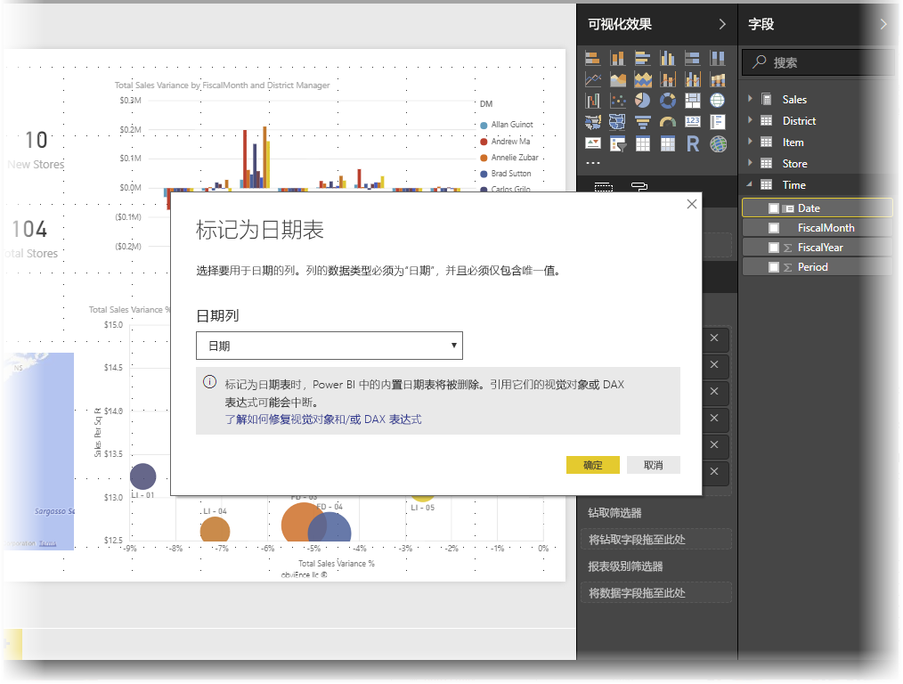
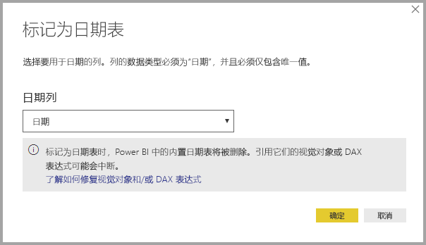
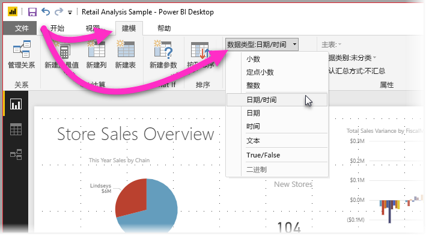

# 在 Power BI Desktop 中设置和使用日期表

Power BI Desktop 在后台工作，自动识别表示日期的列，然后代表用户为模型创建日期层次结构和其他启用元数据。 然后，用户可以在创建报表功能（如视觉对象、表、快速度量值、切片器等）时使用这些内置层次结构。 Power BI Desktop 通过代表用户创建隐藏表来实现此操作，然后用户可以将表用于报表和 DAX 表达式。

有关此自动行为的详细信息，请阅读 [Power BI Desktop 中的自动日期/时间](desktop-auto-date-time.md)一文。

许多数据分析师更倾向于创建其自己的日期表，这样做也可以。 在 Power BI Desktop 中，可以指定希望模型将其用作日期表的表，接着使用该表的日期数据创建与日期相关的视觉对象、表、快速度量值等。 指定自己的日期表时，可以控制在模型中创建的日期层次结构，并在快速度量值和使用模型日期表的其他操作中使用它们。

## 设置自己的日期表

若要设置日期表，请在“字段”窗格中选择要用作日期表的表，然后右键单击该表，在出现的菜单中选择“标记为日期表”>“标记为日期表”，如下图所示。

还可以选择该表，然后从“建模”功能区中选择“标记为日期表”，如此处所示。

指定自己的日期表时，Power BI Desktop 会对该列及其数据执行以下验证，以确保数据：

* 包含唯一值
* 不包含任何 null 值
* 包含连续的日期值（从开头到末尾）
* 如果它是日期/时间数据类型，则它在每个值间具有相同的时间戳

创建自己的日期表有两种可用方案，每种都是合理的方法：

* 第一种方案在使用规范或基本日期表和层次结构时适用。 这是用户的数据中符合前面所述的日期表验证条件的表。 

* 第二种方案用于将来自 Analysis Services 的表与想要用作日期表的 dim date 字段结合使用的情况。 

指定日期表后，可以选择将该表中的哪一列作为日期列。 可以通过选择“字段”窗格中的表指定要使用的列，然后右键单击该表并选择“标记为日期表”>“日期表设置”。 此时将出现以下窗口，可以从窗口的下拉框中选择要用作日期表的列。

请务必注意，用户在指定自己的日期表时，Power BI Desktop 不会自动创建将代表用户构建到模型中的层次结构。 如果以后取消选择日期表（并且不再具有手动设置的日期表），Power BI Desktop 将针对表中的日期列为用户重新创建自动创建的内置日期表。

另请务必注意，在将表标记为日期表时，将删除 Power BI Desktop 创建的内置（自动创建的）日期表，并且之前基于这些内置表创建的任何视觉对象或 DAX 表达式将不再正常工作。 

## 将日期表标记为相应的数据类型

指定自己的日期表时，需要确保数据类型已正确设置。 用户想要将“数据类型”设置为“日期/时间”或“日期”。 为此，可执行以下步骤：

1. 从“字段”窗格中选择日期表，并根据需要将其展开，然后选择要用作日期的列。
   
     

2. 在“建模”选项卡上，选择“数据类型:”，然后单击下拉箭头以显示可用的数据类型。

    

3. 指定列的数据类型。 

## 后续步骤

有关本文的详细信息，请参阅以下资源：

* [Power BI Desktop 中的自动日期/时间](desktop-auto-date-time.md)
* [在 Power BI Desktop 中创建日期表](../guidance/model-date-tables.md)
* [Power BI Desktop 中的数据类型](../connect-data/desktop-data-types.md)
* 是否有任何问题? [尝试咨询 Power BI 社区](https://community.powerbi.com/)
* 建议？ [提出改进 Power BI 的想法](https://ideas.powerbi.com/)
