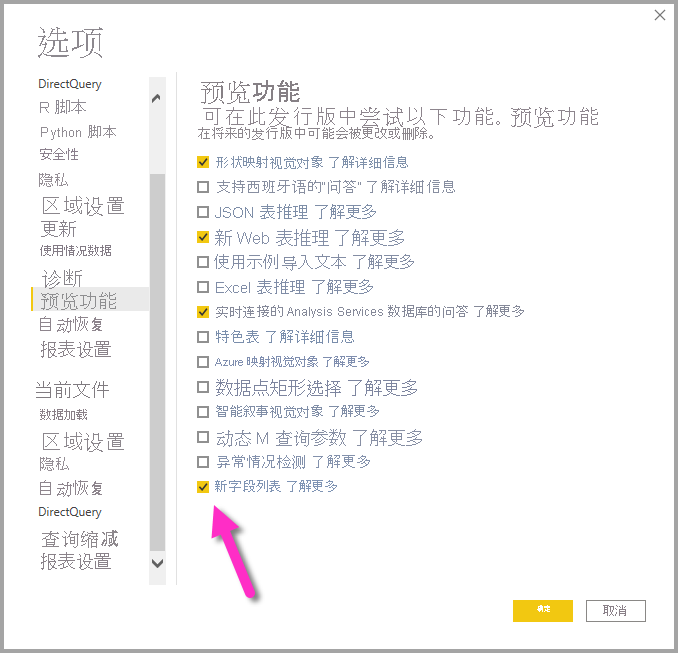
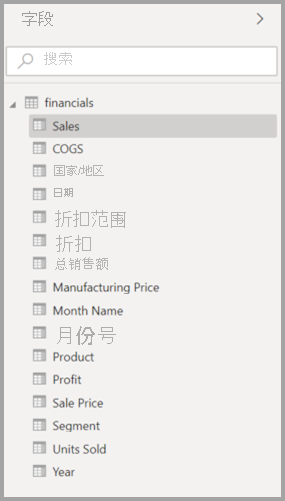
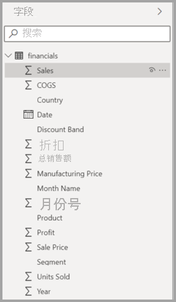
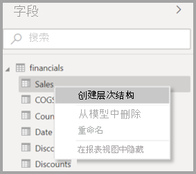
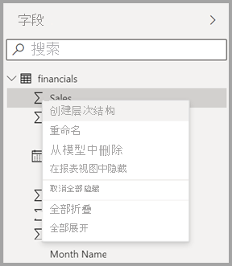
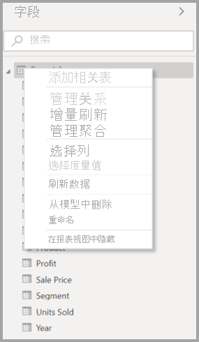
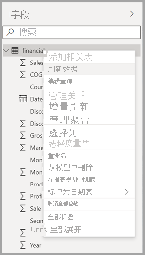
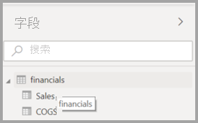
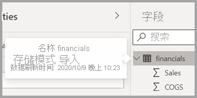

# 使用 Power BI Desktop 中的“字段”列表（预览版）

从 2020 年 11 月的更新开始，我们将统一 Power BI Desktop 的模型视图、数据视图和报表视图中的“字段”列表。 统一这些视图可实现所有视图中的功能和用户界面 (UI) 的一致性，并解决客户反馈的问题。

你将看到的视图中的更改包括以下内容：

* 图标
* 搜索功能
* 上下文菜单项
* 类似的拖放行为
* 工具提示
* 辅助功能改进

目的是提高 Power BI Desktop 可用性。 这些更改只会对典型数据工作流产生最小程度的影响。

## 启用新字段列表（预览版）

将首先为模型视图启用统一的字段列表，随后会为其他视图启用。 要启用统一字段视图，请在 Power BI Desktop 中导航到“文件”>“选项和设置”>“选项”，然后从左窗格选择“预览功能” 。 在“预览功能”部分，选中“新字段列表”旁的复选框。

系统将提示你重启 Power BI Desktop 以使选择生效。

## 字段列表更改

下表显示了字段列表更新。 

|原始字段列表（模型视图）  | 新字段列表（模型视图）  |
|:---------:|:---------:|
|Original  |**新建** |
|图标和 UI       ||
|     |    |
|上下文菜单 - 字段       ||
|     |    |
|上下文菜单 - 表       ||
|     |    |
|**工具提示**       ||
|     |    |

还有新的字段列表图标。 下表显示了原始图标和对应的新图标，并提供了每个图标的简要说明。 

|原始图标  |“新建”图标  |说明  |
|:---------:|:---------:|:---------|
|     |           |“字段”列表中的文件夹         |
|     |         |数值字段：例如，数值字段是可以求和或求平均值的聚合。 聚合随数据一起导入，并在报表所基于的数据模型中定义。 有关详细信息，请参阅 [Power BI 报表中的聚合函数](../create-reports/service-aggregates.md)。         |
|     |         |非数值数据类型的计算列：使用数据分析表达式 (DAX) 公式创建的一个新的非数值列，该公式定义该列的值。 详细了解[计算列](desktop-calculated-columns.md)。        |
|     |          |数值计算列：使用数据分析表达式 (DAX) 公式创建新的列，该公式定义该列的值。 详细了解[计算列](desktop-calculated-columns.md)。         |
|     |          |度量值：度量值有自己的硬编码公式。 报表查看者不能更改此计算，例如，如果该计算是求和，则只能进行求和。 值不会存储在列中。 它们是动态计算的，具体取决于它们在视觉对象中的位置。 有关详细信息，请参阅[了解度量值](desktop-measures.md)。         |
|     |         |度量值组。         |
|     |         |KPI：它是一个视觉提示，用于传达针对可度量目标已完成的进度。 详细了解[关键绩效指标 (KPI)](../visuals/power-bi-visualization-kpi.md) 视觉对象。         |
|     |           |字段的层次结构：选择箭头以查看构成层次结构的字段。 有关详细信息，请观看有关[创建和使用层次结构](https://www.youtube.com/watch?v=q8WDUAiTGeU)的 YouTube Power BI 视频。         |
|     |         |地理数据：这些字段可用于创建地图可视化效果。         |
|     |          |标识字段：具有此图标的字段是“唯一字段”，将被设置为显示全部值，即使它们具有重复项也是如此。 例如，数据中可能存在两个名为 Robin Smith 的不同人员记录，每一条都将被视为唯一。 它们不会合成一条。         |
|     |          |参数：设置参数以使报表和数据模型的某些部分（例如查询筛选器、数据源引用、度量值定义等）依赖于一个或多个参数值。 有关详细信息，请参阅这篇有关[查询参数](https://powerbi.microsoft.com/blog/deep-dive-into-query-parameters-and-power-bi-templates/)的 Power BI 博客文章。         |
|     |         |带有内置日期表的日历日期字段。         |
|     |          |计算表：基于已加载到模型中的数据使用数据分析表达式 (DAX) 公式创建的表。 这类表最适合用于中间计算，且最好将其存储为模型的一部分。         |
|     |         |警告:带有错误的计算字段。 例如，DAX 表达式的语法可能不正确。         |
|     |         |组：此列中的值基于：使用组和箱功能对其他列中的值进行分组。 你可以阅读如何[使用分组和装箱](../create-reports/desktop-grouping-and-binning.md)。         |
| 无原始图标    |          |更改检测度量值：当你配置页面以进行自动页面刷新时，可以配置[更改检测度量值](../create-reports/desktop-grouping-and-binning.md)，通过查询该度量值可确定是否应更新页面的其余视觉对象。         |

## 后续步骤

你可能还会对以下文章感兴趣：

* [创建 Power BI Desktop 中的计算列](desktop-calculated-columns.md)
* [在 Power BI Desktop 中使用分组和装箱](../create-reports/desktop-grouping-and-binning.md)
* [在 Power BI Desktop 报表中使用网格线和对齐网格](../create-reports/desktop-gridlines-snap-to-grid.md)

