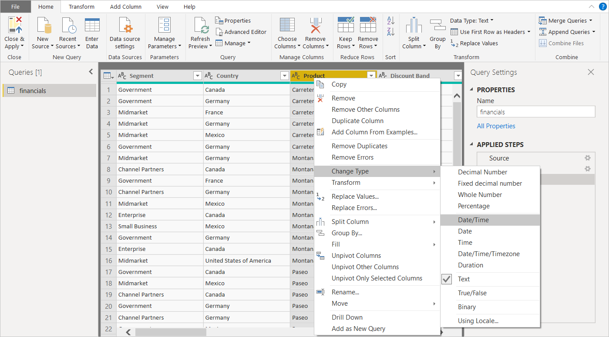

# Power BI Desktop 中的查询概述
借助 Power BI Desktop，可以连接到世界上的数据，创建具有吸引力的基础报表，与依赖你的工作、扩展自身商业智能工作的其他人共享你的工作。

Power BI Desktop 具有三种视图：

* **报表**视图 - 此处你可使用创建的查询来构建具有吸引力的可视化效果，它们按照你所希望的方式进行排列，具有多个页面，你可与他人共享
* **数据**视图 - 以数据模型格式查看报表中的数据，其中你可添加度量值、创建新列和管理关系
* **关系**视图 - 获取已在数据模型中建立的关系的图形表示，并根据需要管理和修改它们。

选择 Power BI Desktop 左侧三个图标之一即可访问这些视图。 在下图中，选择了“报表”视图，因为图标旁显示黄色带区。  

 
Power BI Desktop 还附带 Power Query 编辑器。 使用 Power Query 编辑器可连接到一个或多个数据源，调整和转换数据以满足自己的需要，然后将该模型加载到 Power BI Desktop。

本文档概述了处理 Power Query 编辑器中数据的相关内容，不过有更多信息需要了解。 在本文档末尾，你将找到有关受支持数据类型的详细指南的链接。 你还将找到有关连接到数据、调整数据、创建关系以及如何入门的指南。

但首先让我们了解一下 Power Query 编辑器。

## Power Query 编辑器
若要访问 Power Query 编辑器，请从 Power BI Desktop“开始”选项卡选择“编辑查询”。  

没有数据连接时，Power Query 编辑器显示为空白窗格，准备处理数据。  

加载查询后，Power Query 编辑器视图将变得更加有趣。 如果我们连接到以下 Web 数据源，Power Query 编辑器将加载有关数据的信息，随后就可以开始调整数据：

[*https://www.bankrate.com/retirement/best-and-worst-states-for-retirement/*](https://www.bankrate.com/retirement/best-and-worst-states-for-retirement/)

下面是建立数据连接后 Power Query 编辑器的显示方式：

1. 在功能区中，许多按钮当前处于活动状态，以与查询中的数据进行交互。
2. 在左窗格中，列出了查询，可供你选择、查看和调整。
3. 在中央窗格中，将显示已选择查询中的数据，可供你调整。
4. 随即将出现“查询设置”窗格，其中列出了查询的属性和已应用的步骤。  
   
   

我们将逐一了解以下四个区域：功能区、“查询”窗格、“数据”视图和“查询设置”窗格。

## 查询功能区
Power Query 编辑器中的功能区由四个选项卡组成：“主页”、“转换”、“添加列”和“视图”。

“主页”选项卡包含常见查询任务。

若要连接到数据并开始查询构建过程，请选择“新建源”。 将出现一个菜单，提供最常见的数据源。  

有关可用数据源的详细信息，请参阅**数据源**。 有关连接到数据的信息，包括示例和步骤，请参阅**连接到数据**。

“转换”选项卡提供对常见数据转换任务的访问，例如：

* 添加或删除列
* 更改数据类型 
* 拆分列 
* 其他数据驱动任务

有关转换数据的详细信息（包括示例），请参阅[教程：在 Power BI Desktop 中调整和合并数据](https://docs.microsoft.com/power-bi/desktop-shape-and-combine-data)。

**添加列**选项卡提供了与添加列、设置列数据格式和添加自定义列相关联的其他任务。 下图显示**添加列**选项卡。  

功能区上的**视图**选项卡用于切换显示的窗格或窗口。 它还用于显示高级编辑器。 下图显示**视图**选项卡。  

很多从功能区上进行使用的任务还可通过在中央窗格右键单击列或其他数据进行使用，知道这点很有帮助。

## 左（查询）窗格
左窗格（或“查询”窗格）显示活动查询数以及查询的名称。 当从左窗格选择查询时，其数据显示在中央窗格，可以在此调整并转换数据以满足需要。 下图显示包含一个查询的左窗格。  

## 中央（数据）窗格
在中央窗格（或“数据”窗格）中，将显示所选查询中的数据。 大部分“查询”视图工作在此窗格中完成。

下图显示了早前建立的 Web 数据连接。 “产品”列处于选中状态，右键单击其标题可显示可用菜单项。 请注意，其中许多用右击菜单项与功能区选项卡中的按钮相同。  

当选择右击菜单项（或功能区按钮）时，查询将对数据应用该步骤。 还会将步骤保存为查询本身的一部分。 这些步骤按顺序记录在**查询设置**窗格，如下一节中所述。  

## 右（“查询设置”）窗格
右窗格（“查询设置”窗格）将显示与查询关联的所有步骤。 例如，下图中，**查询设置**窗格的**所应用步骤**部分反映了我们刚刚更改了**总体评分**列的类型。

当其他调整步骤应用于该查询时，它们将在“应用的步骤”部分中反映。

非常重要的一点是，基础数据并未更改。 相反，Power Query 编辑器会调整其数据视图。 它还会基于 Power Query 编辑器经过调整和修改的数据视图，来调整与基础数据的任何交互的视图。

在**查询设置**窗格中，可以根据你的需要重命名步骤、删除步骤，或对步骤重新排序。 若要执行此操作，请右键单击**所应用步骤**部分中的步骤，然后从出现的菜单中选择。 所有查询步骤将按照“所应用步骤”窗格中显示的顺序执行。

## 高级编辑器
利用“高级编辑器”可以查看 Power Query 编辑器通过每个步骤创建的代码。 它还使你可以创建自己的形成代码。 若要启动高级编辑器，从功能区中选择**视图**，然后选择**高级编辑器**。 此时，将会显示包含现有查询代码的窗口。  

可以直接编辑**高级编辑器** 窗口中的代码。 若要关闭该窗口，请选择**完成**或**取消**按钮。  

## 保存工作
在查询已准备就绪时，从 Power Query 编辑器的“文件”菜单中选择“关闭并应用”。 此操作会应用更改并关闭编辑器。  

随着进度推进，Power BI Desktop 提供了一个对话框显示其状态。  

准备就绪后，Power BI Desktop 可以将工作保存为 .pbix 文件的形式。

若要保存工作，请选择“文件”\>“保存”（或“文件”\>“另存为”），如下图所示。  

## 后续步骤
Power BI Desktop 可用于执行多种操作。 有关其功能的详细信息，请参阅下列资源：

* [什么是 Power BI Desktop？](../fundamentals/desktop-what-is-desktop.md)
* [Power BI Desktop 中的数据源](../connect-data/desktop-data-sources.md)
* [连接到 Power BI Desktop 中的数据](../connect-data/desktop-connect-to-data.md)
* [教程：使用 Power BI Desktop 调整和合并数据](../connect-data/desktop-shape-and-combine-data.md)
* [在 Power BI Desktop 中执行常见查询任务](desktop-common-query-tasks.md)   
