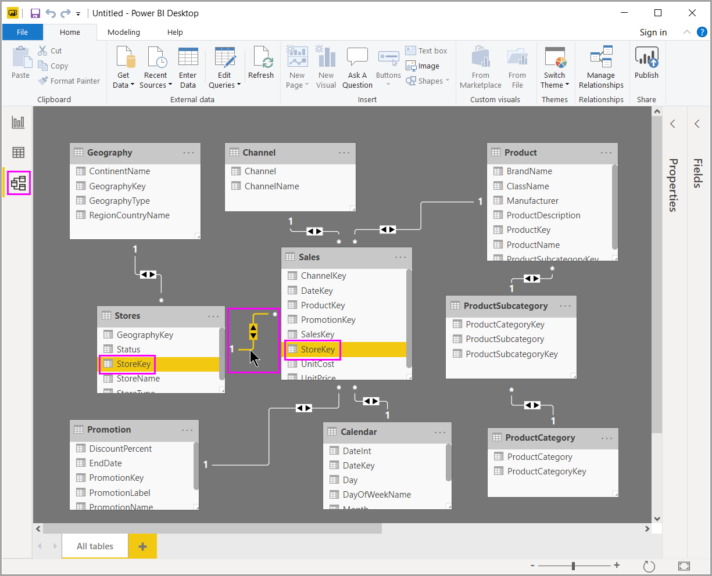

# 使用 Power BI Desktop 中的模型视图

模型视图显示模型中的所有表、列和关系  。 当模型中包含许多关系十分复杂的表时，此视图尤其有用。

选择靠近窗口边缘的“模型”图标，查看现有模型的视图  。 将光标悬停在关系行上方以显示所使用的列。

在上图中，“商店”表中有一个 StoreKey 列，该列与“销售”表中的 StoreKey 列相关     。 这两个表具有多对一 ( *:1) 关系*\*。 行中间的箭头显示了筛选器上下文流的方向。 双箭头表示交叉筛选器方向均设置为“双向”  。

你可以双击关系以在“编辑关系”  对话框中将其打开。 有关关系的详细信息，请参阅[在 Power BI Desktop 中创建和管理关系](desktop-create-and-manage-relationships.md)。
