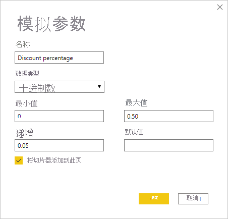
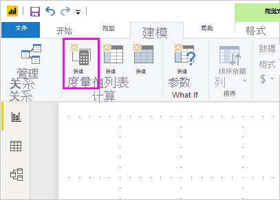

# 创建和使用 What-if 参数可视化 Power BI Desktop 中的变量

从 Power BI Desktop 2018 年 8 月版开始，用户可以为报表创建模拟变量、以切片器的形式与变量交互，以及可视化并量化报表中的不同键值   。

可以在 Power BI Desktop 中的“建模”  选项卡上找到“模拟”  参数。 选择参数时，会显示一个对话框，可在其中配置该参数。

## 创建模拟参数

若要创建模拟参数，请在 Power BI Desktop 中的“建模”  选项卡上选择“新建参数”  。 在下图中，我们已创建名为“折扣率”  的参数，并将其数据类型设置为十进制数字  。 最小值  是 0。 最大值  是 0.50 (50%)。 我们还将增量  设置为 0.05 或 5%。 这就是在报表中交互时将会调整的参数量。

> [!NOTE]
> 对于十进制数字，请务必在值前面加上零，例如，0.50 而不是 .50。 否则，该数字不会得到验证，且“确定”  按钮将不可选。
> 
> 

为方便起见，“将切片器添加到此页”  复选框会将切片器和模拟参数自动放置在当前报表页上。

除了创建参数之外，创建模拟参数还会创建一个度量值，可以用于直观显示模拟参数的当前值。

重要且有用的注意事项是，一旦创建了模拟参数，参数和度量值便会成为模型的一部分。 因此，它们可在整个报表上使用，并可用于其他报表页。 而且由于它们是模型的一部分，因此可以从报表页中删除切片器。 如果需要恢复，只需从“字段”  列表中获取模拟参数并将它拖动到画布上，然后将视觉对象更改为切片器。

## 使用模拟参数

让我们创建使用模拟参数的简单示例。 我们在上一节中创建了模拟参数。 现在会通过创建使用滑块调整值的新度量值来使用它。

新的度量值只是应用了折扣率的总销售额。 可以创建复杂且有趣的度量值，让报表的使用者可视化模拟参数的变量。 例如，可以创建一个报表，让销售人员看到在达到特定销售目标或销售百分比时他们的薪酬，或看到销售额增加对更优厚折扣力度的影响。

在公式栏中键入度量值公式，并将公式命名为“折后销售额”  。

然后，我们在轴上创建一个具有 OrderDate  的列视觉对象，并将 SalesAmount  和刚创建的度量值“折后销售额”  作为值。

然后，当移动滑块时，我们会看到“折后销售额”  列反映已折扣的销售额。

以上是其中包含的全部内容。 可以在各种情况下使用模拟参数。 这些参数使报表的使用者可以与在报表中创建的不同方案进行交互。
