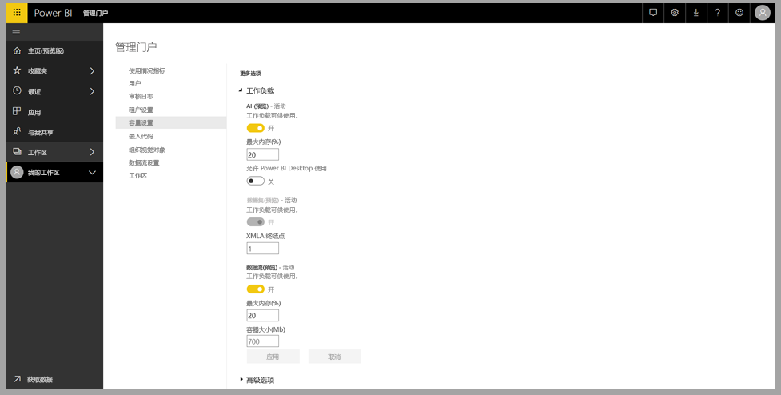
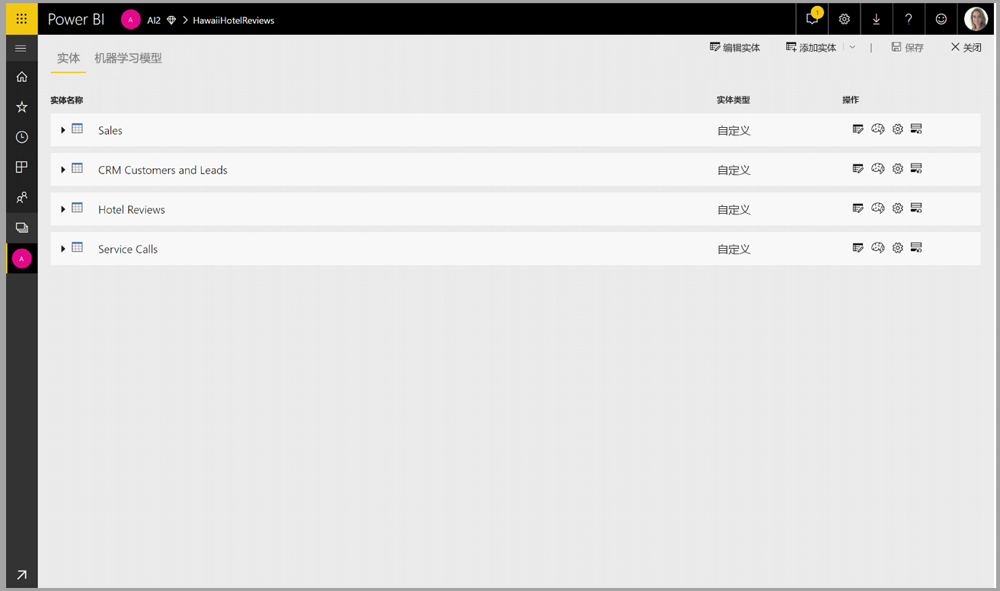
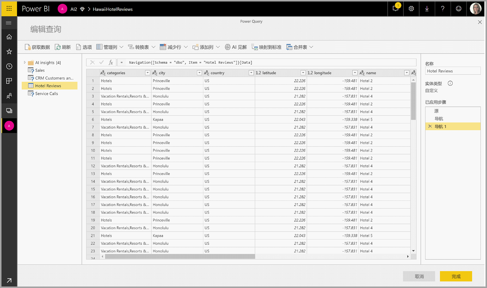
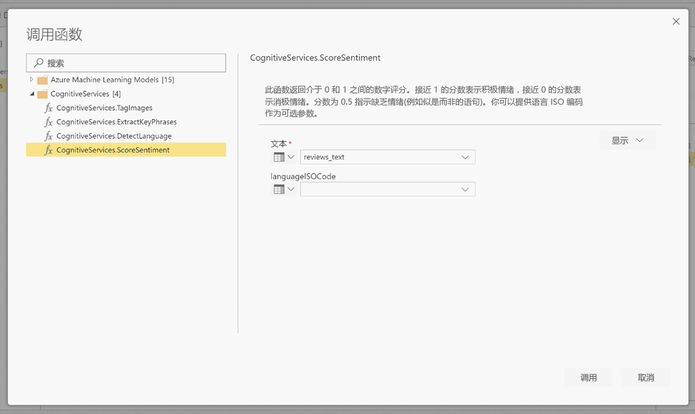
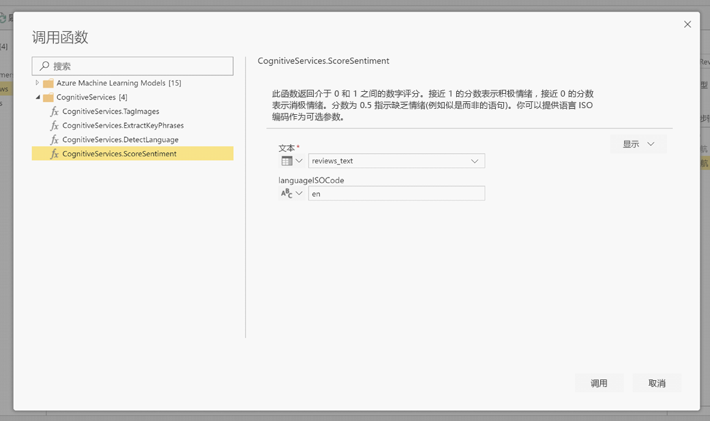
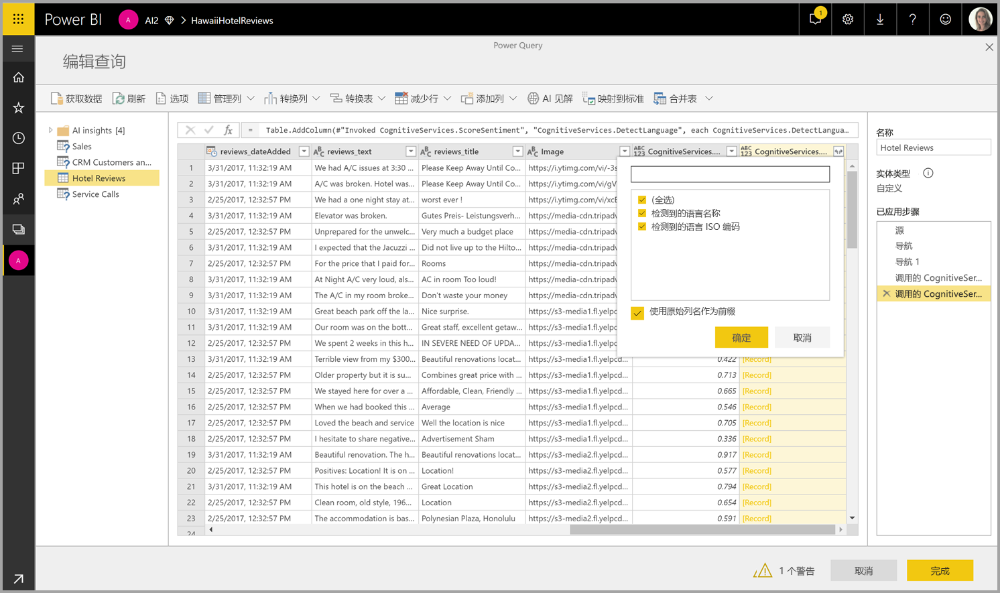

# Power BI 中的认知服务 

借助 Power BI 中的认知服务，可以在数据流自助服务数据准备中应用 [Azure 认知服务](https://azure.microsoft.com/services/cognitive-services/)中的不同算法来丰富数据。

目前支持的服务包括[情绪分析](https://docs.microsoft.com/azure/cognitive-services/text-analytics/how-tos/text-analytics-how-to-sentiment-analysis)、[关键短语提取](https://docs.microsoft.com/azure/cognitive-services/text-analytics/how-tos/text-analytics-how-to-keyword-extraction)、[语言检测](https://docs.microsoft.com/azure/cognitive-services/text-analytics/how-tos/text-analytics-how-to-language-detection)和[图像标记](https://docs.microsoft.com/azure/cognitive-services/computer-vision/concept-tagging-images)。 转换在 Power BI 服务上执行，无需 Azure 认知服务订阅。 此功能需要 Power BI Premium。

## **启用 AI 功能**

高级容量节点 EM2、A2 或 P1 及更高版本均支持认知服务。 容量上的单独 AI 工作负载用于运行认知服务。 公共预览期间（2019 年 6 月之前），默认情况下禁用此工作负载。 在 Power BI 中使用认知服务之前，需要在管理门户的容量设置中启用 AI 工作负载。 可以在工作负载部分启用 AI 工作负载，并定义希望此工作负载使用的最大内存量。 建议的内存限制为 20%。 超过此限制会导致查询速度变慢。

## **Power BI 中的认知服务入门**

[数据流自助服务数据准备](https://powerbi.microsoft.com/blog/introducing-power-bi-data-prep-wtih-dataflows/)中包含认知服务转换。 若要使用认知服务丰富数据，请首先编辑数据流。

选择 Power Query 编辑器顶部功能区中的“AI 见解”按钮  。

在弹出窗口中，选择要使用的函数和要转换的数据。 在本例中，我会对包含评论文本的列的情绪进行评分。

Cultureinfo 是一个可选输入，用于指定文本的语言  。 此字段中应输入 ISO 代码。 可以使用一个列作为 Cultureinfo 的输入，也可以使用静态字段。 在本例中，将整个列的语言指定为“英语 (en)”。 如果将此字段留空，Power BI 会在应用该函数之前自动检测语言。 接下来，选择“调用”  。

调用该函数后，结果将作为新列添加到表中。 还会添加转换作为查询中的一个应用步骤。

如果函数返回多个输出字段，则调用该函数会添加一个新列，其中包含多个输出字段的记录。

使用展开选项将一个或两个值作为列添加到数据中。

## **可用函数**

本部分介绍 Power BI 中认知服务的可用函数。

### **检测语言**

语言检测函数评估文本输入，并为每个字段返回语言名称和 ISO 标识符。 此函数对于收集未知语言的任意文本的数据列很有用。 该函数应以文本格式的数据作为输入。

文本分析可识别多达 120 种语言。 有关详细信息，请参阅[支持的语言](https://docs.microsoft.com/azure/cognitive-services/text-analytics/text-analytics-supported-languages)。

### **提取关键短语**

关键短语提取函数评估非结构化的文本，并为每个文本字段返回一个关键短语列表  。 该函数需要一个文本字段作为输入，并接受 Cultureinfo 的可选输入  。 （请参阅本文前面的“入门”部分）  。

提供更大的文本块进行处理时，最适合使用关键短语提取。 这与情绪分析相反，情绪分析处理较小文本块的效果更好。 若要使两个操作都获得最佳结果，请考虑相应地重构输入。

### **情绪评分**

情绪评分函数计算文本输入，并为每个文档返回一个范围从 0（消极）到 1（积极）的情绪分数  。 此函数对于检测社交媒体、客户评论和论坛中的积极和消极情绪非常有用。

文本分析使用机器学习分类算法生成 0 到 1 之间的情绪分数。 接近 1 的分数表示积极情绪，接近 0 的分数表示消极情绪。 该模型经过预先训练，包含具有情绪关联的大量文本。 目前，无法提供你自己的训练数据。 该模型在文本分析过程中使用了多种技术，包括文本处理、词性分析、字词放置和字词关联。 有关算法的详细信息，请参阅[文本分析简介](https://blogs.technet.microsoft.com/machinelearning/2015/04/08/introducing-text-analytics-in-the-azure-ml-marketplace/)。

对整个输入字段执行情绪分析，而不是提取文本中特定实体的情绪。 事实上，当文档包含一个或两个句子而不是大块文本时，评分准确性会呈现提升趋势。 在客观性评估阶段，模型确定某个输入字段整体上是客观的还是包含情绪。 总体客观的输入字段不会进入到情绪检测短语阶段，结果是 0.50 分，无需进一步处理。 对于在管道中继续处理的输入字段，下一阶段将生成一个高于或低于 0.50 的分数，具体取决于在输入字段中检测到的情绪程度。

目前，情绪分析支持英语、德语、西班牙语和法语这几种语言。 其他语言均为预览版。 有关详细信息，请参阅[支持的语言](https://docs.microsoft.com/azure/cognitive-services/text-analytics/text-analytics-supported-languages)。

### **标记图像**

标记图像函数基于超过 2000 个可识别物体、生物、风景和动作返回标记  。 如果标记不明确或不常见，输出会提供“提示”，以便在已知环境的上下文中阐明标记的含义。 标记不是作为分类法组织的，并且不存在继承层次结构。 内容标记的集合构成图像“说明”的基础，图像“说明”显示为完整句子格式的人类可读语言。

上传图像或指定图像 URL 后，计算机视觉算法会根据图像中标识的物体、生物和动作输出标记。 标记不局限于主要主题（例如前景中的人物），它还可以包括背景（室内或室外）、家具、工具、植物、动物、配饰，小配件等元素。

此函数需要图像 URL 或 Base 64 字段作为输入。 目前，图像标记支持英语、西班牙语、日语、葡萄牙语和简体中文。 有关详细信息，请参阅[支持的语言](https://docs.microsoft.com/rest/api/cognitiveservices/computervision/tagimage/tagimage#uri-parameters)。

## 后续步骤

本文简要介绍了如何将认知服务与 Power BI 服务一起使用。 以下文章也应该会非常有趣且实用。 

* [教程：在 Power BI 中调用机器学习工作室（经典）模型](../connect-data/service-tutorial-invoke-machine-learning-model.md)
* [Power BI 中的 Azure 机器学习集成](service-machine-learning-integration.md)
* [教程：在 Power BI 中使用认知服务](../connect-data/service-tutorial-use-cognitive-services.md)

有关数据流的详细信息，可以阅读以下这些文章：
* [在 Power BI 中创建和使用数据流](service-dataflows-create-use.md)
* [在 Power BI Premium 上使用计算实体](service-dataflows-computed-entities-premium.md)
* [将数据流与本地数据源配合使用](service-dataflows-on-premises-gateways.md)
* [Power BI 数据流的开发人员资源](service-dataflows-developer-resources.md)
* [数据流和 Azure Data Lake 集成（预览）](service-dataflows-azure-data-lake-integration.md)