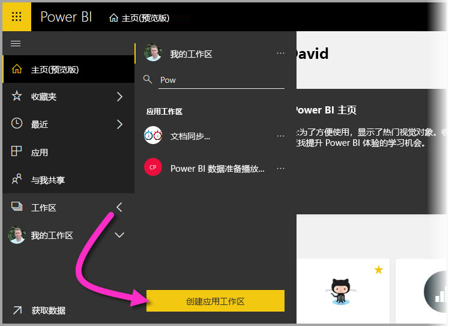
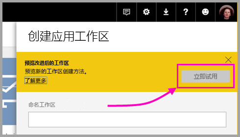
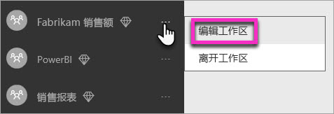
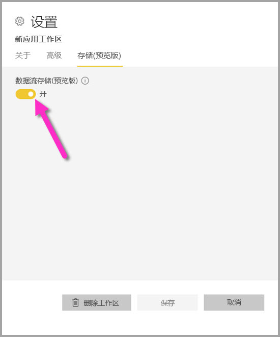
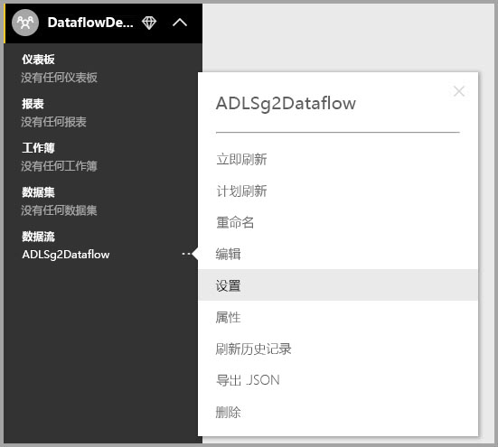
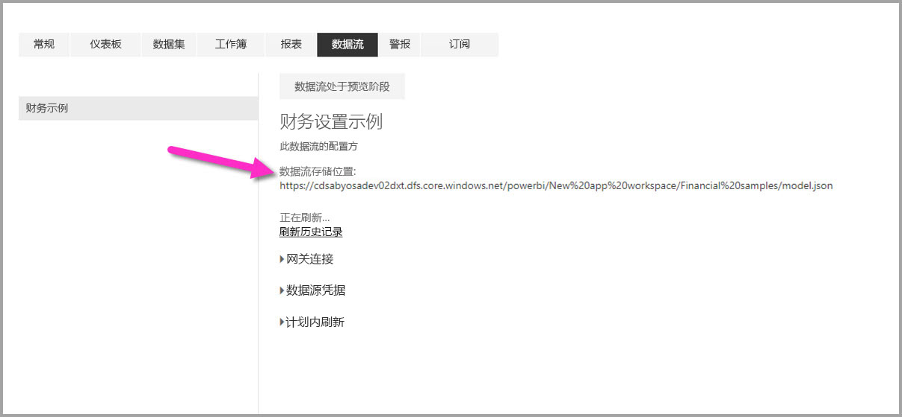

# 配置工作区数据流设置（预览）

使用 Power BI 和数据流时，可以在 Azure Data Lake Storage Gen2 中存储工作区的数据流定义文件和数据文件。 工作区管理员可以将 Power BI 配置为执行此操作，本文介绍了实现此目标所需的步骤。 

公司的全局管理员必须将组织的存储帐户连接到 Power BI，并启用对该存储帐户的存储分配权限，之后你才可以配置工作区的数据流存储位置。 [连接 Azure Data Lake Storage Gen2 以存储数据流（预览）](service-dataflows-connect-azure-data-lake-storage-gen2.md)  

有两种配置工作区数据流存储设置的方法： 

* 在创建工作区的过程中进行配置
* 通过编辑现有工作区进行配置

下面的部分将分别介绍每种方法。 

> [!IMPORTANT]
> 只有在工作区不包含任何工作流的情况下，才能更改工作区数据流存储设置。 此外，此功能仅在新工作区体验中可用。 有关新工作区的详细信息，请参阅[在 Power BI 中创建新工作区（预览）](../collaborate-share/service-create-the-new-workspaces.md)一文。

## 创建新工作区，配置其数据流存储

若要在 Power BI 服务中创建新工作区，请依次选择“工作区”、“创建工作区”  。

在“创建工作区”对话框中，会出现标题为“预览改进的工作区”的黄色框  。 在该区域中选择“立即试用”。 

可以在出现的对话框中为新工作区提供一个唯一的名称。 不要选择“保存”，因为还需要进行高级设置。 

接下来，展开“创建工作区”对话框的“高级”区域，可在该区域打开“数据流存储(预览)”设置    。

选择“保存”，从而创建新工作区。  现在在此工作区中创建的任何新数据流都会将其定义文件（其 Model.json 文件）和数据存储在组织的 Azure Data Lake Storage Gen2 帐户中。 

## 更新现有工作区的数据流存储

除创建新的工作区外，还可将现有的工作区更新为在组织的 Azure Data Lake Storage Gen2 帐户中存储定义文件和数据。 请注意，只有在工作区尚不包含工作流的情况下，才能更改工作区数据流存储设置。

若要编辑工作区，选择省略号 (…)，然后选择“编辑工作区”   。 

在出现的“编辑工作区”窗口中，展开“高级”，然后将“数据流存储(预览)”设置转换为“打开”。     

然后选择“保存”，这样在该工作区中创建的任何新数据流都会将其定义文件和数据存储在组织的 Azure Data Lake Storage Gen2 帐户中。 

## 获取已存储的数据流文件的 URI

在分配给组织的 Azure Data Lake 帐户的工作区中创建数据流后，可以直接访问该数据流的定义文件和数据文件。 可在“数据流设置”页获取它们的位置。  若要转到此页，请按照下面的步骤操作：

在工作区的“数据流”下，选择列出的某个数据流旁的省略号 (...)   。 在显示的菜单中，选择“设置”  。

在显示的信息中，“数据流存储位置”  下会显示数据流的 CDM 文件夹位置，如下图所示。

> [!NOTE]
> Power BI 会为数据流所有者配置存储数据流文件的 CDM 文件夹的读者权限。 授予其他人或服务数据流存储位置的访问权限需要存储帐户的所有者在 Azure 中授予访问权限。

## 注意事项和限制

当数据流存储在 Azure Data Lake Storage Gen2 中时，不支持某些数据流功能： 

Power BI Pro、Premium 和 Embedded 工作区：
* “链接的实体”功能仅在同一存储帐户中的工作区之间受支持 
* 工作区权限不适用于 Azure Data Lake Storage Gen2 中存储的数据流；仅数据流的所有者可以访问它。
* 另外，所有数据准备功能与 Power BI 存储中存储的数据流的相应功能完全相同

下面还列出了一些其他注意事项：

* 数据流存储位置一旦配置即无法更改。
* 仅 Azure Data Lake Storage Gen2 中存储的数据流的所有者可以访问其数据。
* 组织的 Azure Data Lake Storage Gen2 中存储的数据流不支持 Power BI 共享容量中的本地数据源。

 Power BI Desktop 客户无法访问存储在 Azure Data Lake Storage Gen2 帐户中的数据流，除非他们是数据流的所有者。 请考虑以下情况：

1.  Anna 创建了一个新的工作区，并将其配置为存储组织 Data Lake 中的数据流。
2.  Ben 也是 Anna 所创建工作区的成员，他希望利用 Power BI Desktop 和数据流连接器从 Anna 创建的数据流获取数据。
3.  Ben 收到一个错误，因为他没有被添加为 Data Lake 中数据流的 CDM 文件夹的授权用户。

    

## 后续步骤

本文提供了有关如何配置数据流的工作区存储的指南。 有关详细信息，请参阅以下文章：

有关数据流、CDM 和 Azure Data Lake Storage Gen2 的详细信息，请参阅以下文章：

* [数据流和 Azure Data Lake 集成（预览）](service-dataflows-azure-data-lake-integration.md)
* [将 CDM 文件夹添加到 Power BI 作为数据流（预览）](service-dataflows-add-cdm-folder.md)
* [连接 Azure Data Lake Storage Gen2 以存储数据流（预览）](service-dataflows-connect-azure-data-lake-storage-gen2.md)

有关总体数据流的信息，请查看以下这些文章：

* [在 Power BI 中创建和使用数据流](service-dataflows-create-use.md)
* [在 Power BI Premium 上使用计算实体（预览）](service-dataflows-computed-entities-premium.md)
* [将数据流与本地数据源配合使用（预览）](service-dataflows-on-premises-gateways.md)
* [Power BI 数据流的开发人员资源（预览）](service-dataflows-developer-resources.md)

有关 Azure 存储的详细信息，可以阅读以下这些文章：

* [Azure 存储安全指南](/azure/storage/common/storage-security-guide)
* [开始使用 Azure 数据服务中的 github 示例](https://aka.ms/cdmadstutorial)

有关通用数据模型的详细信息，可以阅读其概述文章：

* [通用数据模型 - 概述](/powerapps/common-data-model/overview)
* [CDM 文件夹](/common-data-model/data-lake)
* [CDM 模型文件定义](/common-data-model/model-json)

也可以随时尝试[通过 Power BI 社区提问](https://community.powerbi.com/)。