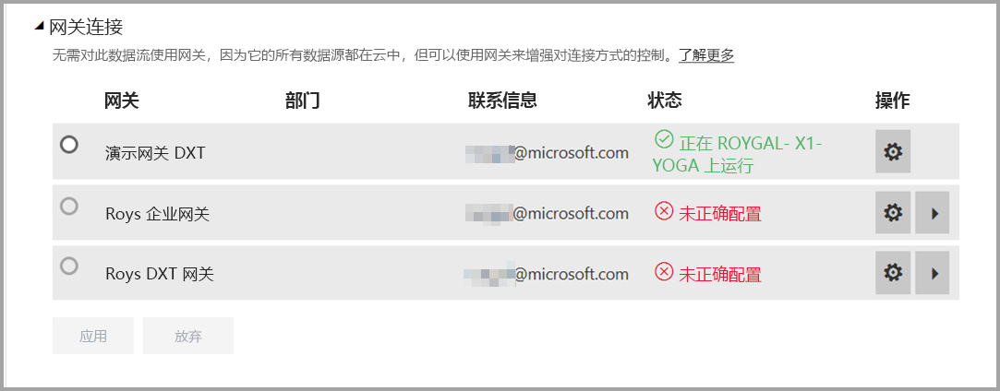
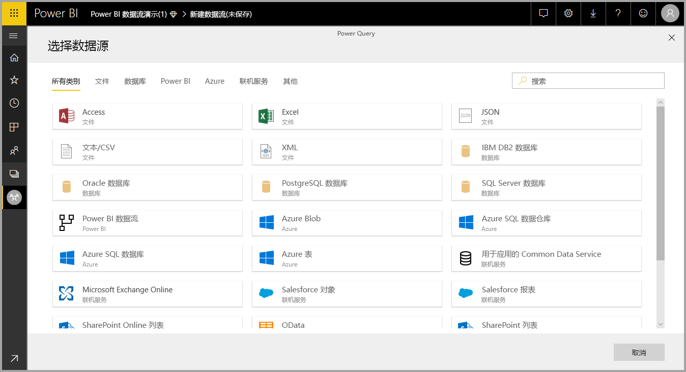
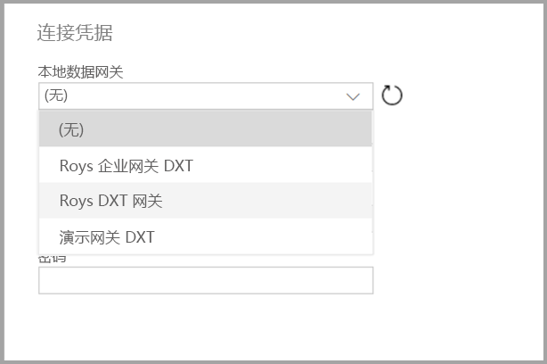

# 将数据流与本地数据源配合使用

使用数据流  ，可以创建来自各种源的数据集合、清理数据并进行转换，然后将其加载到 Power BI 存储。 创建数据流时，用户可能希望使用本地数据源。 本文介绍了与创建数据流相关的要求，以及如何配置企业网关  以启用这些连接。

## 配置企业网关以用于数据流

若要使用网关创建数据流，用户必须是企业网关的管理员，或者管理员必须已与用户共享其计划使用的数据源。 

> [!NOTE]
> 仅在使用企业网关时支持数据流。

## 在数据流中使用本地数据源

创建数据流时，从数据源列表选择本地数据源，如下图所示。

完成选择后，系统会提示用户提供将用于访问本地数据的企业网关的连接详细信息。 必须选择网关本身，并提供选定网关的凭据。

## 监视网关

用户可以使用与监视数据集网关相同的方式监视企业网关的数据流。

在 Power BI 的数据流设置屏幕中，可以监视数据流的网关状态并为数据流分配网关，如下图所示。

## 更改网关

可以通过两种方式更改用于给定数据流的企业网关：

1. 从创作工具中更改  ：可以使用数据流创作工具更改分配给所有查询的网关。

    > [!NOTE]
    > 数据流将尝试使用新网关查找或创建所需的数据源。 如果它无法执行此操作，则在所选网关提供所有必要数据流之前，将无法更改网关。

2. 在设置屏幕中更改  ：可以使用 Power BI 服务中数据流的设置屏幕更改分配的网关。

若要详细了解企业网关，请参阅[本地数据网关](../connect-data/service-gateway-onprem.md)。

## 注意事项和限制

使用企业网关和数据流有一些已知的限制：

* 每个数据流只能使用一个网关。 因此，应使用同一网关配置所有查询。
* 更改网关会影响整个数据流。
* 如果需要多个网关，最佳做法是生成多个数据流（每个网关一个），并使用计算或实体引用功能来统一数据。
* 仅在使用企业网关时支持数据流。 在下拉列表和设置屏幕中将无法选择个人网关。
* 数据流不支持使用[通过 Kerberos 对 DirectQuery 和 Import 查询使用 SSO](../connect-data/service-gateway-sso-kerberos.md#run-a-power-bi-report)选项配置本地数据源。

## 后续步骤

本文介绍了如何将本地数据源用于数据流，以及如何使用和配置网关以访问此类数据。 以下文章也可提供帮助

* [数据流自助服务数据准备](service-dataflows-overview.md)
* [在 Power BI 中创建和使用数据流](service-dataflows-create-use.md)
* [在 Power BI Premium 上使用计算实体](service-dataflows-computed-entities-premium.md)
* [Power BI 数据流的开发人员资源](service-dataflows-developer-resources.md)

有关 Power Query 和计划刷新的详细信息，可以阅读以下文章：
* [Power BI Desktop 中的查询概述](desktop-query-overview.md)
* [配置计划刷新](../connect-data/refresh-scheduled-refresh.md)

有关通用数据模型的详细信息，可以阅读其概述文章：
* [通用数据模型 - 概述](/powerapps/common-data-model/overview)