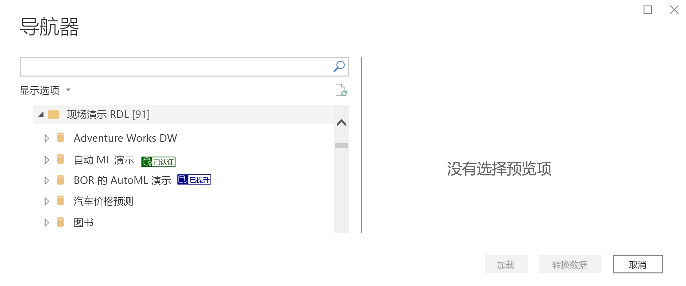
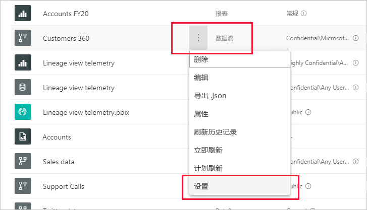
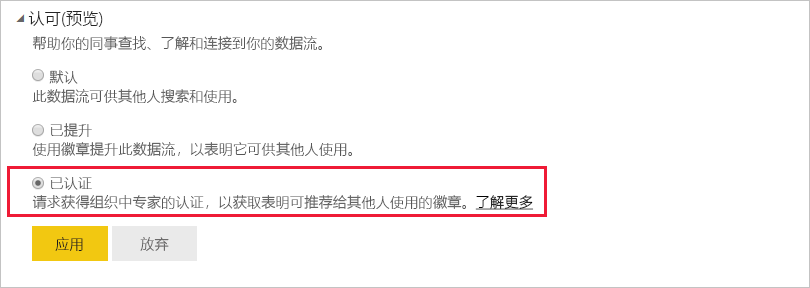

# 推广或认证数据流（预览版）

Power BI 提供了两种方法来提高宝贵且高质量的数据流的可见性：推广和认证   。

* **推广**：使用推广功能，用户可以突出显示他们认为有价值且值得他人使用的数据流。 这种方式鼓励在组织内以协作方式传播数据流。 任何数据流所有者或任何对数据流所在工作区具有写入权限的成员，只要认为数据流有共享价值，他们就可以轻松地推广该数据流。

* **验证**：认证是指数据流经由授权的审阅者检查，确认该数据流确实是可靠的权威数据源，可以在整个组织中使用。 Power BI 管理员定义的一组审阅者确定要认证哪些数据流。 如果用户认为某个特定的数据流应该经过认证，但无权对该流进行认证，则该用户应联系其管理员。

  仅当 [Power BI 管理员已启用](../admin/service-admin-setup-certification.md)数据流认证时，才可以进行数据流认证。

推广或认证数据流称为“认可”  。 Power BI 报表创建者通常有多种数据流可供选择，认可有助于指导他们获得可靠且值得信任的权威数据流。

Power BI 中的许多位置都明确标记了认可的数据流，这使报表创建者可以轻松找到可靠的数据，还使管理员和报表创建者可以轻松跟踪它们在整个组织中的使用情况。

下图显示了如何在 Power Query 中轻松识别已推广和已认证的数据流。

本文介绍
* 推广数据流（数据流所有者或对数据流所在工作区具有成员权限的任何用户）
* 认证数据流（由 Power BI 管理员确定的经授权的数据流认证者）

若要了解如何设置数据流认证（由管理员执行），请参阅[设置数据集和数据流认证](../admin/service-admin-setup-certification.md)

## 推广数据流

若要推广数据流，必须对要推广的数据流所在的工作区具有写入权限。

1. 请转到工作区中的数据流列表。
 
1. 选择要推广的数据流上的“更多选项”(...)，然后选择“设置”   。

    

1. 展开“认可”部分，并选择“已推广”  。

    

1. 选择**应用**。

## 认证数据流

本部分适用于已由 Power BI 管理员授权认证数据流的用户。 认证数据流是一项重要工作。 本部分介绍需要执行的认证过程。

1. 获取要认证的数据流所在的工作区的写入权限。 此权限可由数据流所有者或任何对工作区具有管理权限的人员提供。 

1. 仔细查看数据流并确定其是否值得认证。

1. 如果决定要认证数据流，请转到数据流所在的工作区。
 
1. 找到所需的数据流，单击“更多选项”(...)，然后选择“设置”   。

    

1. 展开“认可”部分，并单击“已认证”  。 

    

2. 单击“**应用**”。

## 后续步骤

* [设置数据集和数据流认证](../admin/service-admin-setup-certification.md)
* 是否有任何问题? [尝试咨询 Power BI 社区](https://community.powerbi.com/)