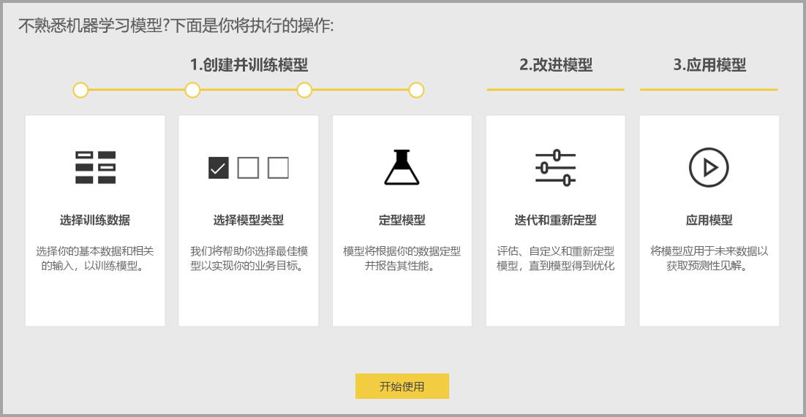
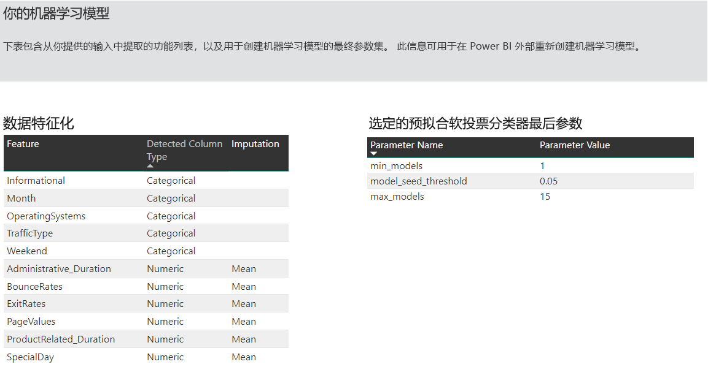
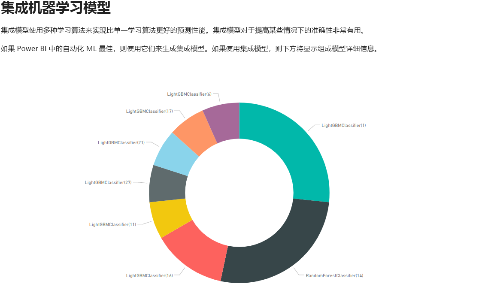
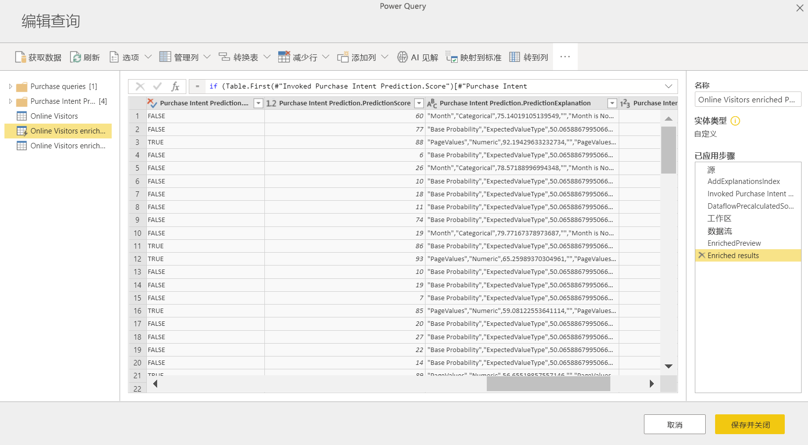

# Power BI 中的自动机器学习

适用于数据流的自动机器学习 (AutoML) 使业务分析师可以直接在 Power BI 中对机器学习 (ML) 模型进行训练、验证和调用。 它包括创建新 ML 模型的简单体验，分析师可以使用其数据流指定用于训练模型的输入数据。 服务会自动提取最相关的功能、选择适当的算法，以及调整和验证 ML 模型。 在对模型进行训练后，Power BI 会自动生成一个包含验证结果的性能报表。 然后，可以在数据流中的任何新的或更新的数据上调用该模型。

自动机器学习仅适用于 Power BI Premium 和嵌入式容量上托管的数据流。

## 使用 AutoML

[Power BI 数据流](service-dataflows-overview.md)为大数据提供自助服务数据准备。 AutoML 集成到数据流中，使你能够在 Power BI 中充分利用数据准备工作来构建机器学习模型。

通过 Power BI 中的 AutoML，数据分析师只需借助 Power BI 技能便可以使用数据流来构建具有简化体验的机器学习模型。 创建 ML 模型背后的大多数数据科学都是通过 Power BI 自动完成的。 该模式具有良好的保护措施，可确保生成高质量模型，并清晰展示创建 ML 模型的整个过程。

AutoML 支持创建数据流的二进制预测、分类和回归模型    。 这些是受监督的机器学习技术类型，这意味着它们通过了解过去观察的已知结果来预测其他观察结果。 用于训练 AutoML 模型的输入数据集是一组标有已知结果的记录  。

Power BI 中的 AutoML 从 [Azure 机器学习](/azure/machine-learning/service/overview-what-is-azure-ml)集成[自动化 ML](/azure/machine-learning/service/concept-automated-ml)，以创建 ML 模型。 不过，在 Power BI 中，无需 Azure 订阅即可使用 AutoML。 训练和托管 ML 模型的过程完全由 Power BI 服务管理。

训练 ML 模型后，AutoML 会自动生成一个 Power BI 报表，用于说明 ML 模型的可能性能。 AutoML 会突出显示输入中影响模型返回的预测结果的关键影响因素，以此强调可解释性。 该报表还包含模型的关键指标。

生成的报表的其他页显示模型的统计摘要和训练详细信息。 对于想要查看模型性能的标准数据科学度量值的用户，统计摘要非常有用。 训练详细信息汇总了用关联建模参数创建模型的所有运行迭代。 它还介绍了如何使用每个输入来创建 ML 模型。

然后，可以将 ML 模型应用于数据以进行评分。 刷新数据流时，数据将根据 ML 模型中的预测进行更新。 Power BI 还包含有关 ML 模型产生的每个特定预测的个性化说明。

## 创建机器学习模型

本节介绍如何创建 AutoML 模型。

### 创建 ML 模型的数据准备

若要在 Power BI 中创建机器学习模型，必须先使用历史结果信息（该信息用于训练 ML 模型）为数据创建数据流。 对于可能成为你要尝试预测的结果的强预测器的任何业务指标，还应当添加计算列。 有关配置数据流的详细信息，请参阅 [Power BI 中的自助服务数据准备](service-dataflows-overview.md)。

对于训练机器学习模型，AutoML 有特定的数据要求。 以下各节根据各自的模型类型对这些要求进行了说明。

### 配置 ML 模型输入

若要创建 AutoML 模型，请在数据流实体的“操作”列中选择 ML 图标，然后选择“添加机器学习模型”   。

简化的体验已启动，其中包含一个向导，该向导将引导你完成创建 ML 模型的过程。 该向导包括以下简单步骤。

**1.选择包含历史数据的实体，以及要进行预测的结果字段**

结果字段标识用于训练 ML 模型的标签属性，如下图所示。

**2.选择模型类型**

选定结果字段时，AutoML 将分析标签数据，以推荐可训练的最可能的 ML 模型类型。 可通过单击“选择其他模型”来选取其他模型类型，如下所示。

> [!NOTE]
> 对于所选的数据，某些模型类型可能不受支持，因此会被禁用。 在上面的示例中，由于文本列被选作结果字段，因此禁用了“回归”。

**3.选择希望模型用作预测信号的输入**

AutoML 分析所选实体中的示例，以建议用于训练 ML 模型的输入。 将在未选择的字段旁边提供说明。 如果某个特定字段的非重复值太多或只有一个值，或者与输出字段的相关性很低或很高，则不建议这样做。

任何依赖于结果字段（或标签字段）的输入都不应当用于训练 ML 模型，因为它们会影响其性能。 此类字段将被标记为“可能与输出字段存在高相关性”。 将这些字段引入训练的数据会导致标签泄露，其中模型对验证或测试数据执行良好，但用于在生产中进行评分时达不到预期性能。 如果训练的模型性能好到令人难以置信，则 AutoML 模型中可能会出现标签泄露的问题。

此功能建议基于数据示例，因此应查看使用的输入。 可以选择更改所选内容，使其仅包含希望模型学习的字段。 也可以通过选择实体名称旁边的复选框选择所有字段。

**4.为模型命名并保存配置**

在最后一步中，可以为模型命名并选择“保存并训练”，即可开始训练 ML 模型。 可以选择缩短训练时间以查看快速结果，或增加训练所用的时间以获得最佳模型。

### ML 模型训练

AutoML 模型的训练是数据流刷新的一部分。 AutoML 首先准备要进行训练的数据。
AutoML 将提供的历史数据拆分为训练和测试数据集。 测试数据集是在训练后用于验证模型性能的维持数据集。 它们是作为数据流中的“训练和测试”  实体实现的。 AutoML 对模型验证使用交叉验证。

接下来，分析每个输入字段并应用插补法，这会将缺失值替换为替换值。 AutoML 使用几个不同的插补法策略。 对于被视为数值特征的输入属性，列值的平均值用于插补。 对于被视为类别特征的输入属性，AutoML 使用插补的列值模式。 用于插补的值平均值和模式由二次采样的训练数据集上的 AutoML 框架进行计算。

然后，将任何所需的采样和规范化应用于数据。 对于分类模型，AutoML 通过分层采样运行输入数据，并对类进行均衡，以确保行计数在所有类别中都相等。

AutoML 对每个选定输入字段基于其数据类型和统计属性应用多个转换。 AutoML 使用这些转换提取功能以用于训练 ML 模型。

AutoML 模型的训练过程包括多达 50 个迭代，其中包含不同的建模算法和超参数设置，以查找性能最佳的模型。 如果 AutoML 发现没有观察到性能改进，则训练可以在较小的迭代初期结束。 使用维持数据测试数据集进行验证，对其中每个模型的性能进行评估。 在此训练步骤中，AutoML 会创建多个管道，用于训练和验证这些迭代。 评估模型性能的过程可能需要几分钟到几小时的时间，最长到向导中配置的训练时间，具体取决于数据集的大小和可用的专用容量资源。

在某些情况下，生成的最终模型可能使用系综学习，其中多个模型用于提供更好的预测性能。

### AutoML 模型可解释性

在对模型进行训练后，AutoML 将分析输入功能与模型输出之间的关系。 它为每个输入特征评估维持数据测试数据集的模型输出的变化量变化。 这称为“功能重要性”  。 该操作在完成训练后进行刷新的过程中发生。 因此刷新所用的时间可能比在向导中配置的训练时间要长。

### AutoML 模型报表

AutoML 会生成一个 Power BI 报表，该报表在验证过程中汇总模型的性能以及全局功能重要性。 一旦数据流刷新成功，便可以从“机器学习模型”选项卡访问此报表。 此报表汇总了将 ML 模型应用于维持数据测试数据的结果，并将预测与已知结果值进行比较。

你可以查看模型报表以了解其性能。 你还可以验证模型的关键影响者是否与有关已知结果的业务见解一致。

用于描述报表中的模型性能的图表和度量值因模型类型不同而异。 以下各节介绍了这些性能图表和度量值。

报表中的其他页可以从数据科学角度描述有关模型的统计度量值。 例如，“二进制预测”  报表包括增益图和模型的 ROC 曲线。

报表还包括“训练详细信息”页，其中包含有关模型训练方式的说明，和一张图表来说明每个迭代运行的模型性能  。

此页上的另一部分介绍了检测到的输入字段的类型和用于填充缺失值的插补方法。 它还包括最终模型所使用的参数。

如果生成的模型使用集成学习，则“训练详细信息”页还包括一个图表，用于描述集成中每个构成模型的权重及其参数  。

## 应用 AutoML 模型

如果对创建的 ML 模型的性能感到满意，则可以在数据流刷新后将其应用于新数据或更新的数据。 可通过选择右上角的“应用”按钮，或选择“机器学习模型”选项卡中操作下的“应用 ML 模型”按钮来从模型报表中执行此操作  。

若要应用 ML 模型，你必须指定须应用该模型的实体的名称，以及将为模型输出添加到此实体的列的前缀。 列名的默认前缀为模型名称。 Apply  函数可能包含特定于模型类型的其他参数。

应用 ML 模型会创建两个新的数据流实体，其中包含针对其在输出实体中评分的每一行的预测和个性化说明。 例如，如果将 PurchaseIntent 模型应用于 OnlineShoppers 实体，则输出将生成 OnlineShoppers 扩充的 PurchaseIntent 和 OnlineShoppers 扩充的 PurchaseIntent 说明实体     。 对于扩充实体中的每一行，根据输入特征，“说明”在扩充说明实体中被划分为多行  。 ExplanationIndex 有助于将扩充说明实体中的行映射到已扩充实体中的行  。

你还可以在 PQO 函数浏览器中使用 AI 见解将任何 Power BI AutoML 模型应用于同一工作区中的任何数据流中的实体。 这样一来，就可以在同一工作区中使用其他人创建的模型，而无需成为具有该模型的数据流的所有者。 Power Query 发现工作区中的所有 Power BI ML 模型，并将其公开为动态 Power Query 函数。 你可以通过从 Powre Query 编辑器的功能区中访问这些函数来调用它们，或通过直接调用 M 函数来调用这些函数。此功能目前仅支持 Power BI 数据流以及 Power BI 服务中的联机 Power Query。 请注意，这与使用 AutoML 向导在数据流中应用 ML 模型的情况非常不同。 未说明使用此方法创建的实体，并且除非你是数据流的所有者，否则无法访问模型训练报表或重新训练模型。 如果编辑了源模型（添加或删除输入字段），或者删除了模型或源数据流，则会中断此依赖数据流。

应用模型后，AutoML 始终会在刷新数据流时保持最新的预测。

若要在 Power BI 报表中使用 ML 模型的见解和预测，可以使用数据流**** 连接器从 Power BI Desktop 连接到输出实体。

## 二元预测模型

二进制预测模型（更正式地称为“二元分类模型”****）用于将数据集分类为两个组。 它们用于预测可能具有二进制结果的事件。 例如，销售机会是否转换、帐户是否将发生变化、是否需要按时支付发票、事务是否为欺诈性等等。

二进制预测模型的输出是一个概率分数，用于标识目标结果得到实现的可能性。

### 训练二进制预测模型

先决条件：

- 每类结果需要至少 20 行的历史数据

二进制预测模型的创建过程遵循与其他 AutoML 模型相同的步骤，如上文“配置 ML 模型输入”**** 一节所述。 唯一的区别是在“选择模型”步骤中，你可以在其中选择你最感兴趣的目标结果值。 还可为结果提供易记的标签，以便用于自动生成的用于汇总模型验证结果的报表。

### 二进制预测模型报表

二进制预测模型将生成输出，该输出是记录将达到目标结果的概率。 该报表包含概率阈值的切片器，它会影响如何解释高于和低于概率阈值的分数。

该报表以“真正”、“假正”、“真负”和“假负”的形式描述模型的性能__。 对于结果数据中的两个类，“真正”和“真负”是正确预测的结果。 “假正”是被预测具有目标结果但实际上没有的记录。 相反，“假负”是具有目标结果但预测为没有的记录。

度量值（如精度和撤回）描述了预测结果的概率阈值效果。 可以使用概率阈值切片器选择一个阈值，该阈值实现精度与撤回之间的均衡折衷。

该报表还包含一个成本收益分析工具，来帮助确定应针对的填充子集，以获取最高利润。 考虑到目标的估计单位成本和获得目标结果的单位收益后，成本收益分析尝试最大程度地提高利润。 你可使用此工具根据最大点选取概率阈值，以最大程度地提高利润。 还可使用关系图计算选择的概率阈值的利润或成本。

模型报表的“准确性报表”**** 页包含模型的“累积收益”__ 图和 ROC 曲线。 这些是模型性能的统计度量值。 报表包含所显示的图表的说明。

### 应用二进制预测模型

若要应用二进制预测模型，必须使用要应用 ML 模型预测的数据指定实体。 其他参数包含输出列名称前缀和概率阈值，以用于对预测结果进行分类。

当应用二进制预测模型时，它向扩充的输出实体添加四个输出列：Outcome、PredictionScore、PredictionExplanation 和 ExplanationIndex   。 实体中的列名具有在应用模型时指定的前缀。

PredictionScore 是一个百分比概率，用于标识目标结果得到实现的可能性****。

Outcome 列包含预测的结果标签****。 概率超过阈值的记录会被预测为可能获得目标结果，并标记为 True。 低于阈值的记录被预测为不可能获得结果并标记为 False。

“PredictionExplanation”**** 列包含一个说明，其中含有输入功能对 PredictionScore **** 的特定影响。

## 分类模型

分类模型用于将数据集分类为多个组或类。 它们用于预测具有多个可能结果之一的事件。 例如，客户是否可能具有非常高、高、中或低的终身价值；违约风险是高、中、低还是非常低；等等。

分类模型的输出是一个概率分数，用于标识记录将获得给定类的条件的可能性。

### 训练分类模型

包含分类模型训练数据的输入实体必须有一个字符串或整个数值字段作为结果字段，用于标识过去已知的结果。

先决条件：

- 每类结果需要至少 20 行的历史数据

分类模型的创建过程遵循与其他 AutoML 模型相同的步骤，如上文“配置 ML 模型输入”**** 一节所述。

### 分类模型报表

通过将 ML 模型应用于维持数据测试数据并将记录的预测类与实际已知类进行比较，生成分类模型报表。

模型报表包括一个图表，其中包括每个已知类的正确和错误分类记录的细分。

通过进一步的特定于类的向下钻取，可以分析已知类的预测是如何分布的。 这包括其他类，在这些类中，已知类的记录可能会分类不当。

报表中的模型说明还包括每个类的最高预测值。

分类模型报表还包括与其他模型类型页面相似的“训练详细信息”页，如本文上面的“AutoML 模型报表”**** 一节所述。

### 应用分类模型

若要应用分类 ML 模型，必须使用输入数据和输出列名称前缀指定实体。

应用分类模型时，它向扩充的输出实体添加五个输出列：ClassificationScore、ClassificationResult、ClassificationExplanation、ClassProbabilities 和 ExplanationIndex    。 实体中的列名具有在应用模型时指定的前缀。

ClassProbabilities 列包含每个可能类的记录的概率分数列表****。

ClassificationScore 是一个百分比概率，用于标识记录将获得给定类的条件的可能性****。

ClassificationResult 列包含记录最可能的预测类****。

ClassificationExplanation 列包含一个说明，其中含有输入功能对 ClassificationScore 的特定影响********。

## 回归模型

回归模型用于预测数值。 例如：可能会从销售交易中实现的收入、帐户的生存期值、可能要支付的应付款发票量、发票的支付日期等等。

回归模型的输出为预测值。

### 训练回归模型

回归模型包含训练数据的输入实体必须有一个数值字段作为结果字段，用于标识已知的结果值。

先决条件：

- 回归模型需要至少 100 行的历史数据

回归模型的创建过程遵循与其他 AutoML 模型相同的步骤，如上文“配置 ML 模型输入”**** 一节所述。

### 回归模型报表

与其他 AutoML 模型报表类似，回归报表基于将模型应用于维持数据测试数据的结果。

模型报表包含将预测值与实际值进行比较的图表。 在此图表中，与对角线的距离表示预测中的误差。

残差图显示了维持数据测试数据集中不同值的平均误差百分比。 横轴表示组实际值的平均值，其中气泡的大小显示了该范围内的值的频率或计数。 垂直轴是平均残差。

回归模型报表还包括“训练详细信息”页，如上面的“AutoML 模型报表”**** 中所述。

### 应用回归模型

若要应用回归 ML 模型，必须使用输入数据和输出列名称前缀指定实体。

应用回归模型时，它向扩充的输出实体添加三个输出列：RegressionResult、RegressionExplanation 和 ExplanationIndex  。 实体中的列名具有在应用模型时指定的前缀。

RegressionResult 列包含基于输入字段的记录的预测值****。 RegressionExplanation 列包含一个说明，其中含有输入功能对 RegressionResult 的特定影响********。

## 后续步骤

本文提供了 Power BI 服务中数据流的自动机器学习概述。 以下文章也可提供帮助。

- [教程：在 Power BI 中生成机器学习模型](../connect-data/service-tutorial-build-machine-learning-model.md)
- [教程：在 Power BI 中使用认知服务](../connect-data/service-tutorial-use-cognitive-services.md)
- [教程：在 Power BI 中调用机器学习工作室（经典）模型（预览版）](../connect-data/service-tutorial-invoke-machine-learning-model.md)
- [Power BI 中的认知服务](service-cognitive-services.md)
- [Power BI 中的 Azure 机器学习集成](service-machine-learning-integration.md)

有关数据流的详细信息，可以阅读以下这些文章：

- [在 Power BI 中创建和使用数据流](service-dataflows-create-use.md)
- [在 Power BI Premium 上使用计算实体](service-dataflows-computed-entities-premium.md)
- [将数据流与本地数据源配合使用](service-dataflows-on-premises-gateways.md)
- [Power BI 数据流的开发人员资源](service-dataflows-developer-resources.md)
- [数据流和 Azure Data Lake 集成（预览）](service-dataflows-azure-data-lake-integration.md)