# 在 Power BI 中使用矩阵视觉对象

[!INCLUDE [power-bi-visuals-desktop-banner](../includes/power-bi-visuals-desktop-banner.md)]

矩阵视觉对象类似于表。  表支持两个维度，且数据是平面结构；也就是说，表显示但不聚合重复值。 使用矩阵，可以更轻松地跨多个维度有目的地显示数据，因为它支持梯级布局。 矩阵自动聚合数据，并启用向下钻取。 

可以在 Power BI Desktop  报表中创建矩阵视觉对象，并能将矩阵内的元素与相应报表页上的其他视觉对象一起交叉突出显示。 例如，可以选择行、列和各个单元格，并交叉突出显示。 此外，还可以将选择的单个单元格和多个单元格复制并粘贴到其他应用程序。 

矩阵有许多相关功能，我们将在本文的下面各部分中逐一介绍它们。

## 了解 Power BI 计算总计的方式

了解如何使用矩阵视觉对象前，请务必先了解 Power BI 是如何在表和矩阵中计算总计和小计值的。 对于总计和小计行，Power BI 是对所有基础数据行评估度量值，这不仅仅是简单地将可见或已显示行中的值相加。 这意味着最终总计行的值与预计的值存在差异。

请查看以下矩阵视觉对象。 

在此示例中，最右边的矩阵视觉对象中的各行显示了每个销售人员/日期组合对应的“金额”  。 但是，由于显示的一个销售人员对应多个日期，这些数字可以出现不止一次。 因此，基础数据的准确总计并不等于可见值的简单相加。 当要求和的值位于一对多关系的“一”这一侧时，这是一种常见模式。

查看总计和小计时，请注意这些值都是以基础数据为依据。 它们并不仅仅以可见值为依据。

<!-- use Nov blog post video

## Expanding and collapsing row headers
There are two ways you can expand row headers. The first is through the right-click menu. You’ll see options to expand the specific row header you clicked on, the entire level or everything down to the very last level of the hierarchy. You have similar options for collapsing row headers as well.

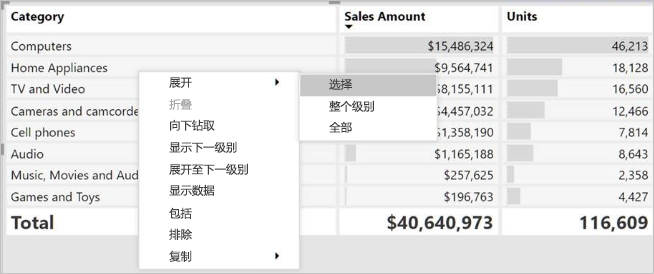

You can also add +/- buttons to the row headers through the formatting pane under the row headers card. By default, the icons will match the formatting of the row header, but you can customize the icons’ color and size separately if you want. 
Once the icons are turned on, they work similarly to the icons from PivotTables in Excel.

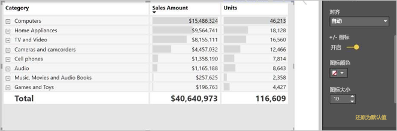

The expansion state of the matrix will save with your report. It can be pinned to dashboards as well, but consumers will need to open up the report to change the state. Conditional formatting will only apply to the inner most visible level of the hierarchy. Note that this expand/collapse experience is not currently supported when connecting to AS servers older than 2016 or MD servers.

Watch the following video to learn more about expand/collapse in the matrix:

-->
## 结合使用向下钻取和矩阵视觉对象
借助矩阵视觉对象，可以执行之前无法实现的各种有意思的向下钻取活动。 这包括向下钻取行、列、单独分区和单元格。 让我们来看看每种向下钻取活动的工作原理。

### 向下钻取行标题

在“可视化效果”窗格中，如果向“字段”  井的“行”  部分添加多个字段，可以为矩阵视觉对象的行启用向下钻取。 这类似于创建层次结构，以便于你可以向下钻取（然后备份）层次结构，并分析每个级别的数据。

在下图中，“行”  部分包含“销售阶段”  和“商机规模”  ，形成了可以向下钻取的行分组（或层次结构）。

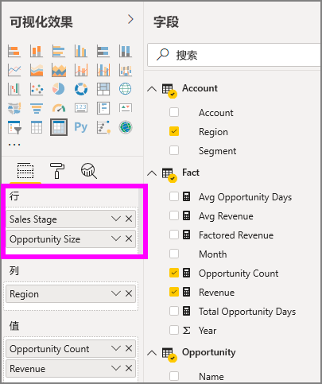

如果视觉对象在“ **行** ”部分中形成了分组，那么视觉对象本身会在其左上角显示“ *钻取* ”和“ *扩展* ”图标。

选择这些按钮可以向下钻取（或备份）层次结构，类似于其他视觉对象中的钻取和扩展行为。 在此示例中，可以从“销售阶段”  向下钻取到“商机规模”  （如下图所示）。在下图中，已选择向下钻取一个级别的图标（草耙图标）。

除了使用这些图标，还可以选择任意行标题，然后从随即显示的菜单中进行选择来向下钻取。

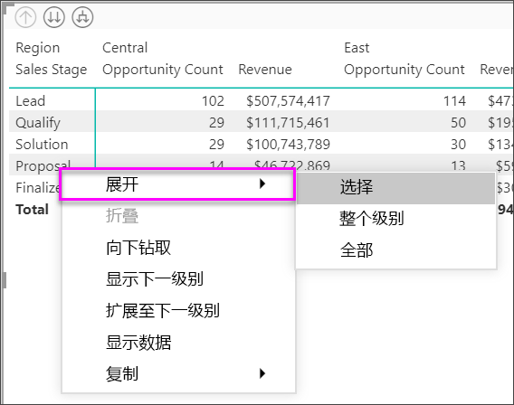

请注意，显示的菜单中有多个选项，分别用于执行不同的操作：

选择“向下钻取”  展开的是相应  行级别的矩阵，不包括  其他所有行标题，只会展开选择的行标题。 在下图中，依次选择的是“建议”   > “向下钻取”  。 请注意，其他顶层行不会再出现在矩阵中。 这种钻取方法是一项十分有用的功能，当我们介绍“交叉突出显示”部分时，你会发现这项功能特别棒。

选择“向上钻取”  图标，以返回到上一顶级视图。 然后，如果你依次选择“建议”   > “显示下一个级别”  ，系统会按升序列出下一个级别的所有项（在此示例中，为“商机规模”  字段），不含更高级别的层次结构分类。

选择左上角的“向上钻取”  图标，让矩阵显示所有顶级类别，然后依次选择“建议”   > “展开到下一个级别”  ，以查看层次结构中“销售阶段”  和“商机规模”  这两个级别的所有值。

也可以使用“展开”  菜单项来进一步控制显示。  例如，依次选择“建议”   > “展开”   > “选择”  。 此时，Power BI 会显示每个“销售阶段”  的总计行，并显示“建议”  的所有“商机规模”  选项。

### 向下钻取列标题
与向下钻取行类似，还可以向下钻取列。 在下图中，“列”  字段井中有两个字段，形成了类似于本文前面对行使用的层次结构。 “列”  字段井中有“区域”  和“细分”  。 当你将第二个字段添加到“列”  后，视觉对象上便会显示新的下拉菜单，此菜单当前显示“行”  。

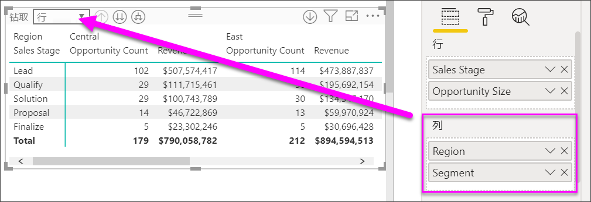

若要向下钻取列，请在矩阵左上角的“钻取对象”  菜单中选择“列”  。 依次选择“东部“  区域和“向下钻取”  。

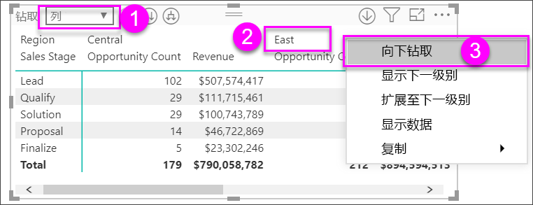

在你选择“向下钻取”  后，系统会显示“区域”>“东部”  列层次结构的下一个级别（在此示例中，为“商机数”  ）。 其他区域处于隐藏状态。

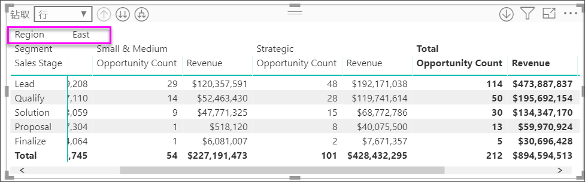

其余菜单项对列和行的工作方式都相同（请参阅上一部分“向下钻取行标题”  ）。 可以对列使用“显示下一个级别”  和“展开到下一个级别”  ，就像对行使用它们一样。

> [!NOTE]
> 矩阵视觉对象左上角的“向下钻取”和“向上钻取”仅对行有效。 必须使用右键单击菜单，才能向下钻取列。

## 使用矩阵视觉对象实现阶梯布局

矩阵视觉对象自动在层次结构中的每个父类别下缩进子类别，这就称为“梯级布局”。

在原始版本的矩阵视觉对象中，子类别显示在完全不同的列中，在视觉对象中占用的空间更多。 下图展示了旧版矩阵视觉对象中的表；请注意，子类别位于单独的列中。

下图展示了采用“阶梯布局”的矩阵视觉对象的实际效果。 请注意，类别“ *计算机* ”将其子类别（“计算机附件”、“台式机”、“笔记本电脑”、“显示器”等）略微缩进，让视觉对象变得更简洁紧凑。

可以轻松调整“阶梯布局”设置。 选择矩阵视觉对象后，在“可视化效果”窗格的“格式”部分（滚动油漆刷图标）中，展开“行标题”部分   。 下面有两个选项：“阶梯布局”开关（用于启用或禁用阶梯布局）和“阶梯布局缩进”（用于指定缩进量，以像素为单位）。

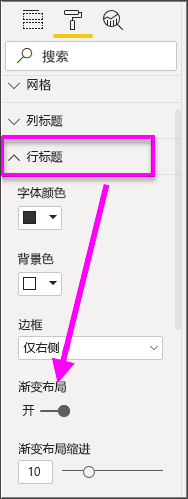

如果你禁用“梯级布局”，Power BI 会在另一列中显示子类别，而不是在父类别下缩进。

## 矩阵视觉对象小计

可以在矩阵视觉对象中，打开或关闭行和列的小计。 在下图中，可以看到行小计已设置为“开”  。

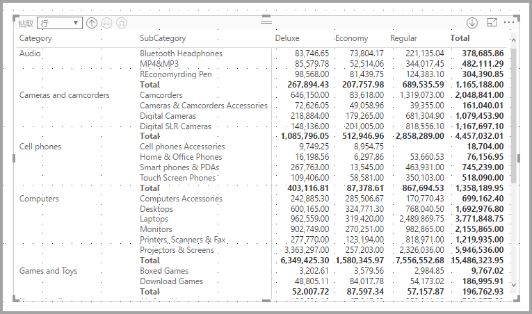

在“可视化效果”窗格的“格式”部分中，展开“小计”卡，并将“行小计”滑块移动至“关闭”   。 在你执行此操作后，系统就不会显示小计。

相同的操作过程适用于列小计。

## 使用矩阵视觉对象进行交叉突出显示

借助矩阵视觉对象，可以选择矩阵中的任意元素，作为交叉突出显示的依据。 如果你选择矩阵视觉对象中的列，Power BI 会突出显示相应列，就像报表页上的其他任何视觉对象一样。 此类型的交叉突出显示一直是其他视觉对象和数据点选择的常见功能，因此现在矩阵视觉对象也可以提供此相同功能。

此外，还可以在按住 Ctrl 的同时单击鼠标进行交叉突出显示。 例如，在下图中，我们选择了矩阵视觉对象中的一组子类别。 请注意，视觉对象中未选择的项为灰显，报表页上的其他视觉对象也会反映矩阵视觉对象中选择的项。

## 复制 Power BI 中的值以供在其他应用程序中使用

可能要将矩阵或表中的内容用于其他应用程序：Dynamics CRM、 Excel 和其他 Power BI 报表。 通过在 Power BI 中右键单击，可以将单个单元格或多个单元格的集合复制到剪贴板。 然后，将单元格粘贴到其他应用程序中。

* 若要复制单个单元格的值，选择单元格，右键单击，并选择“复制值”  。 现在可以将此剪贴板上未格式化的单元格值粘贴到其他应用程序。

    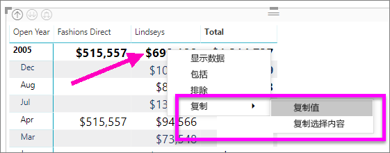

* 若要复制多个单元格，选择单元格范围或使用 CTRL 来选择一个或多个单元格。 

    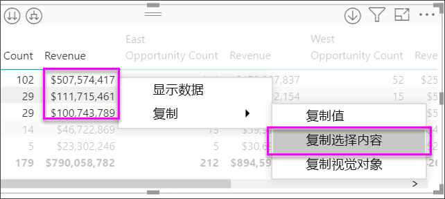

* 复制将包括列标题和行标题。

    

* 若要创建仅包含选定单元格的视觉对象本身的副本，请使用 CTRL 选择一个或多个单元格，右键单击，然后选择“复制视觉对象” 

    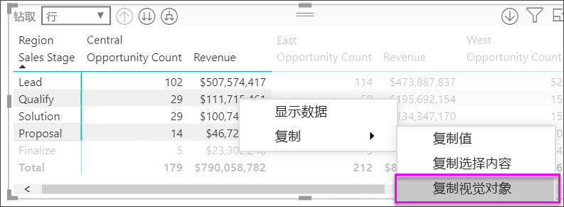

* 副本将是另一个矩阵可视化效果，但仅包含复制的数据。

    

## 矩阵视觉对象的底纹和字体颜色
借助矩阵视觉对象，可以将条件格式（颜色、底纹和数据栏）应用于矩阵中的单元格背景，并将条件格式应用于文本和值本身。

若要应用条件格式，请选择矩阵视觉对象，并打开“格式”  窗格。 展开“条件格式”  卡片，再将“背景色”  、“字体颜色”  或“数据栏”  的滑块移至“开”  。 启用其中任一选项都会显示“高级控件”  链接，单击它可以自定义颜色格式设置的颜色和值。
  
  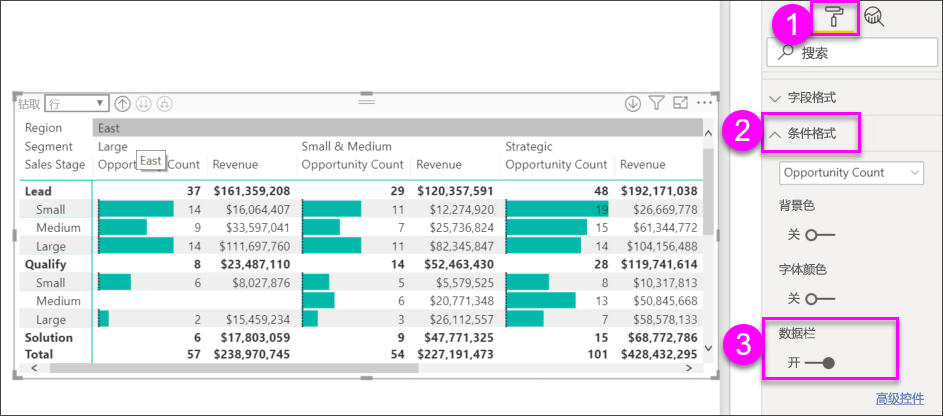

选择“高级控件”  ，以显示对话框，可以在其中进行调整。 此示例显示“数据栏”  的对话框。

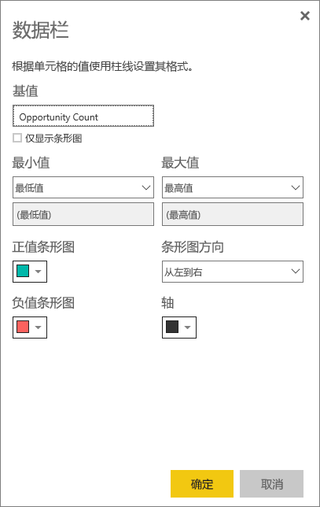

## 后续步骤

[Power BI 中的散点图和气泡图](power-bi-visualization-scatter.md)

[Power BI 中的可视化效果类型](power-bi-visualization-types-for-reports-and-q-and-a.md)