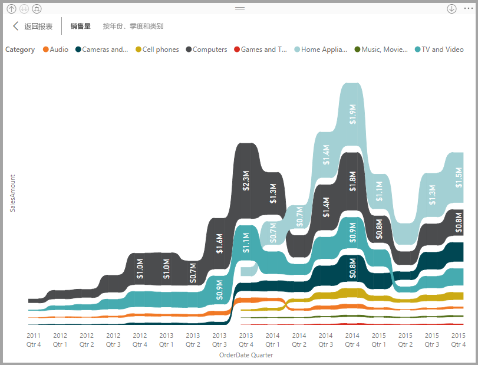
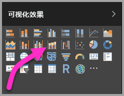

# 在 Power BI 中使用功能区图表
可以使用功能区图表来直观显示数据，并快速发现哪个数据类别具有最高排名（最大值）。 功能区图表能够高效地显示排名变化，并且会在每个时间段内始终将最高排名（值）显示在最顶部。 

## 创建功能区图表
要遵循示例执行操作，请打开[零售分析示例报表](../sample-retail-analysis.md)。 

1. 若要创建功能区图表，请在“可视化效果”  面板中选择“功能区图表”  。

    

    功能区图表使用功能区在可视化时间连续区间内连接一个数据类别，从而使你可以看到某个给定的类别在图表的 x 轴（通常是时间线）范围内是如何排名的。

2. 选择“轴”  “图例”  和“值”  的字段。  在此示例中，我们选择了：“日期”  、“类别”  和“今年销售额”  。  

    

    由于数据集仅包含一年的数据，因此我们还从“轴”  中删除了“年份”  字段。 

3. 功能区图表显示每个其他月份的排名。 请注意排名如何随时间推移而变化。  例如，家庭类别从第三移动到第四，并再次回到第三。 青少年类别在七月从第三移动到第五。 

    

## 设置功能区图表格式
在创建功能区图表时，可以在“可视化效果”  窗格的“格式”  部分使用格式设置选项。 功能区图表的格式设置选项类似于堆叠柱状图中的相应选项，只不过它还具有特定于功能区的其他格式设置选项。

功能区图表的这些格式设置选项可让你进行调整。

*  “间距”可调整功能区之间的间隔大小。 数值为列的最大高度的百分比。
*  “匹配系列颜色”可以将功能区的颜色与系列颜色进行匹配。 设置为关闭时，功能区为灰色。 
*  “透明度”指定功能区的透明度，默认设置为 30。
*  “边框”可以在功能区的顶部和底部使用深色边框。 默认情况下，边框为关闭状态。

由于功能区图表没有 y 轴标签，因此可能要添加数据标签。 从格式设置窗格，选择“数据标签”  。 

设置数据标签的格式设置选项。  在此示例中，我们将文本颜色设置为白色，将小数位数设置为零，并将显示单位设置为千。 

## 后续步骤

[Power BI 中的散点图和气泡图](power-bi-visualization-scatter.md)

[Power BI 中的可视化效果类型](power-bi-visualization-types-for-reports-and-q-and-a.md)