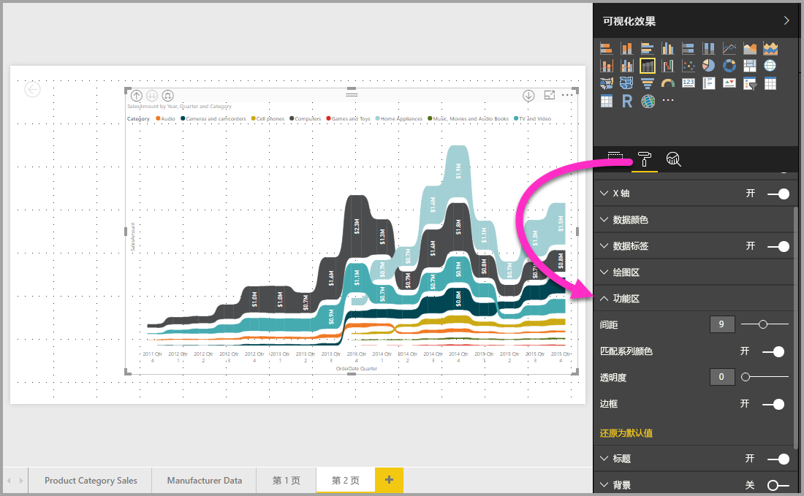

# 在 Power BI 中使用功能区图表
可以使用功能区图表来直观显示数据，并快速发现哪个数据类别具有最高排名（最大值）。 功能区图表能够高效地显示排名变化，并且会在每个时间段内始终将最高排名（值）显示在最顶部。 

## 创建功能区图表
若要创建功能区图表，请在“可视化效果”面板中选择“功能区图表”。

功能区图表使用功能区在可视化时间连续区间内连接一个数据类别，从而使你可以看到某个给定的类别在图表的 x 轴（通常是时间线）范围内是如何排名的。

## 设置功能区图表格式
在创建功能区图表时，可以在“可视化效果”窗格的“格式”部分使用格式设置选项。 功能区图表的格式设置选项类似于堆叠柱状图中的相应选项，只不过它还具有特定于功能区的其他格式设置选项。

功能区图表的这些格式设置选项可让你进行调整。

* “间距”可调整功能区之间的间隔大小。 数值为列的最大高度的百分比。
* “匹配系列颜色”可以将功能区的颜色与系列颜色进行匹配。 设置为关闭时，功能区为灰色。
* “透明度”指定功能区的透明度，默认设置为 30。
* “边框”可以在功能区的顶部和底部使用深色边框。 默认情况下，边框为关闭状态。

## 后续步骤

[Power BI 中的散点图和气泡图](power-bi-visualization-scatter.md)

[Power BI 中的可视化效果类型](power-bi-visualization-types-for-reports-and-q-and-a.md)