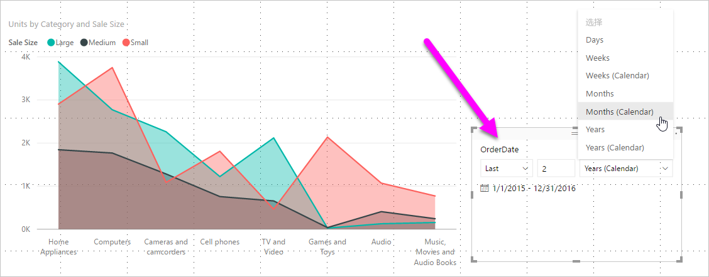
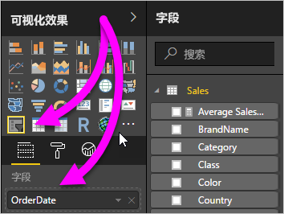
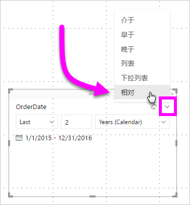
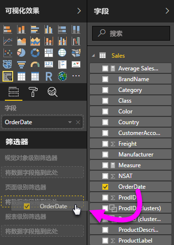
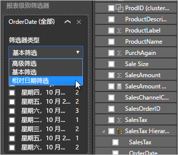
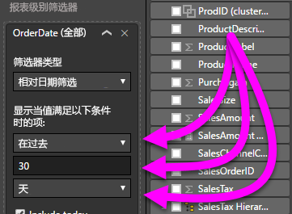

# 在 Power BI Desktop 中使用相对日期切片器和筛选器

借助相对日期切片器  或筛选器  ，可以向数据模型中的任意日期列应用时间筛选器。 例如，可使用相对日期切片器，仅显示过去 30 天（或月、日历月等）的销售数据  。 刷新数据时，相对时间段会自动应用相应的相对日期约束。

## 使用相对日期范围切片器

相对日期切片器的使用方法与其他任何切片器的使用方法一样。 为报表创建“切片器”视觉对象，再选择日期值作为“字段”值   。 在下图中，选择的是“订购日期”字段  。

选择画布上的切片器，然后选择切片器视觉对象右上角的脱字号。 如果视觉对象具有日期数据，则菜单将显示“相对”的选项  。

若要使用相对日期切片器，请选择“相对”  。

然后，可以选择设置。

对于相对日期切片器中的第一个设置，可进行如下选择  ：

* 最后一项

* 下一步

* 本

通过相对日期切片器中的第二个(中间)设置，可输入一个数字来定义相对日期范围  。

可以通过第三个设置选择日期度量值。 可以选择下列选项：

* 日

* 周

* 周（日历）

* 月

* 月（日历）

* 年

* 年(日历)

如果在此该列表中选择“月”，并在中间设置中输入 2，则结果如下所示   ：

* 如果今天是 7 月 20 日

* 由切片器约束的视觉对象中包含的数据将显示前两个月的数据

* 即 5 月 21 日到 7 月 20 日（今天的日期）

相比之下，如果选择“月(日历)”  ，约束的视觉对象会显示 5 月 1 日到 6 月 30 日（过去两个整日历月）的数据。

## 使用相对日期范围筛选器

还可以为报表页或整个报表创建相对日期范围筛选器。 为此，请将日期字段拖到“字段”窗格中的“页面级筛选器”或“报表级筛选器”框    ：

可在此处更改相对日期范围。 这与自定义相对日期切片器的方式类似  。 在“筛选器类型”  下拉列表中选择“相对日期筛选”  。

选择“相对日期筛选”后，可修改 3 个部分（包括中间的数字框），就像切片器一样  。

## 限制和注意事项

目前，使用相对日期范围切片器和筛选器  时，需要遵循以下限制和注意事项。

* Power BI 中的数据模型不包含时区信息  。 模型可以存储时间，但并不指明所在时区。

* 切片器和筛选器始终基于 UTC 的时间。 如果在报表中设置筛选器并将其发送给位于其他时区的同事，你们将看到相同的数据。 除非你处于 UTC 时区，否则你和你的同事都必须考虑将遭遇的时间偏移量。

* 可使用查询编辑器将在本地时区捕获的数据转换为 UTC  。

## 后续步骤

了解如何[在 Power BI Desktop 中进行分组和装箱](../desktop-grouping-and-binning.md)。
