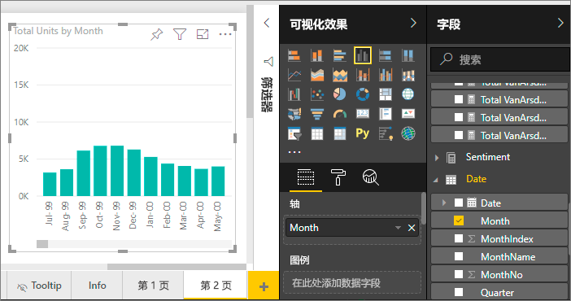
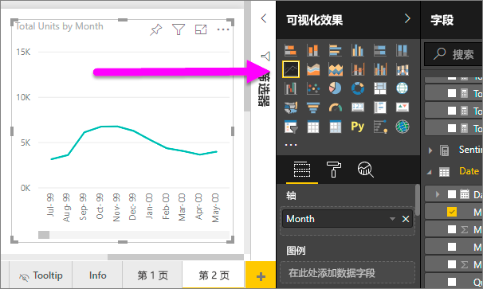
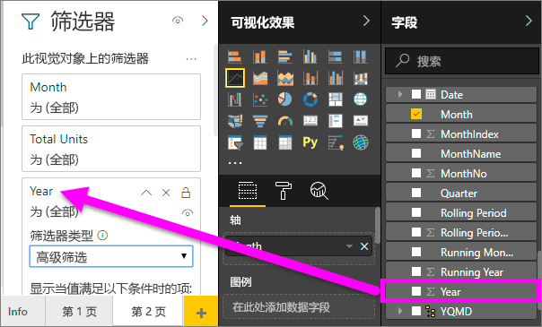
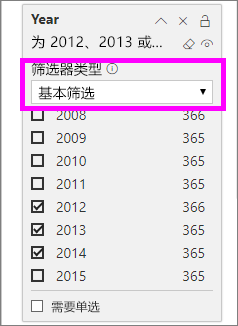
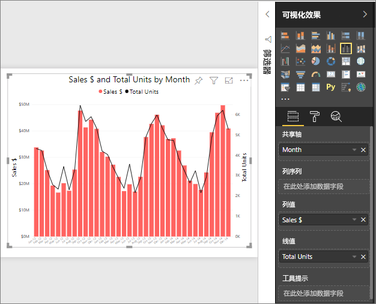

# 在 Power BI 中的折线图
线图是一系列表示点，并由直线连接的数据点。 折线图可能具有一个或多个行。 具有折线图的 X 和 Y 轴。 

## 创建折线图
这些说明使用销售和市场营销示例应用程序创建一个线图，按类别显示本年度的销售额。 若要跟着介绍一起操作，请从 appsource.com 获取示例应用程序。

1. 从空白报表页入手。 如果使用的是 Power BI 服务，请确保在 [“编辑视图”](../service-interact-with-a-report-in-editing-view.md) 中打开报表。

2. 从字段窗格中，选择**消费意愿** \> **总单位数**，然后选择**日期** > **月**。  Power BI 报表画布上创建柱形图。

    

4. 从可视化效果窗格中选择行图表模板转换为折线图。 

    
   

4. 折线图，显示 2012年 2014年年份的数据的筛选器。 如果筛选器窗格处于折叠状态，请现在将其展开。 从字段窗格中，选择**日期** \> **年**并将它拖到筛选器窗格。 删除标题下**此视觉对象上的筛选器**。 
     
    

    更改**高级筛选器**到**基本的筛选器**，然后选择**2012年**， **2013年**并**2014年**。

    

6. （可选）[调整大小和图表文本的颜色](power-bi-visualization-customize-title-background-and-legend.md)。 

    

## 将其他行添加到图表
折线图可以有许多不同的行。 和的线条上的值可能在某些情况下，因此同名的不同，它们不很好地一起显示。 让我们看看添加到我们当前的其他行图表，然后了解如何设置图表格式时的直线表示的值有很大差异。 

### 添加其他行
而不是作为单个行图表上查看所有区域的总单位数，让我们来拆分按区域的总单位数。 添加其他行，通过拖动**异地** > **区域**到图例格式。

   

### 使用两个 Y 轴
如果你想要查看总销售额和同一个图表上的总单位数？ 因此要远远高于单元数值，从而线图不可用的销售数字。 事实上，总单位数的红线显示为零。

   

若要在一个图表上显示高发散的值，请使用组合图。 通过阅读了解有关组合图的所有信息[Power BI 中的组合图](power-bi-visualization-combo-chart.md)。 下面的示例，我们可以显示销售额和总单位一起在一个图表上通过添加第二个 Y 轴。 

   

## 注意事项和疑难解答
* 一个折线图不能具有双 Y 轴。  你将需要改为使用组合图。
* 在上面的示例中，图表已格式化为增大字体大小、 更改字体颜色、 添加轴标题、 中心图表标题和图例、 启动两个轴在零，和的详细信息。 格式窗格 （滚动油漆刷图标） 有一表面上无休止的使图表看起来按照您希望的方式的选项。 若要了解的最佳方法是打开格式窗格并浏览。

## 后续步骤

[Power BI 中的可视化效果类型](power-bi-visualization-types-for-reports-and-q-and-a.md)

