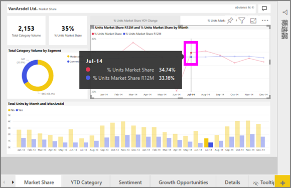

# Power BI 中的折线图
折线图是一系列用点表示并用直线连接的数据点。 折线图可能会有一条或多条折线。 折线图有 X 轴和 Y 轴。 

## 创建折线图
下面的说明使用“销售和市场营销示例”应用，以创建按类别显示今年销售额的折线图。 若要跟着本教程一起操作，请从 appsource.com 获取示例应用。

1. 从空白报表页入手。 如果使用的是 Power BI 服务，请务必在[编辑视图](../service-interact-with-a-report-in-editing-view.md)中打开报表。

2. 在“字段”窗格中，依次选择“销售事实”  \>“总单位数”  ，再依次选择“日期”   > “月份”  。  此时，Power BI 在报表画布上创建柱形图。

    

4. 选择“可视化效果”窗格中的“折线图”模板，将视觉对象转换为折线图。 

    
   

4. 将折线图筛选为仅显示 2012 年 - 2014 年的数据。 如果“筛选器”窗格处于折叠状态，立即展开它。 在“字段”窗格中，依次选择“日期”  \>“年份”  ，并将它拖到“筛选器”窗格中。 将它放在“此视觉对象中的筛选器”  标题下。 
     
    

    将“高级筛选器”  更改为“基本筛选器”  ，并选中“2012 年”  、“2013 年”  和“2014 年”  。

    

6. （可选）[调整大小和图表文本的颜色](power-bi-visualization-customize-title-background-and-legend.md)。 

    

## 向折线图添加其他折线
折线图可以有许多不同的折线。 而且，在某些情况下，折线上的值可能会高度相异，导致不能很好地一起显示。 接下来，将先介绍如何在当前折线图中添加其他折线，再介绍如何在折线所代表的值高度相异时设置图表的格式。 

### 添加其他折线
我们将按区域拆分总单位数，而不是将所有区域的总单位数视为折线图上的一条折线。 添加其他折线，具体方法是依次转到“地理位置”   > “区域”  ，并将“区域”拖到“图例”井中。

   

### 使用两个 Y 轴
若要在同一折线图上研究总销售额和总单位数，该怎么办？ 销售额数字远高于单位数数字，导致折线图无法使用。 事实上，总单位数对应的红色折线似乎为零。

   

若要在一个图表上显示高度相异值，请使用组合图。 有关组合图的所有信息，可以阅读 [Power BI 中的组合图](power-bi-visualization-combo-chart.md)。 在下面的示例中，可以通过添加第二个 Y 轴，在一个组合图上同时显示销售额和总单位数。 

   

## 突出显示和交叉筛选
有关使用筛选器窗格的信息，请参阅[向报表添加筛选器](../power-bi-report-add-filter.md)。

选择折线图上的数据点可交叉突出显示和交叉筛选报表页上的其他可视化效果，反之亦然。 若要跟着本教程一起操作，请打开“市场占有率”  选项卡。  

在折线图上，一个数据点是 X 轴和 Y 轴上值的交点。 在你选择数据点后，Power BI 会添加标记，以指明哪个点（对于一条折线）或哪些点（如果有两条或更多条折线）是报表页上其他视觉对象的交叉突出显示和交叉筛选来源。 如果视觉对象非常密集，Power BI 会选择最靠近你在视觉对象上单击位置的点。

在此示例中，我们选择的数据点包含以下值：在 2014 年 7 月，单位数市场占有率 R12 为 33.16%，单位数市场占有率为 34.74%。

请注意柱形图是如何交叉突出显示的，仪表是如何交叉筛选的。

若要管理图表相互交叉突出显示和交叉筛选的方式，请参阅 [Visualization interactions in a Power BI report（Power BI 报表中的可视化效果交互）](../service-reports-visual-interactions.md)

## 注意事项和疑难解答
* 一个折线图不能有两个 Y 轴。  必须改用组合图。
* 在上面的示例中，图表的格式设置为，增加字体大小、更改字体颜色、添加坐标轴标题、居中对齐图表标题和图例、让两个坐标轴从零开始等。 “格式设置”窗格（“滚动油漆刷”图标）有一组似乎无穷无尽的选项，可以让图表按照你希望的方式显示。 最佳学习方式是，打开“格式设置”窗格并进行探索。

## 后续步骤

[Power BI 中的可视化效果类型](power-bi-visualization-types-for-reports-and-q-and-a.md)

