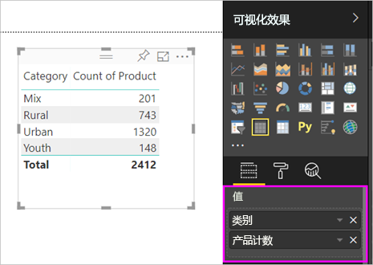
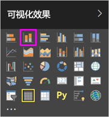
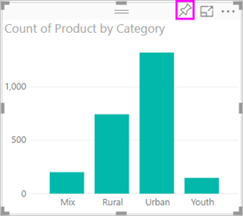

# 第 1 部分，向 Power BI 报表添加可视化效果
本文简要介绍如何使用 Power BI 服务或 Power BI Desktop 在报表中创建可视化效果。  有关更多内容，请[参阅第 II 部分](power-bi-report-add-visualizations-ii.md)。 请观看 Amanda 的视频演示，她将介绍如何在报表画布上创建、编辑视觉对象并对其进行格式设置的一些不同方法。 然后使用[销售和市场营销示例](../sample-datasets.md)来创建自己的报表并进行体验。

<iframe width="560" height="315" src="https://www.youtube.com/embed/IkJda4O7oGs" frameborder="0" allowfullscreen></iframe>

## 打开报表并添加新页面
1. [在“编辑视图”中打开报表](../consumer/end-user-reading-view.md)。 本教程使用“[销售和市场营销示例](../sample-datasets.md)”。
2. 如果看不到“字段”窗格，请选择箭头图标打开它。 
   
   
3. 向报表添加空白页。

## 将可视化效果添加到报表
1. 通过从“字段”窗格中选择字段来创建可视化效果。  
   
   从数值字段开始，如 SalesFact > Sales $。 Power BI 将创建一个包含单个柱形的柱形图。
   
   
   
   或从类别字段开始，例如“名称”或“产品”：Power BI 创建一个表并将该字段添加到“值”框中。
   
   
   
   或从地理字段开始，如“地区”>“城市”。 Power BI 会结合必应地图创建地图可视化效果。
   
   
2. 创建可视化效果，然后更改其类型。 选择“产品”>“类别”，然后选择“产品”>“产品计数”，将其添加到“值”框中。
   
   
3. 通过选择柱形图图标将可视化效果更改为柱形图。
   
   
4. 在报表中创建可视化效果时，可以[将其固定到仪表板](../service-dashboard-pin-tile-from-report.md)。 若要固定可视化效果，请选择固定图标 。
   
   
  

## 后续步骤
 继续[第 2 部分：向 Power BI 报表添加可视化效果](power-bi-report-add-visualizations-ii.md)
   
   在报表中[与可视化效果交互](../consumer/end-user-reading-view.md)。
   
   [对可视化效果执行更多操作](power-bi-report-visualizations.md)。
   
   [保存报表](../service-report-save.md)。
