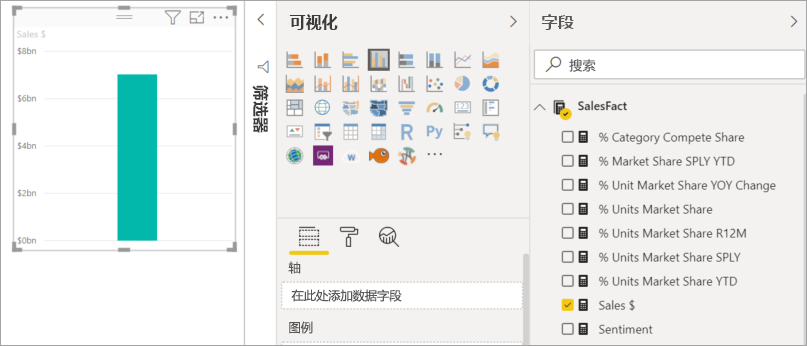
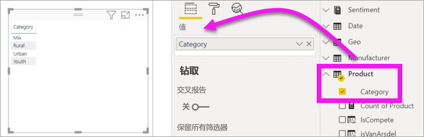
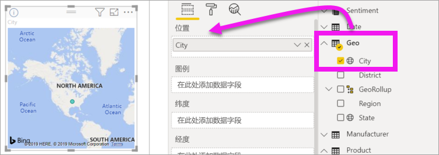
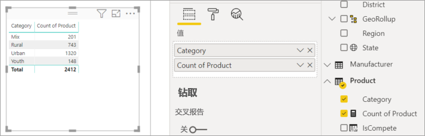
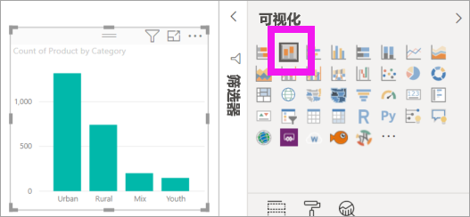
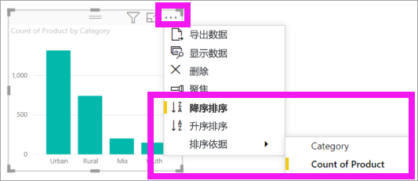

# 向 Power BI 报表添加视觉对象（第 1 部分）

[!INCLUDE[consumer-appliesto-nyyn](../includes/consumer-appliesto-nyyn.md)]    

[!INCLUDE [power-bi-visuals-desktop-banner](../includes/power-bi-visuals-desktop-banner.md)]

本文简要介绍如何在报表中创建可视化效果。 它适用于 Power BI 服务和 Power BI Desktop。 有关更高级的内容，请参阅[本系列的第 2 部分](power-bi-report-add-visualizations-ii.md)。

## 先决条件

本教程使用[销售和市场营销 PBIX 文件](https://download.microsoft.com/download/9/7/6/9767913A-29DB-40CF-8944-9AC2BC940C53/Sales%20and%20Marketing%20Sample%20PBIX.pbix)。

1. 在 Power BI Desktop 菜单栏的左上部分，选择“文件” > “打开” 
   
2. 查找“销售和市场营销示例 PBIX 文件”的副本

1. 在报表视图  中，打开“销售和市场营销示例 PBIX 文件”。

1. 选择  ，以添加新报表页。

> [!NOTE]
> 与 Power BI 同事共享报表时，你和这位同事都应具有独立的 Power BI Pro 许可证，并且应将报表保存在 Premium 容量中。 请参阅[共享报表](../collaborate-share/service-share-reports.md)

## 将可视化效果添加到报表

1. 通过从“字段”窗格中选择字段来创建可视化效果。

    从数值字段入手，如“销售额” > “总销售额” 。 Power BI 将创建一个包含单个柱形的柱形图。

    

    也可以从分类字段入手，如“名称”或“产品”。 Power BI 会创建表，并将相应字段添加到“值”井中。

    

    也可以从地理位置字段入手，如“地理位置” > “城市”。 Power BI 会结合必应地图创建地图可视化效果。

    

## 更改可视化效果类型

 创建可视化效果，然后更改其类型。 
 
 1. 依次选择“产品” > “类别”，再依次选择“产品” > “产品数”，以将它们添加到“值”井中。

    

1. 选择“堆积柱形图”图标，将可视化效果更改为柱形图。

   

1. 若要更改视觉对象的排序方式，请选择“更多操作”(…)。使用排序选项更改排序方向（升序或降序），并更改用于排序的列（排序依据）。

   
  
## 后续步骤

 继续学习：

* [第 2 部分：向 Power BI 报表添加可视化效果](power-bi-report-add-visualizations-ii.md)

* 在报表中[与可视化效果交互](../consumer/end-user-reading-view.md)。
