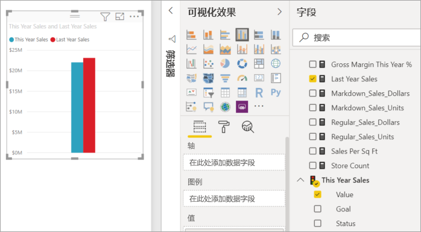
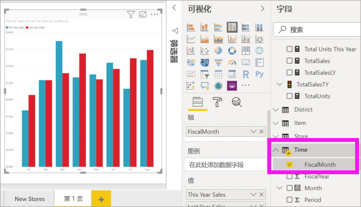
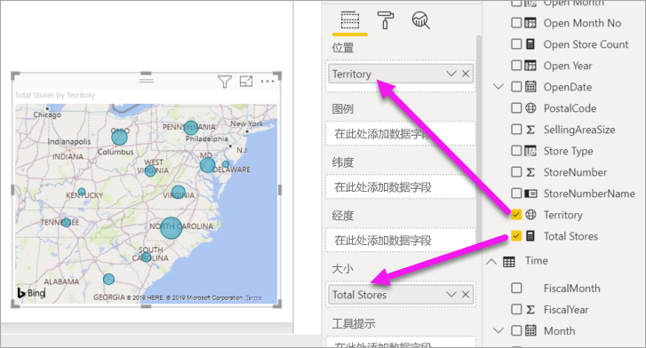
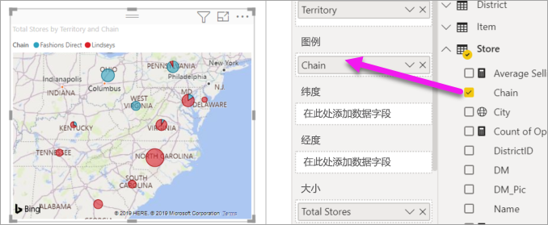

# 第 2 部分，向 Power BI 报表添加可视化效果

[!INCLUDE [power-bi-visuals-desktop-banner](../includes/power-bi-visuals-desktop-banner.md)]

在[第 1 部分](power-bi-report-add-visualizations-i.md)中，通过选中字段名称旁边的复选框来创建基本可视化对象。  在第 2 部分中，你将了解如何使用拖放功能并充分利用“字段”  和“可视化对象”  窗格创建和修改可视化对象。

## 创建新的可视化对象
在本教程中，我们将深入探讨我们的零售分析数据集并创建几个关键的可视化对象。

## 先决条件

本教程使用[零售分析示例 PBIX 文件](https://download.microsoft.com/download/9/6/D/96DDC2FF-2568-491D-AAFA-AFDD6F763AE3/Retail%20Analysis%20Sample%20PBIX.pbix)。

1. 在 Power BI Desktop 菜单栏的左上部分，选择“文件” > “打开”  
   
2. 查找**零售分析示例 PBIX 文件**的副本

1. 在报表视图中打开**零售分析示例 PBIX 文件** 。

1. 选择  ，以添加新报表页。

## 将可视化效果添加到报表

通过从“字段”窗格中选择字段来创建可视化效果。  所创建的可视化效果类型取决于所选字段的类型。 Power BI 使用数据类型确定使用哪种可视化效果来显示结果。 可通过从可视化效果窗格中选择不同图标来更改所用的可视化效果。 请记住，并非所有可视化效果都能显示数据。 例如，使用漏斗图或折线图时，地理数据将无法正常显示。 

### 添加显示今年与去年相比的销售额的分区图

1. 从“销售额”  表中，选择“本年度销售额”   > **值**和“去年销售额”  。 Power BI 将创建柱形图。  此图表十分有趣，你可能想要深入了解。 每月销售额看上去如何？  
   
   

2. 从“时间”表中，将“会计月”  拖动到“轴”  区域。  
   

3. 将[可视化对象更改](power-bi-report-change-visualization-type.md)为一个区域图。  提供许多可视化类型可供选择 - 请参阅[每种类型的描述、最佳做法提示和教程](power-bi-visualization-types-for-reports-and-q-and-a.md)，获取类型选择相关帮助。 在“可视化效果”窗格中，选择分区图图标](media/power-bi-report-add-visualizations-ii/power-bi-area-chart.png)“可视化效果”窗格中的分区图图标，方法是选择可视化对象，抓取其中一个边框圈并进行拖动。 使其宽度足以消除滚动条，同时足够小，从而使我们有足够的空间来添加其他可视化对象。
   
   
6. [保存报表](../service-report-save.md)。

### 添加按位置查看销售额的地图可视化对象

1. 从“商店”  表中，选择“区域”  。 将“总商店数”  拖动至“大小”区域。 Power BI 识别出 Territory 是一个位置，并创建地图可视化对象。  
   

2. 添加图例。  要按商店名称查看数据，请将“商店” > “连锁店”拖到图例区域   。  
   

## 后续步骤
* [Power BI 报表中的可视化对象](power-bi-report-visualizations.md)的详细信息。  
* 更多问题？ [尝试参与 Power BI 社区](https://community.powerbi.com/)

