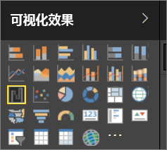

# Power BI 报表中的可视化效果

可视化效果（亦称为“视觉对象”）显示已发现的数据见解。 在 Power BI 报表中，既可能一个页面上只有一个视觉对象，也可能页面上有大量视觉对象。 在 Power BI 服务中，可以将视觉对象[从报表固定到仪表板](../service-dashboard-pin-tile-from-report.md)。

务必要使报表之间的区别*设计器*和报表*使用者*如果您是构建或修改报表的人则是一个设计器。  设计器都有对报表和其基础数据集的编辑权限。 在 Power BI Desktop 中，这意味着，可以在数据视图中打开数据集，并在报表视图中创建视觉对象。 在 Power BI 服务中，这意味着您可以在报表编辑器中打开数据集或报表[编辑视图](../consumer/end-user-reading-view.md)。 如果有人将某个报表或仪表板[与你共享](../consumer/end-user-shared-with-me.md)，你就是报表的一个使用者  。 你将能够查看和使用报表和其视觉对象进行交互，但您将无法保存重大更改。

Power BI 的“可视化效果”窗格中还有其他许多视觉对象类型，可供直接使用。

如需有更多选择，请访问 [Microsoft AppSource 社区网站](https://appsource.microsoft.com)，查找并[下载](https://appsource.microsoft.com/marketplace/apps?page=1&product=power-bi-visuals) Microsoft 和社区提供的[自定义视觉对象](../developer/custom-visual-develop-tutorial.md)。

<iframe width="560" height="315" src="https://www.youtube.com/embed/SYk_gWrtKvM?list=PL1N57mwBHtN0JFoKSR0n-tBkUJHeMP2cP" frameborder="0" allowfullscreen></iframe>

  如果初次接触 Power BI 或需复习，请利用以下链接了解 Power BI 可视化效果的基础知识。  也可使用（本文左侧的）目录查找更多有用信息。

## 在 Power BI 中添加一个可视化效果

在报表页上[创建可视化效果](power-bi-report-add-visualizations-i.md)。 浏览[可用的可视化效果和可用的可视化效果教程的列表。](power-bi-visualization-types-for-reports-and-q-and-a.md) 

## 上载自定义可视化效果并在 Power BI 中使用

添加自己创建或在 [Microsoft AppSource 社区网站](https://appsource.microsoft.com/marketplace/apps?product=power-bi-visuals)中找到的自定义可视化效果。 有创造性的点子？ 深入了解我们的源代码，使用我们的[开发工具](../developer/custom-visual-develop-tutorial.md)创建新的可视化效果类型，并[将它与社区共享](../developer/office-store.md)。 若要详细了解如何开发自定义视觉对象，请访问[开发 Power BI 自定义视觉对象](../developer/custom-visual-develop-tutorial.md)。

## 更改可视化效果类型

请尝试[更改可视化效果的类型](power-bi-report-change-visualization-type.md)以查看哪种类型最适合你的数据。

## 固定可视化效果

在 Power BI 服务中，若有所需的可视化效果，可以将它作为磁贴[固定到仪表板](../service-dashboard-pin-tile-from-report.md)。 如果在固定报表后更改其中正在使用的可视化效果，仪表板上的磁贴并不会更改。也就是说，如果之前是折线图，即使在报表中将它更改为环形图，它也仍为折线图。

## 限制和注意事项
- 具体取决于数据源和字段 （度量值或列） 数，视觉对象可能会加载速度慢。  我们建议限制为 10 到 20 个合计字段，同时出于可读性和性能的原因的视觉对象。 

- 视觉对象的上限为 100 个字段 （度量值或列）。 如果你的视觉对象无法加载，减少字段的数。   

## 后续步骤

* [Power BI 中的可视化效果类型](power-bi-visualization-types-for-reports-and-q-and-a.md)
* [自定义视觉对象](../power-bi-custom-visuals.md)